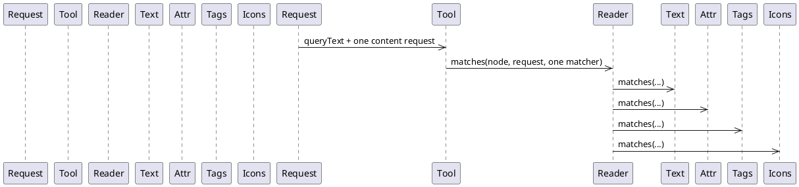
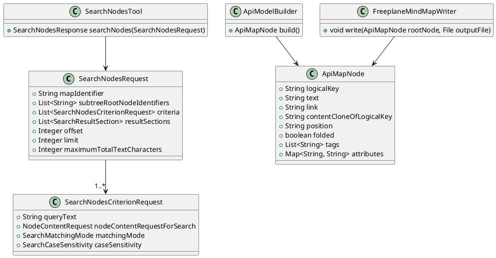

# Task: Add conjunctive metadata search for documentation maps
- **Task Identifier:** 2026-05-27-documentation-search-metadata
- **Scope:** Extend `searchNodes` so one request can require multiple
  search criteria at once, and enrich the generated Freeplane scripting
  API documentation map with searchable node metadata stored as native
  Freeplane tags and attributes.
- **Motivation:** Current documentation lookup works well for exact
  member queries close to the rendered text, but it remains overly
  sensitive to punctuation conventions such as `parent:` and `find(`.
  Conjunctive criteria plus generated metadata should let agents search
  for concepts like `parent` together with `kind:property` instead of
  relying on query-shaping tricks.
- **Scenario:**
  - A **search criterion** is one `queryText` plus its own enabled
    content fields, matching mode, and case sensitivity.
  - A node satisfies a metadata-aware `searchNodes` request only if it
    satisfies every criterion in that request.
  - Generated documentation metadata lives on ordinary map nodes as
    Freeplane tags and attributes so existing search and read tools can
    consume it without a new documentation-specific query tool.
- **Constraints:**
  - Keep `subtreeRootNodeIdentifiers` as a top-level
    `SearchNodesRequest` field.
  - Replace the current single-query request shape instead of keeping a
    compatibility fallback.
  - Keep response ordering and pagination semantics aligned with the
    current traversal order after final filtering.
  - Within one criterion, enabled content areas still match with OR.
  - Across criteria, overall matching must be AND.
  - Use generated metadata only where it is deterministic from the API
    model; do not add guessed semantics.
  - Store generated metadata using native Freeplane node tags and
    attributes so it is visible to existing content readers.
- **Briefing:** Relevant files are
  `freeplane_plugin_ai/src/main/java/org/freeplane/plugin/ai/tools/search/SearchNodesRequest.java`,
  `freeplane_plugin_ai/src/main/java/org/freeplane/plugin/ai/tools/search/SearchNodesTool.java`,
  `freeplane_plugin_ai/src/main/java/org/freeplane/plugin/ai/tools/content/NodeContentReader.java`,
  `freeplane_plugin_ai/src/main/java/org/freeplane/plugin/ai/tools/content/TagsContentReader.java`,
  `freeplane_plugin_ai/src/main/java/org/freeplane/plugin/ai/tools/content/AttributesContentReader.java`,
  `freeplane_plugin_script/src/doclet/java/org/freeplane/plugin/script/doclet/ApiMapNode.java`,
  `freeplane_plugin_script/src/doclet/java/org/freeplane/plugin/script/doclet/ApiModelBuilder.java`,
  `freeplane_plugin_script/src/doclet/java/org/freeplane/plugin/script/doclet/FreeplaneMindMapWriter.java`,
  `freeplane_plugin_script/src/doclet/resources/org/freeplane/plugin/script/doclet/api-map-how-to-use.txt`,
  and the existing search and doclet tests.
- **Research:**
  - `SearchNodesRequest` currently has one top-level `queryText`, one
    `nodeContentRequestForSearch`, and one matching-mode/case-sensitivity
    pair.
  - `SearchNodesTool` currently builds one `NodeContentValueMatcher` and
    matches every searched node against that single matcher.
  - `NodeContentReader.matches(...)` currently returns true when any one
    of the enabled textual, attribute, tag, or icon readers matches,
    so the current request shape can express OR across fields but not
    AND across separate conditions.
  - The generated API documentation map currently stores only node text,
    link, folded state, position, and clone references. The custom
    doclet node model and writer do not yet carry generated tags or
    attributes.
  - Freeplane `.mm` maps already support native metadata needed here:
    tags persist in the node `TAGS` attribute and attributes persist as
    child `<attribute NAME="..." VALUE="..."/>` elements.
  - Existing content readers and search requests already know how to
    search tags and attributes when those fields are present in the map.

- **Design:**
  - Replace the single-query fields on `SearchNodesRequest` with a
    required non-empty `criteria: List<SearchNodesCriterionRequest>` and
    keep `subtreeRootNodeIdentifiers`, `resultSections`, `offset`,
    `limit`, and `maximumTotalTextCharacters` at top level.
  - Add `SearchNodesCriterionRequest` in the search package with these
    exact fields:
    - `queryText`
    - `nodeContentRequestForSearch`
    - `matchingMode`
    - `caseSensitivity`
  - Keep the current default criterion content as text-only when a
    criterion omits `nodeContentRequestForSearch`.
  - Update `SearchNodesTool` so a node is retained only if it matches
    every criterion. Evaluate criteria with short-circuiting but keep
    the external contract as AND across criteria.
  - Keep result payload shape unchanged. Update request parsing,
    validation, and tool-call summaries to describe criteria rather than
    one top-level query.
  - Extend `ApiMapNode` with deterministic metadata collections:
    `tags: List<String>` and `attributes: Map<String, String>`.
  - Extend `FreeplaneMindMapWriter` to serialize generated tags into the
    node `TAGS` attribute and generated attributes into child
    `<attribute>` elements while preserving the existing template-root
    behavior and clone handling.
  - Generate metadata on API documentation nodes with search-first tags
    and mirrored readable attributes. Initial generated tags must use
    stable key-value-like tokens so they are practical search terms with
    the existing tag matcher, for example:
    - `section:api-groups`
    - `section:packages`
    - `kind:group`
    - `kind:type`
    - `kind:property`
    - `kind:method`
    - `kind:constant`
    - `kind:nested-type`
    - `capability:read`
    - `capability:write`
    - `capability:read-write`
    - `group:node`
    - `group:mindmap`
    - `group:controller`
    - `group:attributes`
    - `group:tags`
    - `group:maptagcategories`
  - Mirror the same generated facts as readable attributes such as
    `section`, `kind`, `capability`, `group`, and `exactType` where the
    value is known exactly.
  - Treat generated tags as the primary metadata filter surface because
    current attribute search is plain text over attribute names and
    values, not exact key-based predicates.
  - Update the how-to resource so it teaches metadata-aware search
    patterns such as combining a text criterion with metadata criteria
    instead of depending mainly on punctuation conventions.

- **Test specification:**
  - **Automated tests:**
    - `gradle :freeplane_plugin_ai:test --tests org.freeplane.plugin.ai.tools.search.SearchNodesToolTest -Djava.net.preferIPv6Addresses=true -Djava.awt.headless=true`
    - `gradle :freeplane_plugin_script:docletTest :freeplane_plugin_script:generateFreeplaneApiMap -Djava.net.preferIPv6Addresses=true -Djava.awt.headless=true`
    - Add focused `SearchNodesTool` tests for:
      - AND semantics across two criteria
      - text-plus-tags filtering
      - text-plus-attributes filtering
      - empty or null criteria validation
      - subtree scoping still applying before final filtering
    - Add focused doclet/writer tests that generated API nodes persist
      the expected `TAGS` metadata and `<attribute>` metadata.
    - Add at least one end-to-end documentation-search test using a
      generated documentation-style map node set where a broad text query
      plus a metadata criterion finds the intended member and excludes a
      same-text different-kind node.
  - **Manual tests:**
    - Run `getApiDocumentation()` and capture the returned API-groups
      root identifier.
    - Use `searchNodes` under API groups with one text criterion for a
      broad concept such as `parent` and one tags-only criterion for
      `kind:property`; verify the direct property hit is retained while
      unrelated constant/example hits are filtered out.
    - Use `searchNodes` under API groups with one text criterion for
      `tag` and one tags-only criterion for `group:tags` or
      `group:maptagcategories`; verify the metadata criterion can steer
      the result toward the intended API area.
    - Read one matching node with descendants while requesting tags and
      attributes, and verify the generated metadata is visible as normal
      node content.
