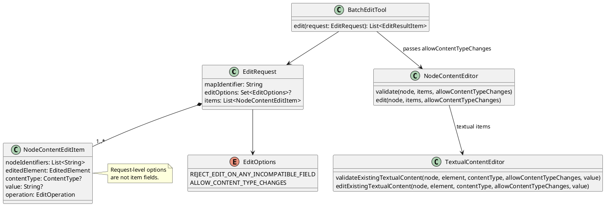
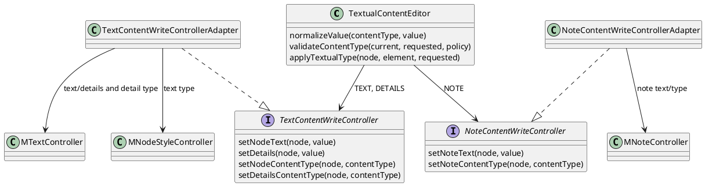
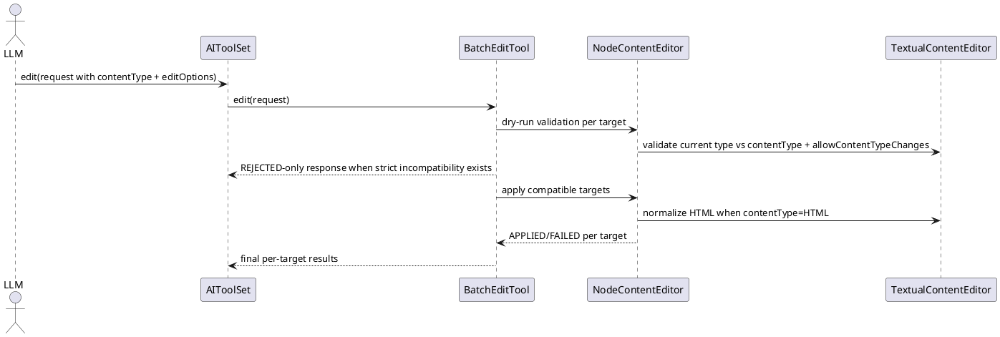

# Task: Enforce explicit content type policy in edit tool
- **Task Identifier:** 2026-04-12-content-type
- **Scope:** Replace textual edit type handling based on
  `originalContentType` with explicit `contentType`, replace separate
  compatibility and type-change policies with request-level `editOptions`,
  describe content-type migration as an explicit-user-request-only opt-in, and
  normalize HTML textual edits so the
  tool auto-adds `<html>` handling when the caller omits it.
- **Motivation:** Current textual edit safety depends on a fetch-first
  round-trip and `originalContentType`. The new contract should let AI
  state intended textual type directly, keep compatibility safety rules
  deterministic, and reduce fragile HTML-prefix mistakes.
- **Scenario:** AI sends an `edit` request with batched instructions.
  For textual `REPLACE` instructions, each item explicitly provides
  `contentType`. DETAILS and NOTE `DELETE` instructions omit it. With no
  `editOptions`, requested type mismatches are incompatibilities and the tool
  skips incompatible targets. `REJECT_EDIT_ON_ANY_INCOMPATIBLE_FIELD` changes
  this to zero-write strict rejection. `ALLOW_CONTENT_TYPE_CHANGES` permits
  supported textual type migration. When `contentType=HTML` and
  the value does not already start with `<html>`, the tool normalizes it
  to HTML before writing.
- **Constraints:**
  - Keep the current batch contract with `nodeIdentifiers` and per-
    target statuses (`APPLIED`, `SKIPPED`, `REJECTED`, `FAILED`).
  - Replace `originalContentType` with `contentType` in typed edit
    payloads; do not add compatibility aliases.
  - `contentType` is required for textual `REPLACE` instructions
    (`TEXT`, `DETAILS`, `NOTE`), absent for textual `DELETE` instructions,
    and absent for non-textual elements.
  - `editOptions` is request-level. With no options, the existing defaults
    apply: skip incompatible targets and disallow content-type changes.
  - `REJECT_EDIT_ON_ANY_INCOMPATIBLE_FIELD` is valid for every edit request
    and changes compatibility handling to strict zero-write rejection.
  - `ALLOW_CONTENT_TYPE_CHANGES` is valid only when at least one textual edit
    instruction is present; a DELETE-only textual request may include it, but
    it has no effect. It is a request validation error when no textual edit is
    present.
  - Content type changes require
    `editOptions` to contain `ALLOW_CONTENT_TYPE_CHANGES`; otherwise they are
    incompatibilities.
  - Tool and schema descriptions must state that
    `ALLOW_CONTENT_TYPE_CHANGES` is exceptional: use it only when the user
    explicitly requests a content-type change, never merely because another
    type would better represent, format, or render the requested value. This
    is LLM guidance, not tool-enforced user-intent authorization.
  - Formula migration support stays out of this task and should be
    designed in the scripting-tool follow-up work.
- **Briefing:** `AIToolSet.edit(...)` delegates to `BatchEditTool`,
  which coordinates dry-run validation and apply loops. `NodeContentEditItem`
  currently exposes `originalContentType`. `NodeContentEditor` and
  `TextualContentEditor` handle textual compatibility and write logic.
  `TextualContentEditor` currently relies on existing type checks and
  value parsing rules for HTML/Markdown/LaTeX.
- **Research:**
  - The current typed edit schema still names textual type as
    `originalContentType` and documents a fetch-first flow.
  - Batch execution already supports request-level compatibility policy
    and per-target statuses.
  - Strict compatibility mode already performs dry-run validation and
    returns only incompatible targets as `REJECTED` with zero writes.
  - Non-textual editors do not need textual content type metadata.
  - Existing textual handling treats HTML specially when values start
    with `<html>`, making prefix omissions a recurring client error
    source.
  - The Markdown and LaTeX plugins register those types for DETAILS and NOTE
    in addition to the base `auto` and `html` types. `auto` and `html` both
    resolve to `HTML`; DETAILS and NOTE have no distinct `PLAIN_TEXT` type.
  - Empty DETAILS or NOTE removes its model extension, including local
    content-type metadata. The current deletion behavior is therefore
    type-neutral.
- **Analysis:**
  - The `ALLOW_CONTENT_TYPE_CHANGES` option may create a node-local type override when
    the effective type is inherited from a style, matching the UI controls.
  - Supported target types are `PLAIN_TEXT`, `HTML`, `MARKDOWN`, and `LATEX`
    for TEXT; and `HTML`, `MARKDOWN`, and `LATEX` for DETAILS and NOTE.
  - DETAILS and NOTE DELETE omits `contentType`, removes content and local
    type metadata, and never migrates a type. A supplied `contentType` is a
    request validation error. `ALLOW_CONTENT_TYPE_CHANGES` is accepted in
    `editOptions` for a DELETE-only request but has no effect.
  - A batched item may migrate targets with different current types when type
    changes are allowed.
  - `ALLOW_CONTENT_TYPE_CHANGES` is a model-directed opt-in. The edit API sees
    only tool arguments, so it cannot verify that the user made the required
    explicit request; `userSummary` cannot serve as authorization because the
    LLM provides it.
- **Design:**
  - Update typed request contracts:
    - `NodeContentEditItem.contentType : ContentType?`
    - remove `originalContentType` from typed contract and docs.
    - replace `EditRequest.compatibilityPolicy` and the proposed
      `contentTypeChangePolicy` with `EditRequest.editOptions : Set<EditOptions>?`.
      An absent or empty set preserves the current defaults.
  - Add enum:

```text
EditOptions
  REJECT_EDIT_ON_ANY_INCOMPATIBLE_FIELD
  ALLOW_CONTENT_TYPE_CHANGES
```

  - Validation and compatibility rules:
    - textual REPLACE item without `contentType` => incompatibility.
    - textual DELETE item with `contentType` => request validation error.
    - non-textual item with `contentType` => incompatibility.
    - `ALLOW_CONTENT_TYPE_CHANGES` without any textual item => request
      validation error. It is accepted for DELETE-only textual requests but
      has no effect.
    - without `ALLOW_CONTENT_TYPE_CHANGES`, requested replacement
      `contentType` must match current textual type; mismatch =>
      incompatibility.
    - with `ALLOW_CONTENT_TYPE_CHANGES`, supported textual type changes
      are allowed and applied. TEXT supports `PLAIN_TEXT`, `HTML`,
      `MARKDOWN`, and `LATEX`; DETAILS and NOTE support `HTML`, `MARKDOWN`,
      and `LATEX` only.
    - Type migration persists the requested type through the same undo-aware
      controllers as the UI: a local TEXT node format, or local DETAILS/NOTE
      content-type metadata. It may therefore override a style-derived type.
    - DETAILS and NOTE DELETE retains current behavior: remove the model
      extension, including its local content-type metadata; do not apply a
      requested type migration.
  - Preserve compatibility behavior through options:
    - with no `REJECT_EDIT_ON_ANY_INCOMPATIBLE_FIELD` option: return per-target
      `APPLIED/SKIPPED/FAILED`.
    - with `REJECT_EDIT_ON_ANY_INCOMPATIBLE_FIELD`: if any incompatible
      targets exist, return only those targets as `REJECTED` and perform no
      writes. If validation passes, run writes and report write-time failures
      as `FAILED`.
  - HTML normalization rule:
    - for textual items with `contentType=HTML`, normalize non-HTML
      input to HTML before write so callers do not need to prepend
      `<html>` manually.
  - Update tool descriptions and schema field docs to use canonical names and
    option semantics. The `editOptions` description and `AIToolSet.edit` tool
    description must state: `ALLOW_CONTENT_TYPE_CHANGES` is exceptional; use
    it only when the user explicitly requests a content-type change, never
    merely because another type would better represent, format, or render the
    requested value.

  - Planned request and validation structure (existing classes are retained;
    the request-level options are resolved in the batch tool rather than copied
    into each item):



  - Planned persistence structure. `TextualContentEditor` owns conversion,
    compatibility checks, and the decision to migrate; write-controller
    adapters own undo-aware writes to Freeplane. No separate migration service
    is introduced.




- **Test specification:**
  - Automated tests:
    - Verify textual REPLACE items require `contentType`.
    - Verify DETAILS/NOTE DELETE rejects `contentType`, removes the model
      extension and local type metadata, and does not migrate a type.
    - Verify non-textual items with `contentType` are incompatible and
      follow the selected `editOptions` compatibility outcome.
    - Verify absent or empty `editOptions` preserves current defaults:
      skip incompatible targets and disallow content-type changes.
    - Verify `ALLOW_CONTENT_TYPE_CHANGES` without textual items fails request
      validation, while DELETE-only textual requests may provide it with no
      effect.
    - Verify `REJECT_EDIT_ON_ANY_INCOMPATIBLE_FIELD` is valid for non-textual
      requests.
    - Verify textual type mismatch without `ALLOW_CONTENT_TYPE_CHANGES` is
      incompatible and yields `SKIPPED` by default or `REJECTED` with
      `REJECT_EDIT_ON_ANY_INCOMPATIBLE_FIELD`.
    - Verify textual type mismatch with `ALLOW_CONTENT_TYPE_CHANGES` is
      accepted for every supported target
      type, persists a node-local override through the undo-aware UI
      controller, and may replace a style-derived effective type.
    - Verify DETAILS and NOTE reject `PLAIN_TEXT` migration.
    - Verify strict incompatibility responses include only incompatible
      `REJECTED` targets and perform zero writes.
    - Verify strict mode still reports apply-phase runtime failures as
      `FAILED` when dry-run passes.
    - Verify `contentType=HTML` with non-HTML input is normalized to
      HTML and written correctly.
    - Verify MCP tool metadata and descriptions expose `contentType` and
      `editOptions` semantics without `originalContentType` wording, including
      the explicit-user-request-only guidance for
      `ALLOW_CONTENT_TYPE_CHANGES`.
  - Manual tests: N/A
