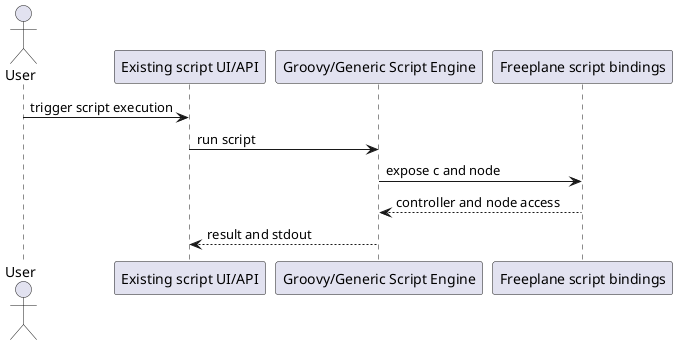
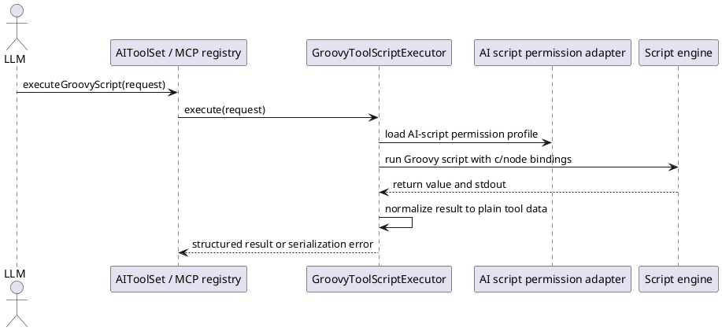
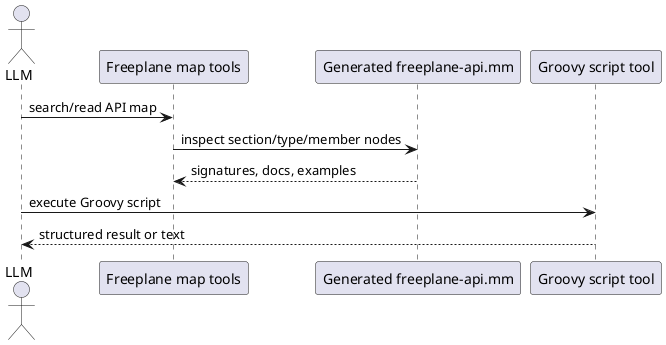

# Task: Add optional Groovy script execution tool for AI and MCP
- **Task Identifier:** 2026-04-09-script-tool
- **Scope:** Add an optional Groovy script execution tool for internal
  AI and MCP that can be enabled separately, runs under a dedicated
  AI-script permission profile, optionally requires user review in tool
  chat before execution, accepts either inline script content or a
  script file path, and returns only plain tool data or captured text.
  Add a build-generated Freeplane scripting API mind map so LLMs can
  inspect current scripting/API information through Freeplane map
  search/read tooling before writing unfamiliar scripts without
  injecting the full API reference by default.
- **Motivation:** Some workflows need traversal, aggregation,
  reporting, or direct API access that typed tools do not cover. LLMs
  can already draft Freeplane Groovy scripts, but there is no tool path
  that executes them from AI or MCP.
- **Scenario:** A user enables Groovy tool scripts for internal AI,
  MCP, or both. AI submits either Groovy script source or a path to a
  Groovy script file, with optional map and node context. If
  `ai_script_execution_requires_review` is enabled, tool chat shows the
  resolved script text in a temporary Groovy/plain-text editor pane
  with allow and skip controls before execution. If the user allows the
  script, Freeplane executes it with the configured AI-script
  permissions, captures stdout, and returns a plain-data result. If the
  user skips execution, that outcome is returned to AI. If the script
  returns unsupported Java objects, the tool fails with guidance to
  convert the result to strings, lists, or maps.
- **Constraints:**
  - Tool exposure to internal AI and MCP must be controlled
    separately.
  - AI-script permission flags for file read, file write, network, and
    exec must live in a dedicated configuration block and default to
    `false`.
  - `ai_script_execution_requires_review` must default to `true`.
  - Once the user explicitly enables the capability and selects a
    permission profile, the tool must not silently downgrade that
    profile.
  - The main trust boundary is access to open maps and live controller
    operations, not only OS-level permissions.
  - Result serialization must not promise arbitrary Java object graphs;
    only JSON-safe values and/or captured text are valid outputs.
  - One shared execution implementation should serve internal AI and MCP
    unless research finds a concrete difference.
  - The feature needs built-in usage guidance for LLMs, not only a bare
    tool signature.
  - The request must accept exactly one script input source: inline
    script content or a script file path.
  - When script review is enabled and a tool call includes inline
    script content or a script file path, tool chat must show a
    temporary `JEditorPane` with the resolved script text and allow/skip
    buttons before execution.
  - After the user chooses allow or skip, the temporary review editor
    must be hidden again.
  - Skipped execution must be returned to AI as an explicit
    `USER_SKIPPED` tool outcome.
- **Briefing:** Freeplane scripting binds `c` and `node`; `c` is a
  read-write controller that can enumerate open maps. Existing scripting
  already has permission controls, signed-script trust, and
  all-permission APIs, but those paths should not silently define the
  new AI tool contract. Even with file, network, and exec blocked, the
  tool result itself remains an output channel for map data.
- **Research:**
  - `GenericScript` binds `c` and `node` into the script context for
    execution.
  - `Controller` is a read-write script surface and exposes open maps,
    selection, undo control, map creation, and headless loading.
  - Existing scripting permissions already model file read, file
    write/delete, network, and exec. Existing script security also
    protects secured properties and restores permission-derived
    behavior after execution.
  - Existing proxy and headless APIs include routes to unrestricted or
    all-permission execution, so the AI tool must choose its own
    explicit permission profile instead of inheriting an unrestricted
    path accidentally.
  - Disabling network does not prevent map contents from reaching the
    model because the tool response itself can carry that data.
  - The requested UX adds a user review gate in tool chat instead of
    silent execution when the review flag is enabled.
  - Arbitrary Java object serialization is not practical for this tool.
    Cycles, internal state, and unstable `toString()` behavior require a
    narrow result contract.
  - The discussion concluded that multiedit likely covers the first
    wave of bulk-edit use cases, leaving script execution for
    aggregation, reporting, traversal, or API access that typed tools do
    not cover.


- **Design:**
  - Implement one `GroovyToolScriptExecutor` shared by internal AI tool
    wiring and MCP tool registration.
  - Add separate configuration keys for exposure and permissions:
    - `ai_chat_script_execution_enabled`
    - `ai_mcp_script_execution_enabled`
    - `ai_script_execution_requires_review`
    - `ai_script_execution_without_file_restriction`
    - `ai_script_execution_without_write_restriction`
    - `ai_script_execution_without_network_restriction`
    - `ai_script_execution_without_exec_restriction`
  - Reuse existing scripting permission enforcement, but source it from
    the dedicated AI-script configuration block rather than general
    script defaults.
  - Keep script input minimal: exactly one of inline script source or
    script file path, optional map identifier, optional node
    identifier, and optional requested result mode.
  - If `ai_script_execution_requires_review` is `true` and the request
    includes inline script source or a script file path:
    - show a temporary tool-chat `JEditorPane` for Groovy/plain-text
      display,
    - render the submitted script in that editor,
    - show allow and skip buttons next to the editor,
    - execute only after allow,
    - return a non-success outcome to AI when the user skips,
    - hide the editor again after allow or skip.
  - Make the result contract explicit:
    - return JSON-safe values (`null`, booleans, numbers, strings,
      lists, maps) as structured tool data,
    - capture stdout as text,
    - reject unsupported return types with a clear error that instructs
      the caller to convert the result to plain data.
  - Provide built-in usage guidance visible to both internal AI and MCP
    clients:
    - tool description explaining `c` and `node`,
    - a short pointer to the generated Freeplane API map and whatever
      map-query tooling exists for unfamiliar APIs,
    - a small cookbook with examples for traversal, aggregation, and
      converting results to lists or maps,
    - guidance about the default permission profile and how unsupported
      result types fail.
  - Register the tool only on surfaces whose exposure flag is enabled so
    disabled surfaces do not advertise it.



Target request and response structure:

```text
ExecuteGroovyScriptRequest
  mapIdentifier : String?
  nodeIdentifier : String?
  script : String?
  scriptFilePath : String?
  resultMode : ScriptResultMode?

Request invariants
  exactly one of script or scriptFilePath must be provided

ScriptResultMode
  AUTO
  STRUCTURED
  TEXT

ExecuteGroovyScriptResponse
  status : ScriptExecutionStatus
  structuredResult : JSON-safe value?
  textResult : String?
  stdout : String?
  errorMessage : String?

ScriptExecutionStatus
  SUCCESS
  USER_SKIPPED
  EXECUTION_ERROR
  SERIALIZATION_ERROR
```
- **Test specification:**
  - Automated tests:
    - Verify the tool is advertised only when the corresponding
      internal-AI or MCP exposure flag is enabled.
    - Verify the dedicated AI-script permission block maps to the
      existing scripting permission enforcement without silent
      downgrades.
    - Verify scripts can access live map and node context when the tool
      is enabled.
    - Verify file, write, network, and exec operations are blocked by
      default and become allowed only when the corresponding
      AI-script permission flag is enabled.
    - Verify JSON-safe values are returned as structured tool data.
    - Verify unsupported Java object return values produce a stable
      serialization error with guidance to convert to plain data.
    - Verify stdout capture is returned alongside successful or failed
      execution.
    - Verify inline script content and script file input are both
      supported.
    - Verify requests with both `script` and `scriptFilePath`, or with
      neither, fail with a clear validation error.
    - Verify `ai_script_execution_requires_review` defaults to `true`.
    - Verify a script call shows the review `JEditorPane` only when the
      review flag is enabled and inline script content or script file
      input is present.
    - Verify the review pane shows the resolved script text together
      with allow and skip controls.
    - Verify allow continues execution and skip returns a non-success
      result to AI without executing the script.
    - Verify the review editor is hidden again after allow or skip.
    - Verify internal AI and MCP share the same execution behavior and
      result normalization path.
  - Manual tests:
    - Enable the tool for one surface only and verify that only that
      surface can discover and use it.
    - Run a small traversal script that returns a list of plain maps and
      verify the response is consumable in follow-up AI reasoning.
    - With script review enabled, confirm the script appears in tool
      chat before execution, allow runs it, skip prevents execution, and
      the temporary editor disappears after either choice.

## Subtask: Generate a Freeplane scripting API mind map for LLM scripting
- **Status:** backlog
- **Scope:** Add a build-generated Freeplane `.mm` mind map containing
  the stable scripting/API surface exposed to script authors, following
  the current curated documentation boundary shown by
  `freeplane_plugin_script/scripts/apiGenerator.groovy` rather than
  limiting v1 to `org.freeplane.api` alone, so internal AI and MCP-side
  LLM workflows can inspect exact current API information through
  Freeplane map search/read tooling before writing unfamiliar Groovy
  scripts.
- **Motivation:** Standard Javadoc HTML is useful for humans, but it is
  not the best primary artifact for an LLM operating inside Freeplane
  or through Freeplane-as-MCP. A generated map keeps the documentation
  in a Freeplane-native format that can be queried with normal map tools
  instead of injecting a large API reference into default chat context.
- **Scenario:** An LLM wants to write or review a Groovy script. Before
  using unfamiliar Freeplane APIs, it reads/searches a generated
  `freeplane-api.mm` map, finds relevant sections such as `Proxy` and
  `Utilities`, then the needed packages, types, methods, signatures,
  and examples, then writes the script and executes it through the
  Groovy tool. Future dedicated query tools may read that map, but this
  first step only requires generating the map during the build.
- **Constraints:**
  - This backlog note records a directional idea, not a justified final
    design decision. Implementation must re-check feasibility against
    the actual build and doclet APIs.
  - The primary artifact must be a Freeplane `.mm` mind map generated
    from the current sources/build, not scraped Javadoc HTML.
  - Do not build RAG, a vector store, JSON output, or Markdown output
    as the primary artifact in this subtask.
  - Do not treat `org.freeplane.api` alone as the whole scripting
    surface. `freeplane_plugin_script/scripts/apiGenerator.groovy`
    shows a curated surface centered on
    `org.freeplane.plugin.script.proxy.Proxy.*` plus selected
    `org.freeplane.api` and utility/supporting types.
  - Keep v1 limited to that curated scripting surface or a verified
    equivalent derived from it; do not expand to the whole codebase.
  - Do not include internal implementation classes unless they are
    clearly part of the scripting API.
  - Keep the existing HTML Javadoc task intact. The new work must be a
    separate Gradle task and must not replace current Javadoc
    generation.
  - The first version should work from existing Java source structure,
    Javadoc comments, and standard Javadoc tags. Support custom
    `@llm.*` tags only opportunistically if present.
  - Do not require new LLM-specific tags or new Javadoc content for the
    first version; both ideas remain questionable and unverified.
  - The generated map must be queryable through existing or future
    Freeplane map reading/search tooling without injecting the full API
    reference by default.
- **Briefing:** The intended source of truth is the modern Javadoc
  doclet API over the exact current Freeplane sources/build, but the
  current scripting-help boundary is already expressed by
  `freeplane_plugin_script/scripts/apiGenerator.groovy`. The generated
  map should let an LLM operating inside Freeplane or via MCP inspect
  sections, packages, types, methods, signatures, descriptions,
  parameters, returns, exceptions, deprecations, and examples in a
  Freeplane-native structure.
- **Research:**
  - If this research has not already been done for the current
    implementation attempt, inspect
    `freeplane_plugin_script/scripts/apiGenerator.groovy` first because
    it shows the current curated scripting-help surface and grouping.
  - If this research has not already been done for the current
    implementation attempt, also inspect the existing Javadoc Gradle
    configuration:
    - `freeplane_plugin_script/build.gradle` `javadoc { ... }` because
      it defines the current curated Javadoc source allowlist for
      scripting docs and writes output to `globalBin + '/doc/api/'`.
    - root `build.gradle` `subprojects { javadoc { ... } }` because it
      defines default Javadoc behavior such as encoding/locale,
      `enabled = false`, and `failOnError = false`, which the new task
      must account for explicitly instead of assuming.
  - The user-provided direction is to generate a Freeplane mind map with
    API reference data during the build and then query that map instead
    of scraping generated HTML.
  - `freeplane_plugin_script/scripts/apiGenerator.groovy` is the
    existing scripting API map generator.
  - `freeplane_plugin_script/build.gradle` contains the current
    scripting Javadoc source curation and output target.
  - root `build.gradle` contains shared Javadoc defaults that may
    otherwise disable or soften the behavior needed by the new task.
  - That script uses a curated explicit class list, not package
    scanning, and divides the scripting help mainly into `Proxy` and
    `Utilities` sections.
  - It includes key script-facing types such as `Proxy.Node`,
    `Proxy.Controller`, `Proxy.MindMap`, `Proxy.Link`,
    `Proxy.Attributes`, `Proxy.NodeStyle`, `Proxy.NodeGeometry`,
    `FreeplaneScriptBaseClass`, `GroovyStaticImports`, `UITools`,
    `TextUtils`, `HtmlUtils`, and `MenuUtils`.
  - It synthesizes Groovy properties from getters/setters and includes
    selected inherited members rather than all inherited members.
  - It uses reflection and Javadoc links; it does not extract Javadoc
    comment text.
  - Its `icons`, `web`, and `legend` sections are auxiliary help
    content and do not by themselves define the required API-doc scope
    for this subtask.
  - The need for new `@llm.*` tags is explicitly unverified and may turn
    out to be unnecessary.
  - It is also unverified whether any new information should be added to
    existing Javadocs for this use case.
  - Concrete Freeplane build/module placement, doclet wiring, and
    map-query ergonomics still need project-specific verification before
    implementation.
- **Design:**
  - Implement a custom Javadoc doclet, tentatively named
    `FreeplaneApiMapDoclet`, using the modern doclet API.
  - Keep traversal and output separate:
    - `FreeplaneApiMapDoclet` handles doclet lifecycle and options.
    - `ApiModelBuilder` converts `DocletEnvironment` into an internal
      model.
    - `JavadocCommentExtractor` extracts body text, standard tags, and
      optional custom tags when present.
    - `FreeplaneMindMapWriter` serializes the internal model into
      Freeplane `.mm` XML.
  - For v1 scope selection, start from the curated class surface in
    `freeplane_plugin_script/scripts/apiGenerator.groovy`.
  - Prefer one centralized, maintainable scope definition over
    scattered ad-hoc class selection. If v1 still needs an allowlist,
    keep it explicit.
  - Add a separate Gradle task named `generateFreeplaneApiMap`:
    - use Gradle's `Javadoc` task type,
    - set `options.doclet` to the custom doclet class,
    - set `options.docletpath` to the doclet module/configuration,
    - restrict `source` to the source files/packages needed for that
      curated scripting/API surface,
    - use the normal compile classpath of the selected scripting/API
      source set(s),
    - write the generated map under
      `build/generated/freeplane-api/freeplane-api.mm` or equivalent
      existing build layout,
    - fail on doclet errors,
    - do not wire the task into `assemble` or release tasks yet unless
      later project research shows that generated docs belong there.
  - If the multi-project build makes this cleaner, add a small separate
    doclet project/module instead of mixing the doclet into application
    code.
  - Internal model should cover at least:
    - section/group (for example `Proxy` and `Utilities`),
    - package,
    - type/class/interface/enum,
    - property when synthesized from getter/setter pairs,
    - method,
    - parameter,
    - return value,
    - thrown exceptions,
    - deprecation status,
    - related types when easily available,
    - optional LLM-oriented metadata when already present in source
      comments.
  - Generate one navigable `.mm` map with a stable structure, for
    example:
    - `Freeplane scripting API`
    - `Proxy`
    - `Node`
    - `Type information`
    - `Description`
    - `Properties`
    - `text : String (rw)`
    - `Methods`
    - `setText(String text) : void`
    - `Parameters`
    - `Returns`
    - `Throws`
    - `Examples`
    - `Related types`
    - `Utilities`
    - `FreeplaneScriptBaseClass`
  - Use readable node text plus machine-searchable attributes.
    - Type nodes should include attributes such as:
      - `kind=type`
      - `typeKind=interface|class|enum`
      - `package=...`
      - `qualifiedName=...`
      - `simpleName=...`
      - `deprecated=true|false`
    - Property nodes if synthesized should include attributes such as:
      - `kind=property`
      - `owner=fully.qualified.TypeName`
      - `name=propertyName`
      - `propertyType=...`
      - `readable=true|false`
      - `writable=true|false`
      - `deprecated=true|false`
    - Method nodes should include attributes such as:
      - `kind=method`
      - `owner=fully.qualified.TypeName`
      - `name=methodName`
      - `signature=...`
      - `returnType=...`
      - `deprecated=true|false`
    - Parameter nodes should include attributes such as:
      - `kind=parameter`
      - `name=...`
      - `type=...`
  - Extract from Javadoc where available:
    - main description/body,
    - `@param`,
    - `@return`,
    - `@throws` / `@exception`,
    - `@deprecated`,
    - links when practical,
    - package-level Javadoc,
    - inherited method information only when it adds value without
      making the map noisy.
  - If custom `@llm.use`, `@llm.example`, `@llm.warning`,
    `@llm.related`, `@llm.context`, `@llm.stability`, or
    `@llm.keyConcept` tags already exist, map them to dedicated child
    nodes or attributes, but do not make them a prerequisite for a
    useful first version.
  - Preserve a script-author-facing view by synthesizing Groovy
    properties from getter/setter pairs instead of showing only raw
    Java accessor methods.
  - If v1 claims parity with the current generator, reimplement its
    member-exposure rules explicitly instead of accidentally widening to
    all inherited members.
  - Preserve enough signature and parameter information that the LLM
    can generate correct scripts without guessing names or types.
  - Query/access strategy:
    - prefer existing Freeplane map reading/search tools over inventing
      a large separate documentation transport,
    - dedicated API-map query tools for AI/MCP are follow-up work
      unless the existing infrastructure makes them trivial.
  - Output requirements:
    - valid Freeplane XML that opens in Freeplane,
    - UTF-8-safe text,
    - correct XML escaping,
    - deterministic ordering for diffs,
    - no unnecessary volatile IDs or timestamps,
    - no oversized unreadable text blobs; split long descriptions into
      child nodes when needed.
  - Stable ordering should be explicit:
    - packages alphabetically,
    - types alphabetically,
    - methods alphabetically or source order, but choose one and keep
      it stable,
    - parameters in declaration order.



- **What not to do:**
  - Do not scrape generated Javadoc HTML.
  - Do not build RAG or a vector store.
  - Do not generate JSON or Markdown as the primary artifact in this
    first step.
  - Do not replace the existing HTML Javadoc task.
  - Do not document the full internal Freeplane codebase.
  - Do not pretend the scripting surface is derivable from
    `org.freeplane.api` alone.
  - If v1 uses a curated class list, keep it centralized and
    maintainable rather than scattering ad-hoc selections through the
    code.
  - Do not assume that adding new LLM-specific Javadoc tags is
    necessary.
  - Do not assume that existing Javadocs need new content before a
    first useful version exists.
- **Intended future use:**
  - Future tools may search the API map.
  - Future tools may find API types and methods.
  - Future tools may read nodes and child nodes from the generated map.
  - Future tools may execute Freeplane scripts after consulting that
    map.
  - This subtask only needs to generate the API map and integrate it
    into the build. Do not add new MCP/API-map query tools unless the
    existing infrastructure makes that trivial.
- **Acceptance criteria:**
  1. A custom doclet exists in the Gradle build.
  2. `gradle generateFreeplaneApiMap` generates a Freeplane `.mm` file.
  3. The generated map opens in Freeplane.
  4. The map contains the curated scripting surface used by current
     scripting help, including key
     `org.freeplane.plugin.script.proxy.Proxy.*` types and selected
     support types; it is not limited to `org.freeplane.api` alone.
  5. Type nodes include descriptions and searchable metadata
     attributes.
  6. Where Java bean accessors form Groovy properties, the map exposes
     a script-author-friendly property view with searchable metadata.
  7. Method nodes include signatures, descriptions, parameter
     information, return information, deprecation status, and
     searchable metadata attributes.
  8. If custom `@llm.*` tags are present, the generator processes them,
     but the task does not depend on adding such tags.
  9. The task does not break or replace existing HTML Javadoc
     generation.
  10. The output is deterministic enough to review in diffs.
  11. The implementation is structured around an internal model and a
      separate writer rather than direct ad-hoc XML generation from
      doclet traversal.
- **Test specification:**
  - Automated tests:
    - Verify the doclet task is registered separately from the normal
      `javadoc` task.
    - Verify the generated scope matches the intended curated scripting
      surface from `apiGenerator.groovy`, including proxy and selected
      utility/supporting classes, without expanding to the whole
      codebase.
    - Verify key script-facing types such as `Proxy.Node`,
      `Proxy.Controller`, `Proxy.MindMap`, and
      `FreeplaneScriptBaseClass` appear in the map.
    - Verify the writer emits valid Freeplane `.mm` XML with correct
      escaping and UTF-8 handling.
    - Verify package, type, property, method, and parameter nodes
      include the expected searchable attributes.
    - Verify getter/setter pairs are exposed as Groovy properties with
      readable/writeable metadata.
    - Verify descriptions, `@param`, `@return`, `@throws`, and
      `@deprecated` content are extracted when present.
    - Verify inherited member exposure is bounded and does not widen to
      full inheritance trees accidentally.
    - Verify optional custom `@llm.*` tags are processed when present
      and ignored safely when absent.
    - Verify output ordering is deterministic across repeated runs with
      unchanged inputs.
    - Verify the implementation is not scraping generated Javadoc HTML.
  - Manual tests:
    - Run `gradle generateFreeplaneApiMap` and open the resulting map in
      Freeplane.
    - Navigate/search the map for `Proxy.Node`, `Proxy.Controller`, and
      `FreeplaneScriptBaseClass` entries and confirm signatures,
      properties, and descriptions are readable.
    - Use existing map search/read tooling to inspect the generated API
      map before drafting a small Groovy script.

## Subtask: Enable formula authoring and migration through script tooling
- **Status:** backlog
- **Scope:** Extend the Groovy script tool path so AI can intentionally
  create, replace, and migrate formula content in nodes through script
  execution, with explicit guidance and guardrails.
- **Motivation:** Formula edits are currently blocked in the typed edit
  flow. Users still need safe formula operations for advanced
  automation, and scripting is the right surface for explicit power-user
  behavior.
- **Scenario:** A user asks AI to convert selected node text to formulas
  or replace existing formulas with plain values. AI consults the
  generated Freeplane API map through map search/read tooling to verify
  the correct API, then executes a reviewed Groovy script that applies
  formula changes. The tool returns structured results and stdout so AI
  can confirm exactly what changed.
- **Constraints:**
  - Keep formula support in the scripting tool family; do not broaden
    typed edit support in this subtask.
  - Formula operations must remain behind script-tool exposure and
    permission controls.
  - When script review is enabled, formula scripts must still pass the
    same allow/skip review gate before execution.
  - Script examples and guidance must clearly distinguish plain text,
    HTML, markdown/latex content, and formula semantics.
  - Results must stay JSON-safe or text-only; do not return arbitrary
    object graphs.
- **Briefing:** Freeplane scripting already exposes `c` and `node` and
  can access write APIs unavailable in the typed edit contract. The
  script execution tooling and generated API map in this task are
  intended to support these advanced operations with explicit
  user-controlled review and permissions.
- **Research:** To be done when this subtask becomes current.
- **Design:**
  - Add a formula-focused section to script tool guidance and cookbook
    examples.
  - Add dedicated API-map navigation/search examples for discovering
    formula-related APIs.
  - Define deterministic result payloads for bulk formula migration
    scripts (counts, target IDs, and per-target outcomes in plain data).
  - Keep typed edit restrictions unchanged; reference this subtask as the
    approved formula path.
- **Test specification:**
  - Automated tests:
    - Verify reviewed script execution can set formula content on target
      nodes when script tool exposure is enabled.
    - Verify formula migration scripts can replace formula content with
      plain values and report structured outcomes.
    - Verify formula scripts respect configured script permissions and
      review gate behavior.
    - Verify the generated API map can surface formula-relevant API
      entries/examples used by scripts.
  - Manual tests:
    - Run a reviewed script that converts a small subtree from plain text
      to formulas and verify map results.
    - Run a reviewed rollback script that converts formulas back to plain
      values and verify results and tool response payloads.
