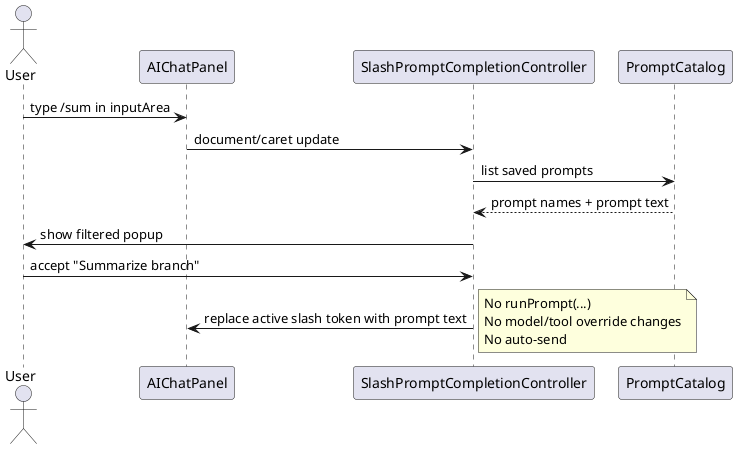

# Task: Add slash-triggered prompt insertion in chat input
- **Task Identifier:** 2026-05-17-slash-prompt
- **Scope:**
  Add chat-input slash completion for saved AI prompts so typing `/` in
  the AI chat input can show matching prompt names and insert the
  selected prompt text into the current draft without sending it or
  changing model/tool selection.
- **Motivation:**
  Reusable prompts are fast to launch from menus, but that path creates
  prompt-execution semantics. Users also need a lighter inline reuse
  path inside an existing chat draft, especially when they want prompt
  text at an arbitrary point in the conversation.
- **Scenario:**
  A user is drafting a normal chat message and types `/sum`. A popup
  lists matching saved prompts such as `Summarize branch`. The user
  accepts one entry, the slash token is replaced with the saved prompt
  text in the input area, and the user can keep editing before sending.
  The current chat's model, tools, and assistant-profile behavior stay
  unchanged.
- **Constraints:**
  - Slash insertion must never call the shown/hidden prompt execution
    path in `AIChatPanel.runPrompt(...)`.
  - It must not change `selectedModelOverride`,
    `toolAvailabilityOverride`, the current global model selection, or
    the current global tool availability.
  - Prompt metadata `showInChat`, `modelSelectionValue`, and
    `toolAvailabilitySelectionValue` are ignored for slash insertion;
    only prompt name matching and prompt text insertion are used.
  - Slash completion must coexist with existing chat input shortcuts
    (send, undo, redo, cancel) and normal multiline text editing.
  - Avoid triggering on arbitrary slash characters inside ordinary text
    unless they form the defined slash-command token.
- **Briefing:**
  `AIChatPanel` owns the chat `inputArea` and its key bindings.
  `AiPromptActionRegistry` owns the saved prompt list and currently
  exposes prompt execution, but `AIChatPanel` does not currently have a
  read-only prompt lookup path. `AIChatPanel.runPrompt(...)` must not be
  reused because it creates prompt-execution semantics, including
  optional prompt-session model/tool overrides.
- **Research:**
  - `AIChatPanel` uses a `JTextArea` named `inputArea` with custom key
    bindings for send, undo, redo, and cancel. There is no completion
    popup today.
  - `AiPromptActionRegistry` persists the saved prompt list and already
    keeps prompt snapshots in memory, but its prompt access is package-
    private and oriented around menu actions and full prompt execution.
  - `AIChatPanel.runPrompt(...)` composes and submits a prompt request,
    and shown prompts may start a dedicated chat session with assistant
    profiles disabled and optional model/tool overrides. That behavior
    is explicitly different from inline prompt insertion.
  - Prompt text already lives separately from prompt execution metadata
    in `AiPrompt`, so inline insertion can reuse the saved prompt text
    without adopting the execution-time model/tool behavior.
- **Design:**
  - Introduce a small read-only prompt lookup interface or equivalent
    snapshot access that `AIChatPanel` can use without taking a
    dependency on prompt execution actions.
  - Add a chat-input slash completion controller for `inputArea` that:
    - detects an active slash token near the caret;
    - shows a popup of matching saved prompt names;
    - updates matches as the user types;
    - accepts selection by keyboard and mouse; and
    - closes cleanly on escape, focus loss, or no active slash token.
  - On acceptance, replace only the active slash token with the
    selected prompt's saved prompt text at the caret position. Do not
    auto-send the message.
  - Keep inline insertion semantic-free: do not call `runPrompt(...)`,
    do not resolve model/tool overrides, and do not alter
    assistant-profile selection logic.
  - Ignore prompt `showInChat`, model selection, and tool selection for
    this path; they remain relevant only to explicit prompt execution
    from the existing prompt feature.
  - Preserve surrounding user text so slash insertion can work at the
    beginning of the draft or in the middle of a larger chat message.

- **Test specification:**
  - Automated tests:
    - verify slash matching filters saved prompt names from the current
      prompt catalog snapshot;
    - verify accepting a completion replaces only the active slash token
      with the saved prompt text;
    - verify slash insertion does not call the prompt execution path and
      does not modify model/tool selection state;
    - verify popup dismissal on escape or invalid slash context leaves
      the input text unchanged.
  - Manual tests:
    - type `/` in the chat input and verify a prompt completion popup
      appears with saved prompt names;
    - type more characters after `/` and verify the list narrows to
      matching prompts;
    - accept a prompt and verify its text is inserted into the draft
      without sending the message;
    - verify the current chat model selector and tool control stay
      unchanged before and after insertion;
    - verify ordinary prompt execution from menus still behaves as
      before, including model/tool prompt semantics.
