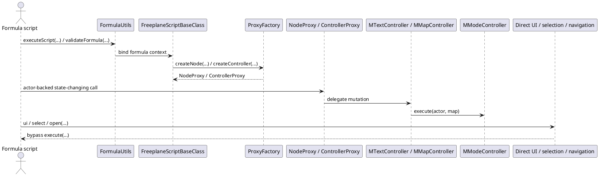
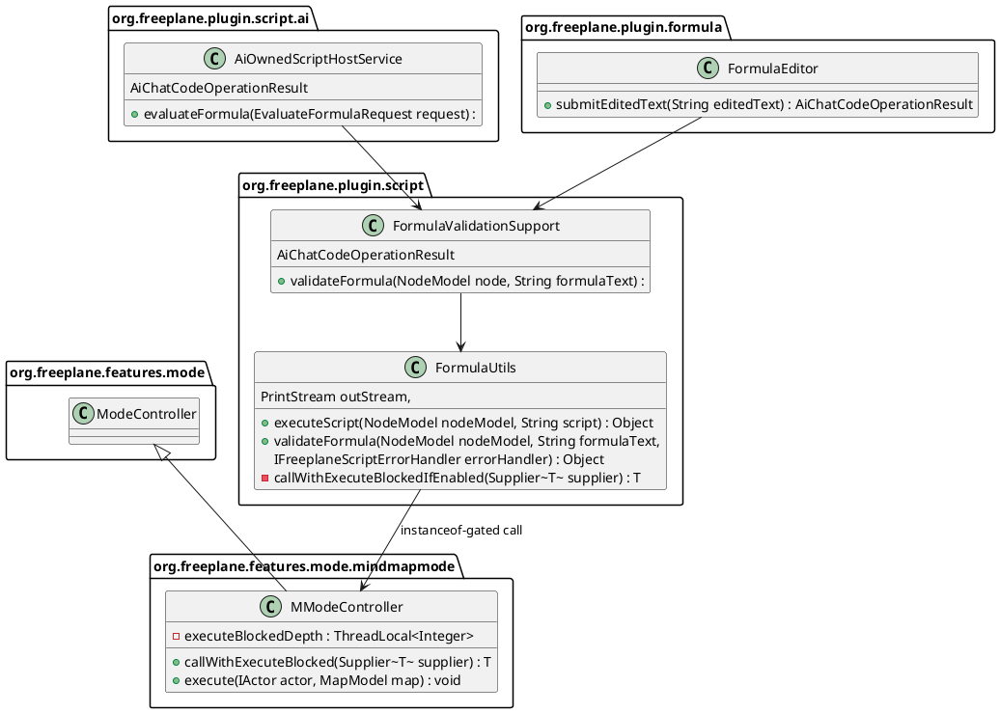
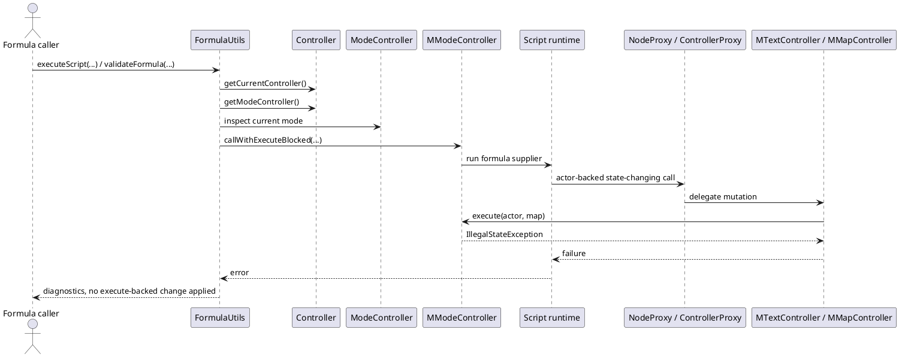

# Task: Prevent formula-triggered mode-controller execute calls
- **Task Identifier:** 2026-06-06-formula-execute-guard
- **Scope:** Add `MModeController`-local guarded execution support and
  enforce execute blocking in `MModeController.execute(IActor,
  MapModel)` while formulas are being evaluated or validated. Apply it
  to shared formula paths used by normal formula evaluation, attached
  formula validation, and AI formula preview evaluation. Add a user
  opt-out for the guard. Keep broader UI, view, and selection
  side-effect blocking out of scope for this increment.
- **Motivation:** Formula policy already says formulas should be
  value-computing only, but current runtime enforcement is incomplete.
  Formula bindings still hand scripts concrete proxy objects with
  write-capable and UI-driving methods. A central guard on
  `MModeController.execute(...)` can stop many actor-backed map changes
  and reduce formula-caused state corruption, while `isReadonly()` is
  already too weak because some readonly actors still change visible or
  persisted state.
- **Scenario:** When a formula is evaluated, validated, or previewed and
  it tries to perform an actor-backed change that reaches
  `MModeController.execute(...)`, evaluation fails with diagnostics and
  the attempted change is not applied. Pure read-only formulas still
  evaluate normally. The guard is enabled by default but can be
  disabled by the user if they intentionally rely on existing
  side-effecting formulas. Direct UI, view, and selection calls that
  bypass `execute(...)` remain unsupported by policy and warnings, but
  are not comprehensively blocked by this increment.
- **Constraints:**
  - Do not model this guard as "readonly"; `IActor.isReadonly()`
    already covers some state-changing actors.
  - Block all `MModeController.execute(...)` calls in the guarded
    scope; do not special-case `isReadonly()`.
  - The guarded scope must cover shared non-AI formula paths, not only
    AI preview or apply.
  - Keep existing formula guidance that formulas must avoid UI-related
    and state-changing calls; this guard is additive, not a
    replacement.
  - Do not attempt comprehensive UI, view, or navigation blocking in
    this increment unless new research finds a safe central
    interception point.
  - Keep shared additions Java-8-compatible.
- **Briefing:** The enforcement API lives in
  `freeplane/src/main/java/org/freeplane/features/mode/mindmapmode/MModeController.java`.
  Many undo-aware map writes reach that method through classes such as
  `MMapController` and `MTextController`. Shared formula execution
  lives in `freeplane_plugin_script`, especially `FormulaUtils` and
  `FormulaValidationSupport`. AI formula preview already crosses the
  OSGi boundary through `AiCodeHostService.evaluateFormula(...)`, which
  reuses the same formula validation path. `FreeplaneScriptBaseClass`
  binds formulas as `NodeRO` / `ControllerRO`, but current proxy
  factories still return concrete `NodeProxy` / `ControllerProxy`
  instances.
- **Research:**
  - `MModeController.execute(IActor, MapModel)` currently allows actor
    execution when `actor.isReadonly() || canEdit(map)`.
  - `MMapController.insertSingleNewNode(...)` creates an `IActor` and
    calls `Controller.getCurrentModeController().execute(actor, map)`.
    Formula code that creates nodes can therefore reach the central
    mode-controller execute path.
  - `MTextController.setNodeObject(...)` also creates an `IActor` and
    calls `Controller.getCurrentModeController().execute(actor,
    node.getMap())`. Formula code that rewrites node text can therefore
    reach the same path.
  - `IActor.isReadonly()` is not equivalent to "no state change".
    Existing readonly actors include
    `MMapController.setFoldingState(...)`,
    `MTextController.setDetailsHidden(...)`, and
    `MTextController.setIsMinimized(...)`, and those actors still
    change visible or persisted state.
  - `SelectionActor` is not marked readonly, but that does not solve
    the broader semantics problem because `isReadonly()` already
    includes other side-effecting actors.
  - Formula scripting documentation in
    `freeplane_plugin_script/src/main/java/org/freeplane/plugin/script/proxy/Proxy.java`
    already says only the read-only proxy interfaces are supported in
    formulas.
  - `FreeplaneScriptBaseClass.withBinding(...)` binds `node` and `c` as
    `NodeRO` and `ControllerRO`, but `ProxyFactory.createNode(...)`
    returns `NodeProxy` and `ProxyFactory.createController(...)`
    returns `ControllerProxy`. Runtime enforcement is therefore still
    needed.
  - `ControllerProxy.select(...)`, `selectBranch(...)`, and
    multi-select methods change selection and display directly without
    using `MModeController.execute(...)`.
  - `NodeBookmarkProxy.open(...)` opens a bookmark directly without
    using `MModeController.execute(...)`.
  - `FreeplaneScriptBaseClass` exposes global `ui`, so dialog and
    notification side effects also exist outside the
    `MModeController.execute(...)` path.
  - `FModeController` and `BModeController` inherit the base
    `ModeController.execute(...)`; this increment does not add a shared
    base guard for those modes.
  - `FormulaUtils.executeScript(...)` and
    `FormulaUtils.validateFormula(...)` are the shared central formula
    execution and validation paths in `freeplane_plugin_script`.
  - `FormulaValidationSupport.validateFormula(...)` reuses
    `FormulaUtils.validateFormula(...)`.
  - `AiOwnedScriptHostService.evaluateFormula(...)` reuses
    `FormulaValidationSupport.validateFormula(...)`, so AI formula
    preview already shares the same validation path.
  - `FormulaEditor.submitEditedText(...)` also validates formulas
    through `FormulaValidationSupport`, so attached formula submission
    uses the same shared path.

- **Analysis:**
  - The guard must not rely on `IActor.isReadonly()` because current
    readonly actors already mutate state.
  - Blocking all `MModeController.execute(...)` calls inside a formula
    scope is a better match for the desired policy than allowing a
    readonly subset.
  - The new scope should be named by the blocked mechanism, not by a
    broader claim such as readonly or side-effect-free, because direct
    UI, view, and selection calls still bypass this boundary.
  - The guarded-scope API can stay local to `MModeController` and
    `FormulaUtils` can opt into it only when the current mode
    controller is an `MModeController`. That keeps the scope explicit
    and avoids changing the shared `ModeController` contract.
  - `FormulaUtils` is the correct place to enter the scope because it
    is shared by normal formula evaluation, validation, attached
    formula submission, and AI formula preview.
  - A user opt-out is needed because this is a behavior change for all
    formulas and may intentionally break existing side-effecting
    formulas.
  - Automated verification for this increment should stay at the unit
    level because broader script-side integration tests would require
    bootstrapping singleton-heavy core controllers that are out of
    scope for this task.
  - Broader UI, view, and selection blocking is a separate problem and
    should not block this increment because no safe central
    interception point has yet been identified.
- **Design:**
  - Add execute-blocking scope support to `MModeController`:
    - `<T> T callWithExecuteBlocked(Supplier<T> supplier)`
  - Track nested scope depth with a thread-local counter restored in
    `finally`.
  - Change `MModeController.execute(IActor, MapModel)` to throw
    `IllegalStateException` when execute-blocking is active before any
    actor logic runs.
  - Do not consult `actor.isReadonly()` in the blocked scope.
  - Add a formula preference `formula_block_mode_controller_execute`
    with default `true` in formula plugin defaults, preferences, and
    translations.
  - Add a helper in `FormulaUtils` that, when the preference is
    enabled and the current mode controller is an `MModeController`,
    delegates formula evaluation to
    `MModeController.callWithExecuteBlocked(...)`; otherwise it
    executes the supplier directly.
  - Wrap both `FormulaUtils.executeScript(...)` and
    `FormulaUtils.validateFormula(...)` with that helper.
  - Keep AI tool and attached-editor guidance that formulas must
    remain value-computing and must not call UI or state-changing
    APIs. Do not claim that the new runtime guard blocks every UI side
    effect.
  - Propagate the thrown error through existing formula validation and
    execution error reporting so callers receive diagnostics rather
    than a crash.

- **Test specification:**
  - Automated tests:
    - Add coverage for `MModeController` scoped execute blocking,
      including nested scope restoration after success and failure.
    - Add unit coverage for
      `FormulaUtils.callWithExecuteBlockedIfEnabled(...)` with current
      controller absent, preference disabled, and preference enabled so
      routing to `MModeController.callWithExecuteBlocked(...)` is
      verified without bootstrapping full script-side integration
      flows.
    - Keep unit coverage that
      `AiOwnedScriptHostService.evaluateFormula(...)` delegates to
      `FormulaValidationSupport`.
    - Keep unit coverage that
      `FormulaValidationSupport.validateFormula(...)` maps success and
      failure diagnostics correctly.
  - Manual tests:
    - In a live map, evaluate a side-effecting formula with the guard
      enabled and confirm the formula fails without changing the map.
    - Disable the preference, re-evaluate the same formula, and
      confirm the previous execute-backed behavior returns.
