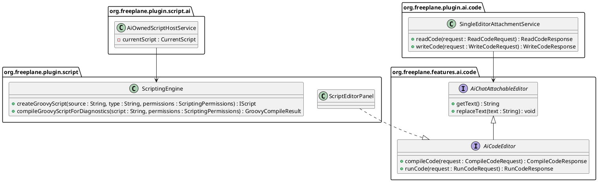
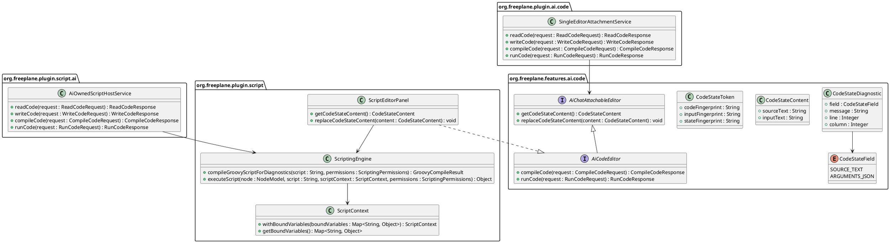
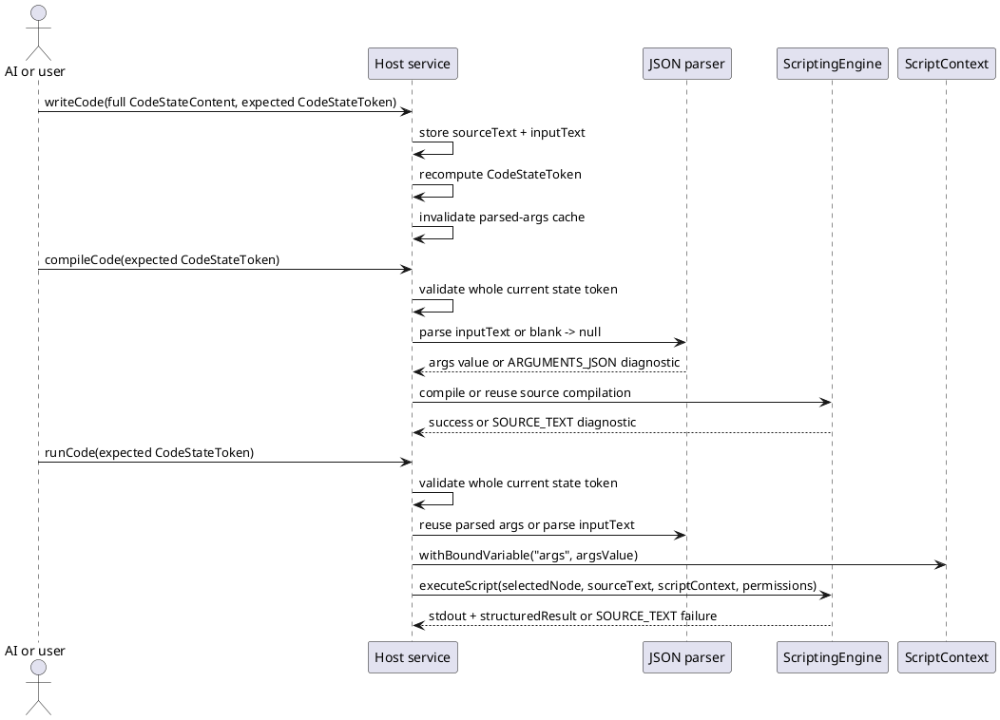

# Task: Add bound JSON inputs to script hosts

- **Task Identifier:** 2026-06-09-script-input-binding

- **Scope:** Add an explicit JSON input channel for Groovy script
  execution in the AI-owned script host and the node script editor /
  attached script editor path, so script data no longer has to be
  embedded inside Groovy source literals. Extend the relevant code-host
  APIs, editor UI, execution binding, and tests.

- **Motivation:** `runCode` and attached script runs currently accept
  only source text. Text payloads therefore have to be encoded inside
  Groovy string literals, which can either fail compilation or
  silently change the stored content before it reaches the map.

- **Scenario:**
  A user or AI prepares a Groovy script that writes long-form prose
  into nodes. The source code is edited in the existing script editor
  or AI-owned script dialog, while the data to be written is supplied
  through a separate JSON field. The script receives that data through
  bindings instead of Groovy string-literal parsing, so quotes,
  dollar signs, backslashes, and line breaks survive unchanged.

- **Constraints:**
  - Treat the JSON payload as data, not source code.
  - Preserve current script-execution permissions and availability
    policies.
  - Keep formula editing and formula execution out of scope unless a
    later clarification explicitly adds them.
  - Any fingerprint or stale-state guard must remain correct for every
    state element that can change compile or run behavior.

- **Briefing:**
  Relevant code spans:

  - `freeplane_plugin_script/.../ScriptEditorPanel.java`
  - `freeplane_plugin_script/.../ScriptEditor.java`
  - `freeplane_plugin_script/.../ExecuteScriptForSelectionAction.java`
  - `freeplane_plugin_script/.../ScriptingEngine.java`
  - `freeplane_plugin_script/.../GroovyScript.java`
  - `freeplane_plugin_script/.../FreeplaneScriptBaseClass.java`
  - `freeplane_plugin_script/.../ai/AiOwnedScriptHostService.java`
  - `freeplane_plugin_script/.../ai/AiOwnedScriptDialog.java`
  - `freeplane_plugin_ai/.../code/SingleEditorAttachmentService.java`
  - `freeplane_plugin_ai/.../tools/code/AiCodeToolSet.java`
  - `freeplane_plugin_formula/.../FormulaEditor.java`
  - `freeplane/src/main/java/org/freeplane/features/ai/code/*`
  - `freeplane/src/main/java/org/freeplane/core/ui/components/OptionalDontShowMeAgainDialog.java`

  Existing review task
  `ai-specs/tasks/review/groovy-script-execution-tool.md`
  established the current host split but not a separate data channel.

## Subtask: Add bound JSON inputs to script hosts
- **Status:** done

- **Research:**
  - `WriteCodeRequest` and `WriteCodeToolRequest` currently carry only
    source text plus expected fingerprint.
  - `ReadCodeResponse`, `CompileCodeResponse`, and `RunCodeResponse`
    expose code state and results but no separate input payload.
  - `ScriptEditorPanel` and `AiOwnedScriptDialog` currently display
    only one editable source field.
  - Freeplane already has `OptionalDontShowMeAgainDialog`, a
    property-backed confirmation dialog whose `MessageType` can be set
    to remember only yes, only no, or both decisions. Existing code
    uses it for decisions such as script execution permission prompts.
  - `freeplane_plugin_script` already ships Jackson on its classpath,
    so script-host JSON parsing can reuse an existing JSON library
    rather than adding a new dependency.
  - Attached script editor persistence currently stores only script
    source in `ScriptHolder` / node attributes.
  - Saved node-script execution is not limited to the script editor.
    `ScriptEditor.NodeScriptModel.executeScript(...)` runs the selected
    saved script from the editor, and
    `ExecuteScriptForSelectionAction` delegates to
    `ScriptingEngine.performScriptOperation(...)` to execute node
    attributes whose names start with `script`.
  - Attached formula editing currently shares the same attached-editor
    host interfaces as attached scripts because `FormulaEditor` also
    implements `AiCodeEditor`.
  - Node script discovery and execution currently treat attributes with
    names starting with `script` as scripts, so any companion-payload
    attribute scheme must avoid accidental script listing or execution.
  - `SingleEditorAttachmentService` fingerprints attached state from
    editor text only.
  - `AiOwnedScriptHostService` fingerprints AI-owned state from code
    text only and runs `ScriptingEngine.executeScript(...)` with no
    extra data channel.
  - `ScriptingEngine.createGroovyScript(...)` uses a process-local
    `ConcurrentCache` of compiled script objects keyed by source text,
    script type, and scripting permissions. The cache size comes from
    `compiled_script_cache_size`, whose default is `200`.
  - For string-backed scripts, the cached `GroovyScript` object keeps
    its compiled class internally and reuses it while the same cached
    object is reused. Changing source text changes the cache key, so it
    does not reuse the old compiled class.
  - `compileGroovyScriptForDiagnostics(...)` does not use that cache.
    It creates a fresh `GroovyScript`, compiles for diagnostics, and
    discards it.
  - AI-owned `runCode` currently does a diagnostic compile first and
    then executes through `ScriptingEngine.executeScript(...)`, so one
    run may still compile twice even though execution itself has a
    cache path.
  - `GroovyScript.createBindingForCompilation()` currently binds only
    `script`, while runtime binding later injects `node` and `c`.
  - That binding flow means a new data-binding feature needs an
    explicit injection point before compile/run.

- **Analysis:**
  - Use a separate input channel because Groovy literals can reject or
    silently corrupt text payloads.
  - Keep scope to script hosts because formula editing and execution
    use a different contract.
  - Persist one JSON payload per saved node script because reopened,
    AI-attached, and attribute-executed saved scripts must stay
    reproducible.
  - Bind one root variable `args`, always present; blank trimmed input
    means `args == null`; nonblank JSON roots map to ordinary
    Groovy-friendly `Map` / `List` / scalar values because root-only
    binding avoids name collisions and still supports any JSON shape.
  - Allow invalid JSON as saved draft state, but make `compileCode` and
    run fail on it because runnable-state validity is stricter than
    draft editing.
  - Use `OptionalDontShowMeAgainDialog` for invalid-JSON Save/Exit in
    the node script editor; `Yes` saves invalid draft and exits, `No`
    keeps the editor open, and only `Yes` may be remembered because a
    remembered `No` would make later Save/Exit look broken.
  - Structured state tokens are allowed, but stale-state checks remain
    whole-state checks because stale `args` is not acceptable.
  - Derive tokens from raw `sourceText` and raw `inputText` only;
    permissions, selection, authorization, and availability remain
    runtime inputs because they are environment state, not editable
    script state.
  - Compile reuse is separate from stale-state checks and depends on
    source text plus effective permissions, not on `args`, because
    `args` changes should not force recompilation.
  - Visible companion metadata is acceptable; empty or whitespace-only
    input must remove it; saved-script `args` must apply to every
    execution path; and companion names must stay outside the
    `script*` namespace so they are never listed or executed as
    scripts.
  - Backward compatibility of the current fingerprint API is not a
    constraint, so the host/API may replace the source-only model with
    one full runnable-state object.

- **Design:**
  Target model:

  - **Full runnable-state contract**
    - Keep `readCode`, `writeCode`, `compileCode`, and `runCode`, but
      redefine them around one `CodeStateContent` with `sourceText` and
      `inputText`, plus one `CodeStateToken` with
      `codeFingerprint`, `inputFingerprint`, and `stateFingerprint`.
    - Derive fingerprints from raw `sourceText`, raw `inputText`, and
      both together.
    - `readCode` returns the current token and omits
      `CodeStateContent` only when the caller already supplied the
      current `stateFingerprint`.
    - `writeCode` replaces the whole `CodeStateContent` at once and
      requires the current expected token whenever state already
      exists.
    - `compileCode` and `runCode` require the expected whole current
      token.
    - `WriteCodeResponse`, `CompileCodeResponse`, and
      `RunCodeResponse` return the current token.
    - Update `AiCodeToolSet`, code-tool request DTOs, and MCP
      schemas/descriptions to expose full-state fields and structured
      tokens instead of source-only text.
    - Target request/response shapes:
      - `ReadCodeRequest { host, knownStateFingerprint? }`
      - `ReadCodeResponse { host, contentType, status, runInitiator,
        stateToken, content?, diagnostics?, errorMessage?, stdout?,
        structuredResult? }`
      - `WriteCodeRequest { host, content, expectedStateToken? }`
      - `WriteCodeResponse { host, contentType, status, stateToken }`
      - `CompileCodeRequest { host, expectedStateToken }`
      - `CompileCodeResponse { host, contentType, status, stateToken,
        diagnostics?, errorMessage? }`
      - `RunCodeRequest { host, expectedStateToken }`
      - `RunCodeResponse { host, contentType, status, runInitiator,
        stateToken, diagnostics?, errorMessage?, stdout?,
        structuredResult? }`

  - **Diagnostics**
    - Add `CodeStateField { SOURCE_TEXT, ARGUMENTS_JSON }` and
      `CodeStateDiagnostic { field, message, line, column }`.
    - Invalid JSON diagnostics target `ARGUMENTS_JSON`; Groovy compile or
      runtime diagnostics target `SOURCE_TEXT`.
    - Keep summary `errorMessage`, but derive it from the primary
      structured diagnostic.

  - **Binding and parsing**
    - Add a second JSON editor field in `ScriptEditorPanel` and
      `AiOwnedScriptDialog`.
    - Bind one root variable `args` only; never auto-bind top-level
      keys.
    - Trim `inputText`; blank input binds `args == null`.
    - Parse nonblank JSON roots to ordinary Groovy-friendly
      `Map` / `List` / `String` / `Number` / `Boolean` / `null`
      values.
    - Extend `ScriptContext` with exact methods
      `withBoundVariables(Map<String, Object>)` and
      `getBoundVariables()`, and make
      `FreeplaneScriptBaseClass.withBinding(...)` merge those values
      into the runtime Groovy `Binding`.
    - Declare `args` in compile-time binding as present with `null`,
      then replace it at runtime with the parsed current value.

  - **Validation, caching, and run flow**
    - `writeCode` stores invalid JSON draft text unchanged.
    - `compileCode` validates whole current state by checking the token,
      parsing trimmed `inputText`, and compiling or reusing Groovy
      compilation for `sourceText + effective permissions`.
    - Invalid JSON fails `compileCode` and blocks `runCode`.
    - Cache parsed `args` by `inputFingerprint` and compiled Groovy by
      `sourceText + effective permissions`.
    - Remove the extra uncached diagnostic compile from AI-owned run as
      part of the new full-state path.
    - Tokens cover only editable runnable-state text; authorization,
      permissions, selection, and availability stay runtime checks.

  - **Attached-editor contract**
    - Replace `AiChatAttachableEditor { getText, replaceText }` with
      full-state accessors over `CodeStateContent`.
    - `ScriptEditorPanel` and `FormulaEditor` implement that full-state
      editor contract.
    - Attached formulas keep current behavior: blank/`null`
      `inputText`, no JSON editor, compile-only, and no formula
      execution added.
    - `SingleEditorAttachmentService` reads, writes, fingerprints, and
      persists full `CodeStateContent`.

  - **Saved node-script persistence**
    - Persist JSON for saved `scriptN` in companion attribute
      `args_for_scriptN`.
    - Companion names must never start with `script`.
    - `ScriptEditor.NodeScriptModel` loads both script and companion
      attributes into one holder, including both positions.
    - Save rules: nonblank JSON creates or updates
      `args_for_scriptN`; blank trimmed JSON removes it; orphan
      `args_for_scriptN` is ignored during execution and removed on the
      next script-editor save.
    - All saved-script execution paths use the same persisted `args`,
      including editor-run and
      `ScriptingEngine.performScriptOperation(...)`.
    - Attribute-based execution therefore loads `args_for_scriptN`,
      parses it with the same rules, binds `args`, and executes through
      the same binding path.

  - **Invalid-JSON Save/Exit prompt**
    - Node-script Save/Exit with invalid JSON uses
      `OptionalDontShowMeAgainDialog` with
      `MessageType.ONLY_OK_SELECTION_IS_STORED`.
    - Prompt semantics: `save invalid JSON?`
      - `Yes` saves invalid draft and exits.
      - `No` keeps the editor open for further editing or explicit
        cancel.
    - This prompt applies only to node-script Save/Exit, not to the
      AI-owned transient hide/cancel path.

  - **Class-level target inventory**

  - **Compile and run interaction**

- **Test specification:**
  - Automated tests:
    - contract/tool tests: full-state read/write carries both
      `sourceText` and `inputText` plus `CodeStateToken`; MCP and
      internal schemas/descriptions advertise those fields; `readCode`
      omits text only when the caller already knows the current whole
      `stateFingerprint`; formula-attached editors keep blank/`null`
      `inputText` and compile-only behavior.
    - host-service tests: extend `AiOwnedScriptHostServiceTest` and
      `SingleEditorAttachmentServiceTest` for full-state read/write,
      structured-token whole-state staleness, invalid draft accepted by
      write, invalid JSON causing `ARGUMENTS_JSON` compile failure and run
      blocking, source failures still targeting `SOURCE_TEXT`, and
      `inputText` changes updating the whole-state token without
      forcing recompilation when source text and permissions are
      unchanged.
    - binding/parsing tests: empty or whitespace-only `inputText`
      binds `args == null`; object, array, scalar, boolean, and null
      JSON roots bind to the approved Groovy-friendly Java value types;
      scripts can write text containing quotes, `$`, `\`, and embedded
      line breaks without source-literal corruption.
    - saved node-script persistence tests: nonblank JSON creates or
      updates `args_for_scriptN`; cleared or whitespace-only JSON
      removes it; companion attributes are never discovered or executed
      as scripts; orphan `args_for_scriptN` attributes are ignored
      during execution and removed on the next script-editor save; the
      same persisted `args` is honored in editor-run and attribute-based
      execution.
    - editor-dialog tests: invalid-JSON Save/Exit shows
      `OptionalDontShowMeAgainDialog` in `remember yes only` mode;
      `Yes` saves invalid JSON draft state and exits; `No` keeps the
      editor open; remembered `Yes` suppresses the prompt; remembered
      `No` is impossible.
  - Manual tests:
    - run node-script editor source + JSON and confirm stored node text
      matches the JSON payload verbatim;
    - reopen the node script editor and confirm saved JSON reloads for
      that script;
    - execute the same saved node script through normal attribute-based
      execution and confirm it uses the same saved `args`;
    - run AI-owned dialog source + JSON and confirm stored node text
      matches the JSON payload verbatim;
    - trigger invalid-JSON Save/Exit in the node script editor and
      verify `Yes` saves invalid draft state, `No` keeps the editor
      open, and `don't ask again` persists only the `Yes` choice.

## Subtask: Refine script-host code-state contract and attached-editor repair flow
- **Status:** done
- **Scope:** Simplify the script-host state contract and fix the
  attached / node script editor repair flow so state reads always carry
  current content, invalid Arguments JSON is identified locally, and AI
  repair stays explicit.
- **Motivation:** The current contract mixes redundant fingerprints,
  content-elision guesses about AI knowledge, and misleading `status`
  values. That confusion already prevented the attached repair flow from
  giving AI the current draft text to fix.
- **Briefing:**
  Relevant code spans:

  - `freeplane/src/main/java/org/freeplane/features/ai/code/*`
  - `freeplane_plugin_ai/.../code/SingleEditorAttachmentService.java`
  - `freeplane_plugin_ai/.../tools/code/*`
  - `freeplane_plugin_ai/.../mcpserver/ModelContextProtocolToolDispatcherTest.java`
  - `freeplane_plugin_script/.../ScriptEditorPanel.java`
  - `freeplane_plugin_script/.../ScriptInputJsonSupport.java`
  - `freeplane_plugin_script/.../ai/AiOwnedScriptHostService.java`
  - `freeplane_plugin_formula/.../FormulaEditor.java`
  - `freeplane/src/viewer/resources/translations/Resources_en.properties`
- **Research:**
  - `CodeStateToken` currently carries `codeFingerprint`,
    `inputFingerprint`, and a derived `stateFingerprint` even though the
    derived value adds no independent state information.
  - `ReadCodeRequest` currently carries `knownStateFingerprint`, and
    `readCode` omits `content` when that fingerprint matches the current
    state.
  - In the observed Ask-AI repair flow, the AI called `readCode`
    successfully and got `status=FAILED` plus `content=null` because the
    request supplied the current `knownStateFingerprint`.
  - `ScriptEditorPanel.manualRunCodeState(...)` currently builds the
    repair state with `content=null`, so the explicit Ask-AI flow can
    send diagnostics without the draft source or arguments even before a
    later `readCode` call.
  - The current `status=FAILED` wording is misleading in `readCode`
    responses because the read operation itself succeeded; only the
    current attached-editor content state was failed.
  - The current single `FAILED` value conflates at least three distinct
    situations: invalid script source, invalid Arguments JSON, and
    runtime execution failure after successful validation.
  - The user wants `ReadCodeRequest` to have no `known*` fields at all,
    wants `stateFingerprint` removed, and prefers `codeState` as the
    single response state field because it stays aligned with
    `readCode` / `writeCode`.
  - The user wants the outer API to keep `readCode` / `writeCode`, but
    still wants the arguments payload to stay visibly distinct from the
    Groovy source inside content and fingerprint fields.
  - On attached script-editor Run with invalid JSON, the local failure
    UI still needs to tell the user that the failing field is Arguments
    JSON.
  - Attached manual run failure must not auto-submit to AI chat merely
    because the editor is attached.
- **Analysis:**
  - Remove `stateFingerprint` because it is derived from the other two
    fingerprints and only duplicates state.
  - Remove `knownStateFingerprint` because AI-facing reads must not rely
    on guesses about what the model still has cached.
  - Keep one neutral outer state field named `codeState` because it is
    coherent with `readCode` / `writeCode`, but keep the inner content
    and fingerprint fields explicit so Arguments JSON is not blurred
    into Groovy source.
  - Replace vague `READY` and `FAILED` values with one single-state
    model that distinguishes edited, runnable, invalid-script,
    invalid-arguments, waiting-for-user-run, run-succeeded, and
    run-failed states.
  - The Ask-AI repair path must include the current draft content in the
    recorded failure state instead of relying on a later content-eliding
    `readCode` call.
  - Attached manual run failure should stay local until the user
    explicitly chooses AI escalation.
- **Design:**
  - Change `CodeStateToken` to hold only `codeFingerprint` and
    `argumentsFingerprint`.
  - Change `CodeStateContent` to use `sourceText` and
    `argumentsJsonText`.
  - Change `ReadCodeRequest` and `ReadCodeToolRequest` to `host` only;
    remove all `known*` fields.
  - Change `readCode` to always return current content for attached and
    AI-owned script hosts.
  - Use one response field named `codeState` instead of `status` on the
    code-host read / write / compile / run responses.
  - Replace `CodeLifecycleStatus` with one single-state enum using:
    `NO_CODE`, `EDITED`, `RUNNABLE`, `INVALID_SCRIPT`,
    `INVALID_ARGUMENTS_JSON`, `WAITING_FOR_USER_RUN`,
    `RUN_SUCCEEDED`, and `RUN_FAILED`.
  - State transitions:
    - after `writeCode`, current content becomes `EDITED`;
    - after successful `compileCode`, current content becomes
      `RUNNABLE`;
    - invalid Groovy source becomes `INVALID_SCRIPT`;
    - invalid Arguments JSON becomes `INVALID_ARGUMENTS_JSON`;
    - AI-owned or attached-editor flows that require an explicit user
      execution keep `WAITING_FOR_USER_RUN`;
    - successful run of current content becomes `RUN_SUCCEEDED`;
    - runtime failure after successful validation becomes `RUN_FAILED`;
    - any later content change resets `RUNNABLE`, `RUN_SUCCEEDED`, or
      `RUN_FAILED` back to `EDITED`.
  - Whole-state stale checks for `writeCode`, `compileCode`, and
    `runCode` must compare both fingerprints from the expected token.
  - Exact request/response shapes:
    - `ReadCodeRequest { host }`
    - `ReadCodeResponse { host, contentType, codeState, runInitiator,
      stateToken, content, diagnostics?, errorMessage?, stdout?,
      structuredResult? }`
    - `WriteCodeRequest { host, content, expectedStateToken? }`
    - `WriteCodeResponse { host, contentType, codeState, stateToken }`
    - `CompileCodeRequest { host, expectedStateToken }`
    - `CompileCodeResponse { host, contentType, codeState, stateToken,
      diagnostics?, errorMessage? }`
    - `RunCodeRequest { host, expectedStateToken }`
    - `RunCodeResponse { host, contentType, codeState, runInitiator,
      stateToken, diagnostics?, errorMessage?, stdout?,
      structuredResult? }`
  - Attached manual-run failure UI for invalid JSON should explicitly
    identify the Arguments JSON field as the failing field instead of
    showing only the raw parser text.
  - The attached script-editor manual-run failure path should stop
    auto-requesting AI repair.
  - If the editor is attached and a manual run fails, keep the failure
    local and offer an explicit user-controlled `Ask AI` choice before
    any repair request is submitted, following the FormulaEditor
    precedent rather than silent auto-forwarding.
  - Record manual-run failure state with the current content included so
    explicit Ask-AI repair requests carry the draft source and
    Arguments JSON without requiring a second read.
  - Update MCP / tool descriptions, DTOs, host services, and tests to
    the new two-fingerprint / always-return-content contract.
- **Test specification:**
  - Automated tests should cover removal of `stateFingerprint` and
    `knownStateFingerprint`, `readCode` always returning
    `sourceText` plus `argumentsJsonText`, and whole-state stale checks
    comparing the two remaining fingerprints.
  - Automated tests should cover the single `codeState` model,
    including distinct `INVALID_SCRIPT`, `INVALID_ARGUMENTS_JSON`, and
    `RUN_FAILED` outcomes.
  - Automated tests should cover the manual attached-editor failure path
    no longer auto-submitting repair requests and should verify that
    explicit Ask-AI repair requests carry the current content.
  - Manual verification should cover invalid Arguments JSON feedback
    that names the failing field locally, no AI chat request until the
    user explicitly chooses Ask AI, and successful submission to the
    owning chat with current source plus arguments only after that
    explicit action.
- **Implementation notes:**
  - **Interpretations:**
    - Kept AI-owned `WAITING_FOR_USER_RUN` as the immediate result of an
      AI-initiated run request under the shown-user-run policy after
      Arguments JSON validation, while deferring script-source
      validation to explicit compile or actual user run, because eager
      source validation changed the existing user-run gate behavior and
      broke the current dialog-flow expectations.

## Subtask: Fix script-editor JSON pane geometry and persistence
- **Status:** done
- **Scope:** Fix the remaining post-review geometry and resize issues in
  the script-editor code / arguments / output layout, including stored
  divider state.
- **Motivation:** The JSON-pane resize and geometry issues remain real,
  but they are lower priority than the failure-feedback and unintended
  AI-escalation bugs.
- **Briefing:**
  Relevant code spans:

  - `freeplane_plugin_script/.../ScriptEditorPanel.java`
  - `freeplane_plugin_script/.../ScriptEditorWindowConfigurationStorage.java`
  - `freeplane_plugin_script/.../ai/AiOwnedScriptDialog.java`
  - `freeplane/src/main/java/org/freeplane/core/ui/components/JRestrictedSizeScrollPane.java`
- **Research:**
  - In the attached / node script editor, reducing the window height can
    make the JSON pane scrollbar disappear even though the content still
    overflows.
  - The current attached / node script editor layout now has three
    adjustable regions: the script list vs editor area split, the code
    vs JSON split, and the upper editor area vs output split.
  - `ScriptEditorPanel` currently persists only `left_ratio` and
    `top_ratio` in `ScriptEditorWindowConfigurationStorage`, so the new
    code-vs-JSON divider is not represented in stored geometry data.
  - `ScriptEditorPanel` currently uses `JRestrictedSizeScrollPane` for
    the code and JSON panes and does not set explicit minimum visible
    heights for the code pane, JSON pane, or output pane.
  - `AiOwnedScriptDialog` currently uses a vertical `JSplitPane` for
    code vs JSON and does not set explicit minimum visible heights for
    those panes.
  - The root cause of the disappearing scrollbar is not yet verified.
    It may involve split-pane size handling, scroll-pane size handling,
    `JRestrictedSizeScrollPane`, look-and-feel behavior, or a
    combination.
  - The user asked to track minimum visible heights of 6 rows for code,
    4 rows for arguments, and 4 rows for the output pane.
- **Analysis:**
  - The added code-vs-JSON divider changed the editor geometry model, so
    later geometry persistence work must treat that as a real stored
    state element rather than as an incidental UI detail.
- **Design:**
  - When this subtask becomes current, investigate the disappearing
    scrollbar without assuming the root cause is only look and feel.
  - The later fix must evaluate minimum visible heights of 6 code rows,
    4 arguments rows, and 4 output rows.
  - Stored geometry data for the script editor should be extended to
    represent the added code-vs-JSON divider instead of persisting only
    the older two-divider model.
  - The later implementation should decide the exact geometry-storage
    shape and any needed handling for existing stored geometry.
- **Test specification:**
  - To be done when this subtask becomes current.
  - At minimum, later verification should cover the requested minimum
    visible heights, preserved scrollbar visibility under resize, and
    persistence / restore of all relevant script-editor divider
    positions.
