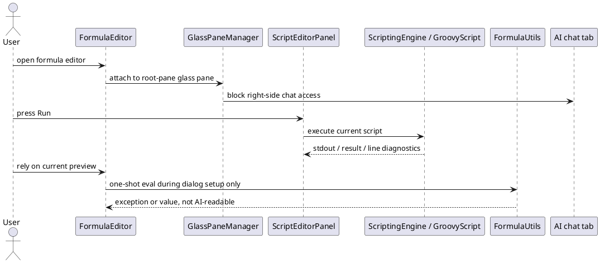
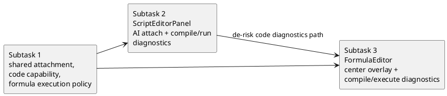
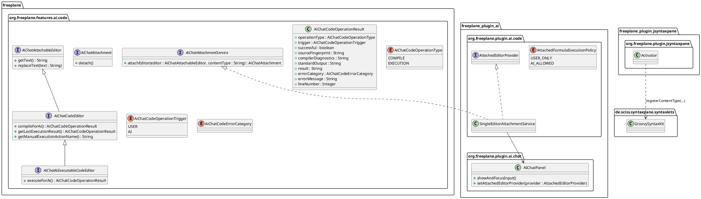
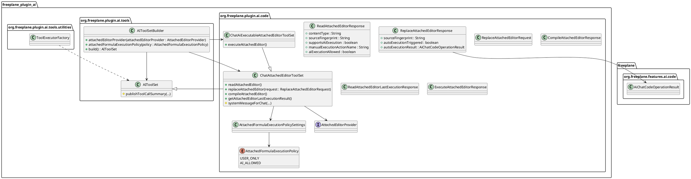
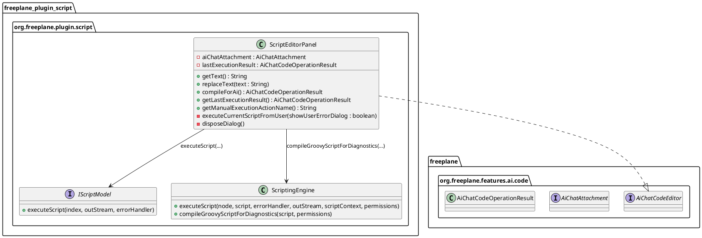
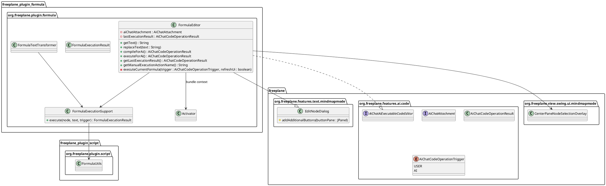
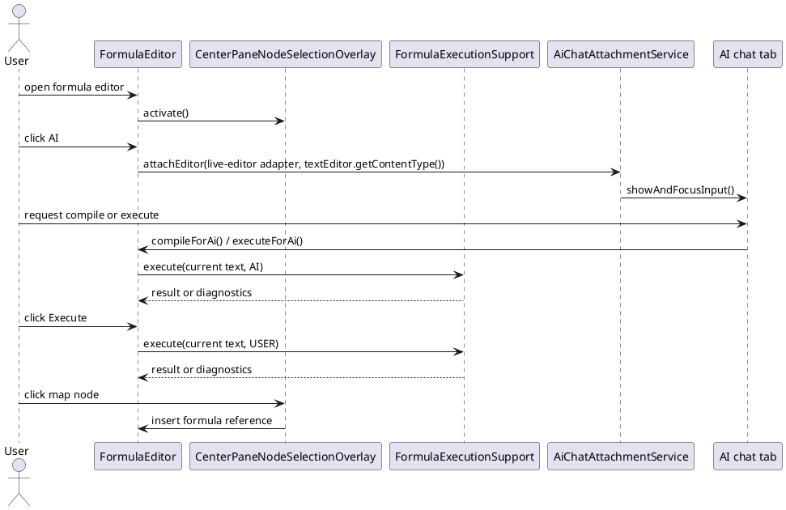

# Task: Allow AI chat attachment for Formula Editor and Script Editor
- **Task Identifier:** 2026-05-27-editor-chat-attachment
- **Scope:** Let a user explicitly attach an open `FormulaEditor` or
  `ScriptEditorPanel` to AI chat via an editor-local AI button. While
  attached, AI chat must become visible and usable, AI must be able to
  replace the live editor content, AI must be able to compile the
  attached code, and AI must be able to inspect compilation and
  execution errors. Only one editor may be attached at a
  time. The attachment ends when the editor closes or another editor
  attaches.
- **Motivation:** Current AI tooling edits persisted node or attribute
  state, not the live text buffer held by an open editor dialog.
  `FormulaEditor` additionally blocks normal access to the main
  Freeplane window, so the user cannot reach AI chat while the editor is
  open. Current script and formula run paths also do not expose their
  diagnostics back to AI.
- **Scenario:** A user opens `FormulaEditor` or `ScriptEditorPanel` and
  clicks a new AI button in that editor. Freeplane shows the AI chat
  panel, associates that editor with the chat, and lets AI read and
  replace the editor's current text while the editor stays open.
  Attaching alone does not compile or execute the editor content. AI
  can compile the attached code and inspect compilation errors. Script
  runs themselves must always be started by the user through the
  existing Run action, and the resulting diagnostics become readable to
  AI on the next chat turn. Formula execution may be AI-triggered only
  when a global formula-execution setting allows it. When AI replaces
  attached formula text while that setting is `ai_allowed`, Freeplane
  executes the updated formula automatically and makes the resulting
  diagnostics readable to AI immediately; otherwise the user triggers
  the editor's Execute action and the resulting diagnostics become
  readable to AI on the next chat turn. If the user attaches a
  different editor, the previous attachment is replaced. If the
  attached editor closes, the attachment is cleared automatically.
- **Constraints:**
  - Attaching an editor must be explicit. Do not auto-attach merely
    because an editor is open.
  - Attaching an editor must not compile or execute its current text by
    itself.
  - At most one editor may be attached to AI chat at a time.
  - Attached-editor edits must operate on the live editor text
    component, not on persisted `NodeModel` or attribute content.
  - Closing an attached editor must clear the attachment automatically.
  - Attaching a second editor must replace the previous attachment.
  - `FormulaEditor` must still support formula-reference insertion from
    the map.
  - Do not route attached-editor replacement through
    `TextualContentEditor` or the existing node-content `edit(...)`
    tool.
  - Attached-editor tools must remain chat-only. They must not appear in
    the MCP tool registry.
  - Compilation and execution must reuse the current
    formula and script mechanisms and runtime environment. Do not add a
    parallel compiler or executor path.
  - Script runs must always be started by the user.
  - There must be a global AI preference that controls whether AI may
    execute attached formulas itself, or whether only the user may
    trigger formula execution.
  - When AI replaces attached formula text and the formula-execution
    policy is `ai_allowed`, the updated formula must be executed
    automatically.
  - When script execution or formula execution is user-triggered, the
    resulting diagnostics must still become readable to AI.
- **Briefing:** `FormulaEditor` lives in
  `freeplane_plugin_formula/src/main/java/org/freeplane/plugin/formula`.
  `ScriptEditorPanel` lives in
  `freeplane_plugin_script/src/main/java/org/freeplane/plugin/script`.
  The AI chat UI is added as a tab in the main Freeplane tabbed panel by
  `freeplane_plugin_ai/src/main/java/org/freeplane/plugin/ai/Activator.java`.
  Current AI edit tooling is centered around `AIToolSet` and
  `TextualContentEditor`, which target persisted map content rather than
  open editor documents. Current script execution is centered around
  `ScriptingEngine` and `GroovyScript`. Current formula execution is
  centered around `FormulaUtils`, `FormulaTextTransformer`, and
  `FormulaEditor`.
- **Research:**
  - Observed facts:
    - `FormulaEditor` extends `EditNodeDialog`, but
      `FormulaEditor.configureDialog(...)` already forces
      `dialog.setModal(false)`. The blocking behavior is therefore not
      ordinary Swing dialog modality.
    - `FormulaEditor.show(Window)` currently installs a
      `GlassPaneManager` on the main window root pane before showing the
      dialog.
    - `GlassPaneManager.ancestorAdded(...)` makes the main root glass
      pane visible and calls
      `SwingUtilities.getWindowAncestor(rootPane).setFocusableWindowState(false)`.
      `ancestorRemoved(...)` reverses that state.
    - `GlassPaneNodeSelector` only routes mouse interaction to
      `MapView`, `MainView`, `JTable`, and scrollbars, and translates
      those interactions into formula-reference picking behavior.
      Normal main-window UI is not part of that allowed interaction set.
    - The AI chat UI is in the main Freeplane window tabbed pane on the
      frame's `ViewController.RIGHT` side, while the main map and
      auxiliary split-pane tree live in the frame's
      `BorderLayout.CENTER` component.
    - Because `GlassPaneManager` uses the root-pane glass pane and also
      disables the whole window focusable state, it blocks both the
      center map area and the right-side AI tab.
    - `ScriptEditorPanel` is a separate non-modal `JDialog`
      (`super(UITools.getCurrentFrame(), false)`) and does not install a
      `GlassPaneManager` or disable the main window focusable state.
    - `FormulaEditor` keeps live text in its `JEditorPane` and only
      writes the value back when the edit control is submitted.
      Updating the node model behind the dialog is stale and can be
      overwritten when the dialog is confirmed.
    - `ScriptEditor` copies script attributes into a dialog-local model
      on open. `ScriptEditorPanel.storeCurrent()` and
      `NodeScriptModel.endDialog(...)` write that buffered value back on
      dialog actions and close. Updating node attributes behind the
      dialog would race with, and can be overwritten by, the dialog's
      buffered copy.
    - `ScriptEditorPanel.RunAction` currently calls `storeCurrent()`,
      clears the result field, and delegates execution to
      `IScriptModel.executeScript(...)` with a panel `PrintStream` and
      `IFreeplaneScriptErrorHandler`.
    - Both current `ScriptEditorPanel` models execute live editor text
      through
      `ScriptingEngine.executeScript(selectedNode, script, errorHandler, outStream, null, ScriptingPermissions.getPermissiveScriptingPermissions())`.
      For the attached script editor path, the current execution
      environment therefore always goes through `GroovyScript` with
      permissive scripting permissions and the current selected node.
    - `ScriptingEngine` already has the full execution overload that
      accepts `PrintStream`, `IFreeplaneScriptErrorHandler`,
      `ScriptContext`, and `ScriptingPermissions`. The simpler overloads
      delegate to it or to the same `GroovyScript` path with default
      sinks.
    - `GroovyScript.execute(...)` compiles inside `execute(...)` through
      its private `compileAndCache(...)` method, writes diagnostics to
      the provided `PrintStream`, and reports line numbers through the
      provided `IFreeplaneScriptErrorHandler`.
    - `FormulaUtils.executeScript(node, script)` creates a `ScriptContext`
      for the node, uses `ScriptingPermissions.getFormulaPermissions()`,
      and delegates to `ScriptingEngine.executeScript(...)` through
      `FormulaCache`.
    - `FormulaTextTransformer.transformContent(...)` wraps formula
      execution in `textController.withNodeNumbering(true, ...)`, so
      displayed formula execution uses that node-numbering context.
    - `FormulaEditor.addPreviewPane(...)` currently executes only once
      during dialog setup, calls `FormulaUtils.evalIfScript(getNode(),
      content)` without custom output or line handlers, and uses
      `getText()` from the original dialog state rather than the live
      current `textEditor` content.
    - `FormulaUtils` currently does not pass custom output or custom line
      handlers into the formula execution path, so formula stdout and
      line-oriented diagnostics are not available to AI.
    - `AIChatPanel` already has a private `showChatTab()` helper, but it
      does not expose a public show-and-focus method for external UI
      actions.
    - `AIToolSet` is shared by normal chat and MCP. `AIChatService`
      filters tool executors by `ChatToolAvailability`, while the MCP
      server builds its registry directly from the `AIToolSet` object.
    - `ToolExecutorFactory.createRegistry(...)` currently scans only
      `toolSet.getClass().getDeclaredMethods()`. A subclass-based
      chat-only tool set would therefore not expose inherited `AIToolSet`
      tools unless tool discovery is expanded across the class
      hierarchy.
    - `freeplane_plugin_formula` and `freeplane_plugin_script` already
      depend on `freeplane`, but not on `freeplane_plugin_ai`.
    - AI-plugin preferences already use resource-backed settings and
      radiobutton groups for AI-specific policy choices such as
      `ai_chat_tool_availability`.
  - Implications:
    - The attachment contract should be exported from `freeplane`, not
      from `freeplane_api` and not from AI-plugin implementation
      packages.
    - Attached-editor editing needs a dedicated live-editor path separate
      from persisted node-content editing.
    - Attached-editor tools must be injected only into the chat tool
      build path, not into the plain `AIToolSet` used by MCP.
    - The shared attachment contract now needs optional code-editor
      capabilities for compilation and last-execution diagnostics, plus
      an optional AI-executable formula capability.
    - `FormulaEditor` needs a selection overlay scoped to the frame's
      center component rather than the whole root pane.
    - `ScriptEditorPanel` should reuse its current run path, but the core
      execution logic needs to be factored so both the existing Run
      button and AI attachment use the same captured result object.
    - `FormulaEditor` needs a reusable live execution helper and an
      explicit user-triggered Execute action because its current preview
      is one-shot and not based on the live current editor content.

- **Design:**
  - Split the work into three functional increments:
    1. shared attachment and attached-code tool foundation,
    2. `ScriptEditorPanel` integration using the current script run path,
    3. `FormulaEditor` integration using a center-scoped overlay and a
       reusable formula execution path.
  - The ordering is intentional:
    - subtask 1 creates the cross-plugin contract, formula-execution
      policy, and chat tool path,
    - subtask 2 validates the simpler script editor first,
    - subtask 3 then solves the harder formula-specific interaction and
      execution problem without changing the contract again.

- **Test specification:**
  - End-to-end completion requires all of the following:
    - only one editor can be attached at a time,
    - AI can read and replace attached live editor text,
    - AI can compile attached script or formula content and inspect
      compilation errors,
    - AI can never run attached scripts itself, but it can inspect the
      latest diagnostics from the user's Run action,
    - when formula AI execution is allowed, AI can execute the
      attached formula and inspect standard output, result, and
      execution errors,
    - when formula AI execution is disallowed, the user can still
      trigger the editor's Execute action and AI can inspect the last
      resulting diagnostics,
    - attached-editor tools do not appear in MCP,
    - `ScriptEditorPanel` save and cancel behavior still uses its
      existing buffered model correctly,
    - `FormulaEditor` keeps map reference insertion while AI chat stays
      reachable and usable.
  - Final manual verification after all subtasks:
    - attach script editor, rewrite live script, compile it from AI,
      then run it from the user Run button and verify AI can read the
      latest execution diagnostics,
    - attach formula editor, compile the current formula from AI, switch
      the global formula setting to `ai_allowed`, rewrite the live
      formula from AI, and verify the replacement auto-executes and AI
      can read the result immediately,
    - with the global formula setting still `ai_allowed`, explicitly
      execute the unchanged attached formula from AI and verify AI can
      read a fresh execution result,
    - switch the global formula setting to `user_only`, execute from
      the user Execute button, and verify AI can read the latest
      execution diagnostics,
    - attach one editor, then the other, and verify only the most
      recent attachment changes.

## Subtask: Introduce shared editor-attachment service, formula-execution policy, and chat-only attached-code tool path
- **Status:** in-progress
- **Scope:** Add the cross-plugin editor-attachment contract in
  `freeplane`, extend it with attached-code capabilities, wire a
  single-active-attachment service into the AI plugin, add a global
  formula-execution policy option, and expose chat-only attached-editor
  tools for read, replace, compile, and last-execution diagnostics,
  plus optional AI formula execution that remains unavailable to MCP.
  Script execution must stay user-triggered only.
- **Motivation:** Both editors need the same attachment contract, the
  same AI-side capability model, and the same policy gate before the
  editor-specific UI work can stay coherent.
- **Constraints:**
  - Declare the public service contract in `freeplane`, not in
    `freeplane_api`.
  - Keep the base attachment contract editor-text-specific. Do not
    expose `NodeModel` or persisted content policy through it.
  - Expose code execution capabilities only through explicit attached
    editor capability interfaces.
  - Keep attached-editor tool availability aligned with existing
    `ChatToolAvailability`.
  - MCP must continue to use a plain `AIToolSet` with no attached-editor
    tools.
  - Global formula-execution policy must be independent from
    general chat tool availability.
  - Script execution must never be AI-triggered.
  - Formula AI execution must be gated by the global
    formula-execution policy.
- **Briefing:** This subtask is the shared foundation for both editor UI
  integrations. It intentionally does not depend on any specific editor
  dialog implementation details beyond the live-text and attached-code
  capability contracts.
- **Research:**
  - `AIChatPanel` already knows how to select its tab through private
    `showChatTab()`, so exposing show and focus behavior is a small
    local change.
  - `AIToolSetBuilder` currently creates the shared tool surface for
    both visible chat requests and MCP server startup.
  - `ModelContextProtocolServer` starts from a plain `AIToolSet` built
    in AI plugin `Activator`, so chat-only tool injection must stay off
    that path.
  - `ToolExecutorFactory` currently uses `getDeclaredMethods()` only, so
    subclass-based tool sets would miss inherited `AIToolSet` methods.
  - AI-plugin preferences already provide a good storage and UI pattern
    for new formula-execution policy settings.
  - `FormulaTextTransformer` and `ScriptEditorPanel` currently set their
    live editor panes to `text/groovy`, so the current editor content
    type does not distinguish formulas from scripts.
  - `freeplane_plugin_jsyntaxpane` `Activator` already registers
    `text/latex` programmatically through
    `DefaultSyntaxKit.registerContentType(...)`, so formula- and
    script-specific Groovy content types can be registered there without
    changing `GroovySyntaxKit` itself.
- **Design:**
  - Export `org.freeplane.features.ai.code` from `freeplane/build.gradle`.
  - Add global attached-formula execution preference:
    - property key: `ai_attached_formula_execution_policy`
    - stored values: `user_only`, `ai_allowed`
    - default: `user_only`
    - add defaults, preferences XML wiring, and translation keys in the
      AI plugin resources.
  - `sourceFingerprint` uses SHA-256 so AI can compare the current editor
    text with the source that produced the latest compilation or
    execution diagnostics.
  - Keep shared attachment contracts in
    `org.freeplane.features.ai.code`. Keep the AI-plugin implementation
    classes for this increment in `org.freeplane.plugin.ai.code`.
  - `AiChatCodeOperationResult` uses `compilerDiagnostics` for compile
    operations and `standardOutput` plus `result` for execution
    operations.
  - Use the live editor pane content type as the AI-visible
    `contentType`.
  - Register `text/x-freeplane-script-groovy` and
    `text/x-freeplane-formula-groovy` in
    `freeplane_plugin_jsyntaxpane/src/main/java/org/freeplane/plugin/jsyntaxpane/Activator.java`
    through `DefaultSyntaxKit.registerContentType(...,
    GroovySyntaxKit.class.getName())`.
  - Change `ScriptEditorPanel` and `FormulaEditor` editor panes from
    `text/groovy` to those registered content types so syntax-kit
    selection and AI-visible content type stay coupled.
  - `AiChatAttachmentService.attachEditor(editor, contentType)`:
    - stores that content type with the active attachment,
    - shows the AI chat UI,
    - focuses the chat input,
    - replaces any previous attachment,
    - returns an idempotent detach handle that clears the slot only if it
      still owns the current attachment.
  - `AIToolSetBuilder.build()` returns:
    - plain `AIToolSet` when no attached editor is present,
    - `ChatAttachedEditorToolSet` when an attached editor is present and
      either it does not support AI execution or the global formula
      policy is `user_only`,
    - `ChatAiExecutableAttachedEditorToolSet` when the attached editor
      supports AI execution and the global formula policy is
      `ai_allowed`.
  - Keep MCP unchanged by continuing to build a plain `AIToolSet` for
    the `ToolCaller.MCP` path.
  - Update `ToolExecutorFactory` tool discovery across the full class
    hierarchy.
    - preserve inherited `AIToolSet` tool visibility,
    - preserve stable superclass-before-subclass ordering,
    - let subclass overrides replace superclass entries by signature.
  - `readAttachedEditor()`, `replaceAttachedEditor(...)`,
    `compileAttachedEditor()`, and
    `getAttachedEditorLastExecutionResult()` are always chat-only
    attached-editor tools.
  - `executeAttachedEditor()` is available only when the attached editor
    supports AI execution and the global formula policy is `ai_allowed`.
  - Tool behavior:
    - `readAttachedEditor()` returns `contentType`, current text,
      current text fingerprint, capability flags, manual execution
      action name, and whether AI formula execution is allowed.
    - `replaceAttachedEditor(...)` replaces the whole editor text and
      returns the new text fingerprint.
    - attaching an editor alone does not create compile or execution
      diagnostics.
    - when the attached editor implements
      `AiChatAiExecutableCodeEditor` and the global formula-execution
      policy is `ai_allowed`, `replaceAttachedEditor(...)` immediately
      calls `executeForAi()`, stores that result as the latest execution
      result, and includes it in the response.
    - `compileAttachedEditor()` calls `AiChatCodeEditor.compileForAi()`
      and returns the captured `AiChatCodeOperationResult`.
    - `getAttachedEditorLastExecutionResult()` returns
      `hasExecutionResult=false` when the user has not yet run the
      attached script and neither the user nor AI has yet executed the
      attached formula, and otherwise returns the latest captured
      `AiChatCodeOperationResult`.
    - `executeAttachedEditor()` calls
      `AiChatAiExecutableCodeEditor.executeForAi()` only when the global
      formula-execution policy is `ai_allowed`. It remains available for
      executing the current attached formula without replacing its text,
      including the initially attached text and re-execution after user
      or map-side context changes.
    - if no editor is attached, all attached-editor tools fail with
      `No editor is attached to AI chat.`
  - Update `ChatToolAvailability`:
    - `READING` includes `readAttachedEditor()`,
      `compileAttachedEditor()`, and
      `getAttachedEditorLastExecutionResult()`
    - `EDITING` includes the `READING` tools plus
      `replaceAttachedEditor(...)` and `executeAttachedEditor()`
    - `DISABLED` includes none of them
  - Update `ChatAttachedEditorToolSet.systemMessageForChat(...)`:
    - for attached scripts, instruct the model never to run them and to
      ask the user to press `Run`, then call
      `getAttachedEditorLastExecutionResult()` on a later turn,
    - for attached formulas with AI execution enabled, instruct the
      model that replacing formula text auto-executes it and returns
      structured diagnostics immediately, to prefer that path after its
      own rewrites, and to use `executeAttachedEditor()` only when it
      needs to execute unchanged formula text or re-execute after
      context changes,
    - for attached formulas with AI execution disabled, instruct the
      model to ask the user to press `Execute`, then call
      `getAttachedEditorLastExecutionResult()` on a later turn.

- **Test specification:**
  - Automated tests:
    - `SingleEditorAttachmentServiceTest`
      - attaching replaces previous attachment,
      - stale detach handles do not clear newer attachments,
      - `detach()` is idempotent.
    - `AttachedFormulaExecutionPolicySettingsTest`
      - `user_only` and `ai_allowed` map from the stored preference
        values correctly.
    - `ChatAttachedEditorToolSetTest`
      - `readAttachedEditor()` returns `contentType`, live text, and
        capability flags,
      - `replaceAttachedEditor(...)` updates fake editor text,
      - `compileAttachedEditor()` returns structured diagnostics from a
        fake attached code editor,
      - `getAttachedEditorLastExecutionResult()` returns
        `hasExecutionResult=false` when nothing has run yet,
      - attached-editor tools fail with `No editor is attached to AI
        chat.` when no attachment exists.
    - `ChatAiExecutableAttachedEditorToolSetTest`
      - attaching a fake editor alone does not create compile or
        execution diagnostics,
      - `replaceAttachedEditor(...)` auto-executes an AI-executable fake
        formula editor and returns the captured execution result when
        the policy is `ai_allowed`,
      - `executeAttachedEditor()` is present only on the AI-executable
        tool subclass, re-executes unchanged attached formula text, and
        returns structured diagnostics from a fake attached code editor.
    - `ToolExecutorRegistryTest`
      - subclass tool sets expose inherited `AIToolSet` tools plus
        subclass-added tools in stable order.
    - `AIChatPanel`-level test
      - `showAndFocusInput()` selects the tab and schedules input focus.
    - `AIToolSetBuilder` / chat-path test
      - no attachment -> plain `AIToolSet`,
      - attachment + `user_only` -> `ChatAttachedEditorToolSet`,
      - attachment + `ai_allowed` ->
        `ChatAiExecutableAttachedEditorToolSet`.
    - `ChatToolAvailability` test
      - `readAttachedEditor`, `compileAttachedEditor`, and
        `getAttachedEditorLastExecutionResult` are present in `READING`
        and `EDITING`,
      - `replaceAttachedEditor` and `executeAttachedEditor` are present
        only in `EDITING`.
  - Verification command:
    - `gradle -Djava.net.preferIPv6Addresses=true -Djava.awt.headless=true :freeplane_plugin_ai:test :freeplane:test`

## Subtask: Attach Script Editor to AI chat and expose current compile/run diagnostics
- **Status:** backlog
- **Scope:** Add an explicit AI button to `ScriptEditorPanel`, adapt it
  to the shared attachment and attached-code contracts, let AI compile
  the current script, and let AI inspect the latest execution
  diagnostics produced by the existing user Run button.
- **Motivation:** This is the simpler editor integration and should
  validate the attached-code contract before the formula-specific overlay
  work.
- **Constraints:**
  - Keep `ScriptEditorPanel` non-modal behavior unchanged.
  - Do not bypass the dialog's buffered script model.
  - Reuse the current `IScriptModel.executeScript(...)` path for script
    execution so selected-node semantics, permissions, stdout capture,
    and error behavior stay aligned with current behavior.
  - AI must never trigger script execution.
  - The existing Run action remains the only script execution entry
    point.
  - Detach only on actual close after the existing close-confirmation
    flow accepts the dialog disposal.
- **Briefing:** `ScriptEditorPanel` already has a top button row in its
  `JMenuBar`, uses `mScriptTextField` as the live text component, and
  already has script-plugin `Activator.getBundleContext()` available for
  OSGi lookup. Its current execution path goes through
  `IScriptModel.executeScript(...)`, which already uses `ScriptingEngine`
  with permissive scripting permissions and the current selected node.
- **Research:**
  - `storeCurrent()` writes `mScriptTextField.getText()` into the
    dialog-local script model.
  - `RunAction` already:
    - stores current text,
    - creates a fresh result buffer through `getPrintStream()`,
    - passes a line-aware `IFreeplaneScriptErrorHandler`,
    - catches errors after `IScriptModel.executeScript(...)`,
    - updates `mScriptResultField`,
    - shows a user-facing error popup on failures.
  - Both current `IScriptModel` implementations for this panel use the
    same selected-node and permissive-permission execution environment.
  - The attached script editor is always a Groovy editor, so compile-only
    diagnostics can target the current `GroovyScript` path directly.
- **Design:**
  - Add an `AI` button to the existing top `JMenuBar` button row next to
    the other editor actions.
  - Resolve `AiChatAttachmentService` through the script plugin bundle
    context.
  - Change the live script editor pane content type from `text/groovy`
    to `text/x-freeplane-script-groovy`.
  - When the AI button attaches the editor, pass
    `mScriptTextField.getContentType()` to
    `AiChatAttachmentService.attachEditor(...)`.
  - `executeCurrentScriptFromUser(...)` must:
    - call `storeCurrent()`,
    - determine the current selected script index,
    - create an output capture buffer and `PrintStream`,
    - create an `IFreeplaneScriptErrorHandler` that both keeps the
      current caret-jump behavior and captures the failing line number,
    - call the existing script-model execution path unchanged,
    - build an `AiChatCodeOperationResult` with operation type
      `EXECUTION`, trigger `USER`, source fingerprint of the executed
      current text, captured standard output, result, error category,
      error message, and line number,
    - store that result as the latest execution result,
    - update the existing result field from the captured result object,
    - show the current popup error dialog only when
      `showUserErrorDialog` is true.
  - Keep the existing Run button, but make `RunAction` delegate to
    `executeCurrentScriptFromUser(true)`.
  - `ScriptingEngine.compileGroovyScriptForDiagnostics(...)` reuses the
    current `GroovyScript` compilation behavior and classpath, does not
    execute the script body, and returns enough captured information to
    map into `AiChatCodeOperationResult`, including compile-success
    state, compiler diagnostics, error message, and line number.
  - On confirmed dialog close in `disposeDialog(...)`:
    - detach the stored `AiChatAttachment` if present,
    - then continue existing save or cancel flow unchanged.
  - Add translation keys for the new AI button and any new compile or
    formula-execution-policy labels introduced in this task.

- **Test specification:**
  - Automated tests:
    - add unit coverage for any extracted helper that maps captured
      standard output or compiler diagnostics into
      `AiChatCodeOperationResult`,
    - add unit coverage for
      `ScriptingEngine.compileGroovyScriptForDiagnostics(...)` when the
      helper is introduced in a testable form.
  - Manual tests:
    - open script editor, attach to AI chat, rewrite the live script,
      compile it from AI, and verify compilation errors are returned with
      line information,
    - verify Groovy syntax highlighting still works in the script editor
      after the content-type change,
    - press the existing Run button manually, and verify AI can read the
      latest execution diagnostics through
      `getAttachedEditorLastExecutionResult()`,
    - save after an AI rewrite and verify persisted script content
      matches the AI-updated live text,
    - cancel after an AI rewrite and verify the original script remains
      unchanged,
    - attach script editor after another editor and verify the earlier
      attachment is replaced.
  - Verification command:
    - `gradle -Djava.net.preferIPv6Addresses=true -Djava.awt.headless=true :freeplane_plugin_script:test :freeplane_plugin_ai:test`

## Subtask: Attach Formula Editor to AI chat while preserving map reference picking and exposing compile/execute diagnostics
- **Status:** backlog
- **Scope:** Add an explicit AI button to `FormulaEditor`, replace the
  current whole-window blocker with a center-scoped selection overlay,
  let AI compile the current formula, and let AI inspect the latest
  execution diagnostics produced either by formula AI execution when
  the global formula setting allows it, including automatic execution
  after AI text replacement, or by a new user Execute action.
- **Motivation:** `FormulaEditor` is the real interaction problem. It
  already uses a non-modal dialog, but its current root-pane selection
  overlay blocks the rest of the frame, and its current preview logic is
  a one-shot setup-time execution that does not expose live diagnostics
  to AI.
- **Constraints:**
  - Overlay only the frame's `BorderLayout.CENTER` component, not the
    whole root pane.
  - Do not call `setFocusableWindowState(false)` on the main window.
  - Preserve existing formula-reference insertion behavior from map and
    attribute-table interaction.
  - Keep the attached-editor text path on `FormulaEditor.textEditor`
    only.
  - Reuse current `FormulaUtils` and `ScriptingEngine` execution
    semantics, including formula permissions and formula `ScriptContext`.
  - AI formula execution must be gated by the global formula-execution
    policy.
  - When AI replaces attached formula text and the policy is
    `ai_allowed`, the dialog must execute the updated text
    automatically and refresh its visible result state from that
    outcome.
  - Align attached formula execution with the live formula runtime
    environment used by `FormulaTextTransformer`, including
    `TextController.withNodeNumbering(true)`.
- **Briefing:** `FormulaEditor` is the only `EditNodeDialog` subclass in
  the repository, so small dialog-button extension points can stay local
  to this feature. `FormulaTextTransformer` is already the runtime entry
  point for displayed formula execution.
- **Research:**
  - `FormulaEditor.show(Window)` currently installs
    `new GlassPaneManager(...)` directly.
  - `FormulaEditor.addPreviewPane(...)` currently executes only during
    dialog configuration and uses the original `getText()` value rather
    than the live current editor text.
  - `FormulaTextTransformer.transformContent(...)` already applies
    `textController.withNodeNumbering(true, ...)`, so formula editor
    execution and attached-editor AI execution should align with that
    environment instead of keeping the current preview discrepancy.
  - The AI tab is on the frame's right side, so a center-only overlay is
    the narrowest change that can preserve map picking without blocking
    AI chat.
- **Design:**
  - `CenterPaneNodeSelectionOverlay`:
    - attaches a transparent overlay only above the frame's current
      `BorderLayout.CENTER` component,
    - reuses `DelayedMouseListener(new GlassPaneNodeSelector(...), 2, 1)`
      for event translation,
    - never disables frame focus,
    - keeps overlay bounds synchronized with the center component.
  - Leave existing `GlassPaneManager` unchanged for other code paths.
  - `FormulaExecutionSupport.execute(NodeModel node, String text,
    AiChatCodeOperationTrigger trigger)` must:
    - use the live current formula text,
    - wrap execution in
      `TextController.getController().withNodeNumbering(true, ...)`,
    - call `FormulaUtils` through a new overload that passes a captured
      `PrintStream` and a line-aware `IFreeplaneScriptErrorHandler`,
    - preserve current formula permissions and `ScriptContext`,
    - capture standard output, result, error category, error message,
      and line number,
    - return a `FormulaExecutionResult` that `FormulaEditor` can map to
      `AiChatCodeOperationResult`.
  - Update `FormulaUtils` and `ScriptingEngine` usage for formulas:
    - add overloads that accept `PrintStream` and
      `IFreeplaneScriptErrorHandler`,
    - keep existing overloads delegating to the new overloads with the
      current default sinks,
    - do not replace the actual execution engine.
  - Change the formula editor pane content type from `text/groovy` to
    `text/x-freeplane-formula-groovy`.
  - `FormulaEditor` activates the overlay on show, adds `AI` and
    `Execute` buttons through `addAdditionalButtons(...)`, and attaches a
    live-editor adapter through
    `AiChatAttachmentService.attachEditor(...,
    textEditor.getContentType())` when the AI button is clicked.
  - Replace the current one-shot preview logic with a persistent preview
    or result component refreshed from the latest execution result.
    - successful execution shows the executed result,
    - failed execution shows the captured diagnostics.
  - Detach the stored `AiChatAttachment` and deactivate the overlay on
    actual dialog close.
  - Add static bundle-context storage to formula-plugin `Activator` so
    `FormulaEditor` can resolve `AiChatAttachmentService` without a
    direct dependency on AI-plugin implementation classes.
  - Update `FormulaTextTransformer` to delegate to
    `FormulaExecutionSupport` or to the same lower-level helper so the
    editor and runtime no longer drift apart on node-numbering and
    formula execution context.

- **Test specification:**
  - Automated tests:
    - add unit coverage for `FormulaExecutionSupport` if it is factored
      into a testable helper,
    - add unit coverage for any new `FormulaUtils` overloads that map
      formula execution failures into captured diagnostics,
    - do **not** claim automated overlay-unblocking coverage unless a
      test actually verifies the right-side AI chat remains reachable.
  - Manual tests:
    - open formula editor, click map nodes, and confirm reference
      insertion still works,
    - attach formula editor to AI chat, compile the current formula from
      AI, and verify compilation errors return line information,
    - verify Groovy syntax highlighting still works in the formula editor
      after the content-type change,
    - switch the global formula setting to `ai_allowed` and verify the
      existing attachment still has no execution result until AI
      executes or replaces the formula text,
    - replace the attached formula text from AI, and verify the
      replacement auto-executes and AI receives standard output,
      result, and execution errors,
    - with the global formula setting still `ai_allowed`, request
      explicit AI execution without changing the formula text and
      verify AI receives a fresh execution result,
    - with the global formula setting still `ai_allowed`, verify the
      preview or result area refreshes automatically after that AI
      formula rewrite,
    - switch the global formula setting to `user_only`, click the new
      Execute button manually, and verify AI can read the latest
      execution diagnostics through
      `getAttachedEditorLastExecutionResult()`,
    - verify the preview or result area reflects the same captured
      execution outcome that AI receives,
    - verify the chat tab remains clickable and typable while the dialog
      stays open,
    - click map nodes again after attachment and verify reference
      insertion still works,
    - close the formula editor and verify attached-editor AI requests now
      fail with `No editor is attached to AI chat.`
  - Verification command:
    - `gradle -Djava.net.preferIPv6Addresses=true -Djava.awt.headless=true :freeplane_plugin_ai:test :freeplane:test`
