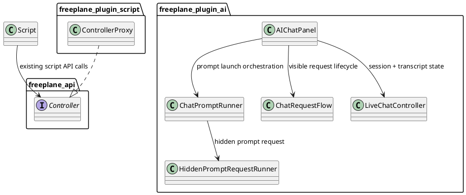
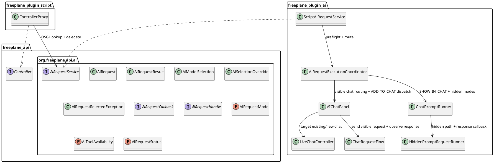
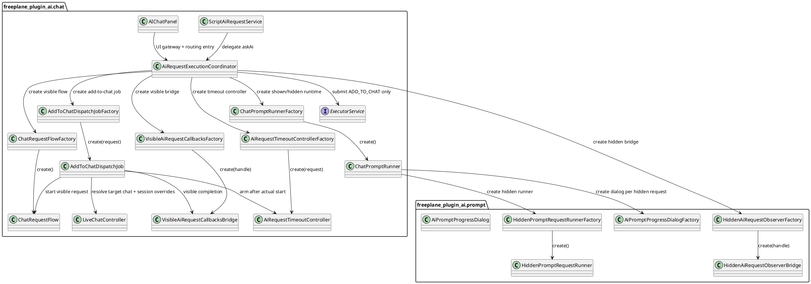
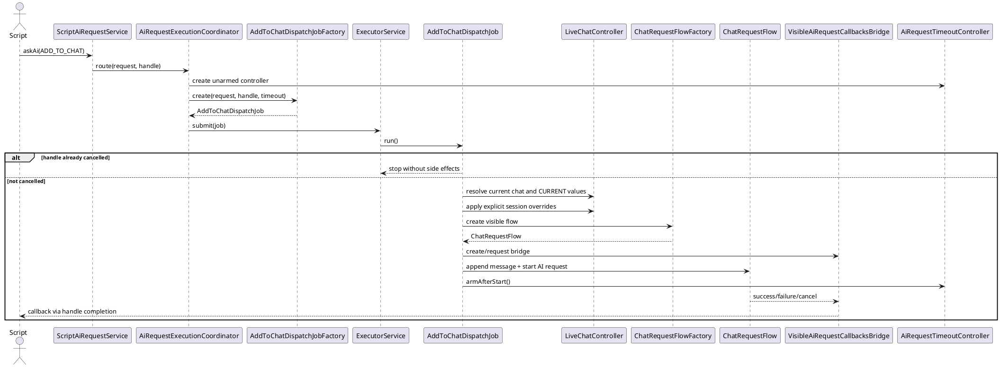

# Task: Allow scripts to ask AI with callback results
- **Task Identifier:** 2026-05-24-script-llm-calls
- **Scope:**
  Add script-facing LLM invocation that reuses prompt-style execution
  semantics from the AI plugin while exposing a callback-only scripting
  API. Support the prompt-configurable options `name`, prompt text,
  model selection, tool selection, and an optional override for the
  selection structure injected into the first prompt message. That
  override uses API-visible map and node identities and affects only
  the injected prompt context, not the later values returned by AI
  tools. Represent chat-targeting
  semantics through a four-value scripting mode enum:
  `SHOW_IN_CHAT`, `ADD_TO_CHAT`, `HIDDEN_WITH_CANCEL_DIALOG`, or
  `HIDDEN`. Add a mandatory timeout. Deliver terminal outcomes through
  a callback result object whose status classifies success,
  cancellation, timeout, and operational failure reasons, and return a
  non-blocking cancel handle so scripts and users can interrupt active
  calls. The remaining work includes a minimal refactor to make the
  outstanding request-routing scenarios reliably testable, replacing
  chat-panel singleton request state with factory-created request
  objects and serializing only `ADD_TO_CHAT` dispatch. The current
  increment keeps AI requests gated by the existing script network
  permission. A dedicated AI-request permission remains follow-up
  backlog work.
- **Motivation:**
  Scripts currently cannot reuse the AI plugin's provider/model/tool
  stack. Users can configure rich prompt execution from the AI UI, but
  automation scripts cannot trigger the same LLM behavior or consume
  the answer programmatically.
- **Scenario:**
  A Groovy script builds an LLM call request with prompt text, mode
  `HIDDEN`, `READING` tools, and `Duration.ofSeconds(30)`. The method
  returns immediately. When the answer arrives, Freeplane invokes the
  callback on the main/UI thread with a `SUCCEEDED` result whose
  `response` contains the model's answer.

  Another script sets mode `SHOW_IN_CHAT`, gives the request a name,
  keeps the current model, and uses `DISABLED` tools. Freeplane opens a
  new visible prompt-style chat, appends the first assistant response
  to that chat, and then invokes the callback with the same
  first-response text.

  A third script sets mode `ADD_TO_CHAT` while a visible chat is
  already active. The request uses the current tool setting, but an
  explicit model override. Freeplane appends the prepared user message
  to that existing chat, updates that chat's effective model before
  sending, appends the assistant response to the same chat, and then
  invokes the callback. Later follow-up messages in that chat keep using
  the changed model until the user changes it again.

  If mode `ADD_TO_CHAT` is used when no visible chat is open at
  execution start, Freeplane creates a new visible chat and sends the
  message there.

  If two `ADD_TO_CHAT` requests are submitted while a visible chat is
  already active, Freeplane accepts both handles immediately but
  serializes only the append-and-send work through a single-thread
  executor for the current visible chat.

  For executor-managed `ADD_TO_CHAT`, the target visible chat and any
  `CURRENT` model/tool resolution are determined when executor dispatch
  begins, not when the request was submitted. Timeout starts only after
  the message is in the chat and the AI request has started.

  A fourth script starts a hidden request with mode
  `HIDDEN_WITH_CANCEL_DIALOG`. The user cancels it from the existing
  progress dialog, or the script cancels it through the returned
  handle. In both cases the callback fires exactly once with
  `CANCELLED`. If the timeout elapses first, Freeplane triggers the
  same cancellation path automatically, closes the hidden progress
  dialog, and the callback fires exactly once with `TIMED_OUT`.

  A fifth script uses an explicit model selection whose provider key is
  invalid, or whose selected model is no longer available. The callback
  still fires exactly once, but the returned result status is
  `AUTHENTICATION_ERROR` or `MODEL_UNAVAILABLE` instead of forcing the
  script to parse a free-form error string.

  A sixth script targets `READING` tools but overrides the injected
  selection context to reference a specific API-visible mind map and an
  ordered list of node IDs from that map. Freeplane injects that
  selection structure into the first prompt message instead of the
  current UI selection, but AI tools that later report or inspect the
  current selection still use the real live selection state.
- **Constraints:**
  - Keep the scripting result path callback-only. Do not introduce a
    blocking `get()`-style scripting contract.
  - Still return a non-blocking request handle so scripts can cancel and
    inspect terminal state.
  - Support all prompt-configurable execution options that affect prompt
    behavior: `name`, prompt text, shown-vs-hidden execution semantics,
    model selection, and tool selection. In the scripting API,
    shown-vs-hidden and chat-targeting semantics are expressed through
    the call mode enum rather than prompt's bare `showInChat` boolean.
  - Add a mandatory per-call timeout and a four-value call mode enum for
    the scripting path.
  - Preserve current prompt semantics for model selection, tool
    selection, automatic selection-context prepending, shown-vs-hidden
    execution, and visible-chat transcript/session behavior, except
    when an explicit selection-context override is supplied for the
    injected first-message prompt context.
  - Call mode semantics are fixed:
    - `SHOW_IN_CHAT` always opens a new visible prompt-style chat.
    - `ADD_TO_CHAT` sends into the current visible chat when one exists
      at execution start, or creates a new visible chat when none
      exists at execution start.
    - `HIDDEN_WITH_CANCEL_DIALOG` uses the hidden request path and shows
      the existing cancel dialog.
    - `HIDDEN` uses the hidden request path without that dialog.
  - `ADD_TO_CHAT` is chat-targeting and session-mutating, not a pure
    text insertion helper. Explicit model/tool options in that mode may
    change the targeted chat's effective session settings before the
    message is sent.
  - If timeout cancels a `HIDDEN_WITH_CANCEL_DIALOG` request while the
    hidden progress dialog is visible, that dialog must close through
    the same cleanup path as explicit cancellation.
  - Once a request is accepted, invoke the callback exactly once.
    Runtime and provider failures after acceptance must be reported
    through the callback result status instead of requiring the script
    to catch exceptions.
  - Invoke the callback on Freeplane's main/UI thread so scripts can
    safely update maps in the callback.
  - Do not make `freeplane_plugin_script` depend directly on AI-plugin
    implementation packages or bundle metadata. Use a cross-plugin OSGi
    service boundary instead.
  - Public LLM API types belong under `org.freeplane.api.ai`, not the
    root `org.freeplane.api` package.
  - Restricted scripts must not bypass script network restrictions by
    routing requests through the AI plugin.
  - Selection-context override input must use API-visible map and node
    identities, not internal AI-plugin map identifiers. The request may
    name a map through the public map proxy and nodes through that map's
    node IDs.
  - Selection-context override affects only the injected prompt context.
    It must not replace or spoof the values later returned by AI tools
    that inspect the actual current map or selection.
  - The callback result status must distinguish at least these
    accepted-request outcomes without requiring scripts to parse
    free-form text: configuration error, authentication error, model
    unavailable, generic provider error, unexpected internal failure,
    cancellation, timeout, and success.
  - Keep formulas/read-only scripting API unchanged. The new entry point
    belongs only on the read-write scripting controller API, so
    formulas must not gain `askAi(...)` access.
  - Reserve synchronous exceptions for programmer errors and for
    pre-acceptance same-thread rejection that can be decided before
    calling the AI service. If `askAi(...)` throws, no callback may be
    invoked for that request.
  - Do not introduce a global AI request queue. Replace singleton-like
    chat-panel request ownership with factory-created request-scoped
    collaborators.
  - Serialize only `ADD_TO_CHAT` append-and-send dispatch through a
    single-thread executor service.
  - For executor-managed `ADD_TO_CHAT`, resolve the target chat and any
    `CURRENT` model/tool selections when dispatch begins, not when the
    request is submitted.
  - Activate timeout for executor-managed `ADD_TO_CHAT` only after the
    message is in the chat and the AI request has started.
- **Briefing:**
  Prompt execution currently lives in
  `org.freeplane.plugin.ai.chat.ChatPromptRunner`,
  `org.freeplane.plugin.ai.prompt.HiddenPromptRequestRunner`, and
  `org.freeplane.plugin.ai.chat.ChatRequestFlow`. Visible prompt chats
  already open through `AIChatPanel.openPromptChat(...)`, while hidden
  prompts already use the cancelable progress dialog.

  The scripting API is exposed through `org.freeplane.api.Controller`
  and implemented by `freeplane_plugin_script` proxy classes such as
  `ControllerProxy`. The script plugin already maps public API types to
  internal implementation types and has enum parity tests such as
  `ViewSideEnumTest`. Both plugins are OSGi bundles loaded by Freeplane
  core, but they do not currently call each other directly.
- **Research:**
  - Prompt-owned execution options currently live in
    `org.freeplane.plugin.ai.prompt.AiPrompt` as `name`, `prompt`,
    `showInChat`, `modelSelectionValue`, and
    `toolAvailabilitySelectionValue`. The scripting API can reuse those
    execution semantics, extend them with selection-context override,
    and fold prompt `showInChat`,
    script-owned hidden dialog visibility, and add-to-current-chat
    targeting into one four-value mode enum instead of multiple
    booleans.
  - Visible prompt execution currently flows through
    `ChatPromptRunner.runPrompt(...)` ->
    `AIChatPanel.openPromptChat(...)` ->
    `submitPreparedVisibleMessage(...)` -> `ChatRequestFlow`. The first
    assistant response reaches
    `ChatRequestFlow.RequestCallbacks.onAssistantResponse(...)` after
    the response is available.
  - Hidden prompt execution currently flows through
    `HiddenPromptRequestRunner.submit(...)`, which already runs in a
    `SwingWorker`, supports cancellation, and drives the existing prompt
    progress dialog, but it does not currently surface the successful
    response text to another caller.
  - Existing visible-chat model and tool choices are session-level
    state, not per-message metadata. That makes invasive `ADD_TO_CHAT`
    semantics feasible, because the current chat already supports user-
    driven session changes for those dimensions.
  - `AIChatPanel` already distinguishes visible-chat request state from
    hidden prompt state, and it already knows how to create a new chat
    when needed. That makes `ADD_TO_CHAT` with `start new chat if none
    exists` compatible with current ownership.
  - `freeplane_plugin_script` already exposes the public controller API
    through `ControllerProxy`, and existing API-to-implementation enum
    parity is guarded by tests such as `ViewSideEnumTest`.
  - `freeplane_plugin_ai` currently exports no public API package. A
    direct script-plugin dependency on AI implementation classes would
    create tighter bundle coupling than necessary.
  - Freeplane core already installs and looks up OSGi services through
    bundle context APIs, and the script plugin already publishes the
    controller service. So an AI-owned OSGi service is compatible with
    the current plugin architecture.
  - Current AI cancellation is cooperative: visible and hidden paths use
    `SwingWorker.cancel(true)`, `ChatRequestCancellation`, and tool-call
    cancellation suppliers. There is no existing per-request provider
    timeout configuration in the AI plugin.
  - Current AI request execution is still constrained by singleton-like
    request ownership in `AIChatPanel` and `ChatPromptRunner`, not by a
    proven product requirement for a global queue.
  - `ADD_TO_CHAT` is the only mode that mutates an existing visible
    chat transcript and session in place, so it is the only mode that
    needs dedicated ordered dispatch.
  - Tool execution is marshaled onto the UI thread, so concurrent
    tool-enabled requests would be thread-safe in the race-condition
    sense, but still semantically interleaving against shared live map
    and selection state.
  - Script network restrictions are modeled through
    `ScriptingSecurityManager`, which uses `SocketPermission` for
    network access.
  - There is currently no dedicated AI-request script permission.
  - Formula execution uses separate formula permissions and does not
    grant network access. Together with the read-only controller
    binding, that is the current main block on formula access to AI.

Current state: there is no script-to-AI invocation path, no callback
result contract for AI responses, and no script-owned cancel handle.
- **Design:**
  1. Add a public API contract under `freeplane_api` package
     `org.freeplane.api.ai` for callback-based LLM execution:
     - immutable `AiRequest` value object;
     - immutable `AiModelSelection` value object for either `current`
       or an explicit provider/model pair;
     - immutable `AiSelectionOverride` value object carrying a public
       API mind map proxy plus an ordered list of node IDs from that
       map for injected-context override;
     - `AiRequestMode` enum with `SHOW_IN_CHAT`, `ADD_TO_CHAT`,
       `HIDDEN_WITH_CANCEL_DIALOG`, and `HIDDEN`;
     - `AiToolAvailability` enum with `CURRENT`, `DISABLED`,
       `READING`, and `EDITING`;
     - `AiRequestStatus` enum with at least `SUCCEEDED`,
       `PERMISSION_DENIED`, `AI_UNAVAILABLE`, `CONFIGURATION_ERROR`,
       `AUTHENTICATION_ERROR`, `MODEL_UNAVAILABLE`, `PROVIDER_ERROR`,
       `FAILED`, `CANCELLED`, and `TIMED_OUT`;
     - immutable `AiRequestResult` carrying terminal status, response
       text, and optional detail/error text;
     - `AiRequestRejectedException` for synchronous pre-acceptance
       rejection such as missing network permission or missing AI
       service, with an `AiRequestStatus` reason and no callback
       delivery for that request;
     - `AiRequestCallback` single-abstract-method interface receiving one
       `AiRequestResult` whose status is the primary branch point for
       scripts; and
     - `AiRequestHandle` interface with non-blocking state/cancel methods
       such as `cancel()`, `isDone()`, and `isCancelled()`.
  2. Extend `org.freeplane.api.Controller` with a method such as
     `askAi(org.freeplane.api.ai.AiRequest request,
     org.freeplane.api.ai.AiRequestCallback callback)` that returns
     `org.freeplane.api.ai.AiRequestHandle` and may throw
     `org.freeplane.api.ai.AiRequestRejectedException` before request
     acceptance.
  3. Keep the cross-plugin boundary decoupled through an OSGi service in
     `org.freeplane.api.ai`, for example `AiRequestService`.
     `ControllerProxy` resolves that service from the bundle context and
     delegates to it instead of importing AI-plugin implementation
     packages.
  4. Do not expose the AI plugin's persisted `provider|model` selection
     string format directly in the public API. `AiModelSelection`
     should represent either `current model` or an explicit
     provider/model pair, and the AI plugin maps that typed value to
     its existing internal selection format.
  5. Use mandatory `Duration timeout` in `AiRequest` to avoid unit
     ambiguity. Reject non-positive timeouts before request submission.
  6. Include `AiRequestMode mode` in `AiRequest`.
     - `SHOW_IN_CHAT` opens a new visible prompt-style chat.
     - `ADD_TO_CHAT` targets the current visible chat when one exists,
       or creates a new visible chat when none exists.
     - `HIDDEN_WITH_CANCEL_DIALOG` reuses the existing hidden-prompt
       cancel dialog.
     - `HIDDEN` runs the hidden request silently but keeps it cancelable
       through the returned handle.
  7. Reuse the AI plugin's prompt execution path instead of creating a
     second LLM execution stack.
     - `SHOW_IN_CHAT` and hidden modes reuse prompt-style request
       preparation and prompt-style model/tool resolution.
     - `ADD_TO_CHAT` reuses the same request composition rules but sends
       through the current visible chat path instead of opening a new
       prompt chat when a visible chat already exists.
  8. Compose the first user message from the resolved effective tool
     availability in all modes:
     - `READING` and `EDITING` prepend the automatic selection-context
       block;
     - `DISABLED` omits that automatic selection context.
     - When `AiSelectionOverride` is present, build that injected
       selection-context block from the supplied public map proxy and
       node IDs instead of the current UI selection.
     - That override affects only first-message prompt composition. It
       does not alter later tool results about current map/selection.
  9. Support `AiRequestMode.SHOW_IN_CHAT` by opening a new visible
     prompt-style chat and registering a one-shot callback observer for
     that launched request. Invoke the scripting callback only after the
     first assistant response has already been appended to the visible
     chat. Reuse existing prompt-chat transcript/session behavior for
     that visible conversation.
  10. Support `AiRequestMode.ADD_TO_CHAT` by routing through the active
      visible chat path when a visible chat already exists at execution
      start, or by creating a new visible chat when none exists at
      execution start.
      - When targeting an existing visible chat, preserve that chat's
        current history and assistant-profile state.
      - `CURRENT` model/tool options in this mode resolve to the target
        chat's current effective values at execution start, not the
        global defaults and not the values at submission time.
      - Explicit model/tool options in this mode mutate the target
        chat's effective session settings before the request is sent.
      - If `ADD_TO_CHAT` creates a new visible chat because none exists
        at execution start, `CURRENT` resolves from the normal global
        defaults for that new chat, and explicit model/tool options
        become the new chat's starting session overrides.
      - `name` does not rename an already active visible chat. It is
        only relevant when the mode creates a new chat at execution
        start.
  11. Support hidden modes by extending the hidden request runner so
      successful completion also reports the assistant response text to
      a caller-owned completion adapter instead of only reporting
      start/finish/failure. `HIDDEN_WITH_CANCEL_DIALOG` and `HIDDEN`
      share the same hidden execution path and differ only in whether
      the existing cancel dialog is shown.
  12. Replace singleton-like AI request ownership in the AI plugin by
      introducing `AiRequestExecutionCoordinator` plus factory-created
      request-scoped collaborators.
      - Do not add a global AI request queue.
      - `SHOW_IN_CHAT` and hidden requests must not be forced through a
        shared active-request slot created only by singleton-like chat-
        panel ownership.
      - Serialize only `ADD_TO_CHAT` append-and-send dispatch through a
        single-thread `ExecutorService`.
      - For executor-managed `ADD_TO_CHAT`, resolve the target visible
        chat and any `CURRENT` model/tool values when dispatch begins,
        not at submission time.
      - Activate timeout for executor-managed `ADD_TO_CHAT` only after
        the message has been appended to the chat and the AI request has
        started.
      - If cancellation wins before that point, do not append the
        message or start the AI request.
  13. Unify terminal callback delivery for visible, add-to-chat, and
      hidden paths. Every accepted non-programmer-error request gets
      exactly one terminal callback result whose status is the primary
      reason code:
      - `SUCCEEDED` with non-null response text;
      - `CONFIGURATION_ERROR` when the accepted request cannot start or
        continue because the selected/current model configuration is
        invalid or incomplete at execution time;
      - `AUTHENTICATION_ERROR` when provider credentials are rejected;
      - `MODEL_UNAVAILABLE` when the selected model cannot be used or is
        not found;
      - `PROVIDER_ERROR` for other provider/network/service-side
        failures that are not classified more specifically;
      - `FAILED` for unexpected internal failures;
      - `CANCELLED` when user/script cancellation wins; or
      - `TIMED_OUT` when timeout-triggered cancellation wins.
  14. Return a dedicated `AiRequestHandle`, not `Future` and not
      `Optional<Future<?>>`. `Future` would reintroduce a blocking-style
      scripting surface, while `Optional` adds no useful state model for
      accepted asynchronous requests. The handle owns cancellation and
      state inspection; the callback owns result delivery.
  15. Preserve script security by performing an explicit network
      permission check in the script plugin before any AI service
      lookup, request startup, or delegation, using the same
      `SocketPermission` semantics that the script security model
      already relies on. If permission is denied, throw
      `AiRequestRejectedException` with status `PERMISSION_DENIED` and
      do not invoke the callback.
  16. If the AI request service is unavailable during same-thread
      preflight, throw `AiRequestRejectedException` with status
      `AI_UNAVAILABLE` and do not invoke the callback.
  17. Keep callback execution on Freeplane's main/UI thread. Hidden and
      visible AI-path completions already arrive on Swing/UI-thread
      codepaths; the service layer should normalize callback dispatch so
      scripts can safely mutate maps from the callback without extra
      threading ceremony.
  18. Add explicit mapping tests between public API tool availability
      and internal `ChatToolAvailability`, including the `CURRENT` ->
      `use current global setting` semantics, and the overlapping enum
      value parity.
  19. Treat provider-level abortion as best-effort. The contract must
      guarantee callback/state termination semantics even if the
      underlying HTTP/model call does not stop immediately after thread
      interruption.

- **Test specification:**
  - **Automated tests:**
    - `freeplane_api` test: request/result validation, public enum
      values, and `org.freeplane.api.ai` packaging.
    - `freeplane_plugin_script` test: `ControllerProxy` throws
      `AiRequestRejectedException` with `AI_UNAVAILABLE` when the AI
      service is unavailable, and does not invoke the callback.
    - `freeplane_plugin_script` test: `ControllerProxy` throws
      `AiRequestRejectedException` with `PERMISSION_DENIED` when the
      script network permission check fails, and does not invoke the
      callback.
    - `freeplane_plugin_script` test: the script network permission
      check happens before AI service lookup or delegation.
    - `freeplane_plugin_script` test: Groovy/SAM callback adaptation and
      returned handle cancellation semantics.
    - `freeplane_plugin_script` test: formula/read-only controller
      bindings still do not expose `askAi(...)`.
    - `freeplane_plugin_ai` test: public API tool availability maps
      correctly to internal `ChatToolAvailability`, including `CURRENT`.
    - `freeplane_plugin_ai` test: public API model selection maps to the
      existing internal selected-model format.
    - `freeplane_plugin_ai` test: selection-context override maps a
      public API mind map proxy plus node IDs to the injected prompt
      structure without requiring callers to know internal AI-plugin map
      identifiers.
    - `freeplane_plugin_ai` test: hidden script-originated request
      returns `SUCCEEDED` response text through the callback.
    - `freeplane_plugin_ai` test: `AiRequestMode.HIDDEN` does not open
      the hidden progress dialog.
    - `freeplane_plugin_ai` test:
      `AiRequestMode.HIDDEN_WITH_CANCEL_DIALOG` opens and then closes the
      hidden progress dialog on cancellation.
    - `freeplane_plugin_ai` test: `AiRequestMode.SHOW_IN_CHAT` invokes
      the callback only after the first assistant response has been
      appended to the chat.
    - `freeplane_plugin_ai` test: `AiRequestMode.ADD_TO_CHAT` with an
      existing visible chat appends to that chat instead of opening a
      prompt chat.
    - `freeplane_plugin_ai` test: `AiRequestMode.ADD_TO_CHAT` with no
      visible chat creates a new visible chat and succeeds.
    - `freeplane_plugin_ai` test: `AiRequestMode.ADD_TO_CHAT` with
      explicit model/tool options mutates the target chat session before
      sending.
    - `freeplane_plugin_ai` test: `AiRequestMode.ADD_TO_CHAT` with
      `CURRENT` model/tool options reuses the target chat's current
      effective values at execution start.
    - `freeplane_plugin_ai` test: accepted-request runtime contention no
      longer produces `REJECTED_BUSY` solely because of chat-panel
      singleton state.
    - `freeplane_plugin_ai` test: two `ADD_TO_CHAT` requests are
      serialized through the dedicated executor in submission order.
    - `freeplane_plugin_ai` test: executor-managed `ADD_TO_CHAT`
      resolves its target visible chat and `CURRENT` model/tool values
      when dispatch begins.
    - `freeplane_plugin_ai` test: configuration failure before request
      start reports `CONFIGURATION_ERROR`.
    - `freeplane_plugin_ai` test: provider authentication failure maps
      to `AUTHENTICATION_ERROR`.
    - `freeplane_plugin_ai` test: unavailable or unknown model maps to
      `MODEL_UNAVAILABLE`.
    - `freeplane_plugin_ai` test: uncategorized provider/network
      failure maps to `PROVIDER_ERROR`.
    - `freeplane_plugin_ai` test: hidden request cancellation reports
      `CANCELLED` exactly once.
    - `freeplane_plugin_ai` test: timeout reports `TIMED_OUT` exactly
      once, triggers the same cancellation path as an explicit cancel,
      and closes the hidden progress dialog when it was visible.
    - `freeplane_plugin_ai` test: timeout for executor-managed
      `ADD_TO_CHAT` is not armed while the request is still waiting for
      dispatch, and cancellation before dispatch prevents append/start.
    - regression tests for existing prompt behavior so the shared prompt
      execution path does not regress.
    - full suites:
      - `gradle -Djava.net.preferIPv6Addresses=true -Djava.awt.headless=true :freeplane_api:test`
      - `gradle -Djava.net.preferIPv6Addresses=true -Djava.awt.headless=true :freeplane_plugin_script:test`
      - `gradle -Djava.net.preferIPv6Addresses=true -Djava.awt.headless=true :freeplane_plugin_ai:test`
  - **Manual tests:**
    - run a script with mode `HIDDEN`; verify the callback receives the
      answer and no visible chat/progress dialog appears;
    - run a script with mode `HIDDEN_WITH_CANCEL_DIALOG`; cancel from
      the dialog and verify one `CANCELLED` callback;
    - run a script with mode `SHOW_IN_CHAT`; verify the first assistant
      response appears in the new prompt-style chat before the callback
      runs;
    - run a script with mode `ADD_TO_CHAT` while a visible chat is
      already open; verify the message is appended to that chat and the
      callback fires after the assistant response is appended;
    - run a script with mode `ADD_TO_CHAT` when no visible chat is open;
      verify a new visible chat is created and used;
    - run a script that cancels through the returned handle and verify
      callback + UI state stay consistent;
    - run a script with a short timeout and verify timeout termination
      without waiting indefinitely, with the same UI/request cleanup as
      explicit cancellation, including closing the hidden progress
      dialog if it was shown;
    - run the same request with `DISABLED`, `READING`, and `EDITING`
      tool settings and verify selection-context behavior matches prompt
      semantics;
    - run a request with selection-context override and verify the first
      injected prompt message reflects the supplied map proxy + node IDs
      while later tool-based current-selection reads still reflect the
      real live selection;
    - run two `ADD_TO_CHAT` requests back-to-back and verify ordered
      append/send through the executor;
    - run an `ADD_TO_CHAT` request, change the visible chat before
      executor dispatch begins, and verify target chat resolution
      happens at dispatch start;
    - keep one `ADD_TO_CHAT` request ahead of another, use a short
      timeout on the second, and verify it does not time out before its
      message is appended and its AI request starts;
    - run with an invalid provider key and verify the callback receives
      `AUTHENTICATION_ERROR`;
    - run with an unavailable explicit model and verify the callback
      receives `MODEL_UNAVAILABLE`.

## Subtask: Snapshot implemented scripting-AI baseline before factory redesign
- **Status:** done
- **Scope:**
  Preserve a reader-visible snapshot of the currently implemented
  scripting-AI bridge before the runtime is redesigned around factories
  and executor-managed `ADD_TO_CHAT` dispatch.
- **Briefing:**
  This snapshot is intentionally descriptive, not prescriptive. Use it,
  not the main-task Research section, as the authoritative description
  of the current code for this continuing session. It is the baseline
  that the next subtask replaces.
- **Done:**
  - `org.freeplane.api.ai` public API types exist, including
    `AiRequest`, `AiRequestHandle`, `AiRequestResult`,
    `AiRequestCallback`, `AiRequestMode`, `AiToolAvailability`,
    `AiRequestStatus`, `AiSelectionOverride`, and `AiRequestService`.
  - `Controller.askAi(...)` is exposed through the script controller
    path and delegated from `ControllerProxy` through OSGi service
    lookup.
  - Script network permission is checked before AI service lookup or
    delegation.
  - Script-visible modes `SHOW_IN_CHAT`, `ADD_TO_CHAT`,
    `HIDDEN_WITH_CANCEL_DIALOG`, and `HIDDEN` are wired end-to-end.
  - Selection-context override for the first prompt message is
    implemented through public map proxy plus node IDs.
  - Current runtime behavior still uses `AIChatPanel.askAi(...)` as the
    central switchboard, still keeps singleton-like request state in
    `AIChatPanel` and `ChatPromptRunner`, still reports
    `REJECTED_BUSY`, and still schedules timeout immediately in
    `ScriptAiRequestService`.

## Subtask: Fully design factory-created AI request runtime and serialized `ADD_TO_CHAT` dispatch
- **Status:** review
- **Scope:**
  Replace every singleton-like request object currently created and held
  by `AIChatPanel` with an explicit factory/product pair, and fully
  design the concrete classes needed for shown, hidden, and
  `ADD_TO_CHAT` execution. Keep `ADD_TO_CHAT` ordering through a
  dedicated single-thread executor only; do not introduce a global AI
  request queue. This subtask is the authoritative current
  implementation target for the remaining runtime redesign work.
- **Motivation:**
  The code base already contains a working baseline, but the runtime
  shape is still dominated by singleton-like request state. A new
  session needs a concrete target design that names every class to add,
  every class to keep, and every class whose responsibility changes.
- **Scenario:**
  A script submits `SHOW_IN_CHAT`, another submits `HIDDEN`, and two
  more submit `ADD_TO_CHAT`. `AIChatPanel` owns only UI/session state,
  factories, and one coordinator. Each request gets fresh runtime
  objects from factories instead of reusing `chatPromptRunner`,
  `chatRequestFlow`, or one callback slot. The two `ADD_TO_CHAT`
  requests are accepted immediately, converted to executor jobs, and run
  in submission order. When each job starts, it resolves the current
  visible chat and any `CURRENT` model/tool values, appends the message,
  starts the AI request, and only then arms timeout handling.
- **Constraints:**
  - Do not modify the main task text to make it match this subtask.
  - Do not introduce a global AI request queue.
  - Replace singleton-like request state owned by `AIChatPanel` and
    `ChatPromptRunner` with factory-created request-scoped objects.
  - Use concrete `XXXFactory` / `XXX` class pairs. No placeholders in
    the design.
  - Serialize only `ADD_TO_CHAT` dispatch through a single-thread
    `ExecutorService`.
  - For executor-managed `ADD_TO_CHAT`, resolve target chat and
    `CURRENT` model/tool values when dispatch begins.
  - Arm timeout for executor-managed `ADD_TO_CHAT` only after the
    message is appended to the chat and the AI request has started.
  - If cancellation wins before executor dispatch starts the AI call,
    do not append the message or start the request.
  - If `askAi(...)` throws a same-thread pre-acceptance rejection, no
    callback may be invoked for that request.
- **Briefing:**
  The current implementation basis still uses these singleton-like
  request holders:
  - `AIChatPanel.chatPromptRunner`
  - `AIChatPanel.chatRequestFlow`
  - `AIChatPanel.activeVisibleAiRequestCallbacks`
  - `ChatPromptRunner.hiddenPromptRequestRunner`
  - `ChatPromptRunner.hiddenPromptProgressDialog`
  - `ChatPromptRunner.hiddenRequestObserver`

  This redesign removes those live request slots from long-lived owner
  objects and moves request state into freshly created runtime objects.
- **Research:**
  - `AIChatPanel.askAi(...)` currently performs mode routing, stores the
    visible callback slot, and calls either `openPromptChat(...)`,
    `submitPreparedVisibleMessage(...)`, or
    `ChatPromptRunner.submitHiddenRequest(...)`.
  - `ChatRequestFlow` and `HiddenPromptRequestRunner` already encapsulate
    most of the actual active-request mechanics, but they are currently
    reused as singleton-like holders instead of one-shot request
    runtime objects.
  - `ScriptAiRequestService` currently schedules timeout at submission
    time. That must change for executor-managed `ADD_TO_CHAT`.
  - `ADD_TO_CHAT` is the only mode that mutates an already active chat
    transcript and session in place, so it is the only mode that needs
    ordered dispatch.
- **Design:**
  - Replace the current singleton-like fields with these exact
    factory/product pairs:
    - `ChatPromptRunnerFactory` / `ChatPromptRunner`
    - `ChatRequestFlowFactory` / `ChatRequestFlow`
    - `HiddenPromptRequestRunnerFactory` /
      `HiddenPromptRequestRunner`
    - `VisibleAiRequestCallbacksFactory` /
      `VisibleAiRequestCallbacksBridge`
    - `HiddenAiRequestObserverFactory` /
      `HiddenAiRequestObserverBridge`
    - `AddToChatDispatchJobFactory` / `AddToChatDispatchJob`
    - `AiRequestTimeoutControllerFactory` /
      `AiRequestTimeoutController`
    - `AiPromptProgressDialogFactory` / `AiPromptProgressDialog`
  - Keep `AiRequestExecutionCoordinator` as the one long-lived runtime
    orchestrator for script-facing AI request routing.
  - Keep `AIChatPanel` as the UI owner and session owner. It must no
    longer own request-local singleton fields.
  - Move timeout scheduling out of `ScriptAiRequestService`. The handle
    is still created there, but timeout is armed later by
    `AiRequestTimeoutController` after actual start for
    executor-managed `ADD_TO_CHAT`.
  - Keep `AIChatServiceFactory` unchanged. It already represents a
    factory/product relationship and is not the singleton-state problem
    being solved here.

  Exact class responsibilities for this redesign:
  - `ScriptAiRequestService`
    - Creates `AiRequestHandleImpl`.
    - Dispatches accepted work to the UI thread.
    - Delegates routing to `AiRequestExecutionCoordinator`.
    - Does not schedule timeout directly.
  - `AIChatPanel`
    - Owns UI widgets, visible-session state, and factory references.
    - Exposes minimal gateway methods for showing the chat tab,
      appending prepared text, opening a new prompt chat, and canceling
      the current visible request.
    - Delegates `askAi(...)` routing to `AiRequestExecutionCoordinator`.
    - Removes request-local fields `chatPromptRunner`,
      `chatRequestFlow`, and `activeVisibleAiRequestCallbacks`.
  - `AiRequestExecutionCoordinator`
    - Performs same-thread preflight and mode routing.
    - Requests fresh runtime objects from factories.
    - Submits only `ADD_TO_CHAT` work to the dedicated executor.
    - Wires handle cancellation to the request-scoped runtime object
      that was created for that request.
  - `ChatPromptRunnerFactory`
    - Creates one `ChatPromptRunner` per shown or hidden prompt-style
      request.
  - `ChatPromptRunner`
    - Is request-scoped.
    - Composes the prepared prompt-style message.
    - Creates prompt-style `AIChatService` instances.
    - Starts either shown prompt chat launch or hidden prompt execution.
    - Holds no cross-request mutable state.
  - `ChatRequestFlowFactory`
    - Creates one `ChatRequestFlow` per visible request.
  - `ChatRequestFlow`
    - Is request-scoped.
    - Owns one visible-request worker, cancellation state, chat
      snapshot, and callback bridge for exactly one request.
    - Never survives beyond one request lifecycle.
  - `VisibleAiRequestCallbacksFactory`
    - Creates one `VisibleAiRequestCallbacksBridge` per visible request.
  - `VisibleAiRequestCallbacksBridge`
    - Adapts visible-chat completion events to `AiRequestHandleImpl`
      completion.
    - Encodes `SUCCEEDED`, `FAILED`, `CANCELLED`, and `TIMED_OUT`
      completion for one visible request.
  - `HiddenPromptRequestRunnerFactory`
    - Creates one `HiddenPromptRequestRunner` per hidden request.
  - `HiddenPromptRequestRunner`
    - Is request-scoped.
    - Owns one hidden `SwingWorker`, one cancellation object, and one
      prompt name.
    - Does not expose `activeWorker` or `activePromptName` as
      cross-request singleton state.
  - `HiddenAiRequestObserverFactory`
    - Creates one `HiddenAiRequestObserverBridge` per hidden request.
  - `HiddenAiRequestObserverBridge`
    - Adapts hidden-runner success/failure/cancel events to
      `AiRequestHandleImpl` completion.
  - `AiPromptProgressDialogFactory`
    - Creates one `AiPromptProgressDialog` per
      `HIDDEN_WITH_CANCEL_DIALOG` request.
    - Returns no dialog for plain `HIDDEN` mode.
  - `AddToChatDispatchJobFactory`
    - Creates one `AddToChatDispatchJob` per `ADD_TO_CHAT` request.
  - `AddToChatDispatchJob`
    - Is the only request runtime object that waits in the dedicated
      single-thread executor.
    - Resolves the current visible chat and `CURRENT` model/tool values
      when `run()` begins.
    - Applies explicit session overrides.
    - Appends the prepared message.
    - Starts the visible AI request through a fresh
      `ChatRequestFlow`.
    - Arms `AiRequestTimeoutController` only after append plus actual AI
      request start.
    - Exits without side effects if the handle was cancelled before
      dispatch began.
  - `AiRequestTimeoutControllerFactory`
    - Creates one `AiRequestTimeoutController` per accepted request.
  - `AiRequestTimeoutController`
    - Starts unarmed.
    - Supports `armAfterStart()`, `cancelTimer()`, and timeout-driven
      handle cancellation.
    - For executor-managed `ADD_TO_CHAT`, measures only active request
      time after start.

- **Test specification:**
  - **Automated tests:**
    - add a test that `AIChatPanel` no longer owns request-local fields
      `chatPromptRunner`, `chatRequestFlow`, or
      `activeVisibleAiRequestCallbacks`;
    - add a test that shown requests create a fresh
      `ChatPromptRunner` from `ChatPromptRunnerFactory`;
    - add a test that hidden requests create a fresh
      `ChatPromptRunner`, `HiddenPromptRequestRunner`, and
      `HiddenAiRequestObserverBridge` per request;
    - add a test that visible requests create a fresh
      `ChatRequestFlow` and `VisibleAiRequestCallbacksBridge` per
      request;
    - add a test that two `ADD_TO_CHAT` requests create two distinct
      `AddToChatDispatchJob` instances and are dispatched in submission
      order through the single-thread executor;
    - add a test that executor-managed `ADD_TO_CHAT` resolves target
      chat and `CURRENT` model/tool values when dispatch begins;
    - add a test that timeout is not armed while an `ADD_TO_CHAT`
      request is waiting in the executor and is armed only after append
      plus actual AI-request start;
    - add a test that cancelling a queued `ADD_TO_CHAT` request before
      dispatch prevents append/start and completes exactly once with
      `CANCELLED`;
    - add a test that accepted-request runtime contention no longer
      produces `REJECTED_BUSY` solely because request state had been
      singleton-like;
    - rerun `gradle -Djava.net.preferIPv6Addresses=true
      -Djava.awt.headless=true :freeplane_api:test
      :freeplane_plugin_script:test :freeplane_plugin_ai:test`.
  - **Manual tests:**
    - submit repeated shown and hidden requests and verify each request
      behaves independently instead of reusing one global request slot;
    - submit two `ADD_TO_CHAT` requests back-to-back and verify ordered
      append/send through the executor;
    - change the visible chat after submitting `ADD_TO_CHAT` but before
      dispatch begins and verify dispatch-start targeting;
    - keep one `ADD_TO_CHAT` request ahead of another, use a short
      timeout on the second, and verify it does not time out before its
      message is appended and its AI request actually starts.
- **Implementation notes:**
  - **Interpretations:**
    - Kept request-scoped visible flows and token trackers in
      `AIChatPanel` registries keyed by `LiveChatSessionId` so request
      runtimes can outlive the currently displayed session without
      adding another planned top-level runtime-holder type.
  - **Tradeoffs:**
    - Kept manual prompt `runPrompt(...)` gating conservative across any
      active AI request even though script-originated requests now use
      request-scoped runtimes, so the script path loses
      singleton-driven `REJECTED_BUSY` while the prompt UI keeps its
      earlier single-launch UX.
    - Added session-specific wrapper methods on `LiveChatController`
      instead of restructuring `LiveChatSessionManager`, which keeps the
      redesign local while still binding map access, token usage, and
      request cleanup to the correct visible session.

## Subtask: Refactor AI request routing for scenario-testability
- **Status:** review
- **Scope:**
  Add the smallest structural seams needed to implement and cover the
  authoritative factory-created AI request runtime target from the
  preceding subtask with reliable automated tests, especially
  `SHOW_IN_CHAT`, factory-created request execution, `ADD_TO_CHAT`
  executor serialization, and hidden progress-dialog lifecycle
  behavior.
- **Motivation:**
  The remaining agreed scenarios live mostly in `AIChatPanel` and
  `ChatPromptRunner` orchestration. This subtask supports the
  preceding factory-created runtime target; it is not a competing
  runtime design. Those paths are partly testable today, but the
  current direct UI and factory wiring would make the missing scenario
  tests brittle and overly integrated.
- **Scenario:**
  An automated test triggers a script-originated AI request and can
  observe which execution path wins, when the callback fires relative
  to visible-chat updates, and whether the hidden progress dialog show
  and close hooks run, without opening real UI dialogs.
- **Constraints:**
  - Keep this refactor behavior-preserving except for the new tests.
  - Follow the preceding factory-created runtime target. Do not
    redefine request ownership, dispatch timing, or timeout semantics
    here.
  - Prefer narrow seams over broad UI redesign.
  - Keep visible-chat transcript/session behavior intact while
    extracting factory and executor seams. Do not reintroduce a global
    queue through the testability refactor.
  - Keep prompt composition, selection-context override semantics, and
    status mapping unchanged.
- **Briefing:**
  `AIChatPanel.askAi(...)` currently owns most script-request mode
  routing, visible-chat setup, and handle completion. `ChatPromptRunner`
  owns hidden-request submission and directly creates the hidden prompt
  progress dialog.
- **Research:**
  - Low-level pieces such as API values, mappings, timeout handling,
    and selection-override resolution are already unit-testable and now
    have direct tests.
  - The missing scenario coverage is concentrated where `AIChatPanel`
    mixes request-routing decisions with direct tab/UI operations.
  - Hidden progress-dialog assertions are awkward because
    `ChatPromptRunner` constructs `AiPromptProgressDialog` directly.
- **Design:**
  - Extract package-private script-request routing out of
    `AIChatPanel.askAi(...)` into `AiRequestExecutionCoordinator` as a
    supporting seam for the factory-created runtime target from the
    preceding subtask, with injectable collaborators for visible-chat
    launch/reuse, hidden request launch, current visible-chat state,
    request-object factories, `ADD_TO_CHAT` executor dispatch, and
    callback completion.
  - Add an injectable `AiPromptProgressDialogFactory` seam in
    `ChatPromptRunner` so tests can observe hidden dialog show/close
    behavior without opening a real dialog.
  - Keep Swing ownership in `AIChatPanel` and `ChatPromptRunner`; move
    only the routing and observation seams needed for deterministic
    tests.
- **Test specification:**
  - **Automated tests:**
    - add a test that `AiRequestMode.SHOW_IN_CHAT` fires the callback
      only after the first assistant response has been appended;
    - add tests that `AiRequestMode.ADD_TO_CHAT` reuses an existing
      visible chat, creates a new visible chat when needed, applies
      explicit model/tool session overrides, and resolves `CURRENT`
      against the target chat;
    - add tests that two `ADD_TO_CHAT` requests are serialized through
      the dedicated executor without introducing a global queue for
      other modes;
    - add a test that executor-managed `ADD_TO_CHAT` resolves its
      target chat and `CURRENT` model/tool values when dispatch begins;
    - add tests that `AiRequestMode.HIDDEN` suppresses the hidden
      progress dialog and `AiRequestMode.HIDDEN_WITH_CANCEL_DIALOG`
      opens then closes it on cancellation and on timeout cleanup after
      the AI request has actually started;
    - rerun `gradle -Djava.net.preferIPv6Addresses=true
      -Djava.awt.headless=true :freeplane_plugin_ai:test`.
  - **Manual tests:**
    - N/A beyond the task-level manual scenarios; this subtask is for
      internal seams and automated coverage.
- **Implementation notes:**
  - **Interpretations:**
    - Treated the main-task pre-acceptance rejection contract as part of
      the same coverage increment, so `ControllerProxy` now throws
      `AiRequestRejectedException` for unavailable-service and
      permission-denied preflight instead of completing a callback.
  - **Tradeoffs:**
    - Covered `AIChatPanel` routing with partial real-method tests that
      inject collaborator fields and static dependencies instead of
      booting the full mode-controller/UI environment, which keeps the
      scenario tests deterministic while still exercising the real
      routing methods.

## Subtask: Unify manual prompt-action and script prompt concurrency behavior
- **Status:** in-progress
- **Scope:**
  Remove the remaining behavior distinction between prompt launches from
  `AIChatPanel.runPrompt(...)` and script-originated prompt-style AI
  requests. Manual prompt actions and script requests with equivalent
  prompt-style modes must follow the same acceptance/concurrency policy
  and request-scoped runtime shape. This subtask does not redesign
  `ADD_TO_CHAT`; it only removes the special conservative
  `runPrompt(...)` gate.
- **Motivation:**
  The user sees no product reason to reject a UI-triggered prompt while
  the corresponding script-originated request would be accepted.
  Keeping two policies also preserves unnecessary branching and makes
  the code harder to understand.
- **Scenario:**
  A user triggers a saved prompt from the UI while a script-originated
  hidden request is already active. Freeplane accepts the UI prompt and
  starts it through the same request-scoped shown/hidden runtime pattern
  used by scripts instead of showing `ai_prompt_request_active`.
  Likewise, a script prompt and a UI prompt launched back-to-back are
  differentiated only by whether a scripting callback/handle exists, not
  by different busy-gate rules.
- **Constraints:**
  - Keep prompt configuration semantics unchanged: `name`, prompt text,
    shown-vs-hidden behavior, model selection, tool selection, and
    selection-context injection.
  - Do not introduce a new global queue or restore singleton request
    ownership.
  - Only `ADD_TO_CHAT` remains executor-serialized.
  - Unify acceptance/concurrency behavior for prompt-style launches
    (`runPrompt(...)`, script `SHOW_IN_CHAT`, and script hidden modes)
    without forcing manual UI prompts to expose scripting callbacks or
    handles.
  - Preserve existing visible-chat transcript/session behavior for
    prompt chats.
- **Briefing:**
  `AIChatPanel.runPrompt(...)` still contains a top-level
  `isAnyAiRequestActive()` rejection path that is no longer used by
  script `askAi(...)` routing after the request-scoped redesign. That is
  the remaining behavior split.
- **Research:**
  - `runPrompt(...)` currently rejects any launch whenever
    `isAnyAiRequestActive()` is true and shows
    `ai_prompt_request_active`.
  - The shown branch of `runPrompt(...)` already creates fresh
    `ChatRequestFlow` and `ChatPromptRunner` objects through factories,
    so most of the runtime shape is already aligned with the script
    path.
  - The hidden branch of `runPrompt(...)` already creates a fresh hidden
    `ChatPromptRunner`, but still inherits the top-level global activity
    gate.
  - The meaningful difference between manual prompt actions and script
    requests is the external contract: scripts need callback/handle
    completion; manual UI actions do not.
- **Design:**
  - Remove the top-level `isAnyAiRequestActive()` gate from
    `AIChatPanel.runPrompt(...)`.
  - Treat manual shown prompt launches as the same prompt-style visible
    request path as script `SHOW_IN_CHAT`, minus callback-handle
    wiring.
  - Treat manual hidden prompt launches as the same hidden request path
    as script hidden modes, with the existing UI cancel dialog behavior
    preserved for manual prompts.
  - Keep any remaining divergence limited to caller contract adapters:
    script path wires `AiRequestHandleImpl`/callbacks; UI actions do
    not.
  - Re-check input/button state logic so overlapping manual/script
    prompt requests do not regress visible request cancellation, hidden
    progress state, or undo/redo enablement.
- **Test specification:**
  - **Automated tests:**
    - add a test that `runPrompt(...)` no longer rejects solely because
      another accepted AI request is active;
    - add a test that a manual shown prompt can start while a
      script-originated hidden or shown request is already active;
    - add a test that a manual hidden prompt can start while another
      accepted prompt-style request is active;
    - add a regression test that `runPrompt(...)` still creates fresh
      request-scoped runtime objects rather than reintroducing shared
      singleton request holders;
    - add a regression test that removing the manual gate does not
      change `ADD_TO_CHAT` serialization semantics;
    - rerun `gradle -Djava.net.preferIPv6Addresses=true
      -Djava.awt.headless=true :freeplane_plugin_ai:test`.
  - **Manual tests:**
    - launch a saved shown prompt from the UI while a script hidden
      request is active and verify both proceed;
    - launch two UI prompts back-to-back and verify no
      `ai_prompt_request_active` rejection appears unless a more
      specific mode-level rule applies.

## Subtask: Support Groovy closure callbacks for scripts
- **Status:** review
- **Scope:**
  Add a Groovy-friendly `askAi(...)` calling form for scripts without
  importing Groovy types into the public Java API.
- **Motivation:**
  Groovy scripts should be able to use a natural closure as the last
  argument instead of requiring explicit Java-SAM callback ceremony.
- **Scenario:**
  A Groovy script calls `c.askAi(request) { result -> ... }`. Freeplane
  accepts that trailing closure form, adapts it to the existing
  callback contract, and delivers the terminal result to the closure.
- **Constraints:**
  - Do not add Groovy-typed methods to the public `Controller`
    interface.
  - If Groovy-closure convenience is added, keep it as a script-side
    implementation overload and document that calling form in the
    interface method javadoc.
- **Briefing:**
  The current script API already accepts `AiRequestCallback`, which is a
  SAM type for Java lambdas, but Groovy scripts are more natural with a
  closure-friendly last-argument form.
- **Research:**
  - For normal Groovy script bindings, an implementation-only overload
    on `ControllerProxy` should be enough because script dispatch is
    dynamic, but that exact calling form should be verified by test.
- **Design:**
  - Add a Groovy-typed `askAi(AiRequest, Closure)` overload on the
    script-side implementing class, not on `Controller`, and adapt the
    closure to `AiRequestCallback`.
  - Document that closure form in the `Controller.askAi(...)` javadoc as
    a valid Groovy usage pattern.
- **Test specification:**
  - **Automated tests:**
    - add a test that a Groovy closure can be passed to `askAi(...)`
      through the implementing overload and receives the callback
      result;
    - add a regression test that the Groovy-typed overload exists on
      the implementing class but not on the public `Controller`
      interface;
    - rerun `gradle -Djava.net.preferIPv6Addresses=true
      -Djava.awt.headless=true :freeplane_plugin_script:test`.
  - **Manual tests:**
    - run a Groovy script using the closure form and verify the closure
      receives the terminal AI result.
- **Implementation notes:**
  - **Tradeoffs:**
    - Kept the Groovy-typed overload on `ControllerProxy` only, which
      preserves a Groovy-free public Java API while still supporting
      dynamic script dispatch.

## Subtask: Support privileged AI configuration capture for scripts
- **Status:** rejected
- **Scope:**
  Make script-originated AI requests capture any protected AI
  configuration values inside a narrow privileged boundary before
  request execution leaves the trusted AI plugin side.
- **Motivation:**
  Accepted AI requests must not later fail only because protected AI
  settings such as token-backed properties become unreadable once
  script security is active.
- **Scenario:**
  A script-originated AI request passes the usual external script
  permission preflight while the scripting security manager is active.
  The AI plugin snapshots the request's needed configuration values
  under a privileged internal boundary, then runs the request from that
  immutable snapshot without requiring later property reads from the
  script security context. The callback still runs as normal script
  code, not as privileged code.
- **Constraints:**
  - Keep the existing script-side network-permission preflight outside
    the privileged boundary.
  - Scope privilege narrowly to AI-plugin-side configuration capture;
    do not run callback execution or unrelated request processing as
    privileged code.
  - Do not rely on lazy protected-property reads after the privileged
    capture point; the runtime used after acceptance must work from the
    captured values or another equally safe trusted snapshot.
  - If the cleanest implementation requires separate resolver variants
    for UI/manual and script-originated requests, prefer that over
    widening privilege.
- **Briefing:**
  A simple privileged wrapper around the first delegate call would not
  be enough if AI configuration values are still read later from
  property-backed resolvers after control leaves the trusted plugin
  boundary.
- **Research:**
  - If token/model/property reads stay lazy in runtime classes, a
    narrow `doPrivileged(...)` around initial delegation will still fail
    later under script security; the values need to be copied while the
    privileged boundary is active.
  - The existing `AiRequestConfigurationResolver` shape suggests a split
    between live property resolution and a script-safe captured snapshot
    may be cleaner than trying to privilege later runtime reads.
  - Two `AiRequestConfigurationResolver` implementations, or an
    equivalent resolver-plus-snapshot split, are a likely fit but are
    not mandated if a smaller design preserves the same security and
    ownership boundaries.
- **Design:**
  - Introduce a narrow AI-plugin-side step that resolves and captures
    all protected AI configuration values needed by a script request
    while privilege is active, then passes only that captured
    configuration into later request execution.
  - Prefer a dedicated privileged resolver/snapshot path for
    script-originated requests over widening privilege for the existing
    runtime.
  - Keep the external permission gate unchanged for now: scripts may
    still be preflight-gated by network permission until the permission
    model subtask decides otherwise.
- **Test specification:**
  - **Automated tests:**
    - add a test that script-side network-permission rejection still
      happens before any privileged AI configuration capture;
    - add tests that protected AI configuration values needed by a
      script request are captured inside the trusted boundary and are
      not read lazily afterward from the script security context;
    - add a regression test that callback execution is not run inside
      the privileged configuration-capture boundary;
    - rerun `gradle -Djava.net.preferIPv6Addresses=true
      -Djava.awt.headless=true :freeplane_plugin_ai:test`.
  - **Manual tests:**
    - run a script under script security and verify the request starts
      with stored AI credentials;
    - verify the callback still runs with normal script permissions, not
      elevated privileges.

## Subtask: Decide AI request script permission model
- **Status:** backlog
- **Scope:**
  Decide whether script-originated AI requests should use a dedicated
  script permission in addition to the existing permissions or should
  stay coupled to the existing network permission, then implement the
  chosen gate without allowing formulas to call `askAi(...)`.
- **Motivation:**
  AI requests are network-backed but may deserve more explicit consent
  than raw network access. The permission model should be deliberate,
  not accidental.
- **Scenario:**
  A normal script that lacks the required permission is denied cleanly.
  A formula still cannot call `askAi(...)`, regardless of whether the
  final design uses a dedicated AI-request permission or the existing
  network permission.
- **Constraints:**
  - Formulas must not gain access to `askAi(...)`.
  - Do not silently widen permissions for existing restricted scripts.
  - If AI requests stay coupled to network permission, document and test
    that exact coupling explicitly.
  - Keep the public `askAi(...)` entry point on `Controller`, not
    `ControllerRO`.
- **Briefing:**
  Script permissions currently live in
  `org.freeplane.plugin.script.ScriptingPermissions`. The current
  `ControllerProxy.askAi(...)` implementation enforces the existing
  network restriction through `SocketPermission` before delegating.
- **Research:**
  - Existing configurable script permissions cover execute, read,
    write, exec, and network access; there is no AI-specific permission
    yet.
  - Formula permissions are created separately in
    `ScriptingPermissions.getFormulaPermissions()` and currently do not
    grant network access.
  - Formula bindings use the read-only controller API, and
    `ControllerRO` does not expose `askAi(...)`.
  - Adding a dedicated AI-request permission would touch more than the
    runtime gate in `ControllerProxy`. It would also affect
    `ScriptingPermissions.PERMISSION_NAMES`, default and permissive
    permission construction, the scripting preferences XML, and likely
    the public script builder API in `org.freeplane.api.Script` and
    `ScriptProxy` if that permission should be expressible there.
  - Script add-on metadata currently serializes and validates the known
    permission names, and `installScriptAddOn.groovy` treats
    `execute_*` permission attributes as required. A new
    `execute_scripts_without_ai_request_restriction`-style attribute
    would therefore need deliberate compatibility handling for add-on
    install and export.
  - A dedicated AI-request permission would be valuable only if
    Freeplane wants AI access to stay narrower than arbitrary script
    network access. If that distinction is not required, reusing the
    existing network permission is materially cheaper.
  - A dedicated AI-request permission/property becomes more compelling
    if accepted script requests need a narrow internal privileged
    configuration-capture step, because that is a stronger capability
    boundary than generic outbound network access alone.
  - Even with that stronger motivation, the current implementation may
    still keep the existing network-permission check as the external
    script preflight until the permission-model decision is made.
- **Design:**
  - Option A: add a dedicated AI-request permission, plumb it through
    script permission storage and UI, and require it for `askAi(...)`
    without exposing the entry point to formulas.
  - Option B: keep `askAi(...)` coupled to the existing network
    permission and rely on the existing `Controller` vs `ControllerRO`
    split to keep formulas out.
  - Choose exactly one option before implementation. Do not ship both
    paths in parallel.
- **Test specification:**
  - **Automated tests:**
    - add tests for the chosen permission gate on normal scripts;
    - add a regression test that formulas/read-only controller bindings
      still cannot call `askAi(...)`;
    - if a dedicated AI-request permission is chosen, add tests for its
      stored property handling and denial path.
  - **Manual tests:**
    - run one allowed script and one denied script under the chosen
      permission model and verify the callback result matches the
      configured restriction;
    - verify a formula still has no `askAi(...)` access.