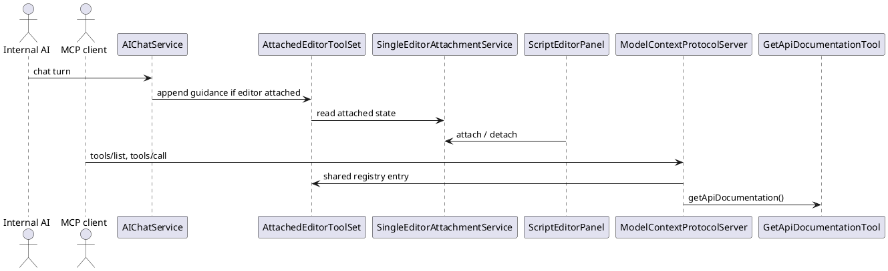
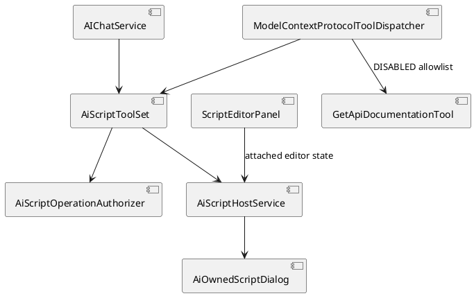
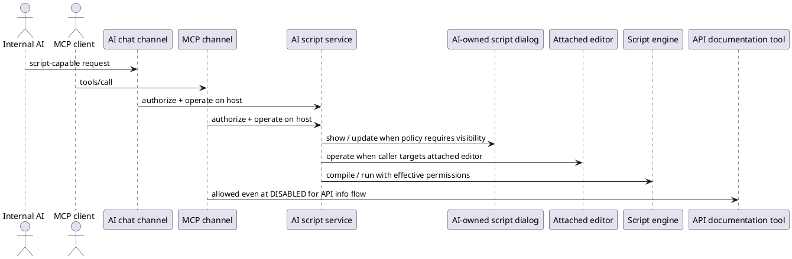

# Task: Replace direct Groovy execution tool with AI-owned script flows
- **Task Identifier:** 2026-04-09-script-tool
- **Scope:** Rewrite this backlog item around a script-plugin-owned AI
  script service instead of a direct `executeGroovyScript(...)` tool.
  Add a shared/global availability level `SCRIPT_EXECUTION`; add a
  user-configurable script-execution policy and a separate
  user-started-permission policy for the AI-owned script dialog; support
  both an AI-owned script flow and the existing attached editor;
  expose the capability to internal AI and MCP with
  host-specific authorization and response handling; and keep MCP
  access to API documentation and the internal API map even when the
  shared/global availability level is `DISABLED`.
- **Motivation:** The old backlog design centered on direct script-tool
  execution. The current requirement is different. AI should normally
  work through a visible or inspectable script host, users should be
  able to choose whether code must be shown and who may start
  execution, and internal AI and MCP should share one execution core
  while still applying different host-specific authorization and
  result handling.
- **Scenario:**
  The task introduces two distinct script hosts.

  - The **AI-owned script flow** is a singleton transient script state
    created by internal AI or MCP. It may open an AI-specific script
    dialog, may wait for the user to press Run, or may run directly,
    depending on the current script-execution policy.
  - The **attached editor** is the existing user-managed
    `ScriptEditorPanel` made available to AI through explicit
    attachment. It remains a persistent script-editing flow and keeps
    normal script behavior and permissions for user-started execution.

  Both hosts may exist at the same time. One attached editor may be
  active at a time, and one AI-owned script state may exist at a time.

  Internal AI and MCP both operate on the same underlying script
  execution model. Internal AI filters tool exposure when the shared
  availability level changes. MCP keeps a stable advertised tool list
  and enforces the same authorization rules at tool-call time.
- **Constraints:**
  - Replace the previous direct execution-tool design instead of adding
    it in parallel.
  - Use one shared/global availability ladder:
    `DISABLED < READING < EDITING < SCRIPT_EXECUTION`.
  - `SCRIPT_EXECUTION` includes `EDITING`.
  - Internal AI and MCP share the same availability policy, but they do
    not have to enforce it the same way.
  - Internal AI may filter advertised tools by availability level.
  - MCP must not rely on dynamic tool-list updates for authorization.
    It may keep a stable advertised tool list, but execution must be
    enforced at tool-call time.
  - At shared/global `DISABLED`, internal AI gets no general script
    capability.
  - Preserve the current explicit attachment override: attaching a
    script editor may create or reuse a chat session with at least
    session-level `READING` even when the shared/global level is
    `DISABLED`.
  - That attachment override preserves attached-editor read, write,
    compile, and status access.
  - That attachment override does not authorize AI-started execution.
    AI-started run from the attached editor still requires
    `SCRIPT_EXECUTION`.
  - At shared/global `DISABLED`, MCP may still access API information:
    `getApiDocumentation()` and read/search access limited to the
    internal API map that tool identifies.
  - Formula execution policy and formula-specific editing remain out of
    scope.
  - The AI-owned script flow is separate from attached-editor
    infrastructure.
  - The AI-owned script state is singleton, transient, replaceable,
    preserved until replacement or application exit, and must not be
    persisted across restart.
  - Replacing idle or finished AI-owned script state is allowed.
    Replacing a currently running AI-owned script is not allowed.
  - Hidden AI-started execution still leaves the latest AI-owned script
    inspectable later until replacement or exit.
  - The script-execution policy is a separate axis from external
    permissions.
  - User-started execution from the AI-owned dialog needs its own
    policy, separate from AI-started execution.
  - User-started execution from attached `ScriptEditorPanel` keeps
    normal script behavior and normal script permissions.
  - The dedicated AI-specific permission profile must reuse the
    existing scripting permission axes for file read, file write,
    network, and exec.
  - In-script AI requests from this feature are allowed only for
    user-started runs from the AI-owned dialog, not for AI-started
    runs.
  - Tool results stay narrow: JSON-safe structured values and/or
    captured text/stdout. Unsupported Java object return values must be
    reported as serialization errors.
  - Preferences tooltips must explain the new levels and policies,
    including what remains readable after the shared/global level drops
    below `SCRIPT_EXECUTION`.
- **Briefing:**
  Relevant current code spans:

  - `freeplane_plugin_ai/.../chat/AIChatService.java`
  - `freeplane_plugin_ai/.../chat/ChatToolAvailability.java`
  - `freeplane_api/.../AiToolAvailability.java`
  - `freeplane_plugin_ai/.../mcpserver/ModelContextProtocolServer.java`
  - `freeplane_plugin_ai/.../mcpserver/ModelContextProtocolToolDispatcher.java`
  - `freeplane_plugin_ai/.../code/AttachedEditorToolSet.java`
  - `freeplane_plugin_ai/.../code/SingleEditorAttachmentService.java`
  - `freeplane_plugin_script/.../ScriptEditorPanel.java`
  - `freeplane_plugin_script/.../ScriptingPermissions.java`
  - `freeplane_plugin_ai/.../tools/documentation/GetApiDocumentationTool.java`

  The previous version of this backlog task assumed a direct Groovy
  tool API. This rewrite replaces that model with script-host-based
  behavior. Exact final property keys, tool names, and class names
  still need confirmation before implementation approval.
- **Research:**
  - `ChatToolAvailability` currently has only `DISABLED`, `READING`,
    and `EDITING`.
  - Public API enum `AiToolAvailability` currently has only `CURRENT`,
    `DISABLED`, `READING`, and `EDITING`.
  - `AIChatService` currently filters tool exposure for chat turns and
    appends attached-editor guidance when an attached editor exists.
  - Current attached-editor behavior is explicit and separate from the
    normal chat tool-availability filter. `SingleEditorAttachmentService`
    ensures at least readable tool access for the owning session.
  - `SingleEditorAttachmentService` supports only one attached editor at
    a time.
  - `AttachedEditorToolSet` is currently attached-editor-specific and
    uses attached/detached plus latest-issue semantics.
  - `ScriptEditorPanel` is already a non-modal script dialog with a Run
    action and an AI attach action.
  - `ModelContextProtocolServer` currently declares
    `tools.listChanged = false` and `resources.listChanged = false`.
  - `ModelContextProtocolToolDispatcher` currently executes registered
    tools without call-time availability checks.
  - `GetApiDocumentationTool` already loads the installed API map and
    returns the map identifier plus important node identifiers.
  - `ScriptingPermissions` already models script-execution confirmation,
    file read, file write, network, exec, signed-script trust, and
    in-script AI-request permission.
  - `execute_scripts_without_ai_request_restriction` is already the
    in-script AI-request permission and must not become the switch that
    authorizes AI to execute scripts in the first place.


- **Design:**
  Shared target design:

  - Replace the direct `executeGroovyScript(...)` contract with a
    script-plugin-owned AI script service that exposes script-host
    state and execution to internal AI and MCP.
  - Keep two script hosts:
    - the AI-owned script flow; and
    - the attached editor.
  - Keep one AI-owned script state at a time.
  - Keep at most one attached editor at a time.
  - Allow one attached editor and one AI-owned script state to
    coexist.
  - Attached manual runs update shared script-host lifecycle/result
    state.
  - Attached manual runs always update lifecycle/result state.
  - For internal AI, attached manual runs auto-post only failures to
    the owning chat. Successful manual runs update state only.
  - For MCP, attached manual runs do not auto-post anywhere. MCP
    observes them only through updated host state and later
    `readScript` calls.
  - Failure auto-posts from the attached editor must be
    analysis-only. AI must not rewrite the script content without an
    explicit user request or confirmation.
  - Those failure auto-posts must include only compact context such as
    `scriptId`, host, and fingerprint. They must not inline the full
    script text or full diagnostics payload.
  - Preserve the current attach behavior: explicit attachment may
    create or reuse a chat session with at least session-level
    `READING` even when the shared/global level is `DISABLED`.
  - That explicit attachment path preserves attached-editor read,
    write, compile, and status access, but not AI-started run.
  - Extend the shared/global availability model to include
    `SCRIPT_EXECUTION` and apply it to both internal AI and MCP.
  - Internal AI uses availability filtering for advertised tools.
  - MCP may keep a stable advertised tool list, but every script tool
    call must re-check current availability and current policy.
  - The AI-owned flow gets a separate configurable script system prompt
    appended to the normal system message when that flow is active.
  - Attached `ScriptEditorPanel` keeps its own guidance path. It does
    not reuse the AI-owned script system prompt.
  - Harmonize script-host request/response structure across the
    AI-owned flow and attached editors so callers can address a
    host either by existing `scriptId` or, when no `scriptId` is
    present, by explicit `host` selection.
  - Use one new generic script-host tool family for both hosts:
    `readScript`, `writeScript`, `compileScript`, and `runScript`.
  - Keep `readScript` as the primary read/status tool.
  - `readScript` always returns current status.
  - `readScript` returns diagnostics whenever the current state contains
    failure information.
  - `readScript` may accept an optional fingerprint and returns script
    text only when no fingerprint was provided or the provided
    fingerprint differs from the current script-text fingerprint.
  - Keep `writeScript`, `compileScript`, and `runScript` as separate
    operations.
  - `writeScript` replaces the full current script text for the
    targeted host and returns the resulting fingerprint.
  - `writeScript`, `compileScript`, and `runScript` may accept an
    optional expected fingerprint and must fail on mismatch.
  - For the AI host, `writeScript` establishes the singleton
    AI-owned script state if none exists yet and otherwise replaces the
    current one.
  - If `scriptId` is present, it determines the host implicitly.
  - If `scriptId` is absent, the caller must specify `host`
    explicitly.
  - Attached editors should therefore gain script identifiers and
    lifecycle/result state, not only attached/detached state.
  - The lifecycle model must distinguish at least:
    `NO_SCRIPT`, `READY`, `WAITING_FOR_USER_RUN`, `RUNNING`,
    `SUCCEEDED`, `FAILED`, and `REPLACED`.
  - AI-owned direct execution and AI-owned shown-editor execution must
    always run the current effective script text. When a visible
    AI-owned dialog exists, the current editor text is authoritative.
  - `runScript` uses the current map/node selection at execution time.
  - `compileScript` should not depend on stored or explicit map/node
    targeting in this task.
  - Do not capture selection into script state and do not add explicit
    per-request `mapIdentifier` or `nodeIdentifier` overrides in this
    task.
  - Whether `runScript` reuses prior compile results or recompiles
    internally is intentionally left unspecified in this task.
  - AI-started execution must re-check the current shared/global
    availability level and current script-execution policy immediately
    before execution starts.
  - When the shared/global level drops below `SCRIPT_EXECUTION`,
    existing AI-owned script state remains readable by status/read
    tools, but new AI authoring/execution authority is removed.
  - For user-run-only AI-owned scripts:
    - internal AI receives an immediate waiting status and later gets an
      automatic completion/failure message in the owning chat session;
    - MCP receives an immediate waiting status plus `scriptId` and then
      uses later read/status calls.
  - For attached manual runs:
    - update shared script-host lifecycle/result state in all cases;
    - for internal AI, auto-post failures, but not successes, to the
      owning chat;
    - for MCP, do not auto-post anywhere and rely on later
      `readScript` calls instead;
    - keep any failure auto-post analysis-only unless the user
      explicitly requests or confirms a rewrite; and
    - include only compact context in the auto-post, for example
      `scriptId`, host, and fingerprint, while leaving script text
      and detailed diagnostics to later tool reads when needed.

Target shared properties and enums:

```text
ToolAvailabilityLevel
  DISABLED
  READING
  EDITING
  SCRIPT_EXECUTION

AiToolAvailability
  CURRENT
  DISABLED
  READING
  EDITING
  SCRIPT_EXECUTION

AiScriptExecutionPolicy
  SHOWN_USER_RUN
  SHOWN_AI_RUN
  HIDDEN_AI_RUN

AiScriptUserRunPermissionMode
  UNRESTRICTED
  LIKE_OTHER_SCRIPTS
  AI_SPECIFIC_PERMISSIONS

ScriptHost
  AI
  ATTACHED_EDITOR

ScriptLifecycleStatus
  NO_SCRIPT
  READY
  WAITING_FOR_USER_RUN
  RUNNING
  SUCCEEDED
  FAILED
  REPLACED

ScriptFailureCategory
  COMPILATION
  EXECUTION
  SERIALIZATION
  FINGERPRINT_MISMATCH
  AUTHORIZATION
  NO_SCRIPT
  BUSY

JsonSafeValue
  null | boolean | number | string | List<JsonSafeValue> |
  Map<String, JsonSafeValue>

Enum-backed property rule
  - persist enum-backed properties as Enum.name() values
  - read them through ResourceController.getEnumProperty(...)
  - preference translation keys use:
    OptionPanel.<EnumSimpleName>.<ENUM_VALUE>
  - generic enum translation keys outside OptionPanel use:
    <EnumSimpleName>.<ENUM_VALUE>

Shared/global property
  ai_tool_availability =
    DISABLED | READING | EDITING | SCRIPT_EXECUTION
  legacy fallback property: ai_chat_tool_availability
  legacy fallback values accepted from prior chat-only setting:
    disabled | reading | editing

AI-owned script policy property
  ai_script_execution_policy =
    SHOWN_USER_RUN | SHOWN_AI_RUN | HIDDEN_AI_RUN

AI-owned user-run permission property
  ai_script_user_run_permission_mode =
    UNRESTRICTED | LIKE_OTHER_SCRIPTS | AI_SPECIFIC_PERMISSIONS

AI-owned script prompt property
  ai_script_system_prompt = <text>

AI-specific external permission properties
  ai_script_without_file_restriction = true|false
  ai_script_without_write_restriction = true|false
  ai_script_without_network_restriction = true|false
  ai_script_without_exec_restriction = true|false

AI-owned user-run in-script AI-request property
  ai_script_user_run_without_ai_request_restriction = true|false
```

Target internal-AI and MCP authorization rules:

```text
Base shared/global gates
  AI
    DISABLED | READING | EDITING
      existing state: readScript only
      no state: no AI-owned script operation available
    SCRIPT_EXECUTION
      readScript | writeScript | compileScript | runScript

  ATTACHED_EDITOR without chat override
    DISABLED
      no script operation available
    READING
      readScript
    EDITING
      readScript | writeScript | compileScript
    SCRIPT_EXECUTION
      readScript | writeScript | compileScript | runScript

Internal AI attached-editor override
  if an attached editor exists in chat:
    readScript | writeScript | compileScript on ATTACHED_EDITOR stay
    advertised and callable even when shared/global level is DISABLED
    or READING
    runScript on ATTACHED_EDITOR still requires SCRIPT_EXECUTION

Internal AI advertisement rule
  advertise a script tool when at least one currently reachable
  host authorizes that operation
  re-check host-specific authorization at tool-call time

MCP rule
  no attached-editor override
  use the base shared/global gates plus the DISABLED documentation-only
  exception
```

Target script-host service boundary:

```text
AiScriptHostService
  readScript(ReadScriptRequest) : ReadScriptResponse
  writeScript(WriteScriptRequest) : WriteScriptResponse
  compileScript(CompileScriptRequest) : CompileScriptResponse
  runScript(RunScriptRequest) : RunScriptResponse
  addListener(AiScriptHostListener)
  removeListener(AiScriptHostListener)

AiScriptHostListener events
  AI_OWNED_USER_RUN_COMPLETED
  AI_OWNED_USER_RUN_FAILED
  ATTACHED_USER_RUN_FAILED
```

Target script-tool request/response structures:

```text
ReadScriptRequest
  scriptId : String?
  host : ScriptHost?
  fingerprint : String?

ReadScriptResponse
  scriptId : String?
  host : ScriptHost?
  status : ScriptLifecycleStatus
  fingerprint : String?
  scriptText : String?
  replacementScriptId : String?
  compilerDiagnostics : List<String>?
  errorCategory : ScriptFailureCategory?
  errorMessage : String?
  lineNumber : Integer?
  stdout : String?
  structuredResult : JsonSafeValue?

Response rules
  - always return status
  - return diagnostics whenever current state contains failure data
  - return scriptText only when no fingerprint was provided or the
    provided fingerprint differs from the current script-text
    fingerprint

WriteScriptRequest
  scriptId : String?
  host : ScriptHost?
  text : String
  expectedFingerprint : String?

WriteScriptResponse
  scriptId : String
  host : ScriptHost
  status : ScriptLifecycleStatus
  fingerprint : String

Write rules
  - replaces full current script text for the targeted host
  - for AI, establishes the singleton state if none exists yet
  - for ATTACHED_EDITOR, requires an attached editor or fails with
    no-script state/error

CompileScriptRequest
  scriptId : String?
  host : ScriptHost?
  expectedFingerprint : String?

CompileScriptResponse
  scriptId : String
  host : ScriptHost
  status : ScriptLifecycleStatus
  fingerprint : String?
  successful : boolean
  compilerDiagnostics : List<String>?
  errorCategory : ScriptFailureCategory?
  errorMessage : String?
  lineNumber : Integer?

RunScriptRequest
  scriptId : String?
  host : ScriptHost?
  expectedFingerprint : String?

RunScriptResponse
  scriptId : String
  host : ScriptHost
  status : ScriptLifecycleStatus
  fingerprint : String?
  executionStarted : boolean
  compilerDiagnostics : List<String>?
  errorCategory : ScriptFailureCategory?
  errorMessage : String?
  lineNumber : Integer?
  stdout : String?
  structuredResult : JsonSafeValue?

Targeting rules
  - if scriptId is present, it determines the host implicitly
  - if scriptId is absent, host is required
  - writeScript/compileScript/runScript fail on expected fingerprint
    mismatch
```

Target MCP `DISABLED` authorization rule:

```text
Allowed at DISABLED for MCP only
  getApiDocumentation()
  readNodesWithDescendants(request) when request.mapIdentifier is the
    internal API map
  readNodesWithDescendantsAsPlainText(request) when request.mapIdentifier
    is the internal API map
  searchNodes(request) when request.mapIdentifier is the internal API
    map

Blocked at DISABLED for MCP
  all script tools
  all non-documentation editing tools
  all read/search calls outside the internal API map
```







```plantuml
@startuml
set separator none
package "org.freeplane.plugin.ai.scripts" {
  class AiScriptToolSet {
    +readScript(request : ReadScriptRequest) : ReadScriptResponse
    +writeScript(request : WriteScriptRequest) : WriteScriptResponse
    +compileScript(request : CompileScriptRequest) : CompileScriptResponse
    +runScript(request : RunScriptRequest) : RunScriptResponse
  }
  class AiScriptOperationAuthorizer {
    +advertisedToolNames() : Set<String>
    +assertAuthorized(operation : String, scriptId : String?, host : ScriptHost)
  }
}
package "org.freeplane.plugin.script.ai" {
  interface AiScriptHostService {
    +readScript(request : ReadScriptRequest) : ReadScriptResponse
    +writeScript(request : WriteScriptRequest) : WriteScriptResponse
    +compileScript(request : CompileScriptRequest) : CompileScriptResponse
    +runScript(request : RunScriptRequest) : RunScriptResponse
    +addListener(listener : AiScriptHostListener)
    +removeListener(listener : AiScriptHostListener)
  }
  interface AiScriptHostListener {
    +aiOwnedUserRunCompleted(response : RunScriptResponse)
    +aiOwnedUserRunFailed(response : RunScriptResponse)
    +attachedUserRunFailed(response : RunScriptResponse)
  }
  class AiOwnedScriptDialog {
    +showScript(scriptId : String)
    +showAndFocus()
    +hideAfterDecision()
  }
}
class ReadScriptRequest {
  +scriptId : String?
  +host : ScriptHost?
  +fingerprint : String?
}
class ReadScriptResponse {
  +scriptId : String?
  +host : ScriptHost?
  +status : ScriptLifecycleStatus
  +fingerprint : String?
  +scriptText : String?
  +replacementScriptId : String?
  +compilerDiagnostics : List<String>?
  +errorCategory : ScriptFailureCategory?
  +errorMessage : String?
  +lineNumber : Integer?
  +stdout : String?
  +structuredResult : JsonSafeValue?
}
class WriteScriptRequest {
  +scriptId : String?
  +host : ScriptHost?
  +text : String
  +expectedFingerprint : String?
}
class WriteScriptResponse {
  +scriptId : String
  +host : ScriptHost
  +status : ScriptLifecycleStatus
  +fingerprint : String
}
class CompileScriptRequest {
  +scriptId : String?
  +host : ScriptHost?
  +expectedFingerprint : String?
}
class CompileScriptResponse {
  +scriptId : String
  +host : ScriptHost
  +status : ScriptLifecycleStatus
  +fingerprint : String?
  +successful : boolean
  +compilerDiagnostics : List<String>?
  +errorCategory : ScriptFailureCategory?
  +errorMessage : String?
  +lineNumber : Integer?
}
class RunScriptRequest {
  +scriptId : String?
  +host : ScriptHost?
  +expectedFingerprint : String?
}
class RunScriptResponse {
  +scriptId : String
  +host : ScriptHost
  +status : ScriptLifecycleStatus
  +fingerprint : String?
  +executionStarted : boolean
  +compilerDiagnostics : List<String>?
  +errorCategory : ScriptFailureCategory?
  +errorMessage : String?
  +lineNumber : Integer?
  +stdout : String?
  +structuredResult : JsonSafeValue?
}

AiScriptToolSet --> AiScriptOperationAuthorizer
AiScriptToolSet --> AiScriptHostService
AiScriptHostService --> AiScriptHostListener
AiScriptHostService --> AiOwnedScriptDialog
AiScriptToolSet ..> ReadScriptRequest
AiScriptToolSet ..> WriteScriptRequest
AiScriptToolSet ..> CompileScriptRequest
AiScriptToolSet ..> RunScriptRequest
@enduml
```

  The task is intentionally split into subtasks because the shared
  authorization/host model, internal AI behavior, and MCP behavior
  are related but not identical.
- **Test specification:**
  - Automated tests:
    - extend availability parsing/tests for `SCRIPT_EXECUTION` in both
      internal and public AI availability paths;
    - verify enum-backed properties persist enum `name()` values and
      parse through `ResourceController.getEnumProperty(...)`;
    - add authorization tests for internal AI filtering vs MCP
      call-time enforcement;
    - add tests for the internal-AI attached-editor override versus
      MCP base-gate behavior;
    - add tests for the three script-execution-policy states;
    - add tests for the three user-started-permission-policy states in
      the AI-owned dialog;
    - add tests for attached-editor normal-permission behavior;
    - add tests for `scriptId` vs explicit `host` targeting;
    - add tests for singleton AI-owned replacement and running-state
      busy rejection;
    - add tests for no-script state, replaced state, and later result
      reads;
    - add tests for `readScript` always returning status, returning
      diagnostics on failure, and returning script text only when the
      fingerprint is absent or changed;
    - add tests for `writeScript` returning the resulting fingerprint;
    - add tests for optional expected-fingerprint mismatch failures on
      `writeScript`, `compileScript`, and `runScript`;
    - add tests that `runScript` uses current selection at execution
      time and that this task does not add explicit map/node-target
      overrides or stored context capture for `compileScript`/
      `runScript`;
    - add tests for `DISABLED` MCP API-documentation/API-map exception;
    - add tests for JSON-safe result serialization and explicit failure
      on unsupported return types.
  - Manual tests:
    - verify all three AI-owned policy modes from internal AI;
    - verify attached-editor behavior under `READING`,
      `EDITING`, and `SCRIPT_EXECUTION`;
    - verify MCP behavior with stable tool metadata and changing local
      availability settings;
    - verify tooltip wording in preferences for level drops and script
      policy consequences.

## Subtask: Shared script authorization, policies, and host contract
- **Status:** backlog
- **Scope:** Define the shared/global availability semantics, replace
  the old direct Groovy-tool contract with a script-host contract,
  harmonize AI-owned and attached-editor state, and map execution to
  existing permission primitives.
- **Motivation:** Internal AI and MCP need one shared execution model,
  but the old direct tool contract and the current attached-editor-only
  contract do not match the new requirements.
- **Briefing:** This subtask primarily touches `AiToolAvailability`,
  shared resolved tool-availability handling, script-host tool
  contracts, and `ScriptingPermissions` integration points.
- **Research:**
  - Current internal chat availability and public API availability stop
    at `EDITING`.
  - Current attached-editor contract is editor-specific and too narrow
    for the AI-owned flow.
  - Existing scripting permissions already supply the external
    permission axes needed by this task.
- **Design:**
  - Add `SCRIPT_EXECUTION` to the shared/global availability model and
    to public AI request availability.
  - Replace chat-only resolved availability handling with one shared
    resolved level enum `ToolAvailabilityLevel`.
  - Use canonical property `ai_tool_availability` with legacy fallback
    from `ai_chat_tool_availability`.
  - Keep the shared/global level authoritative for both internal AI and
    MCP.
  - Internal AI authorization works by filtering tool exposure, except
    for the preserved explicit-attachment override on the attached
    editor.
  - MCP authorization works by call-time checks against current level
    and current policy.
  - Replace attached-editor-only request/response semantics with the
    generic script-host contract defined in the main task Design,
    keyed by `scriptId` and `host`.
  - Use one generic script-host tool family for both hosts:
    `readScript`, `writeScript`, `compileScript`, and `runScript`.
  - Keep `readScript` as the primary read/status operation.
  - `readScript` always returns current status.
  - `readScript` returns diagnostics whenever the current state contains
    failure information.
  - `readScript` may accept an optional fingerprint and returns script
    text only when no fingerprint was provided or the provided
    fingerprint differs from the current script-text fingerprint.
  - Keep `writeScript`, `compileScript`, and `runScript` as separate
    operations.
  - `writeScript` replaces the full current script text for the
    targeted host and returns the resulting fingerprint.
  - `writeScript`, `compileScript`, and `runScript` may accept an
    optional expected fingerprint and must fail on mismatch.
  - `runScript` uses the current map/node selection at execution time.
  - `compileScript` does not introduce stored context capture or
    explicit map/node targeting in this task.
  - This task does not add stored context capture or explicit
    per-request `mapIdentifier`/`nodeIdentifier` overrides.
  - For the AI host, `writeScript` establishes the singleton
    AI-owned script state if none exists yet and otherwise replaces the
    current one.
  - If a request already names `scriptId`, that script state determines
    the host.
  - If a request has no `scriptId`, the caller must provide `host`
    explicitly.
  - Add lifecycle/result state to attached editors so the
    shared contract works across both surfaces.
  - Keep AI-started execution and user-started execution as separate
    policy concerns.
  - Introduce `AiScriptExecutionPolicy`,
    `AiScriptUserRunPermissionMode`, `ScriptHost`, and
    `ScriptLifecycleStatus` exactly as specified in the main task
    Design.
  - AI-specific permissions reuse the existing scripting permission axes
    for file read, file write, network, and exec.
  - In-script AI requests from this feature are allowed only for
    user-started AI-owned runs, controlled by separate property
    `ai_script_user_run_without_ai_request_restriction`.
  - Result serialization stays narrow: JSON-safe structured values and
    text/stdout only.
- **Test specification:**
  - Automated tests:
    - extend availability enum tests with `SCRIPT_EXECUTION`;
    - verify canonical property `ai_tool_availability` plus legacy
      fallback from `ai_chat_tool_availability`;
    - verify `OptionPanel.<EnumSimpleName>.<ENUM_VALUE>` translation
      keys are used for enum-backed preference choices;
    - verify shared/global level mapping for internal AI and MCP,
      including the attached-editor override for internal AI only;
    - verify `scriptId` targeting and explicit-host targeting;
    - verify attached editors expose lifecycle/result state,
      including `READY` and `REPLACED` handling;
    - verify `readScript` always returns status, returns diagnostics on
      failure, and returns script text only when the fingerprint is
      absent or changed;
    - verify `writeScript` returns the resulting fingerprint;
    - verify optional expected-fingerprint mismatch failures on
      `writeScript`, `compileScript`, and `runScript`;
    - verify `runScript` uses current selection at execution time and
      that this task does not add explicit map/node-target overrides or
      stored context capture for `compileScript`/`runScript`;
    - verify AI-specific permission mapping to existing scripting
      permissions;
    - verify AI-started runs block in-script AI requests while
      user-started AI-owned runs may allow them when configured;
    - verify serialization success/failure boundaries.
  - Manual tests: N/A.

## Subtask: Internal AI-owned script dialog flow
- **Status:** backlog
- **Scope:** Add the AI-owned script dialog, integrate it with internal
  AI chat, apply the three script-execution-policy states, and add the
  AI-owned follow-up message behavior for user-started execution.
- **Motivation:** The main user-facing change is an AI-owned script
  host that can be shown, edited, run by the user, or run directly by
  AI, depending on the configured policy.
- **Briefing:** This subtask primarily touches AI chat system-message
  construction, the script-plugin-owned `AiScriptHostService` and
  AI-owned dialog, and the internal AI flow that creates or updates the
  current AI-owned script state.
- **Research:**
  - `ScriptEditorPanel` already provides a script-editing dialog and run
    action, but it is a user-managed persistent editor, not an AI-owned
    transient flow.
  - Internal AI currently operates in one chat/session and can append
    extra attached-editor guidance when needed.
- **Design:**
  - Implement a separate AI-specific script dialog in the script plugin
    rather than reusing `ScriptEditorPanel` directly.
  - Keep the AI-owned dialog transient.
  - Preserve the last AI-owned script in memory until replacement or
    application exit.
  - Reopening the AI-owned dialog shows the current AI-owned script
    state, not a blank editor.
  - `shown in editor, user must press Run` shows the dialog, loads the
    script, and waits for user edits and/or user Run.
  - `shown in editor, AI may run directly` shows the dialog, loads the
    script, and allows immediate AI-started execution.
  - `hidden from user, AI may run directly` does not auto-open the
    dialog, but still updates the AI-owned script state for later
    inspection.
  - When a visible AI-owned dialog exists, execution uses the current
    editor text.
  - If the current AI-owned script is running, a new AI/MCP request is
    rejected as busy.
  - Otherwise a new AI/MCP request replaces the current AI-owned script
    immediately.
  - User-started execution from the AI-owned dialog uses property
    `ai_script_user_run_permission_mode` with enum values
    `UNRESTRICTED`, `LIKE_OTHER_SCRIPTS`, and
    `AI_SPECIFIC_PERMISSIONS`.
  - Internal AI gets the normal base system message plus configurable
    property `ai_script_system_prompt` when the AI-owned flow is
    active.
  - The AI plugin registers an `AiScriptHostListener` and translates
    `AI_OWNED_USER_RUN_COMPLETED` and `AI_OWNED_USER_RUN_FAILED`
    events into owning-chat follow-up messages.
  - Attached script editors keep separate guidance and must not be
    confused with the AI-owned script flow.
  - If the shared/global level later drops below `SCRIPT_EXECUTION`,
    keep read/status access to the existing AI-owned script state but
    remove new authoring/execution authority.
  - Explain this behavior clearly in preferences tooltips.
  - Add preference labels/tooltips for:
    - `ai_tool_availability`
    - `ai_script_execution_policy`
    - `ai_script_user_run_permission_mode`
    - the four AI-specific external-permission booleans
    - `ai_script_user_run_without_ai_request_restriction`
  - Use `OptionPanel.<EnumSimpleName>.<ENUM_VALUE>` translation keys
    for enum-backed preference choices.
- **Test specification:**
  - Automated tests:
    - verify dialog opening behavior for all three policy states;
    - verify hidden mode preserves inspectable state without auto-open;
    - verify shown modes use current editor text at run time;
    - verify busy rejection while the current AI-owned script is
      running;
    - verify immediate replacement while the current AI-owned script is
      idle/open/finished/failed;
    - verify internal AI follow-up messages for user-started completion
      and failure;
    - verify level-drop behavior keeps read/status only;
    - verify script system prompt is appended only for the AI-owned
      flow;
    - verify attached manual run success updates state without
      auto-posting to chat; and
    - verify attached manual run failure auto-posts analysis to the
      owning chat without rewriting content unless explicitly requested
      or confirmed; and
    - verify attached manual run failure auto-post includes compact
      context only and does not inline full script text; and
    - verify MCP observes attached manual failures only through updated
      host state and later `readScript` calls.
  - Manual tests:
    - run internal AI in all three policy modes;
    - edit shown code before Run and verify the edited code is what
      executes;
    - lower the shared/global level after a script exists and verify the
      tooltip text matches behavior.

## Subtask: MCP script flow and DISABLED documentation access
- **Status:** backlog
- **Scope:** Keep MCP tool metadata stable, enforce current
  authorization at call time, support later status/result reads by
  `scriptId`, and keep API-documentation/API-map access available at
  `DISABLED`.
- **Motivation:** MCP has different client behavior and cannot rely on
  internal chat filtering or local UI affordances. The authorization and
  later-read model therefore need explicit MCP handling.
- **Briefing:** This subtask primarily touches
  `ModelContextProtocolServer`, `ModelContextProtocolToolDispatcher`,
  MCP tool metadata/resource exposure, and the API-documentation tool.
- **Research:**
  - Current MCP capabilities announce no tool-list change mechanism.
  - Current MCP dispatch has no call-time availability enforcement.
  - `GetApiDocumentationTool` already loads the API map and returns the
    needed identifiers.
- **Design:**
  - Keep MCP tool advertisement stable.
  - Enforce current availability and current policy when each MCP tool
    call executes.
  - Add one MCP-side authorizer that checks both the shared/global
    level and any script-policy constraints before dispatch.
  - When MCP requests AI-owned user-run-only behavior, return an
    immediate waiting result plus `scriptId`.
  - Add later read/status/result access by `scriptId`.
  - If a later read uses a replaced `scriptId`, return explicit
    replaced-state information instead of silently disappearing.
  - If no current script exists for a readable host, return explicit
    no-script state rather than hiding the tools.
  - MCP does not receive attached manual failure auto-posts. It learns
    about attached manual failures only through updated host state and
    later `readScript` calls.
  - At shared/global `DISABLED`, allow only API information access for
    MCP:
    `getApiDocumentation()` plus `readNodesWithDescendants(...)`,
    `readNodesWithDescendantsAsPlainText(...)`, and
    `searchNodes(...)` only when the request targets the internal API
    map identified by that tool.
  - Reuse `getApiDocumentation()` as the MCP-side API-map locator.
  - Deny all script tools and all non-documentation tool calls at
    `DISABLED` with explicit authorization errors.
- **Test specification:**
  - Automated tests:
    - verify stable MCP tool metadata across availability changes;
    - verify call-time authorization for `READING`, `EDITING`, and
      `SCRIPT_EXECUTION`;
    - verify `DISABLED` blocks non-documentation script operations;
    - verify `DISABLED` still allows `getApiDocumentation()` and only
      API-map-scoped `readNodesWithDescendants(...)`,
      `readNodesWithDescendantsAsPlainText(...)`, and
      `searchNodes(...)`;
    - verify waiting-result plus later reads by `scriptId`;
    - verify replaced-state and no-script-state responses.
  - Manual tests:
    - connect an MCP client, change local availability, and verify that
      call-time authorization changes without depending on refreshed
      tool metadata;
    - use MCP at `DISABLED` to discover the API map and read/search only
      within that map.
