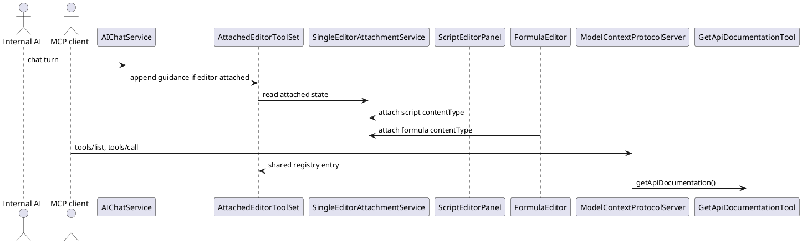
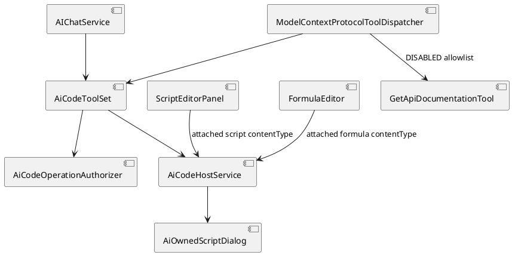
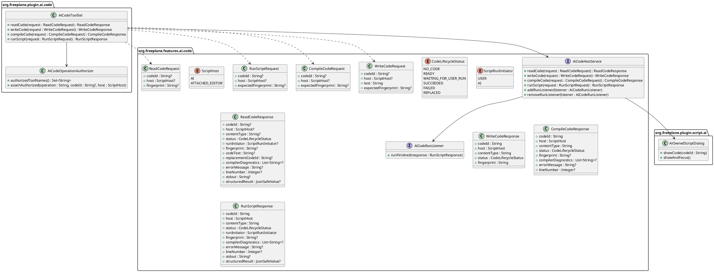
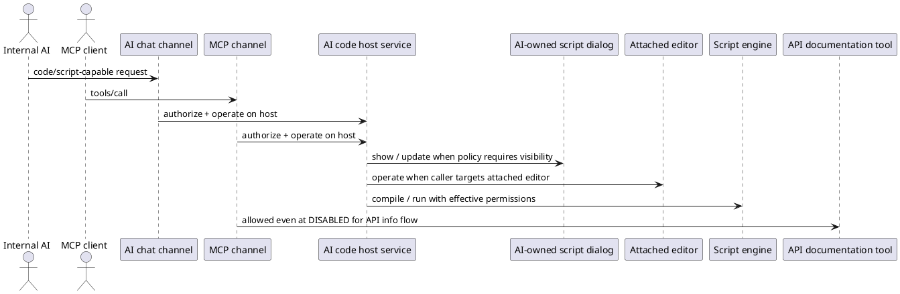

# Task: Replace direct Groovy execution tool with AI-owned script flows
- **Task Identifier:** 2026-04-09-script-tool
- **Scope:** Rewrite this backlog item around an AI-owned script flow
  plus a shared attached-code contract instead of a direct
  `executeGroovyScript(...)` tool. Add a shared/global availability
  level `SCRIPT_EXECUTION`; add a user-configurable script-execution
  policy and a separate user-started-permission policy for the
  AI-owned script dialog; support both an AI-owned script flow and the
  existing attached-editor path, including shared read/write/compile
  for attached script and formula editors; expose the capability to
  internal AI and MCP with host-specific authorization and response
  handling; and keep MCP access to API documentation and the internal
  API map even when the shared/global availability level is
  `DISABLED`.
- **Motivation:** The old backlog design centered on direct script-tool
  execution. The current requirement is different. AI should normally
  work through a visible or inspectable code host, users should be
  able to choose whether code must be shown and who may start
  execution, attached formulas and attached scripts should share one
  external read/write/compile contract, and internal AI and MCP should
  share one execution core while still applying different host-specific
  authorization and result handling.
- **Scenario:**
  The task introduces two distinct `ScriptHost` targets.

  - The **AI-owned script flow** is a singleton transient script state
    created by internal AI or MCP. It may open an AI-specific script
    dialog, may wait for the user to press Run, or may run directly,
    depending on the current script-execution policy.
  - The **attached editor** is the existing user-managed attached-code
    path made available to AI through explicit attachment. It may be a
    `ScriptEditorPanel` or a `FormulaEditor`. AI may read, replace,
    and compile the current draft text through the shared contract,
    while normal user-managed save, submit, and run behavior stays with
    the concrete editor.

  Both hosts may exist at the same time. One attached editor may be
  active at a time, and one AI-owned script state may exist at a time.

  Internal AI and MCP both operate on the same underlying execution
  model. Internal AI filters tool exposure when the shared
  availability level changes. MCP keeps a stable advertised tool list
  and enforces the same authorization rules at tool-call time.
- **Constraints:**
  - Replace the previous direct execution-tool design instead of adding
    it in parallel.
  - Do not preserve backward compatibility for obsolete code tool
    calls or tool-facing DTOs. Replace them in the same increment
    instead of keeping wrappers, aliases, adapters, or parallel
    contracts.
  - Use one shared/global availability ladder:
    `DISABLED < READING < EDITING < SCRIPT_EXECUTION`.
  - `SCRIPT_EXECUTION` includes `EDITING`.
  - Internal AI and MCP share the same availability policy, but they do
    not have to enforce it the same way.
  - Internal AI may filter advertised tools by availability level.
  - MCP must not rely on dynamic tool-list updates for authorization.
    It may keep a stable advertised tool list, but execution must be
    enforced at tool-call time.
  - At shared/global `DISABLED`, internal AI gets no general script
    capability.
  - Preserve the current explicit attachment override: attaching a
    script or formula editor may create or reuse a chat session with
    at least session-level `READING` even when the shared/global level
    is `DISABLED`.
  - That attachment override preserves attached-editor read, write,
    compile, and status access.
  - That attachment override does not authorize AI-started execution.
    AI-started run from the attached editor still requires
    `SCRIPT_EXECUTION`.
  - At shared/global `DISABLED`, MCP may still access API information:
    `getApiDocumentation()` and read/search access limited to the
    internal API map that tool identifies.
  - Formula execution remains out of scope. Attached formulas
    participate only in shared attached-editor read, write, compile,
    and status access.
  - The AI-owned script flow is separate from attached-editor
    infrastructure.
  - The AI-owned script state is singleton, transient, replaceable,
    preserved until replacement or application exit, and must not be
    persisted across restart.
  - Replacing idle or finished AI-owned script state is allowed.
    Replacing a currently running AI-owned script is not allowed.
  - Hidden AI-started execution still leaves the latest AI-owned script
    inspectable later until replacement or exit.
  - The script-execution policy is a separate axis from external
    permissions.
  - User-started execution from the AI-owned dialog needs its own
    policy, separate from AI-started execution.
  - User-started execution from attached `ScriptEditorPanel` keeps its
    current script-editor behavior and current script-editor
    permissions.
  - Attached `FormulaEditor` save/submit behavior remains owned by the
    formula editor and is not replaced by this task.
  - The dedicated AI-specific permission profile must reuse the
    existing scripting permission axes for file read, file write,
    network, and exec.
  - In-script AI requests from AI-owned script runs are out of scope.
    This feature does not allow recursive AI calls from inside the
    running script.
  - AI must not copy attached code into the AI-owned script host and
    execute that copy unless the user explicitly asks for that. In
    this task that is guidance/alignment, not a separate technical
    authorization barrier.
  - Tool results stay narrow: JSON-safe structured values and/or
    captured text/stdout. Unsupported Java object return values must be
    reported as serialization errors.
  - Preferences tooltips must explain the new levels and policies,
    including what remains readable after the shared/global level drops
    below `SCRIPT_EXECUTION`.
- **Briefing:**
  Relevant current code spans:

  - `freeplane_plugin_ai/.../chat/AIChatService.java`
  - `freeplane_plugin_ai/.../chat/ChatToolAvailability.java`
  - `freeplane_api/.../AiToolAvailability.java`
  - `freeplane_plugin_ai/.../mcpserver/ModelContextProtocolServer.java`
  - `freeplane_plugin_ai/.../mcpserver/ModelContextProtocolToolDispatcher.java`
  - `freeplane_plugin_ai/.../code/AttachedEditorToolSet.java`
  - `freeplane_plugin_ai/.../code/SingleEditorAttachmentService.java`
  - `freeplane_plugin_script/.../ScriptEditorPanel.java`
  - `freeplane_plugin_script/.../ScriptingPermissions.java`
  - `freeplane_plugin_ai/.../tools/documentation/GetApiDocumentationTool.java`

  The previous version of this backlog task assumed a direct Groovy
  tool API. This rewrite replaces that model with a shared code-host
  contract for read/write/compile, a script-only execution path, and
  attached-editor content types that distinguish formulas from
  scripts.
- **Research:**
  - `ChatToolAvailability` currently has only `DISABLED`, `READING`,
    and `EDITING`.
  - Public API enum `AiToolAvailability` currently has only `CURRENT`,
    `DISABLED`, `READING`, and `EDITING`.
  - `AIChatService` currently filters tool exposure for chat turns and
    appends attached-editor guidance when an attached editor exists.
  - Current attached-editor behavior is explicit and separate from the
    normal chat tool-availability filter. `SingleEditorAttachmentService`
    ensures at least readable tool access for the owning session.
  - `SingleEditorAttachmentService` supports only one attached editor at
    a time.
  - `AttachedEditorToolSet` is currently attached-editor-specific and
    uses attached/detached plus latest-issue semantics.
  - `ScriptEditorPanel` passes `text/x-freeplane-script-groovy` into
    `AiChatAttachmentService.attachEditor(...)`.
  - `FormulaEditor` passes `text/x-freeplane-formula-groovy` into
    `AiChatAttachmentService.attachEditor(...)`.
  - `SingleEditorAttachmentService` stores the attached content type
    and exposes it through attached-editor reads and guidance.
  - Attached-editor compile dispatch currently calls
    `editor.compileForAi()` and therefore stays editor-owned rather
    than branching on content type.
  - `ScriptEditorPanel` is already a non-modal script dialog with a Run
    action and an AI attach action.
  - `ModelContextProtocolServer` currently declares
    `tools.listChanged = false` and `resources.listChanged = false`.
  - `ModelContextProtocolToolDispatcher` currently executes registered
    tools without call-time availability checks.
  - `GetApiDocumentationTool` already loads the installed API map and
    returns the map identifier plus important node identifiers.
  - `ScriptingPermissions` already models script-execution confirmation,
    file read, file write, network, exec, signed-script trust, and
    in-script AI-request permission.
  - `execute_scripts_without_ai_request_restriction` is already the
    in-script AI-request permission and must not become the switch that
    authorizes AI to execute scripts in the first place.
  - This feature does not enable that permission for AI-owned script
    runs.


- **Design:**
  Shared target design:

  - Replace the direct `executeGroovyScript(...)` contract with one
    shared AI/MCP code-host model:
    - `readCode`, `writeCode`, and `compileCode` are generic across
      both hosts; and
    - `runScript` is a script-only execution path layered on top of
      that shared contract.
  - Keep two `ScriptHost` values:
    - `AI`
    - `ATTACHED_EDITOR`
  - Keep one AI-owned script state at a time.
  - Keep at most one attached editor at a time.
  - Allow one attached editor and one AI-owned script state to
    coexist.
  - The AI host remains script-only and always uses content type
    `text/x-freeplane-script-groovy`.
  - The attached-editor host may currently expose:
    - `text/x-freeplane-script-groovy`
    - `text/x-freeplane-formula-groovy`
  - For attached editors, content type is injected by the editor at
    `attachEditor(...)` time, stored with the active attachment,
    treated as read-only attachment metadata, and returned by shared
    code-state responses.
  - Attached compile behavior stays editor-owned. The host service
    delegates compile to the attached editor implementation. It does
    not branch compile semantics by content type.
  - `writeCode` on `ATTACHED_EDITOR` edits only the live draft text. It
    does not submit, save, validate, or run the editor content.
  - `ScriptEditorPanel` and `FormulaEditor` therefore share the same
    attached-host contract for read, write, and compile, while keeping
    their normal user-managed save/submit/run behavior.
  - Attached manual script runs and attached formula validation
    failures update shared code-host lifecycle/result state.
  - For internal AI, attached-editor auto-posts remain failure-only.
    Successful manual script runs update state only.
  - For MCP, attached-editor manual activity never auto-posts
    anywhere. MCP observes later state only through `readCode`.
  - Failure auto-posts from the attached editor must be analysis-only.
    AI must not rewrite the attached content without an explicit user
    request or confirmation.
  - Attached formula validation failures must remain available through
    shared code-state reads and existing repair-request flows. They
    must not silently submit or save formula text.
  - Guidance for internal AI and MCP must also state that AI must not
    copy attached code into the AI-owned script host and execute that
    copy unless the user explicitly asks for that. This is a guidance
    rule in this task, not a separate technical authorization barrier.
  - Preserve the current attach behavior: explicit attachment of a
    script or formula editor may create or reuse a chat session with
    at least session-level `READING` even when the shared/global level
    is `DISABLED`.
  - That explicit attachment path preserves attached-editor read,
    write, compile, and status access, but not AI-started run.
  - Extend the shared/global availability model to include
    `SCRIPT_EXECUTION` and apply it to both internal AI and MCP.
  - Internal AI uses availability filtering for advertised tools.
  - MCP may keep a stable advertised tool list, but every code/script
    tool call must re-check current availability and current policy.
  - The AI-owned flow uses the normal system message and tool
    descriptions. Do not add a separate AI-owned script system prompt
    in this task.
  - Attached editors keep their own guidance path.
  - Harmonize code-host request/response structure across the
    AI-owned flow and attached editors so callers can address a target
    either by existing `codeId` or, when no `codeId` is present, by
    explicit `host` selection.
  - Use one generic code-host tool family for both hosts:
    `readCode`, `writeCode`, `compileCode`, and `runScript`.
  - `readCode`, `writeCode`, and `compileCode` apply to both hosts.
  - `runScript` applies only to script content. Formula content and
    any other non-script target fail as direct call errors.
  - `readCode` is the primary read/status tool.
  - `readCode` always returns current status.
  - `readCode` returns diagnostics whenever the current state contains
    failure information.
  - `readCode` may accept an optional fingerprint and returns code
    text only when no fingerprint was provided or the provided
    fingerprint differs from the current code-text fingerprint.
  - `writeCode` replaces the full current code text for the targeted
    host and returns the resulting fingerprint.
  - `writeCode`, `compileCode`, and `runScript` may accept an optional
    expected fingerprint and must fail on mismatch.
  - For the AI host, `writeCode` establishes the singleton AI-owned
    script state if none exists yet and otherwise replaces the current
    one.
  - If `codeId` is present, it determines the host and current content
    kind implicitly.
  - If `codeId` is absent, the caller must specify `host` explicitly.
  - Attached editors therefore gain code identifiers and
    lifecycle/result state, not only attached/detached state.
  - The lifecycle model must distinguish at least:
    `NO_CODE`, `READY`, `WAITING_FOR_USER_RUN`,
    `SUCCEEDED`, `FAILED`, and `REPLACED`.
  - All `runScript(...)` paths in this task are synchronous. There is
    no per-call sync/async selector and no externally readable
    `RUNNING` state.
  - Because runs start on the UI thread and there is no safe general
    way to kill arbitrary script code running there, a non-terminating
    script may freeze Freeplane in this task.
  - AI-owned direct execution and AI-owned shown-editor execution must
    always run the current effective script text. When a visible
    AI-owned dialog exists, the current editor text is authoritative.
  - `runScript` uses the current map/node selection at execution time.
  - `compileCode` should not depend on stored or explicit map/node
    targeting in this task.
  - Do not capture selection into code state and do not add explicit
    per-request `mapIdentifier` or `nodeIdentifier` overrides in this
    task.
  - Whether `runScript` reuses prior compile results or recompiles
    internally is intentionally left unspecified in this task.
  - AI-started execution must re-check the current shared/global
    availability level, current script-execution policy, and current
    target content type immediately before execution starts.
  - When the shared/global level drops below `SCRIPT_EXECUTION`,
    existing AI-owned script state remains readable by status/read
    tools, but new AI authoring/execution authority is removed.
  - For user-run-only AI-owned scripts:
    - internal AI receives an immediate waiting status and later gets
      an automatic completion/failure message in the owning chat
      session;
    - MCP receives an immediate waiting status plus `codeId` and then
      uses later read/status calls.
  - All app-authored automatic code-status messages use dedicated
    persisted type `AutomaticCodeStatusMessage` and dedicated
    transcript role `AUTOMATIC_CODE_STATUS`.
  - In this task those messages keep full result/status details, do
    not inline code text, and do not require special compact UI
    rendering.
  - For later AI turns, those messages are included in model context as
    user messages. They are not treated as assistant messages, system
    messages, or fake tool calls.
  - When mapped to user messages for model context, they must identify
    themselves in their text as automatic app-authored code-status
    messages so they are not mistaken for direct user instructions.
  - In this task the dedicated transcript role does not need a
    transcript-entry subclass.
  - For attached manual activity:
    - update shared code-host lifecycle/result state in all cases;
    - for internal AI, auto-post manual script failures, but not
      successes, to the owning chat;
    - for MCP, do not auto-post anywhere and rely on later
      `readCode` calls instead; and
    - keep any failure auto-post analysis-only unless the user
      explicitly requests or confirms a rewrite.

Target shared properties and enums:

```text
ToolAvailabilityLevel
  DISABLED
  READING
  EDITING
  SCRIPT_EXECUTION

AiToolAvailability
  CURRENT
  DISABLED
  READING
  EDITING
  SCRIPT_EXECUTION

AiScriptExecutionPolicy
  SHOWN_USER_RUN
  SHOWN_AI_RUN
  HIDDEN_AI_RUN

AiScriptUserRunPermissionMode
  UNRESTRICTED
  AI_SPECIFIC_PERMISSIONS

ScriptHost
  AI
  ATTACHED_EDITOR

CodeLifecycleStatus
  NO_CODE
  READY
  WAITING_FOR_USER_RUN
  SUCCEEDED
  FAILED
  REPLACED

ScriptRunInitiator
  USER
  AI

JsonSafeValue
  null | boolean | number | string | List<JsonSafeValue> |
  Map<String, JsonSafeValue>

Shared content types
  text/x-freeplane-script-groovy
  text/x-freeplane-formula-groovy

Enum-backed property rule
  - persist enum-backed properties as Enum.name() values
  - read them through ResourceController.getEnumProperty(...)
  - preference translation keys use:
    OptionPanel.<EnumSimpleName>.<ENUM_VALUE>
  - generic enum translation keys outside OptionPanel use:
    <EnumSimpleName>.<ENUM_VALUE>

Shared/global property
  ai_tool_availability =
    DISABLED | READING | EDITING | SCRIPT_EXECUTION
  legacy fallback property: ai_chat_tool_availability
  legacy fallback values accepted from prior chat-only setting:
    disabled | reading | editing

AI-owned script policy property
  ai_script_execution_policy =
    SHOWN_USER_RUN | SHOWN_AI_RUN | HIDDEN_AI_RUN

AI-owned user-run permission property
  ai_script_user_run_permission_mode =
    UNRESTRICTED | AI_SPECIFIC_PERMISSIONS

AI-specific external permission properties
  ai_script_without_file_restriction = true|false
  ai_script_without_write_restriction = true|false
  ai_script_without_network_restriction = true|false
  ai_script_without_exec_restriction = true|false

```

Target internal-AI and MCP authorization rules:

```text
Base shared/global gates
  AI
    DISABLED | READING | EDITING
      existing state: readCode only
      no state: no AI-owned code operation available
    SCRIPT_EXECUTION
      readCode | writeCode | compileCode | runScript

  ATTACHED_EDITOR without chat override
    DISABLED
      no code operation available
    READING
      readCode
    EDITING
      readCode | writeCode | compileCode
    SCRIPT_EXECUTION
      readCode | writeCode | compileCode
      runScript only when current contentType is
      text/x-freeplane-script-groovy

RunScript content gate
  any host
    non-script content fails as a direct call error

Internal AI attached-editor override
  if an attached editor exists in chat:
    readCode | writeCode | compileCode on ATTACHED_EDITOR stay
    advertised and callable even when shared/global level is DISABLED
    or READING
    runScript on ATTACHED_EDITOR still requires SCRIPT_EXECUTION and
    script content

Internal AI advertisement rule
  advertise a code tool when at least one currently reachable target
  authorizes that operation
  advertise runScript only when at least one currently reachable
  script-typed target exists
  re-check host-specific authorization at tool-call time

MCP rule
  no attached-editor override
  use the base shared/global gates plus the DISABLED documentation-only
  exception
```

Target code-host service boundary:

```text
AiCodeHostService
  readCode(ReadCodeRequest) : ReadCodeResponse
  writeCode(WriteCodeRequest) : WriteCodeResponse
  compileCode(CompileCodeRequest) : CompileCodeResponse
  runScript(RunScriptRequest) : RunScriptResponse
  addRunListener(AiCodeRunListener)
  removeRunListener(AiCodeRunListener)

AiCodeRunListener
  runFinished(RunScriptResponse)
```

Target code-tool request/response structures:

```text
ReadCodeRequest
  codeId : String?
  host : ScriptHost?
  fingerprint : String?

ReadCodeResponse
  codeId : String?
  host : ScriptHost?
  contentType : String?
  status : CodeLifecycleStatus
  runInitiator : ScriptRunInitiator?
  fingerprint : String?
  codeText : String?
  replacementCodeId : String?
  compilerDiagnostics : List<String>?
  errorMessage : String?
  lineNumber : Integer?
  stdout : String?
  structuredResult : JsonSafeValue?

Response rules
  - always return status
  - return diagnostics whenever current state contains failure data
  - return codeText only when no fingerprint was provided or the
    provided fingerprint differs from the current code-text
    fingerprint
  - AI-host responses use text/x-freeplane-script-groovy whenever the
    host is resolved
  - attached-editor responses return the contentType captured when the
    editor was attached
  - runInitiator is present only when the returned state reflects an
    actual run in progress or a finished run

WriteCodeRequest
  codeId : String?
  host : ScriptHost?
  text : String
  expectedFingerprint : String?

WriteCodeResponse
  codeId : String
  host : ScriptHost
  contentType : String
  status : CodeLifecycleStatus
  fingerprint : String

Write rules
  - replaces full current code text for the targeted host
  - for AI, establishes the singleton state if none exists yet
  - for ATTACHED_EDITOR, requires an attached editor or fails as a
    direct call error
  - for ATTACHED_EDITOR, edits only draft text and does not submit,
    save, validate, or run content

CompileCodeRequest
  codeId : String?
  host : ScriptHost?
  expectedFingerprint : String?

CompileCodeResponse
  codeId : String
  host : ScriptHost
  contentType : String
  status : CodeLifecycleStatus
  fingerprint : String?
  compilerDiagnostics : List<String>?
  errorMessage : String?
  lineNumber : Integer?

Compile rules
  - attached-editor compile delegates to the concrete editor
    implementation
  - contentType is response metadata, not a compile dispatch selector
  - compile outcome is carried by `status`
  - compile success returns `READY`
  - compile failure returns `FAILED`
  - compile diagnostics keep the current code-backed shape:
    diagnostics lines, optional message, and optional line number

RunScriptRequest
  codeId : String?
  host : ScriptHost?
  expectedFingerprint : String?

RunScriptResponse
  codeId : String
  host : ScriptHost
  contentType : String
  status : CodeLifecycleStatus
  runInitiator : ScriptRunInitiator
  fingerprint : String?
  compilerDiagnostics : List<String>?
  errorMessage : String?
  lineNumber : Integer?
  stdout : String?
  structuredResult : JsonSafeValue?

Run rules
  - allowed only for script content
  - AI-host runs always use text/x-freeplane-script-groovy
  - runInitiator distinguishes `USER`-started runs from `AI`-started
    runs and is part of observable run state
  - all `runScript(...)` paths in this task are synchronous
  - run outcome is carried by `status`
  - waiting for user approval returns `WAITING_FOR_USER_RUN`
  - started execution returns final `SUCCEEDED` or `FAILED`
  - run failures keep the current code-backed shape: optional compile
    diagnostics, optional message, optional line number, captured
    stdout, and optional serialized result

Operation failure rules
  - `readCode` uses readable lifecycle state for `NO_CODE` and
    `REPLACED`
  - `writeCode`, `compileCode`, and `runScript` use direct call errors
    for authorization denial, busy targets, expected fingerprint
    mismatch, missing writable/runnable targets, and non-script
    targets

Targeting rules
  - if codeId is present, it determines the host implicitly
  - if codeId is absent, host is required
  - writeCode/compileCode/runScript fail on expected fingerprint
    mismatch
```

Target MCP `DISABLED` authorization rule:

```text
Allowed at DISABLED for MCP only
  getApiDocumentation()
  readNodesWithDescendants(request) when request.mapIdentifier is the
    internal API map
  readNodesWithDescendantsAsPlainText(request) when request.mapIdentifier
    is the internal API map
  searchNodes(request) when request.mapIdentifier is the internal API
    map

Blocked at DISABLED for MCP
  readCode | writeCode | compileCode | runScript
  all non-documentation editing tools
  all read/search calls outside the internal API map
```







  The task is intentionally split into subtasks because the shared
  authorization/host model, internal AI behavior, and MCP behavior
  are related but not identical.
- **Test specification:**
  - Automated tests:
    - extend availability parsing/tests for `SCRIPT_EXECUTION` in both
      internal and public AI availability paths;
    - verify enum-backed properties persist enum `name()` values and
      parse through `ResourceController.getEnumProperty(...)`;
    - verify attached-editor content-type injection for
      `ScriptEditorPanel` and `FormulaEditor`;
    - add authorization tests for internal AI filtering vs MCP
      call-time enforcement;
    - add tests for the internal-AI attached-editor override versus
      MCP base-gate behavior;
    - add tests for the three script-execution-policy states;
    - add tests for the two user-started-permission-policy states in
      the AI-owned dialog;
    - add tests for attached-editor normal-permission behavior for both
      script and formula attachments;
    - add tests for `codeId` vs explicit `host` targeting;
    - add tests for singleton AI-owned replacement and running-state
      busy rejection;
    - add tests for no-code state, replaced state, and later result
      reads;
    - add tests for `readCode` always returning status, content type,
      diagnostics on failure, and code text only when the fingerprint
      is absent or changed;
    - add tests for `writeCode` returning the resulting fingerprint and
      content type;
    - add tests for optional expected-fingerprint mismatch failures on
      `writeCode`, `compileCode`, and `runScript`;
    - add tests that `writeCode` on attached editors edits draft text
      only and does not submit, save, or run content;
    - add tests that `runScript` uses current selection at execution
      time and that this task does not add explicit map/node-target
      overrides or stored context capture for `compileCode`/
      `runScript`;
    - add tests that `runScript` rejects formula content as a direct
      call error;
    - add tests for attached formula validation failures remaining
      readable through shared code state;
    - add tests for `DISABLED` MCP API-documentation/API-map
      exception; and
    - add tests for JSON-safe result serialization and explicit
      failure on unsupported return types.
  - Manual tests:
    - verify all three AI-owned policy modes from internal AI;
    - verify attached script and formula behavior under `READING`,
      `EDITING`, and `SCRIPT_EXECUTION`;
    - verify formula attachments expose the correct content type and
      remain non-runnable to AI;
    - verify MCP behavior with stable tool metadata and changing local
      availability settings; and
    - verify tooltip wording in preferences for level drops and script
      policy consequences.


## Subtask: Preparatory migration from attached-editor tools to generic code-host structures
- **Status:** review
- **Scope:** Replace the attached-editor-specific tool family and its
  tool-facing DTOs with the generic code-host request/response
  structures for the attached-editor host first, remove the obsolete
  tool names and DTOs in the same increment, and leave later subtasks
  to add the shared availability policy, AI-owned host behavior, and
  `runScript`.
- **Motivation:** Later AI-owned and authorization work is simpler if
  one generic attached-code contract exists first. This also matches
  the no-backward-compatibility rule and avoids parallel tool APIs.
- **Briefing:** This subtask primarily touches
  `AttachedEditorToolSet`, `AttachedEditorProvider`,
  `SingleEditorAttachmentService`, `AIToolSetBuilder`,
  `AIChatService`, `ChatPromptRunner`, `AIChatPanel`,
  `ScriptEditorPanel`, `FormulaEditor`, `AiChatAttachment`, and
  `AiChatRepairRequest`.
- **Research:**
  - The pre-migration attached-editor API was its own tool family:
    `readAttachedEditor`, `overwriteAttachedEditorContent`,
    `compileAttachedEditorContent`, and
    `getAttachedEditorLatestIssue`.
  - The pre-migration tool-facing DTOs were
    `ReadAttachedEditorResponse`,
    `OverwriteAttachedEditorContentResponse`, and
    `ReadAttachedEditorLatestIssueResponse`.
  - `SingleEditorAttachmentService` already captured `contentType` at
    `attachEditor(...)` time and already delegated compile to the
    concrete editor implementation.
  - `ScriptEditorPanel` attached script content as
    `text/x-freeplane-script-groovy`; `FormulaEditor` attached formula
    content as `text/x-freeplane-formula-groovy`.
  - Failure tracking and repair payloads still used the chat-specific
    `AiChatCodeOperationResult` shape rather than the planned generic
    code-state shape.
- **Design:**
  - The main-task Design is the authoritative shared contract.
  - This subtask applies only its attached-editor migration slice:
    - introduce `AiCodeHostService`, `AiCodeToolSet`,
      `AiCodeEditor`, and the generic `ReadCode*`, `WriteCode*`, and
      `CompileCode*` request/response types;
    - implement only the `ATTACHED_EDITOR` host path in this
      subtask; AI-host behavior and `runScript` remain for later
      subtasks;
    - replace `readAttachedEditor`,
      `overwriteAttachedEditorContent`,
      `compileAttachedEditorContent`, and
      `getAttachedEditorLatestIssue` with `readCode`, `writeCode`, and
      `compileCode`;
    - make `SingleEditorAttachmentService` the direct
      `AiCodeHostService` implementation for the attached-editor host;
    - preserve attached `contentType` capture and editor-owned compile
      behavior;
    - replace `AiChatCodeEditor` with `AiCodeEditor`;
    - replace attachment issue tracking and repair payloads with the
      generic code-host state structures; and
    - remove the old attached-editor tool names, DTOs, and
      compatibility paths in the same increment.
- **Test specification:**
  - Automated tests:
    - verify `AiCodeToolSet` replaces `AttachedEditorToolSet`;
    - verify old attached-editor tool names are no longer advertised or
      callable;
    - verify `readCode`, `writeCode`, and `compileCode` work for
      `ATTACHED_EDITOR`;
    - verify attached script and formula editors preserve
      `contentType`;
    - verify `readCode` covers latest-issue reads without a separate
      issue tool;
    - verify attached-editor compile failures populate generic code
      diagnostics;
    - verify formula validation failure state remains readable through
      generic code-state reads;
    - verify `writeCode` edits draft text only and does not submit,
      save, validate, or run content; and
    - verify repair flows and registries use only the generic code-tool
      family after migration.
  - Manual tests: N/A.
- **Implementation notes:**
  - **Interpretations:**
    - `ScriptEditorPanel` and `FormulaEditor` now return compile
      diagnostics in the generic `CompileCodeResponse` shape, while
      `SingleEditorAttachmentService` fills in the authoritative
      attached-editor `codeId`, `host`, and `contentType` around those
      editor-owned compile results.
  - **Tradeoffs:**
    - `SingleEditorAttachmentService` keeps replaced and detached
      attached-editor `codeId` reads in memory with `REPLACED` or
      `NO_CODE` state instead of silently dropping them, so later
      `readCode` calls already match the later code-id-based flow.

## Subtask: Shared code authorization, content typing, and script-execution policies
- **Status:** review
- **Scope:** Define the shared/global availability semantics on top of
  the generic code-host contract from the preparatory migration,
  extend that contract from attached-editor-only behavior to shared
  AI-owned and attached-editor behavior, and map script execution to
  existing permission primitives.
- **Motivation:** Internal AI and MCP need one shared execution model,
  but after the preparatory contract migration the generic contract
  still lacks shared/global availability, AI-host behavior, content-
  type-based run eligibility, and permission mapping.
- **Briefing:** This subtask primarily touches `AiToolAvailability`,
  shared resolved tool-availability handling, the generic code-host
  contract, and `ScriptingPermissions` integration points.
- **Research:**
  - The preparatory migration subtask introduced the generic code-host
    contract for the attached-editor host first.
  - Current internal chat availability and public API availability stop
    at `EDITING`.
  - Existing scripting permissions already supply the external
    permission axes needed by this task.
- **Design:**
  - The main-task Design is authoritative for the shared contract,
    enums, request/response structures, and authorization matrix.
  - This subtask adds the shared policy layer and script-only run path:
    - add `SCRIPT_EXECUTION` to both `ToolAvailabilityLevel` and
      `AiToolAvailability`;
    - use canonical property `ai_tool_availability` with legacy
      fallback from `ai_chat_tool_availability`;
    - extend the generic code-host contract from attached-editor-only
      behavior to both `AI` and `ATTACHED_EDITOR`, including
      `runScript`;
    - keep `readCode`, `writeCode`, and `compileCode` generic and keep
      `runScript` script-only;
    - add `org.freeplane.plugin.ai.code.RoutingAiCodeHostService` to
      route `ATTACHED_EDITOR` to
      `SingleEditorAttachmentService` and `AI` to the script-plugin
      host;
    - add `org.freeplane.plugin.script.ai.AiOwnedScriptHostService`
      as the script-plugin-owned `AI` host implementation;
    - preserve the internal-AI attached-editor override for
      `readCode`/`writeCode`/`compileCode` only; `runScript` still
      requires shared/global `SCRIPT_EXECUTION` and script content;
    - resolve host and content type from `codeId` when present, else
      require explicit `host`;
    - reject formula or other non-script targets as direct call
      errors;
    - map AI-specific external permissions to existing scripting
      permission axes; and
    - keep recursive AI requests disabled for AI-owned runs.
- **Test specification:**
  - Automated tests:
    - extend availability enum tests with `SCRIPT_EXECUTION`;
    - verify canonical property `ai_tool_availability` plus legacy
      fallback from `ai_chat_tool_availability`;
    - verify shared/global level mapping for internal AI and MCP,
      including the internal-AI attached-editor override;
    - verify `codeId` targeting and explicit-host targeting;
    - verify AI-host responses always resolve to script content type;
    - verify attached-editor responses preserve the content type
      captured at attach time;
    - verify lifecycle/result handling, including `READY` and
      `REPLACED`;
    - verify optional expected-fingerprint mismatch failures on
      `writeCode`, `compileCode`, and `runScript`;
    - verify `runScript` rejects non-script content as a direct call
      error;
    - verify AI-specific permission mapping to existing scripting
      permissions; and
    - verify serialization success and failure boundaries.
  - Manual tests: N/A.
- **Implementation notes:**
  - **Interpretations:**
    - `ToolAvailabilityLevel` now replaces the chat-only availability
      enum and uses canonical property `ai_tool_availability` with
      legacy fallback from `ai_chat_tool_availability`.
    - `AiCodeOperationAuthorizer` keeps attached-editor
      `readCode`/`writeCode`/`compileCode` available for internal AI
      when a session override exists, while `runScript` still requires
      shared/global `SCRIPT_EXECUTION` and script content.
    - `RoutingAiCodeHostService` routes by resolved host from `codeId`
      or explicit `host`, returns AI-host `NO_CODE` state when the
      script-plugin service is absent, and fails write/compile/run in
      that case.
  - **Tradeoffs:**
    - `AiOwnedScriptHostService` now tolerates missing current
      `Controller`/`ResourceController` during construction so OSGi
      registration and script-side helper lookup do not require full UI
      bootstrap; when preferences are unavailable, AI-specific external
      permissions stay restricted by default.
    - Run-listener synchronization in `RoutingAiCodeHostService` is
      deduplicated at registration time so the same listener is not
      added twice to the AI host.

## Subtask: Internal AI-owned script dialog flow
- **Status:** review
- **Scope:** Add the AI-owned script dialog, integrate it with internal
  AI chat, apply the three script-execution-policy states, and add the
  AI-owned follow-up message behavior for user-started execution.
- **Motivation:** The main user-facing change is an AI-owned script
  host that can be shown, edited, run by the user, or run directly by
  AI, depending on the configured policy.
- **Briefing:** This subtask primarily touches AI chat system-message
  construction, the shared `AiCodeHostService` contract, the
  script-plugin-owned AI host implementation and dialog, and the
  internal AI flow that creates or updates the current AI-owned script
  state.
- **Research:**
  - `ScriptEditorPanel` already provides a script-editing dialog and run
    action, but it is a user-managed persistent editor, not an AI-owned
    transient flow.
  - Internal AI currently operates in one chat/session and can append
    extra attached-editor guidance when needed.
- **Design:**
  - The main-task Design remains authoritative for the shared code-host
    contract and automatic status-message semantics.
  - This subtask adds the AI-owned dialog and owning-chat behavior on
    top of that contract:
    - implement a separate transient, non-modal
      `AiOwnedScriptDialog` rather than reusing `ScriptEditorPanel`
      directly;
    - preserve the latest AI-owned script in memory until replacement
      or application exit, and let the user reopen that existing state
      from the AI chat UI when status is not `NO_CODE`;
    - apply the three execution-policy modes exactly as specified in
      the main task, including the dialog-close behavior for
      `SHOWN_USER_RUN` and `SHOWN_AI_RUN`;
    - treat visible dialog text as authoritative for execution;
    - reject replacement only while the current AI-owned script is busy
      running; otherwise replace the existing AI-owned state
      immediately;
    - use `ai_script_user_run_permission_mode` with
      `UNRESTRICTED` and `AI_SPECIFIC_PERMISSIONS`, and treat the
      dialog `Run` click itself as the execution approval for
      `AI_SPECIFIC_PERMISSIONS`;
    - keep recursive AI requests disabled for AI-owned runs;
    - keep the AI-owned flow on the normal base system message and tool
      descriptions; do not add a separate AI-owned script system
      prompt;
    - persist app-authored completion and failure follow-up messages as
      `AutomaticCodeStatusMessage` with transcript role
      `AUTOMATIC_CODE_STATUS`, map them into later model context as
      user messages, and label them explicitly as automatic
      app-authored code-status messages; and
    - below shared/global `SCRIPT_EXECUTION`, keep AI-owned
      read/status access but remove new authoring and execution
      authority.
- **Test specification:**
  - Automated tests:
    - verify dialog opening behavior for all three policy states;
    - verify the AI-owned dialog is non-modal;
    - verify hidden mode preserves inspectable state without auto-open;
    - verify the AI chat UI reopen action is enabled only when current
      AI-owned code exists;
    - verify shown modes use current editor text at run time;
    - verify `SHOWN_USER_RUN` and `SHOWN_AI_RUN` keep or close the
      dialog exactly as specified;
    - verify busy rejection and immediate replacement rules for the
      current AI-owned script;
    - verify internal-AI follow-up messages for user-started results use
      the dedicated automatic code-status message type;
    - verify level-drop behavior keeps read/status only;
    - verify attached manual run success updates state without
      auto-posting to chat;
    - verify attached manual run failure auto-posts analysis-only
      status details without inline full code text;
    - verify automatic code-status messages preserve their dedicated
      type and transcript role across transcript/history rebuild;
    - verify later AI turns receive those messages in model context as
      user messages; and
    - verify MCP observes attached manual failures only through updated
      host state and later `readCode` calls.
  - Manual tests:
    - run internal AI in all three policy modes;
    - edit shown code before Run and verify the edited code is what
      executes; and
    - lower the shared/global level after a script exists and verify the
      tooltip text matches behavior.
- **Implementation notes:**
  - **Interpretations:**
    - Hidden internal-AI requests now bind AI-owned-script ownership to
      the current chat session so later user-started completion/failure
      follow-up messages have a transcript target.
    - Attached manual script-failure auto-posts omit inline code text
      and rely on shared code-state details plus later `readCode`
      access.
  - **Tradeoffs:**
    - The explicit AI-owned-script reopen path is implemented in the AI
      chat popup menu rather than as a persistent top-bar button to keep
      the UI change minimal while still exposing a user-only reopen
      action.
    - Current chat rendering shows `AutomaticCodeStatusMessage` with the
      existing system-message styling while preserving its dedicated
      transcript role and model-context `UserMessage` mapping.

## Subtask: MCP code-host flow and DISABLED documentation access
- **Status:** backlog
- **Scope:** Keep MCP tool metadata stable, enforce current
  authorization at call time, support later status/result reads by
  `codeId`, and keep API-documentation/API-map access available at
  `DISABLED`.
- **Motivation:** MCP has different client behavior and cannot rely on
  internal chat filtering or local UI affordances. The authorization and
  later-read model therefore need explicit MCP handling.
- **Briefing:** This subtask primarily touches
  `ModelContextProtocolServer`, `ModelContextProtocolToolDispatcher`,
  MCP tool metadata/resource exposure, and the API-documentation tool.
- **Research:**
  - Current MCP capabilities announce no tool-list change mechanism.
  - Current MCP dispatch has no call-time availability enforcement.
  - `GetApiDocumentationTool` already loads the API map and returns the
    needed identifiers.
- **Design:**
  - Keep MCP tool advertisement stable.
  - Enforce current availability and current policy when each MCP tool
    call executes.
  - Add one MCP-side authorizer that checks the shared/global level,
    script-policy constraints, and target content type before
    dispatch.
  - When MCP requests AI-owned user-run-only behavior, return an
    immediate waiting result plus `codeId`.
  - Add later read/status/result access by `codeId`.
  - If a later read uses a replaced `codeId`, return explicit
    replaced-state information instead of silently disappearing.
  - If no current code exists for a readable host, return explicit
    no-code state rather than hiding the tools.
  - MCP does not receive attached manual failure auto-posts. It learns
    about attached manual failures only through updated host state and
    later `readCode` calls.
  - At shared/global `DISABLED`, allow only API information access for
    MCP:
    `getApiDocumentation()` plus `readNodesWithDescendants(...)`,
    `readNodesWithDescendantsAsPlainText(...)`, and
    `searchNodes(...)` only when the request targets the internal API
    map identified by that tool.
  - Reuse `getApiDocumentation()` as the MCP-side API-map locator.
  - Deny `readCode`, `writeCode`, `compileCode`, `runScript`, and all
    other non-documentation tool calls at `DISABLED` with explicit
    authorization errors.
- **Test specification:**
  - Automated tests:
    - verify stable MCP tool metadata across availability changes;
    - verify call-time authorization for `READING`, `EDITING`, and
      `SCRIPT_EXECUTION`;
    - verify `DISABLED` blocks non-documentation code/script
      operations;
    - verify `DISABLED` still allows `getApiDocumentation()` and only
      API-map-scoped `readNodesWithDescendants(...)`,
      `readNodesWithDescendantsAsPlainText(...)`, and
      `searchNodes(...)`;
    - verify waiting-result plus later reads by `codeId`;
    - verify replaced-state and no-code-state responses.
  - Manual tests:
    - connect an MCP client, change local availability, and verify that
      call-time authorization changes without depending on refreshed
      tool metadata;
    - use MCP at `DISABLED` to discover the API map and read/search only
      within that map.
