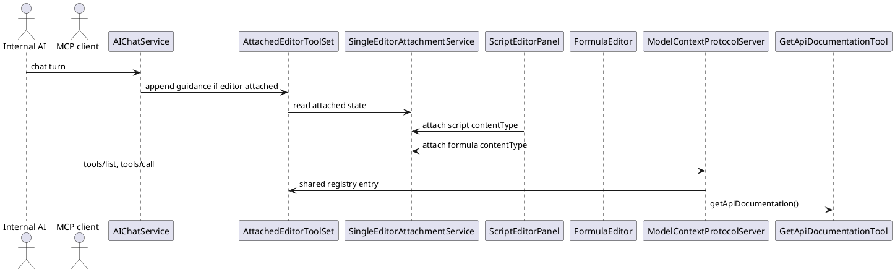
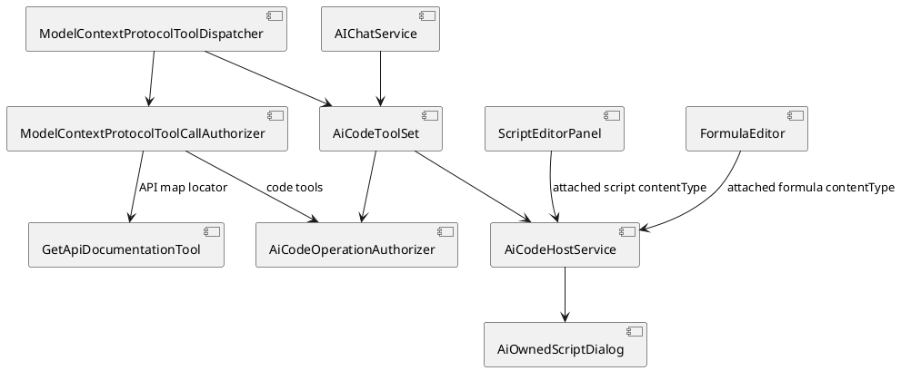
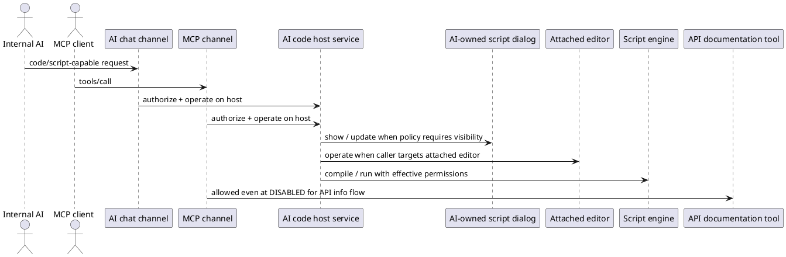

# Task: Introduce shared AI code-host workflows for scripts, formulas, and MCP
- **Task Identifier:** 2026-04-09-script-tool
- **Scope:** Rewrite this backlog item around an AI-owned script flow
  plus a shared attached-code contract instead of a direct
  `executeGroovyScript(...)` tool. Add a shared/global availability
  level `SCRIPT_EXECUTION`; add a user-configurable script-execution
  policy and a separate user-started-permission policy for the
  AI-owned script dialog; support both an AI-owned script flow and the
  existing attached-editor path, including shared read/write/compile
  for attached script and formula editors; expose the capability to
  internal AI and MCP with host-specific authorization and response
  handling; and keep MCP access to API documentation and the internal
  API map even when the shared/global availability level is
  `DISABLED`.
- **Motivation:** The old backlog design centered on direct script-tool
  execution. The current requirement is different. AI should normally
  work through a visible or inspectable code host, users should be
  able to choose whether code must be shown and who may start
  execution, attached formulas and attached scripts should share one
  external read/write/compile contract, and internal AI and MCP should
  share one execution core while still applying different host-specific
  authorization and result handling.
- **Scenario:**
  The task introduces two distinct `ScriptHost` targets.

  - The **AI-owned script flow** is a singleton transient script state
    created by internal AI or MCP. It may open an AI-specific script
    dialog, may wait for the user to press Run, or may run directly,
    depending on the current script-execution policy.
  - The **attached editor** is the existing user-managed attached-code
    path made available to AI through explicit attachment. It may be a
    `ScriptEditorPanel` or a `FormulaEditor`. AI may read, replace,
    and compile the current draft text through the shared contract,
    while normal user-managed save, submit, and run behavior stays with
    the concrete editor.

  Both hosts may exist at the same time. One attached editor may be
  active at a time, and one AI-owned script state may exist at a time.

  Internal AI and MCP both operate on the same underlying execution
  model. Internal AI filters tool exposure when the shared
  availability level changes. MCP keeps a stable advertised tool list
  and enforces the same authorization rules at tool-call time.
- **Constraints:**
  - Replace the previous direct execution-tool design instead of adding
    it in parallel.
  - Do not preserve backward compatibility for obsolete code tool
    calls or tool-facing DTOs. Replace them in the same increment
    instead of keeping wrappers, aliases, adapters, or parallel
    contracts.
  - Use one shared/global availability ladder:
    `DISABLED < READING < EDITING < SCRIPT_EXECUTION`.
  - `SCRIPT_EXECUTION` includes `EDITING`.
  - Internal AI and MCP share the same availability policy, but they do
    not have to enforce it the same way.
  - Internal AI may filter advertised tools by availability level.
  - MCP must not rely on dynamic tool-list updates for authorization.
    It may keep a stable advertised tool list, but execution must be
    enforced at tool-call time.
  - At shared/global `DISABLED`, internal AI gets no general script
    capability.
  - Preserve the current explicit attachment override: attaching a
    script or formula editor may create or reuse a chat session with
    at least session-level `READING` even when the shared/global level
    is `DISABLED`.
  - That attachment override preserves attached-editor read, write,
    compile, and status access.
  - That attachment override does not authorize AI-started execution.
    AI-started run from the attached editor still requires
    `SCRIPT_EXECUTION`.
  - At shared/global `DISABLED`, MCP may still access API information:
    `getApiDocumentation()` and read/search access limited to the
    internal API map that tool identifies.
  - Formula execution remains out of scope. Attached formulas
    participate only in shared attached-editor read, write, compile,
    and status access.
  - The AI-owned script flow is separate from attached-editor
    infrastructure.
  - The AI-owned script state is singleton, transient, replaceable,
    preserved until replacement or application exit, and must not be
    persisted across restart.
  - Replacing idle or finished AI-owned script state is allowed.
    Replacing a currently running AI-owned script is not allowed.
  - Hidden AI-started execution still leaves the latest AI-owned script
    inspectable later until replacement or exit.
  - The script-execution policy is a separate axis from external
    permissions.
  - User-started execution from the AI-owned dialog needs its own
    policy, separate from AI-started execution.
  - User-started execution from attached `ScriptEditorPanel` keeps its
    current script-editor behavior and current script-editor
    permissions.
  - Attached `FormulaEditor` save/submit behavior remains owned by the
    formula editor and is not replaced by this task.
  - The dedicated AI-specific permission profile must reuse the
    existing scripting permission axes for file read, file write,
    network, and exec.
  - In-script AI requests from AI-owned script runs are out of scope.
    This feature does not allow recursive AI calls from inside the
    running script.
  - AI must not copy attached code into the AI-owned script host and
    execute that copy unless the user explicitly asks for that. In
    this task that is guidance/alignment, not a separate technical
    authorization barrier.
  - Tool results stay narrow: JSON-safe structured values and/or
    captured text/stdout. Unsupported Java object return values must be
    reported as serialization errors.
  - Preferences tooltips must explain the new levels and policies,
    including what remains readable after the shared/global level drops
    below `SCRIPT_EXECUTION`.
- **Briefing:**
  Relevant current code spans:

  - `freeplane_plugin_ai/.../chat/AIChatService.java`
  - `freeplane_plugin_ai/.../chat/ChatToolAvailability.java`
  - `freeplane_api/.../AiToolAvailability.java`
  - `freeplane_plugin_ai/.../mcpserver/ModelContextProtocolServer.java`
  - `freeplane_plugin_ai/.../mcpserver/ModelContextProtocolToolDispatcher.java`
  - `freeplane_plugin_ai/.../code/AttachedEditorToolSet.java`
  - `freeplane_plugin_ai/.../code/SingleEditorAttachmentService.java`
  - `freeplane_plugin_script/.../ScriptEditorPanel.java`
  - `freeplane_plugin_script/.../ScriptingPermissions.java`
  - `freeplane_plugin_ai/.../tools/documentation/GetApiDocumentationTool.java`

  The previous version of this backlog task assumed a direct Groovy
  tool API. This rewrite replaces that model with a shared code-host
  contract for read/write/compile, a script-only execution path, and
  attached-editor content types that distinguish formulas from
  scripts.
- **Research:**
  - `ChatToolAvailability` currently has only `DISABLED`, `READING`,
    and `EDITING`.
  - Public API enum `AiToolAvailability` currently has only `CURRENT`,
    `DISABLED`, `READING`, and `EDITING`.
  - `AIChatService` currently filters tool exposure for chat turns and
    appends attached-editor guidance when an attached editor exists.
  - `AssistantProfileChatMemory` already persists special chat-message
    types such as `AssistantProfileSwitchMessage` and injects hidden
    `InstructionAckMessage` so profile control can affect model context
    and transcript/history projection without panel-side message
    replacement.
  - `ModelProjector`, `TranscriptProjector`, `PanelProjector`, and
    `ChatMemoryHistoryRenderer` already apply message-type-specific
    model, transcript, and visible-history treatment.
  - Current attached-editor behavior is explicit and separate from the
    normal chat tool-availability filter. `SingleEditorAttachmentService`
    ensures at least readable tool access for the owning session.
  - `SingleEditorAttachmentService` supports only one attached editor at
    a time.
  - `AttachedEditorToolSet` is currently attached-editor-specific and
    uses attached/detached plus latest-issue semantics.
  - `ScriptEditorPanel` passes `text/x-freeplane-script-groovy` into
    `AiChatAttachmentService.attachEditor(...)`.
  - `FormulaEditor` passes `text/x-freeplane-formula-groovy` into
    `AiChatAttachmentService.attachEditor(...)`.
  - `SingleEditorAttachmentService` stores the attached content type
    and exposes it through attached-editor reads and guidance.
  - Attached-editor compile dispatch currently calls
    `editor.compileForAi()` and therefore stays editor-owned rather
    than branching on content type.
  - `ScriptEditorPanel` is already a non-modal script dialog with a Run
    action and an AI attach action.
  - `ModelContextProtocolServer` currently declares
    `tools.listChanged = false` and `resources.listChanged = false`.
  - `ModelContextProtocolToolDispatcher` currently executes registered
    tools without call-time availability checks.
  - `GetApiDocumentationTool` already loads the installed API map and
    returns the map identifier plus important node identifiers.
  - `ScriptingPermissions` already models script-execution confirmation,
    file read, file write, network, exec, signed-script trust, and
    in-script AI-request permission.
  - `execute_scripts_without_ai_request_restriction` is already the
    in-script AI-request permission and must not become the switch that
    authorizes AI to execute scripts in the first place.
  - This feature does not enable that permission for AI-owned script
    runs.


- **Design:**
  Shared target design:

  - Replace the direct `executeGroovyScript(...)` contract with one
    shared AI/MCP code-host model:
    - `readCode`, `writeCode`, and `compileCode` are generic across
      both hosts; and
    - `runCode` is the script-only execution path layered on top of
      that shared contract.
  - Keep two `ScriptHost` values:
    - `AI`
    - `ATTACHED_EDITOR`
  - Keep one AI-owned script state at a time.
  - Keep at most one attached editor at a time.
  - Allow one attached editor and one AI-owned script state to
    coexist.
  - The AI host remains script-only and always uses content type
    `text/x-freeplane-script-groovy`.
  - The attached-editor host may currently expose:
    - `text/x-freeplane-script-groovy`
    - `text/x-freeplane-formula-groovy`
  - For attached editors, content type is injected by the editor at
    `attachEditor(...)` time, stored with the active attachment,
    treated as read-only attachment metadata, and returned by shared
    code-state responses.
  - Attached compile behavior stays editor-owned. The host service
    delegates compile to the attached editor implementation. It does
    not branch compile semantics by content type.
  - `writeCode` on `ATTACHED_EDITOR` edits only the live draft text. It
    does not submit, save, validate, or run the editor content.
  - `ScriptEditorPanel` and `FormulaEditor` therefore share the same
    attached-host contract for read, write, and compile, while keeping
    their normal user-managed save/submit/run behavior.
  - Attached manual script runs and attached formula validation
    failures update shared code-host lifecycle/result state.
  - For internal AI, attached-editor auto-posts remain failure-only.
    Successful manual script runs update state only.
  - For MCP, attached-editor manual activity never auto-posts
    anywhere. MCP observes later state only through `readCode`.
  - Failure auto-posts from the attached editor must be analysis-only.
    AI must not rewrite the attached content without an explicit user
    request or confirmation.
  - Attached formula validation failures must remain available through
    shared code-state reads and existing repair-request flows. They
    must not silently submit or save formula text.
  - Guidance for internal AI and MCP must also state that AI must not
    copy attached code into the AI-owned script host and execute that
    copy unless the user explicitly asks for that. This is a guidance
    rule in this task, not a separate technical authorization barrier.
  - Preserve the current attach behavior: explicit attachment of a
    script or formula editor may create or reuse a chat session with
    at least session-level `READING` even when the shared/global level
    is `DISABLED`.
  - That explicit attachment path preserves attached-editor read,
    write, compile, and status access, but not AI-started run.
  - Extend the shared/global availability model to include
    `SCRIPT_EXECUTION` and apply it to both internal AI and MCP.
  - Internal AI uses availability filtering for advertised tools.
  - MCP may keep a stable advertised tool list, but every code/script
    tool call must re-check current availability and current policy.
  - Add
    `org.freeplane.plugin.ai.mcpserver.ModelContextProtocolToolCallAuthorizer`
    as the MCP-only call-time authorization collaborator.
  - `ModelContextProtocolToolDispatcher` owns MCP tool-call execution
    order and invokes
    `ModelContextProtocolToolCallAuthorizer.assertAuthorized(...)`
    before it executes a tool.
  - `ModelContextProtocolToolCallAuthorizer` reuses
    `AiCodeOperationAuthorizer` for `readCode`, `writeCode`,
    `compileCode`, and `runCode`, and separately owns the MCP-only
    `DISABLED` documentation/API-map allowlist.
  - `ModelContextProtocolServer` and
    `ModelContextProtocolToolRegistry` remain protocol/metadata units.
  - The AI-owned flow uses the normal system message and tool
    descriptions. Do not add a separate AI-owned script system prompt
    in this task.
  - Attached editors keep their own guidance path.
  - Harmonize code-host request/response structure across the
    AI-owned flow and attached editors so callers can address a target
    either by existing `codeId` or, when no `codeId` is present, by
    explicit `host` selection.
  - Use one generic code-host tool family for both hosts:
    `readCode`, `writeCode`, `compileCode`, and `runCode`.
  - `readCode`, `writeCode`, and `compileCode` apply to both hosts.
  - `runCode` applies only to script content. Formula content and any
    other non-script target fail as direct call errors.
  - `readCode` is the primary read/status tool.
  - `readCode` always returns current status.
  - `readCode` returns diagnostics whenever the current state contains
    failure information.
  - `readCode` may accept an optional fingerprint and returns code
    text only when no fingerprint was provided or the provided
    fingerprint differs from the current code-text fingerprint.
  - `writeCode` replaces the full current code text for the targeted
    host and returns the resulting fingerprint.
  - `writeCode`, `compileCode`, and `runCode` may accept an optional
    expected fingerprint and must fail on mismatch.
  - For the AI host, `writeCode` establishes the singleton AI-owned
    script state if none exists yet and otherwise replaces the current
    one.
  - If `codeId` is present, it determines the host and current content
    kind implicitly.
  - If `codeId` is absent, the caller must specify `host` explicitly.
  - Attached editors therefore gain code identifiers and
    lifecycle/result state, not only attached/detached state.
  - The lifecycle model must distinguish at least:
    `NO_CODE`, `READY`, `WAITING_FOR_USER_RUN`,
    `USER_RUN_CANCELLED`, `SUCCEEDED`, `FAILED`, and `REPLACED`.
  - All `runCode(...)` paths in this task are synchronous. There is no
    per-call sync/async selector and no externally readable `RUNNING`
    state.
  - Because runs start on the UI thread and there is no safe general
    way to kill arbitrary script code running there, a non-terminating
    script may freeze Freeplane in this task.
  - AI-owned direct execution and AI-owned shown-editor execution must
    always run the current effective script text. When a visible
    AI-owned dialog exists, the current editor text is authoritative.
  - `runCode` uses the current map/node selection at execution time.
  - `compileCode` should not depend on stored or explicit map/node
    targeting in this task.
  - Do not capture selection into code state and do not add explicit
    per-request `mapIdentifier` or `nodeIdentifier` overrides in this
    task.
  - Whether `runCode` reuses prior compile results or recompiles
    internally is intentionally left unspecified in this task.
  - AI-started execution must re-check the current shared/global
    availability level, current script-execution policy, and current
    target content type immediately before execution starts.
  - When the shared/global level drops below `SCRIPT_EXECUTION`,
    existing AI-owned script state remains readable by status/read
    tools, but new AI authoring/execution authority is removed.
  - For user-run-only AI-owned scripts:
    - internal AI receives an immediate waiting status and, after the
      user presses Run, gets an automatic completion/failure message in
      the owning chat session as a user-side turn that immediately
      triggers a real assistant response shown in chat;
    - if the user cancels instead of running, internal AI gets an
      automatic cancellation message in the owning chat session as a
      user-side turn that immediately triggers a real assistant
      response shown in chat;
    - MCP may block for up to a globally configured user-controlled
      wait timeout; if the user presses Run or Cancel within that
      timeout, MCP receives the final result, otherwise MCP receives
      `WAITING_FOR_USER_RUN` and later uses read/status calls.
  - All app-authored automatic code-status messages use dedicated
    persisted type `AutomaticCodeStatusMessage` and dedicated
    transcript role `AUTOMATIC_CODE_STATUS`.
  - Keep that dedicated runtime message type. Do not collapse those
    turns into plain `UserMessage`, because distinct visible rendering
    and transcript-role preservation depend on message type, even
    though later model projection still treats them as user-side
    messages.
  - Reuse the existing special-message path for those messages. Do not
    add panel-side submission APIs or post-hoc replacement of plain
    user messages. If a synthetic follow-up turn is required, create it
    at the chat-memory/request boundary as an
    `AutomaticCodeStatusMessage`.
  - In this task those messages keep full result/status details, do
    not inline code text, and may use distinct UI styling because they
    are a dedicated message type.
  - For later AI turns, those messages remain included in model
    context as user messages. They are not treated as assistant
    messages, system messages, or fake tool calls.
  - When mapped to user messages for model context, they must identify
    themselves in their text as automatic app-authored code-status
    messages so they are not mistaken for direct user instructions, and
    the immediately generated assistant reply must persist as the next
    assistant turn.
  - In this task the dedicated transcript role does not need a
    transcript-entry subclass.
  - For attached manual activity:
    - update shared code-host lifecycle/result state in all cases;
    - for internal AI, auto-post manual script failures, but not
      successes, to the owning chat;
    - for MCP, do not auto-post anywhere and rely on later
      `readCode` calls instead; and
    - keep any failure auto-post analysis-only unless the user
      explicitly requests or confirms a rewrite.

Target shared properties and enums:

```text
ToolAvailabilityLevel
  DISABLED
  READING
  EDITING
  SCRIPT_EXECUTION

AiToolAvailability
  CURRENT
  DISABLED
  READING
  EDITING
  SCRIPT_EXECUTION

AiScriptExecutionPolicy
  SHOWN_USER_RUN
  HIDDEN_AI_RUN

AiScriptUserRunPermissionMode
  UNRESTRICTED
  AI_SPECIFIC_PERMISSIONS

ScriptHost
  AI
  ATTACHED_EDITOR

CodeLifecycleStatus
  NO_CODE
  READY
  WAITING_FOR_USER_RUN
  USER_RUN_CANCELLED
  SUCCEEDED
  FAILED
  REPLACED

ScriptRunInitiator
  USER
  AI

JsonSafeValue
  null | boolean | number | string | List<JsonSafeValue> |
  Map<String, JsonSafeValue>

Shared content types
  text/x-freeplane-script-groovy
  text/x-freeplane-formula-groovy

Enum-backed property rule
  - persist enum-backed properties as Enum.name() values
  - read them through ResourceController.getEnumProperty(...)
  - preference translation keys use:
    OptionPanel.<EnumSimpleName>.<ENUM_VALUE>
  - generic enum translation keys outside OptionPanel use:
    <EnumSimpleName>.<ENUM_VALUE>

Shared/global property
  ai_tool_availability =
    DISABLED | READING | EDITING | SCRIPT_EXECUTION
  legacy fallback property: ai_chat_tool_availability
  legacy fallback values accepted from prior chat-only setting:
    disabled | reading | editing

AI-owned script policy property
  ai_script_execution_policy =
    SHOWN_USER_RUN | HIDDEN_AI_RUN

AI-owned user-run permission property
  ai_script_user_run_permission_mode =
    UNRESTRICTED | AI_SPECIFIC_PERMISSIONS

AI-specific external permission properties
  ai_script_without_file_restriction = true|false
  ai_script_without_write_restriction = true|false
  ai_script_without_network_restriction = true|false
  ai_script_without_exec_restriction = true|false

```

Target internal-AI and MCP authorization rules:

```text
Base shared/global gates
  AI
    DISABLED | READING | EDITING
      existing state: readCode only
      no state: no AI-owned code operation available
    SCRIPT_EXECUTION
      readCode | writeCode | compileCode | runCode

  ATTACHED_EDITOR without chat override
    DISABLED
      no code operation available
    READING
      readCode
    EDITING
      readCode | writeCode | compileCode
    SCRIPT_EXECUTION
      readCode | writeCode | compileCode
      runCode only when current contentType is
      text/x-freeplane-script-groovy

RunCode content gate
  any host
    non-script content fails as a direct call error

Internal AI attached-editor override
  if an attached editor exists in chat:
    readCode | writeCode | compileCode on ATTACHED_EDITOR stay
    advertised and callable even when shared/global level is DISABLED
    or READING
    runCode on ATTACHED_EDITOR still requires SCRIPT_EXECUTION and
    script content

Internal AI advertisement rule
  advertise a code tool when at least one currently reachable target
  authorizes that operation
  advertise runCode only when at least one currently reachable
  script-typed target exists
  re-check host-specific authorization at tool-call time

MCP rule
  no attached-editor override
  use the base shared/global gates plus the DISABLED documentation-only
  exception
```

Target code-host service boundary:

```text
AiCodeHostService
  readCode(ReadCodeRequest) : ReadCodeResponse
  writeCode(WriteCodeRequest) : WriteCodeResponse
  compileCode(CompileCodeRequest) : CompileCodeResponse
  runCode(RunCodeRequest) : RunCodeResponse
  addRunListener(AiCodeRunListener)
  removeRunListener(AiCodeRunListener)

AiCodeRunListener
  runFinished(RunCodeResponse)
```

Target code-tool request/response structures:

```text
ReadCodeRequest
  codeId : String?
  host : ScriptHost?
  fingerprint : String?

ReadCodeResponse
  codeId : String?
  host : ScriptHost?
  contentType : String?
  status : CodeLifecycleStatus
  runInitiator : ScriptRunInitiator?
  fingerprint : String?
  codeText : String?
  replacementCodeId : String?
  compilerDiagnostics : List<String>?
  errorMessage : String?
  lineNumber : Integer?
  stdout : String?
  structuredResult : JsonSafeValue?

Response rules
  - always return status
  - return diagnostics whenever current state contains failure data
  - return codeText only when no fingerprint was provided or the
    provided fingerprint differs from the current code-text
    fingerprint
  - AI-host responses use text/x-freeplane-script-groovy whenever the
    host is resolved
  - attached-editor responses return the contentType captured when the
    editor was attached
  - runInitiator is present only when the returned state reflects an
    actual run in progress or a finished run

WriteCodeRequest
  codeId : String?
  host : ScriptHost?
  text : String
  expectedFingerprint : String?

WriteCodeResponse
  codeId : String
  host : ScriptHost
  contentType : String
  status : CodeLifecycleStatus
  fingerprint : String

Write rules
  - replaces full current code text for the targeted host
  - for AI, establishes the singleton state if none exists yet
  - for ATTACHED_EDITOR, requires an attached editor or fails as a
    direct call error
  - for ATTACHED_EDITOR, edits only draft text and does not submit,
    save, validate, or run content

CompileCodeRequest
  codeId : String?
  host : ScriptHost?
  expectedFingerprint : String?

CompileCodeResponse
  codeId : String
  host : ScriptHost
  contentType : String
  status : CodeLifecycleStatus
  fingerprint : String?
  compilerDiagnostics : List<String>?
  errorMessage : String?
  lineNumber : Integer?

Compile rules
  - attached-editor compile delegates to the concrete editor
    implementation
  - contentType is response metadata, not a compile dispatch selector
  - compile outcome is carried by `status`
  - compile success returns `READY`
  - compile failure returns `FAILED`
  - compile diagnostics keep the current code-backed shape:
    diagnostics lines, optional message, and optional line number

RunCodeRequest
  codeId : String?
  host : ScriptHost?
  expectedFingerprint : String?

RunCodeResponse
  codeId : String
  host : ScriptHost
  contentType : String
  status : CodeLifecycleStatus
  runInitiator : ScriptRunInitiator
  fingerprint : String?
  compilerDiagnostics : List<String>?
  errorMessage : String?
  lineNumber : Integer?
  stdout : String?
  structuredResult : JsonSafeValue?

Run rules
  - allowed only for script content
  - AI-host runs always use text/x-freeplane-script-groovy
  - runInitiator distinguishes `USER`-started runs from `AI`-started
    runs and is part of observable run state
  - all `runCode(...)` paths in this task are synchronous
  - run outcome is carried by `status`
  - waiting for user approval returns `WAITING_FOR_USER_RUN`
  - for MCP user-run-only AI-owned runs, a globally configured
    user-controlled wait timeout may return `WAITING_FOR_USER_RUN`
    after bounded blocking without auto-run or auto-cancel
  - user cancellation before execution returns `USER_RUN_CANCELLED`
  - started execution returns final `SUCCEEDED` or `FAILED`
  - run failures keep the current code-backed shape: optional compile
    diagnostics, optional message, optional line number, captured
    stdout, and optional serialized result

Operation failure rules
  - `readCode` uses readable lifecycle state for `NO_CODE` and
    `REPLACED`
  - `writeCode`, `compileCode`, and `runCode` use direct call errors
    for authorization denial, busy targets, expected fingerprint
    mismatch, missing writable/runnable targets, and non-script
    targets

Targeting rules
  - if codeId is present, it determines the host implicitly
  - if codeId is absent, host is required
  - writeCode/compileCode/runCode fail on expected fingerprint
    mismatch
```

Target MCP `DISABLED` authorization rule:

```text
Allowed at DISABLED for MCP only
  getApiDocumentation()
  readNodesWithDescendants(request) when request.mapIdentifier is the
    internal API map
  readNodesWithDescendantsAsPlainText(request) when request.mapIdentifier
    is the internal API map
  searchNodes(request) when request.mapIdentifier is the internal API
    map

Blocked at DISABLED for MCP
  readCode | writeCode | compileCode | runCode
  all non-documentation editing tools
  all read/search calls outside the internal API map
```







```plantuml
@startuml
set separator none
package "org.freeplane.plugin.ai.code" {
  class AiCodeToolSet {
    +readCode(request : ReadCodeRequest) : ReadCodeResponse
    +writeCode(request : WriteCodeRequest) : WriteCodeResponse
    +compileCode(request : CompileCodeRequest) : CompileCodeResponse
    +runCode(request : RunCodeRequest) : RunCodeResponse
  }
  class AiCodeOperationAuthorizer {
    +authorizedToolNames() : Set<String>
    +assertAuthorized(operation : String, codeId : String?, host : ScriptHost)
  }
}
package "org.freeplane.plugin.ai.mcpserver" {
  class ModelContextProtocolToolDispatcher {
    +dispatch(toolName : String, argumentsNode : JsonNode) : ToolExecutionResult
  }
  class ModelContextProtocolToolCallAuthorizer {
    +assertAuthorized(toolName : String, argumentsNode : JsonNode) : void
  }
}
package "org.freeplane.plugin.ai.tools.documentation" {
  class GetApiDocumentationTool {
    +getApiDocumentation() : GetApiDocumentationResponse
  }
}
package "org.freeplane.features.ai.code" {
  interface AiCodeHostService {
    +readCode(request : ReadCodeRequest) : ReadCodeResponse
    +writeCode(request : WriteCodeRequest) : WriteCodeResponse
    +compileCode(request : CompileCodeRequest) : CompileCodeResponse
    +runCode(request : RunCodeRequest) : RunCodeResponse
    +addRunListener(listener : AiCodeRunListener)
    +removeRunListener(listener : AiCodeRunListener)
  }
  interface AiCodeRunListener {
    +runFinished(response : RunCodeResponse)
  }
  enum ScriptHost {
    AI
    ATTACHED_EDITOR
  }
  enum CodeLifecycleStatus {
    NO_CODE
    READY
    WAITING_FOR_USER_RUN
    USER_RUN_CANCELLED
    SUCCEEDED
    FAILED
    REPLACED
  }
  enum ScriptRunInitiator {
    USER
    AI
  }
  class ReadCodeRequest {
    +codeId : String?
    +host : ScriptHost?
    +fingerprint : String?
  }
  class ReadCodeResponse {
    +codeId : String?
    +host : ScriptHost?
    +contentType : String?
    +status : CodeLifecycleStatus
    +runInitiator : ScriptRunInitiator?
    +fingerprint : String?
    +codeText : String?
    +replacementCodeId : String?
    +compilerDiagnostics : List<String>?
    +errorMessage : String?
    +lineNumber : Integer?
    +stdout : String?
    +structuredResult : JsonSafeValue?
  }
  class WriteCodeRequest {
    +codeId : String?
    +host : ScriptHost?
    +text : String
    +expectedFingerprint : String?
  }
  class WriteCodeResponse {
    +codeId : String
    +host : ScriptHost
    +contentType : String
    +status : CodeLifecycleStatus
    +fingerprint : String
  }
  class CompileCodeRequest {
    +codeId : String?
    +host : ScriptHost?
    +expectedFingerprint : String?
  }
  class CompileCodeResponse {
    +codeId : String
    +host : ScriptHost
    +contentType : String
    +status : CodeLifecycleStatus
    +fingerprint : String?
    +compilerDiagnostics : List<String>?
    +errorMessage : String?
    +lineNumber : Integer?
  }
  class RunCodeRequest {
    +codeId : String?
    +host : ScriptHost?
    +expectedFingerprint : String?
  }
  class RunCodeResponse {
    +codeId : String
    +host : ScriptHost
    +contentType : String
    +status : CodeLifecycleStatus
    +runInitiator : ScriptRunInitiator
    +fingerprint : String?
    +compilerDiagnostics : List<String>?
    +errorMessage : String?
    +lineNumber : Integer?
    +stdout : String?
    +structuredResult : JsonSafeValue?
  }
}
package "org.freeplane.plugin.script.ai" {
  class AiOwnedScriptDialog {
    +showCode(codeId : String)
    +showAndFocus()
  }
}

AiCodeToolSet --> AiCodeOperationAuthorizer
AiCodeToolSet --> AiCodeHostService
ModelContextProtocolToolDispatcher --> ModelContextProtocolToolCallAuthorizer
ModelContextProtocolToolCallAuthorizer --> AiCodeOperationAuthorizer
ModelContextProtocolToolCallAuthorizer --> GetApiDocumentationTool
AiCodeHostService --> AiCodeRunListener
AiCodeHostService --> AiOwnedScriptDialog
AiCodeToolSet ..> ReadCodeRequest
AiCodeToolSet ..> WriteCodeRequest
AiCodeToolSet ..> CompileCodeRequest
AiCodeToolSet ..> RunCodeRequest
@enduml
```

  The task is intentionally split into subtasks because the shared
  authorization/host model, internal AI behavior, and MCP behavior
  are related but not identical.
- **Test specification:**
  - Automated tests:
    - extend availability parsing/tests for `SCRIPT_EXECUTION` in both
      internal and public AI availability paths;
    - verify enum-backed properties persist enum `name()` values and
      parse through `ResourceController.getEnumProperty(...)`;
    - verify attached-editor content-type injection for
      `ScriptEditorPanel` and `FormulaEditor`;
    - add authorization tests for internal AI filtering vs MCP
      call-time enforcement;
    - add tests for the internal-AI attached-editor override versus
      MCP base-gate behavior;
    - add tests for the two script-execution-policy states;
    - add tests for the two user-started-permission-policy states in
      the AI-owned dialog;
    - add tests for attached-editor normal-permission behavior for both
      script and formula attachments;
    - add tests for `codeId` vs explicit `host` targeting;
    - add tests for singleton AI-owned replacement and running-state
      busy rejection;
    - add tests for no-code state, replaced state, and later result
      reads;
    - add tests for `readCode` always returning status, content type,
      diagnostics on failure, and code text only when the fingerprint
      is absent or changed;
    - add tests for `writeCode` returning the resulting fingerprint and
      content type;
    - add tests for optional expected-fingerprint mismatch failures on
      `writeCode`, `compileCode`, and `runCode`;
    - add tests that `writeCode` on attached editors edits draft text
      only and does not submit, save, or run content;
    - add tests that `runCode` uses current selection at execution
      time and that this task does not add explicit map/node-target
      overrides or stored context capture for `compileCode`/
      `runCode`;
    - add tests that `runCode` rejects formula content as a direct call
      error;
    - add tests for attached formula validation failures remaining
      readable through shared code state;
    - add tests for `DISABLED` MCP API-documentation/API-map
      exception; and
    - add tests for JSON-safe result serialization and explicit
      failure on unsupported return types.
  - Manual tests:
    - verify both AI-owned policy modes from internal AI;
    - verify attached script and formula behavior under `READING`,
      `EDITING`, and `SCRIPT_EXECUTION`;
    - verify formula attachments expose the correct content type and
      remain non-runnable to AI;
    - verify MCP behavior with stable tool metadata and changing local
      availability settings; and
    - verify tooltip wording in preferences for level drops and script
      policy consequences.


## Subtask: Preparatory migration from attached-editor tools to generic code-host structures
- **Status:** review
- **Scope:** Replace the attached-editor-specific tool family and its
  tool-facing DTOs with the generic code-host request/response
  structures for the attached-editor host first, remove the obsolete
  tool names and DTOs in the same increment, and leave later subtasks
  to add the shared availability policy, AI-owned host behavior, and
  `runScript`.
- **Motivation:** Later AI-owned and authorization work is simpler if
  one generic attached-code contract exists first. This also matches
  the no-backward-compatibility rule and avoids parallel tool APIs.
- **Briefing:** This subtask primarily touches
  `AttachedEditorToolSet`, `AttachedEditorProvider`,
  `SingleEditorAttachmentService`, `AIToolSetBuilder`,
  `AIChatService`, `ChatPromptRunner`, `AIChatPanel`,
  `ScriptEditorPanel`, `FormulaEditor`, `AiChatAttachment`, and
  `AiChatRepairRequest`.
- **Research:**
  - The pre-migration attached-editor API was its own tool family:
    `readAttachedEditor`, `overwriteAttachedEditorContent`,
    `compileAttachedEditorContent`, and
    `getAttachedEditorLatestIssue`.
  - The pre-migration tool-facing DTOs were
    `ReadAttachedEditorResponse`,
    `OverwriteAttachedEditorContentResponse`, and
    `ReadAttachedEditorLatestIssueResponse`.
  - `SingleEditorAttachmentService` already captured `contentType` at
    `attachEditor(...)` time and already delegated compile to the
    concrete editor implementation.
  - `ScriptEditorPanel` attached script content as
    `text/x-freeplane-script-groovy`; `FormulaEditor` attached formula
    content as `text/x-freeplane-formula-groovy`.
  - Failure tracking and repair payloads still used the chat-specific
    `AiChatCodeOperationResult` shape rather than the planned generic
    code-state shape.
- **Design:**
  - The main-task Design is the authoritative shared contract.
  - This subtask applies only its attached-editor migration slice:
    - introduce `AiCodeHostService`, `AiCodeToolSet`,
      `AiCodeEditor`, and the generic `ReadCode*`, `WriteCode*`, and
      `CompileCode*` request/response types;
    - implement only the `ATTACHED_EDITOR` host path in this
      subtask; AI-host behavior and `runScript` remain for later
      subtasks;
    - replace `readAttachedEditor`,
      `overwriteAttachedEditorContent`,
      `compileAttachedEditorContent`, and
      `getAttachedEditorLatestIssue` with `readCode`, `writeCode`, and
      `compileCode`;
    - make `SingleEditorAttachmentService` the direct
      `AiCodeHostService` implementation for the attached-editor host;
    - preserve attached `contentType` capture and editor-owned compile
      behavior;
    - replace `AiChatCodeEditor` with `AiCodeEditor`;
    - replace attachment issue tracking and repair payloads with the
      generic code-host state structures; and
    - remove the old attached-editor tool names, DTOs, and
      compatibility paths in the same increment.
- **Test specification:**
  - Automated tests:
    - verify `AiCodeToolSet` replaces `AttachedEditorToolSet`;
    - verify old attached-editor tool names are no longer advertised or
      callable;
    - verify `readCode`, `writeCode`, and `compileCode` work for
      `ATTACHED_EDITOR`;
    - verify attached script and formula editors preserve
      `contentType`;
    - verify `readCode` covers latest-issue reads without a separate
      issue tool;
    - verify attached-editor compile failures populate generic code
      diagnostics;
    - verify formula validation failure state remains readable through
      generic code-state reads;
    - verify `writeCode` edits draft text only and does not submit,
      save, validate, or run content; and
    - verify repair flows and registries use only the generic code-tool
      family after migration.
  - Manual tests: N/A.
- **Implementation notes:**
  - **Interpretations:**
    - `ScriptEditorPanel` and `FormulaEditor` now return compile
      diagnostics in the generic `CompileCodeResponse` shape, while
      `SingleEditorAttachmentService` fills in the authoritative
      attached-editor `codeId`, `host`, and `contentType` around those
      editor-owned compile results.
  - **Tradeoffs:**
    - `SingleEditorAttachmentService` keeps replaced and detached
      attached-editor `codeId` reads in memory with `REPLACED` or
      `NO_CODE` state instead of silently dropping them, so later
      `readCode` calls already match the later code-id-based flow.

## Subtask: Shared code authorization, content typing, and script-execution policies
- **Status:** review
- **Scope:** Define the shared/global availability semantics on top of
  the generic code-host contract from the preparatory migration,
  extend that contract from attached-editor-only behavior to shared
  AI-owned and attached-editor behavior, and map script execution to
  existing permission primitives.
- **Motivation:** Internal AI and MCP need one shared execution model,
  but after the preparatory contract migration the generic contract
  still lacks shared/global availability, AI-host behavior, content-
  type-based run eligibility, and permission mapping.
- **Briefing:** This subtask primarily touches `AiToolAvailability`,
  shared resolved tool-availability handling, the generic code-host
  contract, and `ScriptingPermissions` integration points.
- **Research:**
  - The preparatory migration subtask introduced the generic code-host
    contract for the attached-editor host first.
  - Current internal chat availability and public API availability stop
    at `EDITING`.
  - Existing scripting permissions already supply the external
    permission axes needed by this task.
- **Design:**
  ```plantuml
  @startuml
  component "Internal AI" as Chat
  component "MCP" as Mcp
  component "AiCodeOperationAuthorizer" as Authorizer
  component "RoutingAiCodeHostService" as Routing
  component "AiOwnedScriptHostService" as AiHost
  component "SingleEditorAttachmentService" as AttachedHost

  Chat --> Authorizer : advertise + call authorize
  Mcp --> Authorizer : call authorize
  Authorizer --> Routing : readCode/writeCode/\ncompileCode/runCode
  Routing --> AiHost : host AI
  Routing --> AttachedHost : host ATTACHED_EDITOR
  AttachedHost --> Authorizer : attached-editor override\nfor read/write/compile
  AiHost --> Authorizer : script content only
  @enduml
  ```

  ```plantuml
  @startuml
  set separator none
  package "org.freeplane.plugin.ai.tools.code" {
    class AiCodeOperationAuthorizer {
      +authorizedToolNames() : Set<String>
      +assertAuthorized(operation : String, codeId : String?, host : ScriptHost) : void
    }
  }
  package "org.freeplane.plugin.ai.code" {
    interface AiCodeHostService {
      +readCode(request : ReadCodeRequest) : ReadCodeResponse
      +writeCode(request : WriteCodeRequest) : WriteCodeResponse
      +compileCode(request : CompileCodeRequest) : CompileCodeResponse
      +runCode(request : RunCodeRequest) : RunCodeResponse
    }
    class RoutingAiCodeHostService {
      +readCode(request : ReadCodeRequest) : ReadCodeResponse
      +writeCode(request : WriteCodeRequest) : WriteCodeResponse
      +compileCode(request : CompileCodeRequest) : CompileCodeResponse
      +runCode(request : RunCodeRequest) : RunCodeResponse
    }
    class SingleEditorAttachmentService {
      +readCode(request : ReadCodeRequest) : ReadCodeResponse
      +writeCode(request : WriteCodeRequest) : WriteCodeResponse
      +compileCode(request : CompileCodeRequest) : CompileCodeResponse
      +runCode(request : RunCodeRequest) : RunCodeResponse
    }
  }
  package "org.freeplane.plugin.script.ai" {
    class AiOwnedScriptHostService {
      +readCode(request : ReadCodeRequest) : ReadCodeResponse
      +writeCode(request : WriteCodeRequest) : WriteCodeResponse
      +compileCode(request : CompileCodeRequest) : CompileCodeResponse
      +runCode(request : RunCodeRequest) : RunCodeResponse
    }
  }

  RoutingAiCodeHostService ..|> AiCodeHostService
  SingleEditorAttachmentService ..|> AiCodeHostService
  AiOwnedScriptHostService ..|> AiCodeHostService
  RoutingAiCodeHostService --> SingleEditorAttachmentService : ATTACHED_EDITOR
  RoutingAiCodeHostService --> AiOwnedScriptHostService : AI
  AiCodeOperationAuthorizer ..> ScriptHost
  @enduml
  ```

  - The main-task Design is authoritative for the shared contract,
    enums, request/response structures, and authorization matrix.
  - This subtask adds the shared policy layer and script-only run path:
    - add `SCRIPT_EXECUTION` to both `ToolAvailabilityLevel` and
      `AiToolAvailability`;
    - use canonical property `ai_tool_availability` with legacy
      fallback from `ai_chat_tool_availability`;
    - extend the generic code-host contract from attached-editor-only
      behavior to both `AI` and `ATTACHED_EDITOR`, including
      `runCode`;
    - keep `readCode`, `writeCode`, and `compileCode` generic while
      keeping `runCode` script-only;
    - route `ATTACHED_EDITOR` to
      `SingleEditorAttachmentService` and `AI` to
      `AiOwnedScriptHostService` through
      `RoutingAiCodeHostService`;
    - preserve the internal-AI attached-editor override for
      `readCode`/`writeCode`/`compileCode` only; `runCode` still
      requires shared/global `SCRIPT_EXECUTION` and script content;
    - keep shared lifecycle/result semantics aligned across internal AI
      and MCP, including `WAITING_FOR_USER_RUN` and
      `USER_RUN_CANCELLED` for AI-owned user-run-only flows;
    - resolve host and content type from `codeId` when present, else
      require explicit `host`;
    - reject formula or other non-script targets as direct call
      errors;
    - map AI-specific external permissions to existing scripting
      permission axes; and
    - keep recursive AI requests disabled for AI-owned runs.
- **Test specification:**
  - Automated tests:
    - extend availability enum tests with `SCRIPT_EXECUTION`;
    - verify canonical property `ai_tool_availability` plus legacy
      fallback from `ai_chat_tool_availability`;
    - verify shared/global level mapping for internal AI and MCP,
      including the internal-AI attached-editor override;
    - verify `codeId` targeting and explicit-host targeting;
    - verify AI-host responses always resolve to script content type;
    - verify attached-editor responses preserve the content type
      captured at attach time;
    - verify lifecycle/result handling, including `READY`,
      `WAITING_FOR_USER_RUN`, `USER_RUN_CANCELLED`, and `REPLACED`;
    - verify optional expected-fingerprint mismatch failures on
      `writeCode`, `compileCode`, and `runCode`;
    - verify `runCode` rejects non-script content as a direct call
      error;
    - verify AI-specific permission mapping to existing scripting
      permissions; and
    - verify serialization success and failure boundaries.
  - Manual tests: N/A.
- **Implementation notes:**
  - **Interpretations:**
    - `ToolAvailabilityLevel` now replaces the chat-only availability
      enum and uses canonical property `ai_tool_availability` with
      legacy fallback from `ai_chat_tool_availability`.
    - `AiCodeOperationAuthorizer` keeps attached-editor
      `readCode`/`writeCode`/`compileCode` available for internal AI
      when a session override exists, while `runCode` still requires
      shared/global `SCRIPT_EXECUTION` and script content.
    - `RoutingAiCodeHostService` routes by explicit `host`, returns
      AI-host `NO_CODE` state when the script-plugin service is absent,
      and fails write/compile/run in that case.
  - **Tradeoffs:**
    - `AiOwnedScriptHostService` now tolerates missing current
      `Controller`/`ResourceController` during construction so OSGi
      registration and script-side helper lookup do not require full UI
      bootstrap; when preferences are unavailable, AI-specific external
      permissions stay restricted by default.
    - Run-listener synchronization in `RoutingAiCodeHostService` is
      deduplicated at registration time so the same listener is not
      added twice to the AI host.
    - MCP-specific bounded waiting and pending-follow-up reset stay in a
      dedicated MCP-side `AiCodeHostService` wrapper so shared chat and
      host services do not need MCP-only branching.

## Subtask: Internal AI-owned script dialog flow
- **Status:** review
- **Scope:** Add the AI-owned script dialog, integrate it with internal
  AI chat, apply the two script-execution-policy states, and add the
  AI-owned follow-up message behavior for user-started execution.
- **Motivation:** The main user-facing change is an AI-owned script
  host that can be shown, edited, run by the user, or run directly by
  AI, depending on the configured policy.
- **Briefing:** This subtask primarily touches AI chat system-message
  construction, the shared `AiCodeHostService` contract, the
  script-plugin-owned AI host implementation and dialog, and the
  internal AI flow that creates or updates the current AI-owned script
  state.
- **Research:**
  - `ScriptEditorPanel` already provides a script-editing dialog and run
    action, but it is a user-managed persistent editor, not an AI-owned
    transient flow.
  - Internal AI currently operates in one chat/session and can append
    extra attached-editor guidance when needed.
  - The existing special-message path already handles assistant-profile
    switching without panel-side message replacement: special messages
    are stored in `AssistantProfileChatMemory`, projected differently by
    the model/transcript/panel projectors, and hidden `ok`
    acknowledgements are injected there as `InstructionAckMessage`.
  - The current visible internal-AI request entry starts from plain
    text through `ChatRequestFlow` and `AIChatService.chat(String)`, so
    any automatic follow-up that must persist as a dedicated message
    type has to be introduced below the panel or by extending that
    lower request boundary.
- **Design:**
  ```plantuml
  @startuml
  actor User
  participant "AiOwnedScriptDialog" as Dialog
  participant "AiOwnedScriptHostService" as Host
  participant "Internal AI follow-up runtime" as Followup
  participant "AssistantProfileChatMemory" as Memory

  alt User presses Run
    User -> Dialog : Run
    Dialog -> Host : runFromDialog(currentContent)
    Host -> Followup : runFinished(RUN_SUCCEEDED or RUN_FAILED)
  else User presses Cancel
    User -> Dialog : Cancel
    Dialog -> Host : dialogCancelled()
    Host -> Followup : runFinished(USER_RUN_CANCELLED)
  end
  Followup -> Memory : add AutomaticCodeStatusMessage
  Followup -> Memory : append assistant reply
  @enduml
  ```

  ```plantuml
  @startuml
  set separator none
  package "org.freeplane.plugin.script.ai" {
    interface DialogCallbacks {
      +runFromDialog(content : CodeStateContent) : RunCodeResponse
      +dialogCancelled() : void
    }
    class AiOwnedScriptDialog {
      +showCode(content : CodeStateContent) : void
      +hideDialog() : void
    }
    class AiOwnedScriptHostService {
      +runCode(request : RunCodeRequest) : RunCodeResponse
      +runFromDialog(content : CodeStateContent) : RunCodeResponse
      +dialogCancelled() : void
    }
    AiOwnedScriptHostService ..|> DialogCallbacks
    AiOwnedScriptDialog --> DialogCallbacks
  }
  package "org.freeplane.plugin.ai.chat.memory" {
    class AssistantProfileChatMemory {
      +add(message : ChatMessage) : void
    }
    class UserMessage
    class AutomaticCodeStatusMessage {
      +forRunResponse(response : RunCodeResponse) : AutomaticCodeStatusMessage
    }
    class InstructionAckMessage
    class ModelProjector
    class TranscriptProjector
    class PanelProjector
  }
  package "org.freeplane.plugin.ai.chat.ui" {
    class ChatMemoryHistoryRenderer
  }
  package "org.freeplane.features.ai.code" {
    interface AiCodeRunListener {
      +runFinished(response : RunCodeResponse)
    }
  }

  AiOwnedScriptHostService --> AiCodeRunListener : runFinished(response)
  AutomaticCodeStatusMessage ..|> UserMessage
  AssistantProfileChatMemory --> AutomaticCodeStatusMessage
  AssistantProfileChatMemory --> InstructionAckMessage
  AssistantProfileChatMemory ..> ModelProjector
  AssistantProfileChatMemory ..> TranscriptProjector
  AssistantProfileChatMemory ..> PanelProjector
  TranscriptProjector ..> AutomaticCodeStatusMessage
  PanelProjector ..> AutomaticCodeStatusMessage
  ChatMemoryHistoryRenderer ..> AutomaticCodeStatusMessage
  @enduml
  ```

  - The main-task Design remains authoritative for the shared code-host
    contract and automatic status-message semantics.
  - This subtask adds the AI-owned dialog and owning-chat behavior on
    top of that contract:
    - implement a separate transient, non-modal
      `AiOwnedScriptDialog` rather than reusing `ScriptEditorPanel`
      directly;
    - preserve the latest AI-owned script in memory until replacement
      or application exit, and let the user reopen that existing state
      from the AI chat UI when status is not `NO_CODE`;
    - apply the two execution-policy modes exactly as specified in the
      main task: `SHOWN_USER_RUN` must show the dialog and wait for the
      user to press `Run`, while `HIDDEN_AI_RUN` must keep AI-started
      execution hidden;
    - treat visible dialog text as authoritative for execution;
    - when the user cancels a pending `SHOWN_USER_RUN` request before
      execution starts, update the current AI-owned code state to
      `USER_RUN_CANCELLED`;
    - reject replacement only while the current AI-owned script is busy
      running; otherwise replace the existing AI-owned state
      immediately;
    - use `ai_script_user_run_permission_mode` with
      `UNRESTRICTED` and `AI_SPECIFIC_PERMISSIONS`, and treat the
      dialog `Run` click itself as the execution approval for
      `AI_SPECIFIC_PERMISSIONS`;
    - keep recursive AI requests disabled for AI-owned runs;
    - keep the AI-owned flow on the normal base system message and tool
      descriptions; do not add a separate AI-owned script system
      prompt;
    - persist app-authored completion, cancellation, and failure
      follow-up messages as `AutomaticCodeStatusMessage` with
      transcript role `AUTOMATIC_CODE_STATUS`;
    - keep that dedicated message type because distinct rendering and
      transcript-role preservation depend on it, even though later
      model projection still treats it as user-side;
    - reuse the existing special-message treatment path in chat memory
      and projectors, and send those turns through the normal
      internal-AI conversation flow so they immediately trigger visible
      assistant replies;
    - keep this orchestration below `AIChatPanel`; do not add
      panel-specific automatic-status submission APIs or panel-side
      replacement of plain user messages;
    - map those messages into later model context as user messages and
      label them explicitly as automatic app-authored code-status
      messages; and
    - below shared/global `SCRIPT_EXECUTION`, keep AI-owned
      read/status access but remove new authoring and execution
      authority.
- **Test specification:**
  - Automated tests:
    - verify dialog opening behavior for both policy states;
    - verify the AI-owned dialog is non-modal;
    - verify hidden mode preserves inspectable state without auto-open;
    - verify the AI chat UI reopen action is enabled only when current
      AI-owned code exists;
    - verify shown modes use current editor text at run time;
    - verify `SHOWN_USER_RUN` waits for explicit user execution and
      `HIDDEN_AI_RUN` does not open the dialog for AI-started
      execution;
    - verify busy rejection and immediate replacement rules for the
      current AI-owned script;
    - verify internal-AI follow-up for user-started completion,
      cancellation, and failure posts the dedicated automatic
      code-status message type and immediately generates a visible
      assistant response;
    - verify dialog cancellation before execution updates the current
      AI-owned code state to `USER_RUN_CANCELLED`;
    - verify level-drop behavior keeps read/status only;
    - verify attached manual run success updates state without
      auto-posting to chat;
    - verify attached manual run failure auto-posts analysis-only
      status details without inline full code text;
    - verify automatic code-status messages preserve their dedicated
      type and transcript role across transcript/history rebuild, with
      the resulting assistant reply preserved in the following
      assistant turn;
    - verify later AI turns receive those messages in model context as
      user messages in their original turn order with the generated
      assistant reply following them; and
    - verify MCP observes attached manual failures only through updated
      host state and later `readCode` calls.
  - Manual tests:
    - run internal AI in both policy modes;
    - in `SHOWN_USER_RUN`, press Run and verify the chat shows the
      automatic code-status message followed immediately by a real
      assistant response based on that result;
    - in `SHOWN_USER_RUN`, press Cancel and verify the chat shows the
      automatic cancellation message followed immediately by a real
      assistant response based on that cancellation, and that the
      current AI-owned code state becomes `USER_RUN_CANCELLED`;
    - edit shown code before Run and verify the edited code is what
      executes; and
    - lower the shared/global level after a script exists and verify the
      tooltip text matches behavior.
- **Implementation notes:**
  - **Interpretations:**
    - Hidden internal-AI requests now bind AI-owned-script ownership to
      the current chat session so later user-started completion,
      cancellation, and failure follow-up messages have a transcript
      target.
    - AI-started execution now has only the hidden direct-run path; the
      shown path always waits for an explicit user `Run`.
    - Attached manual script-failure auto-posts omit inline code text
      and rely on shared code-state details plus later `readCode`
      access.
  - **Tradeoffs:**
    - The explicit AI-owned-script reopen path is implemented in the AI
      chat popup menu rather than as a persistent top-bar button to keep
      the UI change minimal while still exposing a user-only reopen
      action.
    - Automatic code-status follow-up requests reuse the normal visible
      internal-AI request flow through the existing text entry path, but
      `AssistantProfileChatMemory` converts the reserved automatic
      code-status text into `AutomaticCodeStatusMessage` at add-time and
      `ChatRequestFlow` rebuilds visible history after the assistant
      reply so special rendering/transcript behavior comes from the
      existing memory/projector path rather than from panel-side message
      replacement.
    - Current chat rendering shows `AutomaticCodeStatusMessage` with the
      existing system-message styling while preserving its dedicated
      transcript role and model-context `UserMessage` mapping.

## Subtask: MCP code-host flow and DISABLED documentation access
- **Status:** review
- **Scope:** Keep MCP tool metadata stable, enforce current
  authorization at call time, support bounded waiting plus later
  status/result reads by `codeId` for AI-owned user-run-only behavior,
  and keep API-documentation/API-map access available at `DISABLED`.
- **Motivation:** MCP has different client behavior and cannot rely on
  internal chat filtering or local UI affordances. The authorization and
  later-read model therefore need explicit MCP handling.
- **Briefing:** This subtask primarily touches
  `ModelContextProtocolServer`, `ModelContextProtocolToolDispatcher`,
  MCP tool metadata/resource exposure, and the API-documentation tool.
- **Research:**
  - Current MCP capabilities announce no tool-list change mechanism.
  - Current MCP dispatch has no call-time availability enforcement.
  - `GetApiDocumentationTool` already loads the API map and returns the
    needed identifiers.
- **Design:**
  ```plantuml
  @startuml
  actor "MCP client" as Client
  actor User
  participant "ModelContextProtocolToolDispatcher" as Dispatcher
  participant "ModelContextProtocolToolCallAuthorizer" as Authorizer
  participant "AiOwnedScriptHostService" as Host

  Client -> Dispatcher : runCode(host=AI,...)
  Dispatcher -> Authorizer : assertAuthorized(...)
  Dispatcher -> Host : runCode(...)
  alt User presses Run or Cancel within timeout
    User -> Host : Run or Cancel
    Host --> Dispatcher : RUN_SUCCEEDED / RUN_FAILED / USER_RUN_CANCELLED
    Dispatcher --> Client : final RunCodeResponse
  else Timeout expires first
    Host --> Dispatcher : WAITING_FOR_USER_RUN + codeId
    Dispatcher --> Client : waiting RunCodeResponse
    Client -> Dispatcher : readCode(codeId)
    Dispatcher -> Authorizer : assertAuthorized(...)
    Dispatcher -> Host : readCode(codeId)
    Host --> Dispatcher : final state
    Dispatcher --> Client : ReadCodeResponse
  end
  @enduml
  ```

  - Keep MCP tool advertisement stable.
  - Keep `ModelContextProtocolServer` responsible for MCP protocol
    handling and `ModelContextProtocolToolRegistry` responsible for
    stable tool metadata only.
  - Add
    `org.freeplane.plugin.ai.mcpserver.ModelContextProtocolToolCallAuthorizer`
    as the MCP-only call-time authorization collaborator.
  - `ModelContextProtocolToolDispatcher` invokes
    `ModelContextProtocolToolCallAuthorizer.assertAuthorized(...)`
    before each tool execution.
  - `ModelContextProtocolToolCallAuthorizer` reuses
    `AiCodeOperationAuthorizer` for `readCode`, `writeCode`,
    `compileCode`, and `runCode`, and separately owns the MCP-only
    `DISABLED` documentation/API-map allowlist.
  - Enforce current availability and current policy when each MCP tool
    call executes.
  - When MCP requests AI-owned user-run-only behavior, block for up to
    a globally configured user-controlled wait timeout.
  - If the user presses Run or Cancel within that timeout, return the
    final result directly.
  - If the timeout expires first, return `WAITING_FOR_USER_RUN` plus
    `codeId` without auto-run or auto-cancel.
  - MCP does not receive automatic completion, cancellation, or
    failure chat messages.
  - Add later read/status/result access by `codeId`, including the
    eventual transition to `RUN_SUCCEEDED`, `RUN_FAILED`, or
    `USER_RUN_CANCELLED` after the user acts.
  - If a later read uses a replaced `codeId`, return explicit
    replaced-state information instead of silently disappearing.
  - If no current code exists for a readable host, return explicit
    no-code state rather than hiding the tools.
  - MCP does not receive attached manual failure auto-posts. It learns
    about attached manual failures only through updated host state and
    later `readCode` calls.
  - At shared/global `DISABLED`, allow only API information access for
    MCP:
    `getApiDocumentation()` plus `readNodesWithDescendants(...)`,
    `readNodesWithDescendantsAsPlainText(...)`, and
    `searchNodes(...)` only when the request targets the internal API
    map identified by that tool.
  - Reuse `getApiDocumentation()` as the MCP-side API-map locator.
  - Deny `readCode`, `writeCode`, `compileCode`, `runCode`, and all
    other non-documentation tool calls at `DISABLED` with explicit
    authorization errors.
- **Test specification:**
  - Automated tests:
    - verify stable MCP tool metadata across availability changes;
    - verify
      `ModelContextProtocolToolDispatcher` consults
      `ModelContextProtocolToolCallAuthorizer` before tool execution;
    - verify call-time authorization for `READING`, `EDITING`, and
      `SCRIPT_EXECUTION`;
    - verify `DISABLED` blocks non-documentation code/script
      operations;
    - verify `DISABLED` still allows `getApiDocumentation()` and only
      API-map-scoped `readNodesWithDescendants(...)`,
      `readNodesWithDescendantsAsPlainText(...)`, and
      `searchNodes(...)`;
    - verify MCP returns the final result directly when the user
      presses Run within the configured wait timeout;
    - verify MCP returns `USER_RUN_CANCELLED` directly when the user
      presses Cancel within the configured wait timeout;
    - verify timeout expiry returns `WAITING_FOR_USER_RUN` plus
      `codeId` without auto-run or auto-cancel, and later reads by
      `codeId` expose the eventual final state;
    - verify MCP-triggered runs do not append automatic completion,
      cancellation, or failure chat messages while still updating code
      state correctly;
    - verify replaced-state and no-code-state responses.
  - Manual tests:
    - connect an MCP client, change local availability, and verify that
      call-time authorization changes without depending on refreshed
      tool metadata;
    - use MCP at `DISABLED` to discover the API map and read/search only
      within that map.
- **Implementation notes:**
  - **Interpretations:**
    - `ModelContextProtocolToolCallAuthorizer` now owns MCP-only
      call-time authorization, while `AiCodeOperationAuthorizer`
      remains the shared code-host gate reused for MCP code tools.
    - MCP uses a dedicated code-host wrapper to clear any pending
      internal-AI follow-up ownership before AI-host writes/runs and to
      wait off the EDT for a later terminal user-run result up to the
      configured timeout.
  - **Tradeoffs:**
    - The MCP authorizer resolves the internal API map identifier by
      calling `GetApiDocumentationTool` directly instead of duplicating
      separate API-map lookup logic or parsing MCP tool output.
    - MCP bounded waiting is implemented in the MCP-only code-host
      wrapper instead of the shared host services so chat-side flows
      keep immediate waiting responses and MCP alone owns the blocking
      timeout behavior.
    - `ModelContextProtocolToolDispatcher` remained the MCP execution
      boundary and now invokes the MCP authorizer before tool
      execution, keeping `ModelContextProtocolServer` focused on
      JSON-RPC and HTTP protocol handling.

## Subtask: Rename code-host tools and make the code-state contract explicit
- **Status:** review
- **Scope:** Replace the externally visible AI/MCP code-host tool
  names, the directly coupled code-host API and DTO names, and the
  lifecycle guidance so the exposed contract clearly communicates that
  read, write, compile, and run operate on current host-side code
  state rather than on source text quoted in chat.
- **Motivation:** The broadened `SCRIPT_EXECUTION` tool exposure now
  lets the model see the full code-host family even when no current AI
  script exists, but the current mixed `readCode` / `writeCode` /
  `compileCode` / `runScript` naming and descriptions still invite the
  wrong workflow. A recent chat turn showed the model calling
  `runScript` for formula text it had only discussed, without first
  creating current AI-host code state through `writeCode`.
- **Constraints:**
  - Replace obsolete exposed tool names in the same increment instead of
  keeping aliases or parallel names.
  - Keep chat and MCP on one consistent externally visible contract.
  - Preserve the existing host model, authorization gates, and
    code-state semantics unless a coupled clarity fix is explicitly
    planned in this subtask.
- **Briefing:** This follow-up primarily touches
  `AiCodeToolSet`, `AiCodeOperationAuthorizer`, `AIChatService`,
  `ModelContextProtocolToolRegistry`, MCP tool dispatch/authorization,
  `AiCodeHostService`, core code-host request/response DTOs,
  tool-layer code request DTOs, code-host guidance text, and the tests
  that assert exposed tool names and descriptions.
- **Research:**
  - `AiCodeOperationAuthorizer.authorizedToolNames()` now exposes the
    full code-host family at `SCRIPT_EXECUTION` even when no current
    AI-owned code exists, so contract clarity can no longer rely on
    the absence of `compileCode` or `runScript`.
  - `AiCodeToolSet` currently exposes the mixed tool family
    `readCode`, `writeCode`, `compileCode`, and `runScript`.
  - The current `runScript` tool description says only `Run the current
    script for the requested host or codeId using the current Freeplane
    selection.` It does not say that the tool runs current host-side
    code state and does not accept script text directly.
  - The current `writeCode` and `compileCode` descriptions also do not
    state the normal AI-host lifecycle for new code explicitly.
  - The current descriptions do not clearly say that compile and run
    operate on the current code state of the targeted host rather than
    on source text quoted in chat.
  - `AiCodeToolSet.systemMessageForChat(...)` currently adds guidance
    only for attached editors. It does not add an equally explicit
    generic AI-host workflow such as write, optional compile, then run.
  - `ModelContextProtocolToolRegistry` reuses the same base tool
    descriptions for MCP metadata, so the naming/description ambiguity
    currently affects both chat and MCP.
- **Analysis:**
  - Replace the exposed code-host tool names rather than add aliases
    because the main task already forbids backward-compatible parallel
    tool contracts and the user explicitly asked to fix the names.
  - Propagate the rename through the directly coupled code-host API and
    DTO names because one end-to-end vocabulary is clearer than keeping
    different external and internal names for the same contract.
  - Use one compact `...Code` naming family without repeating
    `current` or `stored` because that duplication adds noise without
    adding a meaningful boundary.
  - Keep the script-only run restriction in descriptions and runtime
    validation rather than in the noun choice because the user prefers
    one consistent code vocabulary end-to-end.
  - Update chat guidance and MCP metadata in the same subtask because
    both surfaces currently expose the same misleading contract.
- **Design:**
  - Keep `readCode`, `writeCode`, and `compileCode`, and rename the
    script-execution operation end-to-end from `runScript` to
    `runCode`.
  - Rename the directly coupled code-host API and DTO names in the same
    pattern, including `RunCodeRequest`, `RunCodeResponse`, and the
    aligned tool-layer request types.
  - Rename the code-host API methods, aligned tool registration,
    authorization allowlists, MCP metadata, tool summaries, and tests
    to match that naming scheme.
  - Update tool descriptions and chat system guidance so the normal
    AI-host flow explicitly requires creating or replacing current
    host-side code state before compile or run, and explicitly states
    that compile/run do not accept source text directly.
  - Make the `compileCode` and `runCode` descriptions themselves say
    that they operate on the current code state of the targeted host,
    and that for new AI-host code the usual first step is `writeCode`.
  - Keep `runCode` script-only by content-type checks and description,
    while preserving attached-editor constraints such as draft-only
    writes and formula non-runnability.
  - Revise the main-task code-host diagrams and request/response
    inventories to use the final selected external names while keeping
    AI-owned script product terminology for the dialog and policy
    surface.
- **Test specification:**
  - Automated tests:
    - verify the renamed tool family is what chat exposes and MCP
      advertises;
    - verify obsolete exposed tool names are no longer registered or
      callable;
    - verify tool descriptions and chat system guidance explicitly teach
      the host-side code-state lifecycle for new AI-host code;
    - verify the `compileCode` and `runCode` descriptions themselves
      state that they act on current target-host code state rather than
      inline chat text, and point new AI-host authoring toward
      `writeCode` first;
    - verify attached-editor guidance stays aligned with the renamed
      contract;
    - verify MCP tool metadata reflects the same renamed contract and
      lifecycle wording; and
    - update existing code-tool authorization and dispatcher tests to
      assert the renamed tool names.
  - Manual tests: N/A.

## Subtask: Show MCP tool calls in AI chat and open a chat when needed
- **Status:** review
- **Scope:** Make MCP-originated tool-call summaries visible in AI chat
  when the `AI chat shows tool calls` option is enabled. If no chat is
  currently running to receive the summary, open a chat session and add
  the MCP tool-call entry there instead of dropping it.
- **Motivation:** MCP tool calls currently execute through the shared
  tool sets and summary path, but they are not reflected in chat even
  when the user enabled tool-call visibility.
- **Briefing:** This follow-up primarily touches
  `Activator.startModelContextProtocolServer(...)`,
  `AIChatPanel.toolCallSummaryHandler()`, `LiveChatController`,
  `ChatRequestFlow`, and chat memory/rendering paths for
  `ToolCaller.MCP` summaries.
- **Research:**
  - The MCP server is currently created with
    `toolCallSummaryHandler(aiChatPanel.toolCallSummaryHandler())` and
    `toolCaller(ToolCaller.MCP)`.
  - `AIChatPanel.toolCallSummaryHandler()` currently forwards summaries
    only when `currentVisibleRequestFlow()` is non-null.
  - `AIChatPanel` and `LiveChatController` already support creating and
    switching chat sessions through `startNewChat()`.
  - `ChatRequestFlow.onToolCallSummary(...)` already supports
    `ToolCaller.MCP` and appends MCP summaries to memory/render output
    when tool-call history is visible.
  - Existing tests already cover MCP-tagged tool summaries at the
    `ChatRequestFlow` level.
- **Analysis:**
  - Treat MCP tool summaries as part of the same user-visible tool-call
    history feature because the setting is phrased generically and the
    user explicitly expects MCP tool calls to appear there too.
  - When no chat is currently running, opening a chat is preferable to
    silently dropping the MCP summary because the requested behavior is
    visibility, not best-effort background persistence.
- **Design:**
  - Preserve `ToolCaller.MCP` labeling and existing hide/show behavior.
  - Route MCP summaries through an `AIChatPanel` path that does not
    depend on an active visible request flow.
  - If a visible chat request is currently running, append the summary
    to that chat through the existing request-flow path.
  - If no chat is currently running, start a new chat session, show the
    chat, and append the MCP summary directly to that session's chat
    memory and rendered history.
  - If tool-call visibility is disabled, do not append MCP summaries
    and do not open a new chat.
- **Test specification:**
  - Automated tests:
    - add regression coverage that MCP tool summaries are appended to
      the current visible chat when tool-call visibility is enabled and
      a chat request flow exists;
    - add regression coverage that when no chat is currently running,
      an MCP tool summary opens a new chat session and appears there;
    - verify disabled tool-call visibility still suppresses MCP tool
      summaries and does not open a new chat; and
    - verify rendered/history entries preserve `ToolCaller.MCP`.
  - Manual tests: N/A.

## Subtask: Disable LangChain4j parallel tool calls for OpenRouter chat
- **Status:** review
- **Scope:** Make the effective LangChain4j OpenRouter chat-model
  configuration set `parallel_tool_calls` to false while preserving the
  existing sequential Freeplane tool-execution path.
- **Motivation:** The current LangChain4j OpenRouter setup leaves
  `parallel_tool_calls` enabled. The user wants it disabled.
- **Briefing:** This follow-up primarily touches
  `AIChatModelFactory` and its tests. `AIChatService` and
  `ToolExecutorFactory` matter only as checked context for where the
  current behavior does and does not come from.
- **Research:**
  - `AIChatService.buildAssistant()` currently creates the assistant via
    `AiServices.builder(...)` and registers tools with
    `builder.tools(toolExecutorRegistry.filtered(allowedToolNames)
    .getExecutorsBySpecification())`.
  - LangChain4j 1.15.1 executes multiple tools concurrently only when
    `AiServices.executeToolsConcurrently(...)` is called.
  - The current Freeplane chat code does not call
    `AiServices.executeToolsConcurrently(...)`, so Java-side tool
    execution already stays sequential by default.
  - The OpenRouter provider path in `AIChatModelFactory` currently uses
    `OpenAiChatModel.builder()` with the OpenRouter base URL.
  - LangChain4j 1.15.1 `OpenAiChatModelBuilder` exposes
    `parallelToolCalls(Boolean)`.
  - LangChain4j 1.15.1 carries that setting into
    `OpenAiChatRequestParameters` and emits `parallel_tool_calls` in the
    OpenAI-compatible request payload when the value is non-null.
  - No equivalent `parallelToolCalls(...)` setting was found in the
    Gemini or Ollama builders currently used here.
- **Analysis:**
  - Disable `parallel_tool_calls` in the OpenRouter/OpenAI-compatible
    model builder because that is the setting that governs the emitted
    provider request.
  - Do not change `ToolExecutorFactory` or `ToolExecutorRegistry` for
    this behavior because they do not enable LangChain4j concurrent tool
    execution in the current code path.
- **Design:**
  - Set `parallelToolCalls(false)` on the OpenRouter
    `OpenAiChatModel.builder()` path in `AIChatModelFactory`.
  - Keep the current `AIChatService` tool registration path unchanged,
    since it already leaves LangChain4j Java-side tool execution
    sequential by default.
  - Add regression tests that verify the OpenRouter model's default
    request parameters carry `parallelToolCalls = false`.
- **Test specification:**
  - Automated tests:
    - add coverage for the OpenRouter model-construction path that
      proves `parallelToolCalls` is false in the built
      `OpenAiChatModel` request parameters;
    - verify the OpenRouter path still keeps the existing max-retries
      and other current builder behavior intact; and
    - keep or add regression coverage showing no project-side
      `executeToolsConcurrently(...)` call is introduced in chat setup.
  - Manual tests: N/A.

## Subtask: Remove external codeId contract and use current-host fingerprints
- **Status:** review
- **Scope:** Simplify the external AI/MCP code-host contract so normal
  current-state operations use `host` only. Remove `codeId` from the
  public code-tool request and response shapes, stop exposing replaced
  historical code states through the normal tools, and make
  fingerprints the required stale-state guard for current-host compile,
  run, and overwrite flows.
- **Motivation:** The current external contract makes AI reason about
  server-assigned code identifiers that do not matter to the normal
  user workflow. That causes avoidable failures such as invented
  `codeId` values on `writeCode(...)`. For current usage scenarios, the
  meaningful target is the current code in a host, not a caller-chosen
  or caller-remembered id.
- **Scenario:** A user asks AI to run a new AI-owned script. AI writes
  it to host `AI`, receives the current fingerprint, and later compiles
  or runs it by sending host `AI` plus that fingerprint. If the script
  text changes before compile or run, the request fails with a
  fingerprint mismatch, so AI must first read the current code again
  and reason about the change.

  Another user attaches `ScriptEditorPanel` to AI chat. AI reads the
  current attached-editor code through host `ATTACHED_EDITOR`, edits it,
  and later compiles it using the returned fingerprint. If the user has
  changed the editor text in the meantime, compile fails until AI reads
  the new current text.
- **Constraints:**
  - No normal chat or MCP code-tool request may require or accept a
    caller-supplied `codeId`.
  - No normal chat or MCP code-tool response may expose `codeId` or
    `replacementCodeId`.
  - `host` must be the explicit external target selector for
    `readCode(...)`, `writeCode(...)`, `compileCode(...)`, and
    `runCode(...)`.
  - `compileCode(...)` and `runCode(...)` must require
    `expectedFingerprint` for all hosts.
  - `writeCode(...)` must require `expectedFingerprint` whenever a
    current code state already exists for the requested host.
  - `writeCode(...)` may omit `expectedFingerprint` only when creating a
    fresh AI-owned current state and no current AI-owned code exists.
  - On fingerprint mismatch, the operation must fail before mutation,
    compilation, or execution, so the caller is forced to re-read the
    current code.
  - Keep current-host semantics for attached editors; do not add a new
    history-lookup tool in this increment.
  - If internal attachment/script ids remain useful for implementation,
    keep them private rather than re-exposing them in the public tool
    contract.
- **Briefing:** The public code DTOs live under
  `freeplane/src/main/java/org/freeplane/features/ai/code/`. Tool-layer
  request DTOs and descriptions live in
  `freeplane_plugin_ai/src/main/java/org/freeplane/plugin/ai/tools/code/`.
  Current-host routing lives in `RoutingAiCodeHostService`, AI-owned
  script state lives in `AiOwnedScriptHostService`, and attached-editor
  state lives in `SingleEditorAttachmentService`. `AIChatPanel` also
  tracks AI-owned script ownership for automatic status messages and for
  showing the current AI-owned script dialog.
- **Research:**
  - Current public request DTOs `ReadCodeRequest`, `WriteCodeRequest`,
    `CompileCodeRequest`, and `RunCodeRequest` all expose both
    `codeId` and `host`.
  - Current public response DTOs `ReadCodeResponse`,
    `WriteCodeResponse`, `CompileCodeResponse`, and
    `RunCodeResponse` all expose `codeId`; `ReadCodeResponse` also
    exposes `replacementCodeId`.
  - `AiOwnedScriptHostService.doWriteCode(...)` currently ignores any
    caller-chosen identity and always assigns the next internal
    `ai-script-N` id to the new current AI-owned script state.
  - Both `AiOwnedScriptHostService` and
    `SingleEditorAttachmentService` already support host-only
    current-state access when `codeId` is absent.
  - `compileCode(...)` and `runCode(...)` currently check the expected
    fingerprint only when it is supplied; they do not require it.
  - `AiCodeOperationAuthorizer.resolveHost(...)` and
    `RoutingAiCodeHostService.resolveHost(...)` currently infer host
    from `codeId` prefixes when a non-empty id is present.
  - `AIChatPanel` currently remembers AI-owned script ownership by
    returned `codeId`, uses `response.getCodeId()` in
    `handleCodeRunFinished(...)`, and `showCurrentAiOwnedCode()` calls a
    reflective `showCode(String codeId)` method.
  - `AutomaticCodeStatusMessage` currently includes `codeId` in the
    automatic chat message text for user-started AI-owned script runs.
  - `CodeLifecycleStatus` currently includes `REPLACED`, and both host
    services currently keep archived replaced states keyed by the old
    ids for readback.
- **Analysis:**
  - Drop the external `codeId` contract because normal current-host
    usage does not need it and invented ids create avoidable AI
    failures.
  - Do not rename the external field to `editor id` because the AI host
    is not an editor; the correct simplification is to stop exposing
    state ids publicly.
  - Make fingerprints the mandatory stale-state guard for overwrite,
    compile, and run because once `codeId` is removed there must still
    be an exact caller-visible check that the code text is the one AI
    reasoned about.
  - Keep `readCode(...)` as the resynchronization step after stale-state
    failures because it returns the current text and fingerprint the AI
    must inspect before retrying.
  - Remove external replaced-state exposure because historical state
    lineage is not part of the current user workflow and should not
    complicate the normal contract.
- **Design:**
  - Remove `codeId` from the public request DTOs:
    - `ReadCodeRequest`
    - `WriteCodeRequest`
    - `CompileCodeRequest`
    - `RunCodeRequest`
  - Remove `codeId` from the public response DTOs:
    - `ReadCodeResponse`
    - `WriteCodeResponse`
    - `CompileCodeResponse`
    - `RunCodeResponse`
  - Remove `replacementCodeId` from `ReadCodeResponse`.
  - Make `host` mandatory in all external code-tool requests.
  - `readCode(host, fingerprint?)` reads only the current code state for
    the requested host and returns `NO_CODE` when none exists.
  - `writeCode(host, text, expectedFingerprint)` behavior:
    - for host `AI`, create a fresh current AI-owned code state when no
      current AI-owned code exists;
    - otherwise require `expectedFingerprint` and fail on mismatch
      before changing the current code text;
    - for host `ATTACHED_EDITOR`, require an attached editor and
      require `expectedFingerprint` before replacing the current text.
  - `compileCode(host, expectedFingerprint)` and
    `runCode(host, expectedFingerprint)` must reject missing
    `expectedFingerprint` and reject mismatches before compiling or
    running.
  - Keep any internal script/attachment ids private if still needed for
    dialog management, but stop routing public requests by id and stop
    surfacing replaced archived states externally.
  - Refactor `AiCodeOperationAuthorizer`, `RoutingAiCodeHostService`,
    tool-layer request DTOs, and tool descriptions to use host-only
    external targeting.
  - Refactor `AIChatPanel` automatic AI-owned-script status plumbing so
    it no longer depends on response `codeId` values. Use host-based
    current-state access and private internal hooks instead.
  - Remove `codeId` from automatic code-status messages and other
    externally surfaced summaries while preserving host, fingerprint,
    status, diagnostics, stdout, and structured result.
- **Test specification:**
  - Automated tests:
    - update code-tool DTO and dispatcher tests to the host-only public
      contract;
    - verify `writeCode(host=AI, text, expectedFingerprint omitted)`
      creates a fresh current AI-owned script only when no current AI
      script exists;
    - verify `writeCode(...)` rejects missing or stale fingerprints when
      overwriting an existing current AI-owned script or attached
      editor;
    - verify `compileCode(...)` rejects missing fingerprints and stale
      fingerprints before compilation for both hosts;
    - verify `runCode(...)` rejects missing fingerprints and stale
      fingerprints before execution for both hosts;
    - verify `readCode(host, ...)` returns only current-host state and
      no longer exposes replaced historical states;
    - verify automatic AI-owned script status messages and user-run
      dialog flows still work after removing public `codeId` values; and
    - remove or replace tests that depend on externally reading old
      replaced states by id.
  - Manual tests: N/A.
- **Implementation notes:**
  - Public code-host DTOs now expose only `host`, text, fingerprint,
    status, diagnostics, stdout, and structured result; external
    `codeId` and `replacementCodeId` were removed from both requests
    and responses.
  - `AiCodeOperationAuthorizer`, `AiCodeToolSet`,
    `ModelContextProtocolToolCallAuthorizer`, and MCP/tool-layer DTOs
    now authorize and route code-host operations by explicit `host`
    only.
  - `AiOwnedScriptHostService` now treats AI-owned code as one current
    host state: fresh `writeCode(host=AI, text, null)` creates it only
    when absent, later writes require `expectedFingerprint`, and
    `readCode(host=AI, ...)` exposes only the current state.
  - `SingleEditorAttachmentService` now exposes only the current
    attached-editor state externally and requires
    `expectedFingerprint` for overwrite/compile/run.
  - Follow-up cleanup removed the remaining internal attached-editor and
    AI-owned-script `codeId` plumbing as dead code from normal current
    state handling; the dialog paths now operate on the single current
    code state directly instead of tracking synthetic ids.
  - `RoutingAiCodeHostService`, `AIChatPanel`, and
    `AutomaticCodeStatusMessage` were updated so reopening and automatic
    user-run status handling no longer depends on externally surfaced
    `codeId` values.

## Subtask: MCP tool completion synchronization on EDT
- **Status:** in-progress
- **Scope:** Replace the current MCP bounded-wait implementation with
  MCP-only response-completion synchronization that keeps all Freeplane
  tool method bodies on EDT, keeps chat tool behavior unchanged, and
  returns a terminal AI-owned `runCode` response when the user presses
  Run or Cancel inside the configured timeout.
- **Motivation:** MCP `runCode(host=AI)` must return `RUN_SUCCEEDED`,
  `RUN_FAILED`, or `USER_RUN_CANCELLED` when the user acts inside the
  timeout. The current local waiting approach either returns the
  original `WAITING_FOR_USER_RUN` or needs a nested Swing event loop.
  The better design is to let the initial tool call return from EDT,
  then let the MCP server thread wait for MCP-only terminal completion
  while EDT remains free to process Run, Cancel, and timer events.
- **Briefing:** This follow-up primarily touches
  `ModelContextProtocolToolDispatcher` and
  `ModelContextProtocolAiCodeHostService`. It should not change
  `EventDispatchToolExecutor` or the chat/LLM tool execution path.
  It reuses `ToolExecutionResult.result()` for typed inspection before
  MCP JSON serialization, `AiCodeRunListener` for terminal AI-run
  states, and `ai_mcp_user_run_wait_timeout_seconds` for the timeout.
- **Research:**
  - `ModelContextProtocolToolDispatcher` builds MCP tool executors
    through `ToolExecutorFactory`.
  - `ToolExecutorFactory` wraps reflected tool methods with
    `EventDispatchToolExecutor`.
  - `EventDispatchToolExecutor` currently uses `invokeAndWait`, so the
    MCP HTTP/server thread waits while the whole tool method executes
    on EDT.
  - Freeplane map, script, and UI access require tool method bodies to
    execute on EDT.
  - After `invokeAndWait` returns, the MCP HTTP/server thread is free
    to wait without blocking EDT.
  - `DefaultToolExecutor` stores the raw Java return value in
    `ToolExecutionResult.result()` and only converts it to text through
    `resultTextSupplier` when `resultText()` or `resultContents()` is
    requested.
  - `ModelContextProtocolServer.handleToolCall(...)` serializes the
    final MCP response after dispatcher return by calling
    `ToolExecutionResult.resultText()` and wrapping it as MCP text
    content.
  - `AiOwnedScriptHostService.dialogCancelled()` and user-started Run
    paths publish terminal AI-host run states through
    `AiCodeRunListener`.
  - A blocking wait inside an EDT tool method freezes the UI and
    prevents the dialog Run/Cancel event and Swing timer event from
    being processed.
  - `SecondaryLoop` can keep EDT event processing alive, but it is a
    more complex workaround than waiting on the MCP server thread after
    the initial EDT tool call returns.
- **Analysis:**
  - Keep all Freeplane tool method bodies on EDT because map, script,
    and UI operations are EDT-bound.
  - Keep `EventDispatchToolExecutor` unchanged because changing shared
    tool execution would affect chat tools even though the problem is
    MCP-specific response completion.
  - Implement delayed behavior after the initial EDT tool result in
    `ModelContextProtocolToolDispatcher` because that is where the MCP
    server thread is available to wait without blocking EDT.
  - Treat delayed MCP `runCode` as response-completion behavior rather
    than tool-execution threading because the tool still executes on
    EDT and only the MCP response is delayed.
  - Keep internal chat behavior separate from MCP delayed completion
    because internal AI-owned user-run completion is handled by the
    automatic chat follow-up path, not by holding the model tool call.
  - Use `ToolExecutionResult.result()` for typed `RunCodeResponse`
    inspection because it preserves the raw tool return value before
    MCP text serialization.
  - Build delayed terminal `ToolExecutionResult` values with the same
    object-to-text conversion used by LangChain4j's
    `DefaultToolExecutor` because immediate and delayed MCP responses
    must have the same external JSON shape.
- **Design:**
  ```plantuml
  @startuml
  participant "MCP HTTP/server thread" as McpThread
  participant "ModelContextProtocolToolDispatcher" as Dispatcher
  participant "EventDispatchToolExecutor" as Executor
  participant "EDT" as Edt
  participant "AiCodeToolSet" as CodeTool
  participant "ModelContextProtocolAiCodeHostService" as McpCodeHost
  participant "AiOwnedScriptHostService" as AiHost
  participant "AI-owned script dialog" as Dialog

  McpThread -> Dispatcher : dispatch(runCode)
  Dispatcher -> Executor : executeWithContext(...)
  Executor -> Edt : invokeAndWait(tool invocation)
  Edt -> CodeTool : runCode(...)
  CodeTool -> McpCodeHost : runCode(...)
  McpCodeHost -> AiHost : runCode(...)
  AiHost -> Dialog : show and wait for user action
  AiHost --> McpCodeHost : WAITING_FOR_USER_RUN
  McpCodeHost --> CodeTool : WAITING_FOR_USER_RUN
  CodeTool --> Executor : ToolExecutionResult(result=RunCodeResponse)
  Executor --> Dispatcher : initial ToolExecutionResult
  alt initial result is not AI WAITING_FOR_USER_RUN
    Dispatcher --> McpThread : initial ToolExecutionResult
  else initial result is AI WAITING_FOR_USER_RUN
    Dispatcher -> McpCodeHost : await terminal-or-timeout completion
    alt user acts before timeout
      Dialog -> AiHost : Run or Cancel
      AiHost -> McpCodeHost : AiCodeRunListener terminal response
      McpCodeHost --> Dispatcher : terminal RunCodeResponse
      Dispatcher --> McpThread : ToolExecutionResult(terminal response)
    else timeout expires first
      McpCodeHost --> Dispatcher : original WAITING_FOR_USER_RUN
      Dispatcher --> McpThread : initial ToolExecutionResult
    end
  end
  @enduml
  ```

  - Leave `EventDispatchToolExecutor` and `ToolExecutorFactory`
    behavior unchanged.
  - Add MCP-only delayed completion in
    `ModelContextProtocolToolDispatcher` after the initial
    `ToolExecutionResult` is returned by the executor.
  - `ModelContextProtocolToolDispatcher` inspects
    `ToolExecutionResult.result()` and delays only when the result is a
    `RunCodeResponse` with `host=AI` and
    `codeState=WAITING_FOR_USER_RUN`.
  - `ModelContextProtocolAiCodeHostService.runCode(...)` registers the
    terminal AI-run listener and starts the Swing timeout timer before
    delegating to `AiOwnedScriptHostService.runCode(...)`, but it does
    not block the EDT.
  - If the immediate `runCode` response is not `WAITING_FOR_USER_RUN`,
    `ModelContextProtocolAiCodeHostService` stops the timer, removes
    the listener, and returns normally.
  - If the immediate response is `WAITING_FOR_USER_RUN`,
    `ModelContextProtocolAiCodeHostService` keeps a pending completion
    for the MCP dispatcher and returns the initial waiting response.
  - The MCP dispatcher waits on the MCP HTTP/server thread for the
    first of terminal `AiCodeRunListener` response or timeout.
  - Terminal user completion returns a terminal `RunCodeResponse` to
    the dispatcher and stops the timer on EDT.
  - Timeout completion returns the original waiting response and
    removes the terminal listener on EDT.
  - Completion is first-wins so a timeout/result race cannot publish
    two MCP responses.
  - Delayed terminal responses are converted to `ToolExecutionResult`
    with the same JSON conversion semantics as LangChain4j normal tool
    returns. Use a narrow adapter rather than MCP-server protocol
    serialization so `ModelContextProtocolServer` can keep calling
    `resultText()` uniformly.
  - The final implementation must not use `SecondaryLoop` and must not
    run any Freeplane tool method body off EDT.
- **Test specification:**
  - Automated tests:
    - verify the shared `EventDispatchToolExecutor` behavior remains
      unchanged for normal chat/tool calls;
    - verify `ModelContextProtocolToolDispatcher` inspects the raw
      `ToolExecutionResult.result()` before MCP serialization;
    - verify non-`runCode`, attached-editor `runCode`, and immediate
      non-waiting AI `runCode` results return without delayed
      completion;
    - verify MCP `runCode(host=AI)` starts its terminal listener and
      timer before delegating to the AI-owned host;
    - verify MCP `runCode(host=AI)` returns the terminal
      `RUN_SUCCEEDED` or `RUN_FAILED` response when user Run completes
      inside the timeout;
    - verify MCP `runCode(host=AI)` returns `USER_RUN_CANCELLED` when
      Cancel happens inside the timeout;
    - verify timeout returns the original `WAITING_FOR_USER_RUN`
      response without auto-run or auto-cancel;
    - verify completion is first-wins when timeout and terminal
      response race;
    - verify listener and timer cleanup on terminal result, timeout,
      immediate non-waiting result, and exception paths;
    - verify delayed terminal `RunCodeResponse` text matches the normal
      `DefaultToolExecutor` object-return JSON shape; and
    - verify internal chat `runCode` behavior still returns the
      immediate waiting response and relies on the automatic follow-up
      path rather than MCP delayed completion.
  - Manual tests:
    - call MCP `writeCode`, `compileCode`, and `runCode(host=AI)` for a
      script requiring user Run; press Cancel inside the timeout and
      verify the `runCode` tool response is `USER_RUN_CANCELLED`;
    - repeat and press Run inside the timeout, verifying the `runCode`
      response contains the terminal state, stdout, and structured
      result; and
    - repeat without acting until timeout and verify the response stays
      `WAITING_FOR_USER_RUN`, with later `readCode(host=AI)` exposing
      the eventual state.
- **Implementation notes:**
  - **Interpretations:**
    - Treated MCP-only delayed completion as dispatcher-side response
      completion after the EDT tool invocation returns, with existing
      dispatcher/server constructors retaining null delayed-completion
      state unless the MCP activator supplies the MCP code-host wrapper.
    - Treated the same-JSON-shape requirement as rebuilding delayed
      terminal responses with LangChain4j object-return JSON conversion
      while leaving `ModelContextProtocolServer` on its existing
      `resultText()` serialization path.
  - **Tradeoffs:**
    - Kept pending terminal-or-timeout state inside
      `ModelContextProtocolAiCodeHostService` instead of adding a new
      public synchronization service. This keeps the change narrow but
      leaves package-level coupling between the dispatcher and the MCP
      code-host wrapper.

## Subtask: MCP code-run summaries after delayed completion
- **Status:** in-progress
- **Scope:** Make MCP-visible chat summaries for AI-host `runCode` use the final delayed MCP result instead of the initial `WAITING_FOR_USER_RUN` response.
- **Design:** Suppress the early MCP AI-host waiting summary in `AiCodeToolSet`, then let the MCP dispatcher publish one summary after terminal-or-timeout completion.
- **Test specification:** Verify terminal delayed MCP `runCode` summaries show the terminal state and timeout summaries show `WAITING_FOR_USER_RUN` without duplicates.
- **Implementation notes:**
  - Empty until implementation.
