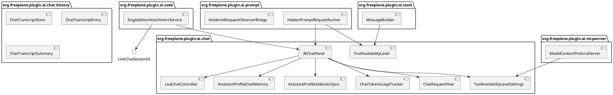
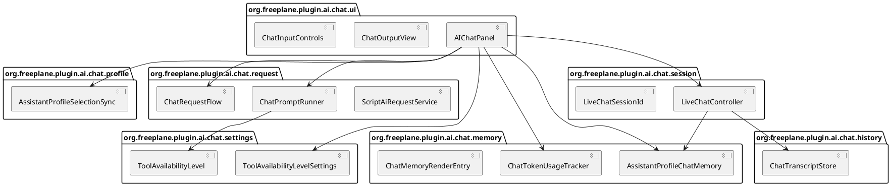

# Task: Split AI chat package into cohesive internal packages
- **Task Identifier:** 2026-06-05-chat-package-split
- **Scope:**
  Split the catch-all `org.freeplane.plugin.ai.chat` package into
  cohesive subpackages inside `freeplane_plugin_ai`, move the hidden
  request-runtime helpers that currently live in
  `org.freeplane.plugin.ai.prompt` into the same chat package tree,
  reduce visibility to package-private wherever cross-package use does
  not require wider access, and update tests to match the new package
  boundaries without changing chat behavior.
- **Motivation:**
  The AI chat subsystem is currently concentrated in one root package.
  That forces unrelated concerns to share the same visibility domain,
  leaves many top-level types public only because they need same-package
  access today, and makes package ownership harder to review and
  preserve.
- **Scenario:**
  A user opens the AI chat panel, sends visible chat requests, runs
  shown and hidden saved prompts, restores prior chat sessions,
  switches assistant profiles, changes model and tool overrides, and
  uses AI-backed code attachment. All user-visible behavior stays the
  same; only package ownership and type visibility change.
- **Constraints:**
  - This is a refactor. Do not intentionally change user-visible
    behavior, transcript persistence behavior, prompt execution
    behavior, assistant-profile behavior, or code-attachment behavior.
  - Do not keep compatibility shims or duplicate old/new package paths.
    Move to one final package layout.
  - Keep `freeplane_plugin_ai` bundle exports unchanged. The plugin does
    not currently export chat packages, so the refactor should not add
    exports.
  - Prefer moving tests with their production packages over widening
    production visibility only for test access.
  - Default moved types to package-private. Keep a type public only when
    another package must construct it, extend it, or exchange it as a
    shared value.
  - If a type must stay visible only for testing, that is allowed, but
    first prefer moving the affected tests. A plugin-local
    `VisibleForTesting` annotation may be added if implementation shows
    that such cases need explicit marking.
  - Do not introduce broad façade layers solely to hide a few more
    types unless implementation shows that a small façade is lower risk
    than keeping the directly used type public.
- **Briefing:**
  The work is confined to `freeplane_plugin_ai`. The current chat root
  package contains UI assembly, assistant-profile state, request
  orchestration, session persistence, token accounting, and message/
  memory types. A small set of neighboring packages already imports chat
  types: `org.freeplane.plugin.ai`, `...code`, `...mcpserver`,
  `...prompt`, and `...tools`. The build keeps `bundleExports` empty for
  this plugin, so the refactor is an internal package-ownership change,
  not a published OSGi API migration.
- **Research:**
  - `freeplane_plugin_ai/src/main/java/org/freeplane/plugin/ai/chat/`
    currently contains 81 top-level production types in the root
    package, plus 9 transcript/store types already separated into
    `org.freeplane.plugin.ai.chat.history`.
  - 38 top-level types under the current chat package tree are `public`.
    29 of those `public` types are still in the root catch-all package.
  - Verified out-of-package imports outside the current chat root are
    limited to a small boundary set:
    - `AIChatPanel` from `org.freeplane.plugin.ai`, `...code`, and
      `...prompt`;
    - `ScriptAiRequestService` from `org.freeplane.plugin.ai`;
    - `LiveChatSessionId` from `...code`;
    - `ToolAvailabilityLevel` and `ToolAvailabilityLevelSettings` from
      `...code`, `...mcpserver`, `...prompt`, and `...tools`;
    - `AIChatService`, `ChatRequestCancellation`,
      `AiRequestHandleImpl`, and `AiRequestStatusMapper` from hidden
      prompt/request helpers.
  - The hidden request-runtime helpers are currently misplaced in
    `org.freeplane.plugin.ai.prompt` even though chat classes import and
    instantiate them directly:
    - `HiddenAiRequestObserverBridge`
    - `HiddenAiRequestObserverFactory`
    - `HiddenPromptRequestRunner`
    - `HiddenPromptRequestRunnerFactory`
  - `freeplane_plugin_ai/build.gradle` does not override
    `bundleExports`, so chat package renames do not need to preserve an
    exported package contract.
  - 43 tests currently live under
    `freeplane_plugin_ai/src/test/java/org/freeplane/plugin/ai/chat`.
    The hidden request-runtime tests live under
    `.../src/test/java/org/freeplane/plugin/ai/prompt`. Keeping moved
    production types package-private therefore requires matching test
    package moves.
  - The current cohesion clusters are strong enough to justify package
    boundaries around UI assembly, request runtime, live sessions,
    memory/message modeling, assistant profiles, and shared tool-
    availability settings.

- **Analysis:**
  - Remove the root catch-all package instead of keeping it as a thin
    façade because the requested refactor is to split
    `org.freeplane.plugin.ai.chat`, not to preserve it as the default
    home for unrelated types.
  - Move the four `Hidden*` request-runtime helpers out of
    `org.freeplane.plugin.ai.prompt` because they belong to chat request
    execution, not saved-prompt storage or prompt-menu behavior.
  - Reduce visibility by co-locating cohesive collaborators first and
    only then deciding which cross-package boundary types must stay
    public, because widening visibility before the moves would preserve
    the current problem.
  - Move tests with their production packages because package-private
    verification is required and widening production access only for
    tests would directly conflict with the refactor goal.
- **Design:**
  1. Move every production type that is still in
     `org.freeplane.plugin.ai.chat` into one of these target packages,
     while keeping the existing `org.freeplane.plugin.ai.chat.history`
     package for transcript/store types:
     - `org.freeplane.plugin.ai.chat.ui`
     - `org.freeplane.plugin.ai.chat.profile`
     - `org.freeplane.plugin.ai.chat.request`
     - `org.freeplane.plugin.ai.chat.session`
     - `org.freeplane.plugin.ai.chat.memory`
     - `org.freeplane.plugin.ai.chat.settings`
  2. Use this package inventory:
     - `chat.ui`
       - `AIChatPanel`
       - `AIChatMessageStyleSettings`
       - `ChatDisplaySettings`
       - `ChatHistoryHyperlinkHandler`
       - `ChatInputControls`
       - `ChatMarkdownCopyAction`
       - `ChatMemoryHistoryRenderer`
       - `ChatMessageHistory`
       - `ChatMessageRenderer`
       - `ChatMessageStyleApplier`
       - `ChatMessageTransferHandler`
       - `ChatModelSelector`
       - `ChatOutputView`
       - `ToolAvailabilityLevelMenu`
     - `chat.profile`
       - `AssistantProfile`
       - `AssistantProfileManagerDialog`
       - `AssistantProfilePaneBuilder`
       - `AssistantProfileSelectionModel`
       - `AssistantProfileSelectionSync`
       - `AssistantProfileStore`
     - `chat.request`
       - `AIChatService`
       - `AIChatServiceFactory`
       - `AddToChatDispatchJob`
       - `AddToChatDispatchJobFactory`
       - `AiRequestConfigurationResolver`
       - `AiRequestExecutionCoordinator`
       - `AiRequestHandleImpl`
       - `AiRequestMappings`
       - `AiRequestStatusMapper`
       - `AiRequestTimeoutController`
       - `AiRequestTimeoutControllerFactory`
       - `AiSelectionOverrideResolver`
       - `ChatPromptRunner`
       - `ChatPromptRunnerFactory`
       - `ChatRequestCancellation`
       - `ChatRequestFlow`
       - `ChatRequestFlowFactory`
       - `HiddenAiRequestObserverBridge`
       - `HiddenAiRequestObserverFactory`
       - `HiddenPromptRequestRunner`
       - `HiddenPromptRequestRunnerFactory`
       - `PromptToolSelectionResolver`
       - `ResolvedAiRequest`
       - `ScriptAiRequestService`
       - `VisibleAiRequestCallbacksBridge`
       - `VisibleAiRequestCallbacksFactory`
     - `chat.session`
       - `ChatListDialog`
       - `ChatListItem`
       - `ChatListItemStatus`
       - `LiveChatController`
       - `LiveChatSession`
       - `LiveChatSessionId`
       - `LiveChatSessionManager`
       - `LiveChatSessionSummary`
       - `LiveTranscriptAdapter`
       - `MapRootShortTextCountsMerger`
       - `MapRootShortTextFormatter`
       - `TranscriptMemoryMapper`
     - `chat.memory`
       - `ActiveTurnRange`
       - `AssistantProfileChatMemory`
       - `AssistantProfileInstructionMessage`
       - `AssistantProfileSwitchMessage`
       - `AutomaticCodeStatusMessage`
       - `ChatMemoryProjectionBuilder`
       - `ChatMemoryRenderEntry`
       - `ChatMemorySettings`
       - `ChatMemoryViewState`
       - `ChatTokenCounterMode`
       - `ChatTokenCounterSettings`
       - `ChatTokenUsageState`
       - `ChatTokenUsageTracker`
       - `ChatTurnTracker`
       - `ChatUsageTotals`
       - `GeneralSystemMessage`
       - `HistoricalToolCycle`
       - `InstructionAckMessage`
       - `RemovedForSpaceSystemMessage`
       - `SingleTurnChatMemory`
       - `SingleTurnChatMemoryFactory`
       - `ToolCallSummaryMessage`
       - `TranscriptHiddenSystemMessage`
       - `VisibleContextSelection`
       - `VisibleContextSelector`
     - `chat.settings`
       - `ToolAvailabilityLevel`
       - `ToolAvailabilityLevelSettings`
  3. Keep transcript persistence types in
     `org.freeplane.plugin.ai.chat.history` for this increment:
     - `AssistantProfileTranscriptEntry`
     - `ChatTranscriptEntry`
     - `ChatTranscriptId`
     - `ChatTranscriptRecord`
     - `ChatTranscriptRole`
     - `ChatTranscriptStatus`
     - `ChatTranscriptStore`
     - `ChatTranscriptSummary`
     - `MapRootShortTextCount`
  4. After the moves, narrow visibility package by package:
     - start from package-private for every moved type;
     - keep `public` only for cross-package construction,
       inheritance, or shared-value exchange;
     - prefer package-private constructors and methods when only the
       type itself must remain public.
  5. Keep the cross-package public boundary small and evidence-driven.
     At minimum it will still need to cover the neighboring imports that
     remain outside the chat package tree, especially:
     - `chat.ui.AIChatPanel`
     - `chat.request.ScriptAiRequestService`
     - `chat.session.LiveChatSessionId`
     - `chat.settings.ToolAvailabilityLevel`
     - `chat.settings.ToolAvailabilityLevelSettings`
     Additional `public` types are allowed only where direct
     implementation constraints show that a narrower boundary would add
     more risk than value.
  6. Update imports in neighboring packages to the new package names and
     keep behavioral contracts unchanged:
     - `org.freeplane.plugin.ai.Activator`
     - `org.freeplane.plugin.ai.code.*`
     - `org.freeplane.plugin.ai.mcpserver.*`
     - `org.freeplane.plugin.ai.prompt.*`
     - `org.freeplane.plugin.ai.tools.*`
  7. Move tests into matching target packages so package-private access
     remains available without widening production visibility. When a
     production type still needs wider visibility only for tests, that
     is acceptable after test relocation is considered first, and such
     cases may be marked with a plugin-local `VisibleForTesting`
     annotation if that improves review clarity. Preserve current test
     intent and only change test logic when package moves expose
     missing coverage.
  8. Execute the refactor in low-risk order:
     - move the request-runtime `Hidden*` prompt helpers first;
     - move shared settings and value types next;
     - move session, memory, profile, and UI clusters;
     - then tighten visibilities and fix any test/package fallout.

- **Test specification:**
  - Automated tests:
    - run
      `gradle -Djava.net.preferIPv6Addresses=true -Djava.awt.headless=true :freeplane_plugin_ai:test`
      during implementation as the minimum regression suite;
    - run
      `gradle -Djava.net.preferIPv6Addresses=true -Djava.awt.headless=true :freeplane_plugin_ai:check`
      before presenting the refactor for review so the module tests and
      plugin-specific verification tasks both pass;
    - keep or extend focused tests for moved request, session, profile,
      memory, and UI types when package moves expose missing behavioral
      coverage.
  - Manual tests: N/A. This increment is an internal package/visibility
    refactor, and the module already has focused automated coverage for
    chat panel wiring, request runtime behavior, transcript/session
    behavior, prompt flows, and code-attachment integration.
- **Implementation notes:**
  - **Interpretations:**
    - Treated "keep most types package private" as a package-by-package
      default, then widened only the classes, members, and constructors
      required by cross-package production wiring or by the remaining
      cross-package tests.
  - **Tradeoffs:**
    - Moved the majority of chat tests into the matching target
      packages, but kept a few cross-package session and request types
      visible because `AIChatPanel` tests still need to traverse those
      package boundaries directly.
    - The approved six-package split still leaves a large required
      public surface. After the refactor, 37 top-level chat-package
      types are package-private and 57 remain public because production
      code crosses those package boundaries.
