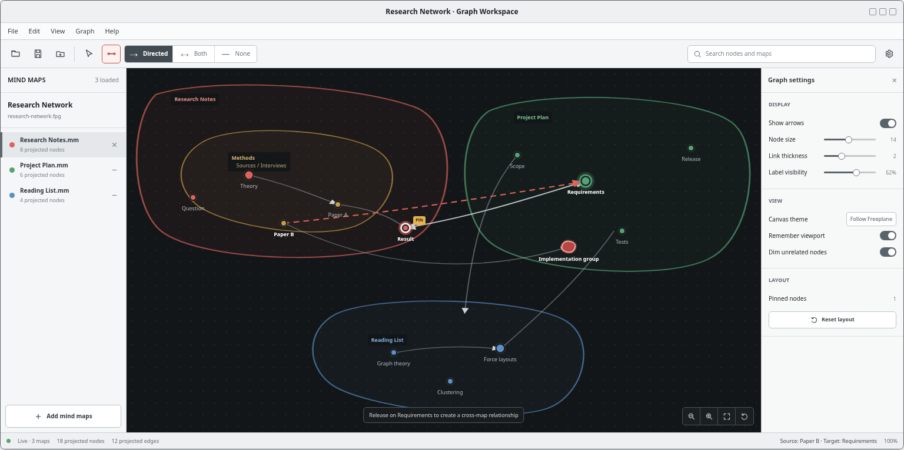
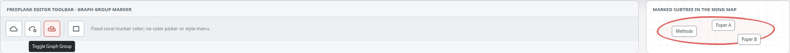

# Graph Workspace Design

- Date: 2026-08-10
- Task: Feature 1
- Status: Design approved in conversation; written specification awaiting review
- Amendments: `2026-08-13-graph-node-prominence-design.md` sizes projected graph nodes by their distinct visible outgoing reach

## Summary

Freeplane will gain a bundled Graph Workspace feature for viewing selected mind maps as one interactive graph in a separate desktop window.

Each workspace is saved as a versioned `.fpg` file. It references existing `.mm` files without merging or copying them. Structural leaves and explicitly marked Graph Groups become graph vertices. Ordinary non-leaf ancestors become labeled dynamic enclosures around their projected descendants. Native connectors supply relationships within one map, while the Graph Workspace owns relationships whose endpoints belong to different maps.

The feature is implemented in a new `freeplane_plugin_graph` module. A pure projection module hides graph semantics behind an immutable `GraphProjection`. GraphStream 1.3 supplies Barnes-Hut force physics through a narrow adapter, while a Freeplane-owned Swing canvas renders and interacts with the graph.

## Goals

1. Open a Graph Workspace in a separate, modeless top-level window.
2. Add and remove existing `.mm` files with a file chooser.
3. Keep source-map hierarchy and content intact.
4. Show structural leaves and active Graph Groups as graph vertices, excluding nodes the user has persistently hidden.
5. Show ungrouped ancestors as labeled dynamic enclosures, with map identity visually emphasized above internal depth.
6. Project native same-map connectors and workspace-owned cross-map relationships into one edge model.
7. Create relationships directly by dragging between visible endpoints.
8. Preserve native Freeplane undo and save behavior for source-map edits.
9. Update the graph live while source maps change.
10. Keep pan, zoom, search, selection, pinning, and layout responsive at 2,000 projected nodes and 5,000 projected edges. This is a fixed engineering commitment, not a user-selectable option.
11. Leave a versioned metadata path for later AI-generated relationships without implementing AI in Feature 1.

## Non-Goals

Feature 1 does not include:

- AI-generated relationships;
- graph-based node creation or text editing;
- local-depth graph mode;
- advanced query filters;
- user-adjustable force parameters;
- time-lapse animation;
- custom per-relationship colors, widths, or dash patterns;
- graph export;
- collaboration or concurrent editing of one workspace file.

## Domain Model

The canonical terminology is in [`CONTEXT.md`](../../../CONTEXT.md). The key ownership rule is:

- A **map connector** joins nodes in one mind map and is owned by that `.mm` file.
- A **Graph Relationship** joins nodes in different mind maps and is owned by the `.fpg` Graph Workspace.

Both become contributors to a derived **projected edge**. The projection is never an additional source of truth.

## User Experience

### Entry Points

- `View -> Open Graph Workspace` opens an existing `.fpg` file or creates a new workspace.
- Opening an already-open workspace focuses its existing window.
- Distinct workspace files may have distinct windows.
- The Graph Group action appears in the main mind-map toolbar beside the existing cloud controls.

### Graph Workspace Window

The window contains:

1. A standard menu bar.
2. A compact toolbar for workspace open/save, adding maps, selection mode, connection mode, relationship direction, search, and settings.
3. A left map list with stable map colors, projected-node counts, Add, Remove, Retry, and Locate actions.
4. A full-bleed graph canvas with emphatic map enclosures and subtle internal enclosures.
5. A compact right settings drawer.
6. A status bar for map state, projected counts, selected endpoints, layout state, unresolved counts, save errors, and unsaved source-map changes.

The canvas follows the active Freeplane Look and Feel. The approved mockup uses light application chrome and a dark canvas, with theme adaptation in the implementation.



### Main Editor Graph Group Control

The Graph Group button is visually related to the existing cloud button but uses a separate action and model. Its color is a fixed coral accent and has no color picker or style menu.

The marker is rendered as a cloud-like outer outline around the marked node and descendants. If the node also has an ordinary Freeplane cloud, the Graph Group outline is painted outside it with a fixed gap so both states remain legible.

#### Marker Rendering

The marker has one fixed appearance and its own geometry, so it can never be mistaken for cloud formatting:

- **Extent.** The outline encloses the marked node together with its entire subtree, because that subtree is exactly what collapses to a single graph vertex. It does not enclose only the marked node.
- **Fixed style.** A coral stroke with a faint fill, identical for every marker. There is no color picker, shape menu, or per-node style.
- **Shape independence.** The marker looks the same regardless of which cloud shape the node uses, and regardless of the cloud's color. Only the inner cloud varies.
- **Coexistence.** With an ordinary cloud present, the marker is offset outside the cloud by a fixed gap. Neither outline restyles the other.
- **Inactive markers stay visible.** A nested marker beneath an active ancestor marker is drawn muted and dashed. It is persisted but not collapsing anything, and hiding it would make the user believe the marker was lost.
- **Leaf markers.** Drawn in the same style around the single node. They cover no subtree until children are added.

The marker never changes node geometry, text layout, or edge routing in the map view.

The action follows Freeplane's multiple-node toggle convention. It applies the primary selected node's inverse marker state to all selected nodes. Marking a structural leaf is allowed but does not change its current vertex count or covered subtree; Graph Group styling still identifies the marker, and the marker becomes meaningful if children are later added.

Because the marker lives in shared clone data, toggling it on any node also toggles it on every clone of that node, including clones that were not selected. The action's tooltip states this, and the status bar reports how many clone positions were affected.



### Canvas Interaction

- Single-click selects a graph node or enclosure endpoint.
- Hover highlights the endpoint and its incident projected edges while dimming unrelated content.
- Double-click or Enter opens the source map and selects the represented leaf, Graph Group root, or ancestor node.
- Right-click opens endpoint or edge actions.
- Dragging an unpinned graph node moves and pins it in the current workspace.
- Unpin and Unpin All return nodes to force layout.
- Dragging empty canvas space pans.
- Mouse wheel, trackpad zoom, `+`, and `-` zoom around the pointer or viewport center.
- Arrow keys pan; Shift accelerates panning.
- Zoom In, Zoom Out, Fit Graph, and Reset Zoom are available as icon controls.
- The workspace restores its last viewport. An invalid restored viewport falls back to Fit Graph.
- Search dims nonmatching nodes instead of removing them, preserving spatial context.
- Labels use level of detail: selected, hovered, and matched labels remain visible; other labels fade as density increases.
- Tab and arrow-key traversal move selection between projected nodes and enclosure endpoints, so the graph is operable without a pointer.
- Every projected node carries an accessible name combining its label and owning map name, so map identity is never conveyed by color alone.

### Undo Routing

The graph window has two distinct histories, and the difference is visible because workspace commands auto-save while map commands do not.

- `Ctrl+Z` and `Ctrl+Y` in the graph window always target the **workspace** history.
- Map undo is never bound to the same keys in this window; it stays with the map's own editor view.
- The Edit menu lists both explicitly, as `Undo Workspace Change` and `Undo In Source Map`, with the affected map named.
- Each menu item is disabled when its history is empty, so the two are never confused.

### Relationship Creation

The toolbar provides persistent relationship modes:

- Directed;
- Bidirectional;
- Undirected.

The user activates the relationship tool and drags from a source projected endpoint to a target projected endpoint. Directed mode follows drag order, source to target. A preview line shows the pending direction.

Visible endpoints include projected graph nodes and ancestor enclosure boundaries. Enclosure hit testing resolves to the exact represented ancestor node, including a specific label in a combined unary chain.

On release:

- same-map endpoints create one native Freeplane connector;
- cross-map endpoints create one Graph Relationship;
- a self-relationship or already-covered direction is a no-op;
- a validation failure creates nothing.

A requested direction is already covered when existing contributors on the same exact source-node pair already supply that semantic relationship. For example, an existing bidirectional contributor covers a later directed request, and opposite directed contributors together cover a later bidirectional request. A directed contributor does not cover an undirected request.

When a new contributor is created but the projected edge does not change appearance, the gesture would look like it failed. Two rules prevent that:

- a projected edge carries a multiplicity cue when it has more than one contributor, so a genuine addition is visible;
- a no-op request reports why nothing was created instead of failing silently.

### Edge Inspection And Deletion

A projected edge retains all contributing map connectors and Graph Relationships.

- One contributor: Delete removes that contributor from its owner.
- Multiple contributors: Delete opens the contributor inspector.
- The inspector supports deleting one contributor or explicitly deleting all.
- Existing connector labels are visible in contributor details but are not painted on the graph by default.
- Hiding or filtering a projected edge never deletes a contributor.

## Architecture

### Plugin Module

The feature lives in a bundled `freeplane_plugin_graph` Gradle/OSGi module. It registers a MindMap mode extension, actions, persistence handlers, listeners, translations, icons, and preferences through existing Freeplane extension points.

The plugin does not introduce a new Freeplane mode and does not extend `MapView`.

### External Interface

The module exposes one opening interface and one per-workspace handle to its window and tests:

```java
interface GraphWorkspaceController {
    GraphWorkspaceHandle open(Path workspaceFile);
}

interface GraphWorkspaceHandle extends AutoCloseable {
    GraphProjection currentProjection();
    CommandResult execute(GraphCommand command);
    ListenerRegistration addProjectionListener(GraphProjectionListener listener);
    void close();
}
```

The exact Java names may change during planning, but the interface must retain these properties:

- callers submit intent rather than mutating stores directly;
- callers receive immutable projections and ordered updates;
- Freeplane model types do not cross into the projection, layout, or canvas modules;
- GraphStream types do not cross the layout adapter.

### Internal Modules

#### Graph Workspace Store

Owns parsed `.fpg` state, workspace commands, workspace undo/redo, atomic auto-save, schema migration, map registrations, cross-map Graph Relationships, viewport, pins, display settings, and future metadata.

#### Map Lease And Adapter

Reuses an already-loaded `MapModel` or background-loads a map without creating an editor view. It owns listener registration and immutable map snapshots.

Each open workspace holds a lease on its active map models. Releasing a workspace removes its listeners and strong references but never closes an editor view. A map that was loaded only for graph use then becomes eligible for normal Freeplane cleanup.

#### Graph Group Controller

Persists the map-owned Graph Group marker, implements the toolbar action through normal map actors, supplies extension copy/clone behavior, and publishes node-change events.

#### Projection Engine

Pure deterministic computation from immutable map snapshots plus workspace state to an immutable `GraphProjection`.

#### Layout Adapter

Converts projection changes into GraphStream physics elements and returns stable positions. It is the only module that knows GraphStream.

#### Swing Graph Canvas

Paints enclosures, edges, arrowheads, graph nodes, labels, selection, previews, and controls. It performs canvas geometry, hit testing, and input translation but does not derive graph semantics.

## Persistence

### Graph Workspace File

The `.fpg` format is versioned XML parsed with structured XML APIs, not string manipulation.

Conceptual structure:

```xml
<graph_workspace format_version="1" id="...">
  <maps>
    <map_ref id="..." path="maps/research.mm" active="true" color="..." />
  </maps>
  <relationships>
    <relationship id="..." sequence="1" direction="FORWARD">
      <endpoint map_ref="..." node_id="ID_123" />
      <endpoint map_ref="..." node_id="ID_456" />
      <metadata schema="future.ai.v1">...</metadata>
    </relationship>
  </relationships>
  <pins>
    <pin map_ref="..." node_id="ID_123" x="..." y="..." />
  </pins>
  <viewport x="..." y="..." zoom="..." />
  <display ... />
</graph_workspace>
```

This is illustrative, not a frozen XML schema.

### Map References

Each added map receives a workspace-owned UUID. Node identity is `(map reference UUID, Freeplane node ID)`.

- Store a workspace-relative URI when possible and an absolute file URI otherwise.
- Re-adding the same known path reactivates the existing registration.
- Adding a copied map creates a new registration.
- A missing or moved file remains unresolved until the user explicitly selects Locate.
- Locate rejects a file already bound to another registration in the same workspace.
- No fingerprint or content heuristic silently rebinds a map reference.
- Removing a map sets its registration inactive rather than deleting it while Graph Relationships still refer to it.

Normal Freeplane file saves write an ID for every node. The adapter must nevertheless handle a legacy or hand-edited map containing a node without a persisted ID. It must not call `createID()` merely to satisfy workspace identity. Persistent cross-map relationship and pin commands for that node fail atomically and ask the user to open and save the map once; after that save, the node's normal file ID is used.

### Graph Relationships

Graph Relationships store exact map/node endpoints, direction, creation sequence, and versioned metadata. Their status is derived rather than authoritative, and unresolved endpoints are separated by whether recovery is still possible:

- `ACTIVE` when both maps are active and both endpoints resolve;
- `UNRESOLVED_RECOVERABLE` when an endpoint cannot resolve for a reversible reason: the map registration is inactive, the file is missing or unreadable, the map is still loading, or the endpoint lies inside a locked encrypted branch;
- `UNRESOLVED_MISSING_NODE` when the map is active and readable but the endpoint node no longer exists in it;
- omitted from the canvas while unresolved, in either state;
- automatically `ACTIVE` again when both original endpoints resolve;
- deleted only by explicit relationship deletion or by purge.

The distinction exists to protect data. A locked encrypted branch and a moved file both make endpoints temporarily unresolvable, and neither means the user's relationship was wrong.

A relationship is never promoted to `UNRESOLVED_MISSING_NODE` while any part of its endpoint's map is inaccessible. Ambiguity always resolves toward `UNRESOLVED_RECOVERABLE`.

Unknown metadata schemas are preserved across read/write. A newer unsupported workspace schema opens read-only only when known fields can be interpreted without loss; otherwise loading fails without rewriting the file.

### Purge

Purge removes only `UNRESOLVED_MISSING_NODE` relationships. It never touches `UNRESOLVED_RECOVERABLE` ones.

- Purge is presented as a confirmation that lists every relationship to be deleted, with both endpoint descriptions.
- Purge is a workspace command on the normal undo history, so it can be reverted.
- Purge is disabled when no relationship is in `UNRESOLVED_MISSING_NODE`.
- The status bar reports recoverable and missing-node counts separately so a locked branch never looks like permanent loss.

### Graph Group Marker

The Graph Group marker is a map-owned node extension serialized as its own extension element, not as a `CloudModel` and not in the `.fpg` file. Persistence handlers are registered with the map read/write managers. Copy, clone, undo, redo, and clipboard behavior are covered by the same extension conventions used by existing node features.

The marker element carries its own version attribute, independent of the map's `version` and of the workspace `format_version`. This lets the marker format evolve without touching map-level data. An unrecognized marker version is preserved untouched and treated as an inactive marker rather than being rewritten or dropped.

#### Upstream Compatibility

A mind map written by a Freeplane build containing this plugin must remain fully readable by a build without it. Freeplane already guarantees this if persistence stays additive: `NodeBuilder` and `MapReader` capture unrecognized attributes and elements as `UnknownElements`, and `UnknownElementWriter` is registered for both attributes and elements, so unknown content round-trips verbatim.

This feature must therefore obey an additive-only rule:

- introduce new elements and attributes only;
- never change the meaning of an existing element or attribute;
- never make the absence of our marker significant to map interpretation;
- never require our reader to be present for the rest of the map to load.

The resulting behavior in a build without the plugin: the map opens normally, the marker survives as unknown content, the node draws without a marker outline, and saving preserves the marker. Editing a marked map in stock Freeplane and reopening it here restores the marker.

Because unknown content round-trips faithfully, no map-level provenance stamp or fingerprint is written. Such a stamp would record only which build last wrote a stamp, not which build last modified the map, so it cannot support the safety claim it appears to make. Map identity remains workspace-owned UUIDs with explicit Locate.

Marker writes are ordinary map modifications and are protected by Freeplane's existing rotating backups in the `.backup` directory, governed by the `backup_file_number` preference. This feature adds no separate backup mechanism.

#### Clone Semantics

Freeplane clones share one `SharedNodeData`, and node extensions are stored there. The Graph Group marker is therefore **a property of shared content, not of one clone position**. Marking any clone marks every clone of that node, and unmarking any clone unmarks all of them.

This is deliberate and matches how clouds and node styles already behave, so the marker stays consistent with the rest of Freeplane rather than inventing a second notion of node identity.

The user-visible consequences must be surfaced rather than left implicit:

- each clone remains a distinct projected graph node with its own node ID, so one marker collapses several subtrees at once;
- collapsing removes each clone subtree's leaves as vertices, and their pins become dormant under the normal dormant-pin rule;
- cloning an already-marked subtree produces another marked, collapsed group;
- the action's tooltip and status text state that the marker applies to all clones;
- an acceptance test pins this behavior so it cannot silently change.

Relationship endpoints are unaffected by this sharing, because they are stored per node ID. Two clones of one marked group are two separate endpoints.

## Projection Semantics

### Structural Traversal

For each active, resolved map, traverse from the map root:

1. If the current node is a marked Graph Group with no marked ancestor, emit one projected graph node for the group root and stop traversing its descendants.
2. If the current node is a structural leaf, emit one projected graph node.
3. Otherwise emit an ancestor enclosure and continue through its children.

Nested Graph Group markers remain persisted but inactive beneath an active outer marker. Removing the outer marker reactivates the next marked descendants without changing those markers.

The map root is the outermost ancestor enclosure unless it is an active Graph Group.

#### Node Kinds Excluded From Projection

Traversal skips these nodes and their subtrees, because including them would contradict persisted user intent or duplicate content:

- **Hidden nodes.** `NodeVisibility.HIDDEN` is a persisted node property, not transient view filtering. A hidden node and its descendants are omitted. This is a deliberate exception to the rule that view state never affects projection: hiding is saved intent, whereas folding and filtering are not. When the map's `SHOW_HIDDEN_NODES` configuration is active, hidden nodes are projected normally.
- **Hidden summary nodes.** A summary node that Freeplane itself treats as hidden is omitted.

These nodes are included:

- **Visible summary nodes.** Projected as ordinary nodes or enclosures by the normal rules. Their summarized children are also projected; a summary is additional structure, not a replacement for it.
- **Free nodes.** Projected by the normal rules. Their free placement in the map view has no meaning in a force layout.

An endpoint whose node is excluded from projection is `UNRESOLVED_RECOVERABLE`, because unhiding restores it.

#### Node Labels

Labels use Freeplane's own plain-text conversion so graph text matches what the editor shows:

- HTML node text is converted with the same plain-text conversion Freeplane uses for node text;
- LaTeX and other formula content uses its rendered or source text, never raw markup;
- a node with no text falls back to a kind marker such as its icon or attachment description, never an empty label;
- labels are truncated to a fixed length for layout, with the full text available on hover;
- newlines are collapsed to single spaces.

### Unary Ancestor Chains

A maximal consecutive chain of ancestor enclosures in which each ancestor has one projected child becomes one visible enclosure. The enclosure contains every ancestor label in hierarchy order. Branching ancestors retain separate nested enclosures.

Each ancestor in a combined chain remains an independently addressable relationship endpoint even though several endpoints share one visible boundary.

### Endpoint Projection

An endpoint resolves only if its node is **reachable from the map root through the same traversal that produces the projection**. A flat `getNodeForID` lookup is not sufficient and must not be used for resolution.

This is a confidentiality requirement, not an optimization. `EncryptionModel` detaches a locked node's children by replacing its child list with an empty list, but those children are never unregistered from the map's ID index. After a branch has been decrypted once in a session and re-locked, `getNodeForID` still returns live nodes whose text is readable. Resolving by ID would therefore let the graph project and label content the user has explicitly re-locked.

Consequences:

- a locked encrypted node presents as a structural leaf, because that is what the model exposes;
- endpoints beneath it are `UNRESOLVED_RECOVERABLE`, never `UNRESOLVED_MISSING_NODE`;
- unlocking the branch restores those endpoints without user intervention;
- no label, tooltip, search match, or contributor detail may expose text from an unreachable node.

For a reachable exact source node endpoint:

1. If it is inside an active Graph Group, project to the outermost active group root.
2. Otherwise, if it is a structural leaf, project to that graph node.
3. Otherwise project to its ancestor enclosure boundary.

A relationship created against an active Graph Group stores the group-root node ID. If the marker is removed, the same relationship attaches to that root's ancestor enclosure. It is never redistributed to descendants.

### Edge Projection

Map connectors and active Graph Relationships become contributors.

1. Resolve both exact endpoints.
2. Project each endpoint.
3. Omit contributors whose endpoints resolve to the same projected endpoint.
4. Canonically order the remaining endpoint pair.
5. Consolidate contributors with the same unordered projected pair into one projected edge.
6. Add an arrowhead at each end if any contributor points toward that end.
7. Retain every contributor for inspection and deletion routing.

Consequences:

- repeated `A -> B` contributors paint one arrow;
- `A -> B` plus `B -> A` paints one line with two arrowheads;
- nondirectional contributors alone paint no arrowheads;
- nondirectional and directed contributors share one line while directed contributors determine visible arrowheads;
- connections internal to one active Graph Group or one collapsed endpoint disappear without modifying their stores.

Existing duplicate native connectors remain untouched in their map.

### Determinism

Projection ordering never depends on `HashMap` iteration. Maps use workspace sequence, map nodes use structural traversal order, relationships use persisted sequence, and edge pairs use canonical endpoint order.

The same workspace and map snapshots produce the same projection keys and deterministic initial positions.

## Layout And Geometry

### Physics

The layout graph contains:

- visible particles for projected graph nodes;
- invisible hierarchy anchors for enclosures;
- relationship springs for projected edges;
- weaker invisible containment springs from each visible projected node to its nearest structural ancestor enclosure anchor;
- anchor-to-anchor springs for nested hierarchy;
- a radius-scaled map separation correction derived from map-root anchors.

Invisible hierarchy elements keep related map regions together even when they have no visible connector.

Spatial constraint strength is deliberately unequal by tier:

- **Map level is hard.** Map-root anchors determine a correction scaled by their current hull radii. For a map with no pinned projected node, the correction is applied as a uniform translation to all its particles, preserving internal geometry while added maps move into distinct canvas regions. Moving only the root anchor was rejected by the dependency spike because soft containment did not propagate the correction strongly enough. Aggregate cross-map relationship displacement is capped per particle below containment attraction; the measured workload kept map regions distinct, while concentrated cross-map clusters remain an explicit implementation stress test.
- **Internal level is soft.** Containment springs inside one map are weak. Descendant enclosures may overlap their siblings, because two-tier styling still communicates hierarchy when geometry is imperfect.

This asymmetry is intentional. The readability problem worth solving with physics is *which map does this node belong to*; internal structure is communicated by styling and labels instead of by strict geometry.

Map-root separation is a best-effort constraint, not a guarantee. A map containing any pinned projected node is immovable by the map-tier correction; the correction never translates only part of a pinned map. If one map in an overlapping pair is immovable, the movable map takes the full correction. If both are immovable or the post-correction hulls still overlap, layout honors the pins, reports the condition in the status bar, and offers Unpin for the nodes involved. This pin/correction interaction was not exercised by the dependency spike and is an implementation-phase acceptance test. A pinned node is never silently moved.

Pins freeze only visible projected graph nodes. A pin is keyed by exact map/node identity. If that node temporarily ceases to be a projected graph node, the pin remains dormant and reappears if the same node becomes projected again.

### Enclosures

After each stable position update, the canvas computes a padded closed hull around each enclosure's direct child node shapes and child enclosure hulls.

- Hulls use smooth closed curves derived from deterministic geometry.
- Hulls are drawn from layout output; geometry is fitted, not constrained after the fact.
- Parent hulls contain their child hulls whenever the soft internal springs allow it. Residual internal overlap is acceptable and is not an error.
- Interior labels reserve collision space.
- Hull extent grows with prominence-scaled child node shapes; padding is unchanged (see `2026-08-13-graph-node-prominence-design.md`).
- Relationship lines attach to the nearest valid point on an enclosure boundary.

#### Two Visual Tiers

Enclosures render in exactly two styles. No third tier is introduced at any depth. Which boundaries occupy the emphatic tier is decided by the tier rules below, not by absolute depth.

**Emphatic tier.** The topmost visible boundary of one added map:

- thick solid stroke in the assigned map color at high opacity;
- faint map-color fill;
- bold, larger label that is always visible and never suppressed by level of detail.

**Subtle tier.** Every boundary nested inside an emphatic one:

- thin, lower-opacity stroke in the same map color;
- minimal or no fill;
- normal-weight, smaller label subject to level-of-detail fading.

Tier rules:

1. With two or more added maps, each map's outermost boundary is emphatic and everything nested inside it is subtle.
2. With exactly one added map, the map-root boundary is suppressed entirely, its first-level children become emphatic, and everything nested inside those is subtle.
3. When a map root collapses into a combined unary chain, the resulting single boundary stays emphatic. Map ownership takes precedence over internal depth.
4. Depth below the emphatic tier never changes styling; every deeper level is identical to the first subtle level.
5. Adding or removing a map can therefore restyle an existing map's boundaries, because the emphatic tier is relative to how many maps are loaded.

Because map identity is carried by both stroke weight and color, an accessible palette is required but is not the only identity cue.

The committed window mockup predates this rule and does not yet differentiate stroke weights between tiers.

#### Label Placement

Label placement follows a deterministic ladder with a hard padding cap, so label demand can never inflate a hull without bound:

1. place the label in the largest interior gap;
2. otherwise reserve a band on the hull's least-populated arc;
3. otherwise anchor the label outside the boundary with a leader line;
4. otherwise show the label only on hover or selection.

Enclosure padding may grow only up to a fixed factor. Beyond that cap the label is demoted down this ladder rather than expanding the hull. Emphatic labels may use steps 1 through 3 but are never demoted to step 4.

### GraphStream Dependency Gate

The preferred layout implementation uses only GraphStream 1.3 `gs-core` physics and its small `pherd` and `mbox2` dependencies. The Scala-based `gs-ui` layer is not used.

Before the feature proceeds beyond the layout spike, maintainers must approve:

1. LGPLv3+/CeCILL-C dependency policy and distribution notices.
2. Java 8 and OSGi packaging.
3. Dynamic add/remove behavior.
4. Pinning.
5. Worker shutdown without leaked timers or threads.
6. Performance at 2,000 projected nodes and 5,000 projected edges.

The accepted target is stated in projected nodes and projected edges, which is what a user perceives. The simulated graph is larger, because it also contains enclosure anchors, containment springs, and map-tier correction. The spike must therefore measure the full pipeline at the accepted projected scale, including:

- derived particle and spring counts for the same workload;
- force-step and separate map-tier-correction costs;
- hull fitting and label-ladder cost per frame for the resulting enclosure count.

The gate passes only if the complete pipeline sustains the accepted interaction target. Otherwise the target is renegotiated before implementation continues.

GraphStream remains behind `LayoutEngine`; rejection of the dependency does not alter projection or canvas interfaces, but selecting a fallback may require revisiting the accepted performance guarantee.

#### Gate Result (2026-08-10)

The technical dependency gate and dependency-policy gate passed. The complete technical evidence, workload ledger, checksums, negative controls, and runtime measurements are in the [GraphStream gate report](2026-08-10-graphstream-gate-report.md).

- **Policy:** On 2026-08-10 the maintainer selected the LGPLv3 distribution option for the three unchanged GraphStream jars. The plugin distribution includes the canonical LGPLv3 text, GraphStream attribution, artifact checksums, and source links.

- **Packaging:** three unchanged jars (`gs-core` 1.3, `pherd` 1.0, and `mbox2` 1.0) in the plugin's existing `lib`/`Bundle-ClassPath` layout passed bnd verification and became ACTIVE in Freeplane's Knopflerfish 8.0.11 framework. No wrapper bundle, `gs-ui`, Scala, launcher change, or exported GraphStream package is needed.
- **Java:** the probes compile to Java 8 bytecode and passed on OpenJDK 11.0.32 and 21.0.12. The requested Zulu 21.0.8 installation was not present on the probe machine.
- **Mutation and pins:** 100 add/remove cycles returned all particle, spring, and neighbor-reference counts to baseline. Frozen nodes had zero measured drift across 500 steps and moved again after unfreezing.
- **Lifecycle:** GraphStream's `LayoutRunner` has a reproducible release race and is prohibited. A plugin-owned single-thread worker passed 25 start/stop cycles with no failures or surviving non-daemon threads.
- **Typed physics:** GraphStream's `layout.weight` changes preferred spring length, not stiffness. A minimal `SpringBox` subclass supplies weak containment and hierarchy attraction plus a hard aggregate per-particle cross-map displacement cap. GraphStream types remain private behind `LayoutEngine`.
- **Full workload:** 2,000 projected nodes, 5,000 projected edges, 1,200 enclosure anchors, 2,000 containment springs, and 1,180 hierarchy springs produce 3,200 particles and 8,180 springs. After 400 warm-up frames, 300 full frames were measured.
- **Thresholds and result:** force-step p95 must be at most 50 ms and complete worker-pipeline p95 at most 100 ms. Java 11 measured 19.312 ms and 31.362 ms; Java 21 measured 22.980 ms and 34.530 ms. Both had zero exact intersections among the 190 unpinned map-hull pairs after the map-tier correction.
- **Fixed quality:** production keeps SpringBox at its library default quality of 0.10. A recorded quality-1.0 control measured 134.80 ms per step on the smaller raw 2,000/approximately-5,000 graph and is outside the interaction budget.
- **Idle detection:** external map correction invalidates GraphStream's energy-based stabilization history. Layout pause/idle detection uses measured perceptual displacement instead of `getStabilization()`.

Production projection rebuild, stable-key diff, obsolete-generation discard, pin/map-correction interaction, concentrated cross-map clusters, EDT state swap, and Swing paint timing remain implementation-phase performance gates because those code paths do not exist yet.

## Threading And Live Updates

Freeplane map models are mutable and are read only on the EDT.

1. Map and node listeners capture plain immutable changes on the EDT.
2. Changes are coalesced for approximately 150 ms.
3. A complete pure projection is recomputed from immutable snapshots off the EDT.
4. The new projection is diffed by stable keys against the prior projection.
5. Layout elements are updated while retaining unaffected positions and pins.
6. Canvas state is swapped on the EDT.

The first implementation favors a complete O(N + E) projection rebuild after each coalesced batch because it is simpler and easier to prove correct at the accepted scale. Incremental projection is added only if the performance probe demonstrates a need.

Every projection/layout generation has a sequence number. A result for an obsolete snapshot is discarded.

Text-only changes repaint labels without resetting positions. Structural and relationship changes preserve every unaffected coordinate.

All GraphStream graph mutations and `compute()` calls are serialized on the plugin-owned layout worker. The worker publishes immutable canvas state and never calls Swing. `LayoutRunner` is never instantiated.

## Commands, Undo, And Saving

### Workspace-Owned Commands

Workspace commands include map activation/removal, cross-map relationship create/update/delete, purge, pin, and unpin. They use a workspace-local command history.

- Undo and redo auto-save the resulting workspace state.
- Purge is undoable like any other workspace command.
- Pan and zoom persist but are not undoable.
- Save forces an immediate write.
- Save As creates a distinct workspace identity and rewrites stored map URIs relative to the new location, so workspace-relative references keep resolving after the file moves.
- Automatic writes use a temporary file and atomic replacement after a short debounce.

### Map-Owned Commands

Graph Group changes and native same-map connectors use normal Freeplane map actors and map undo.

When a graph drag creates a same-map connector:

1. Resolve both exact nodes.
2. Open or focus a normal editor view for the map so it has normal edit/undo lifecycle.
3. Reject read-only maps.
4. Call `MLinkController` to create one connector and set its arrow mode.
5. Return focus to the graph window.
6. Leave the source map modified for normal Freeplane saving.

Step 2 is required, not incidental. `MMapModel` installs `IUndoHandler` in `beforeViewCreated`, and `addUndoableActor` silently skips maps without one. Editing a background-loaded map would therefore apply the change with no undo entry at all.

Because opening views has a visible cost, view materialization is batched per map per session:

- the first same-map command for a map materializes its view once;
- subsequent commands for that map reuse the existing view without re-focusing it;
- the user is told which maps were opened, so tabs never appear without explanation;
- no map edit is ever executed against a map lacking `IUndoHandler`; such a command fails loudly instead of silently discarding undo.

The accepted UX consequence: creating same-map relationships across several maps opens one editor tab per touched map.

The Graph Workspace never auto-saves a source map. Its status bar reports source maps made dirty by graph commands.

## Map Lifecycle

- Adding a map reuses an existing loaded model when its canonical URL matches.
- Otherwise the adapter background-loads the map without opening an editor tab.
- Opening that file later in the editor reuses the same model.
- Closing an editor view does not remove the map from an active workspace; the adapter reacquires or retains a background lease.
- Removing a map from the workspace releases its lease but never closes another editor view.
- Closing a workspace releases its listeners and background leases.

## Errors And Operational States

### Workspace Loading

Workspace loading is transactional. Malformed XML, an unsupported schema, or a failed migration never creates partial state and never rewrites the source file.

### Map States

An active registration is one of:

- Loading;
- Available;
- Missing;
- Unreadable;
- Password required;
- Reload required.

Missing, unreadable, and cancelled encrypted maps remain registered. Their Graph Relationships become unresolved. Map rows expose Retry, Locate, and Remove.

An open editor model is authoritative over disk, including unsaved changes. Background-loaded maps reload after external saves. Freeplane's existing conflict handling takes precedence whenever local changes exist.

### Save Failure

If workspace save fails:

- retain in-memory state and command history;
- retain the previous valid `.fpg` file;
- expose Retry Save;
- do not clear the dirty/error state.

### Layout Failure

If the layout worker fails:

- stop the failed worker;
- retain the last valid positions;
- give new nodes deterministic initial positions;
- keep navigation, inspection, editing, and saving available;
- expose Restart Layout.

### Adaptive Rendering

Rendering behavior adapts automatically based on actual projected node and edge counts. Users never choose a performance tier - the system detects graph size and adjusts.

**Engineering target:** 2,000 projected nodes and 5,000 projected edges. The spike proves this, tests enforce it, and it is the responsiveness guarantee. This target is fixed and non-negotiable for the gate.

**Rendering tiers activate automatically:**

- **Below 500 nodes:** full label visibility, smooth animation, no level-of-detail suppression.
- **500 to 2,000 nodes:** level-of-detail label fading based on density, standard hull computation.
- **Above 2,000 nodes:** aggressive label suppression (hover and selection only for most nodes), layout can be paused via a control, status bar shows projected counts and warns that the responsiveness guarantee does not apply.

Workspaces above the engineering target still open and remain editable. Navigation, inspection, relationship creation, and saving stay available. The degradation is in rendering fluidity and automatic layout settling, not in correctness or data integrity.

A future enhancement could add a user preference to bias thresholds toward detail or speed, but Feature 1 uses fixed automatic detection.

## Settings Included In Feature 1

Workspace-persisted settings:

- show arrowheads;
- canvas theme (`Follow Freeplane`, light, dark);
- remember viewport;
- dim unrelated nodes.

The feature provides Reset Layout and Unpin All. Force sliders, per-map color editing, and user-adjustable performance tier preferences are deferred.

Rendering tiers (label density, animation smoothness) activate automatically based on projected counts and are not user-configurable in Feature 1.

Map colors are assigned from a fixed, accessible multi-hue palette and remain stable within the workspace. Per-map color editing is deferred.

Color is never the only carrier of map identity. Emphatic stroke weight, enclosure labels, the map list, accessible names, and status-bar text all convey it as well.

## Testing Strategy

### Projection Tests

Table-driven JUnit tests cover:

- structural leaves independent of fold/filter/view state;
- exclusion of persisted hidden nodes and hidden summary nodes, and their restoration when unhidden;
- inclusion of visible summary nodes and free nodes;
- outermost Graph Group activation;
- nested marker restoration;
- group-root endpoint identity after ungrouping;
- ancestor enclosure endpoints;
- unary-chain combination and branching;
- internal-edge omission;
- endpoint-pair consolidation;
- the complete arrow-union truth table;
- deterministic ordering;
- dormant relationship lifecycle;
- reachability-based resolution, including that a node detached by a locked encrypted parent never resolves and never contributes a label;
- status classification, including that an inaccessible map yields `UNRESOLVED_RECOVERABLE` and never `UNRESOLVED_MISSING_NODE`;
- Graph Group marker sharing across clones, including collapse of every clone subtree from one marker.

Randomized event sequences verify projection invariance under input permutation: structural changes (insert, move, delete, fold), grouping (mark, unmark, ungroup-under-active-ancestor), map addition/removal, connectors, and relationships applied in differing orders to the same initial maps must produce equivalent projections when commutative. Non-commutative operations (A depends on B existing) are ordered correctly.

Equality between event-driven state and cold reload from the same files is verified: after a randomized sequence, the workspace is saved, closed, and reopened, and the resulting projection is compared against the live one.

### Persistence Tests

- `.fpg` round trips with active and unresolved relationships, inactive maps, viewport, pins, settings, and unknown metadata.
- Both unresolved states round-trip and are recomputed on load rather than trusted from the file.
- Purge deletes only `UNRESOLVED_MISSING_NODE` records, is undoable, and leaves recoverable records intact.
- Supported migrations.
- Newer-version read-only behavior.
- Atomic-save failure behavior.
- Relative and absolute path handling.
- Explicit Locate rebinding without heuristics.

### Freeplane Adapter Tests

Real `.mm` fixtures verify:

- background loading;
- already-open model reuse;
- rejection of persistent pins and cross-map relationships for a legacy node without a file ID, without mutating the source map;
- Graph Group save/load/copy/clone/undo/redo;
- Graph Group marking through one clone collapsing all clones, and unmarking restoring all of them;
- marker round trip through a reader without the plugin registered, proving the marker survives as unknown content and the map still loads;
- unrecognized marker version preserved untouched and treated as inactive;
- marker rendering: full-subtree extent, fixed style across all four cloud shapes, outside-offset when a cloud is present, muted styling for inactive nested markers, and leaf markers;
- locked encrypted branches: endpoints become recoverable, no decrypted text reaches labels, tooltips, search, or contributor details, and unlocking restores the endpoints;
- plain-text conversion from HTML node text, LaTeX, and other formulas using the same rules as Freeplane's editor;
- fallback labels for nodes without text content;
- ordinary cloud and Graph Group coexistence;
- native connector creation through `MLinkController`;
- connector direction and labels entering projection;
- source maps never being changed by workspace save.

### Layout Spike And Performance

The GraphStream gate verifies Java 8 bytecode, OSGi packaging, add/remove, pinning, deterministic seeding, worker shutdown, and a generated 2,000-node/5,000-edge workload measured as a full pipeline: 3,200 particles and 8,180 springs, typed force steps, map-tier correction, position publication, hull fitting, and label placement for 1,200 enclosures. After 400 warm-up frames, at least 300 frames are sampled; force-step p95 must be at most 50 ms and complete-pipeline p95 at most 100 ms on the recorded reference machine.

Implementation adds a separate performance task that generates maps and relationships, runs them through the production projection and stable-key diff, and measures batch-to-first-frame p95 at most 150 ms and p99 at most 300 ms. It also measures immutable-state EDT swap p95 at most 2 ms and Swing repaint separately. Machine-specific acceptance results are recorded as diagnostics; automated tests use generous regression tripwires rather than pretending frame timing is hardware-independent.

Deterministic layout tests also assert that concentrated cross-map fan-out cannot exceed the aggregate per-particle displacement cap, and that map-tier correction treats any map containing a pinned projected node as rigid: one movable side takes the full correction, two blocked sides report the conflict, and no pinned node moves.

Performance assertions use generous regression bounds in automated tests and record tighter measurements as diagnostic output rather than relying on machine-specific frame-rate assertions.

### Canvas Tests

Paint fixed projections into `BufferedImage` fixtures and assert:

- nonblank output;
- map-root hull separation with two or more added maps;
- emphatic versus subtle tier styling, including a collapsed map-root chain keeping emphatic style;
- suppressed map-root hull with exactly one added map;
- parent/child nesting reported as a measured quality metric rather than asserted absolutely;
- endpoint attachment;
- label ladder fallbacks, including external leader lines and hover-only demotion under the padding cap;
- labels remain in bounds;
- fixed-format controls do not overlap;
- selected, hovered, pinned, loading, empty, error, and high-density states render coherently.

Synthetic input events cover selection, opening source nodes, panning, zooming, dragging to pin, connection preview, connection creation, cancellation, keyboard traversal, and undo routing.

### Integration Tests

Cross-cutting scenarios verify that separate modules compose correctly:

- batch view materialization for same-map connector creation across multiple maps;
- no map edit is ever executed against a map lacking `IUndoHandler`;
- workspace undo and map undo remain separate, with the correct history responding to each menu action;
- relationship multiplicity cues and no-op rejection feedback when contributors duplicate;
- Save As rewrites relative map URIs to stay valid from the new location.

### Verification Commands

Implementation verification will include:

```text
gradle :freeplane_plugin_graph:test
gradle :freeplane:compileJava
gradle format_translation
gradle test
```

Translation validation follows `AGENTS.md`, including ASCII checks after formatting.

The test suite must never execute a map edit against a map lacking `IUndoHandler`, because that produces a silent unundoable change. This is an assertion, not a best-effort check.

## Acceptance Scenarios

1. Create a workspace, add two existing maps, close it, and reopen it with maps, viewport, pins, colors, and settings restored.
2. Confirm only structural leaves and active Graph Groups are vertices.
3. Confirm all required ancestor and map-root enclosures render with interior labels.
4. Mark nested Graph Groups and verify the outermost marker wins; remove it and verify the inner marker reactivates.
5. Project repeated connectors into one edge without modifying the duplicates.
6. Project opposite directed contributors into one edge with two arrowheads.
7. Drop relationships whose endpoints project to the same endpoint.
8. Draw a same-map relationship and verify a native connector, map undo, and unsaved map state.
9. Draw a cross-map relationship and verify only the `.fpg` workspace changes.
10. Remove one map and verify its cross-map relationships become hidden and unresolved, then re-add it and verify exact reactivation.
11. Delete an endpoint node, undo the deletion, and verify the relationship becomes unresolved and then active again.
12. Remove a Graph Group marker and verify group-root relationships attach to the resulting ancestor enclosure.
13. Drag and pin a node, reopen the workspace, and verify its position is restored while neighboring nodes settle.
14. Exercise pan, zoom, fit, reset, search, hover, selection, double-click navigation, and contributor inspection.
15. Load a 2,000-node/5,000-edge generated workspace and verify the accepted interaction target after the GraphStream gate passes.
16. Load a legacy node without an ID and verify persistent endpoint commands request a normal map save without silently assigning an ID.
17. Load three maps with dense cross-map relationships and verify map enclosures stay spatially distinct and emphatically styled while internal enclosures remain subtle.
18. Load exactly one map and verify the map-root boundary is suppressed and first-level children carry the emphatic style.
19. Add a second map to a single-map workspace and verify the first map's boundaries restyle so its root becomes emphatic and its first-level children become subtle.
20. Pin two nodes so that map separation is unsatisfiable, then verify the pin is honored, the condition is reported, and Unpin is offered.
21. Lock an encrypted branch holding a cross-map endpoint, then verify the relationship is recoverable, no decrypted text is exposed anywhere in the graph, purge cannot delete it, and unlocking restores it.
22. Delete an endpoint node and save, then verify the relationship becomes `UNRESOLVED_MISSING_NODE`, purge lists it explicitly, and undo restores it.
23. Clone a subtree, mark one clone as a Graph Group, and verify every clone collapses, the affected count is reported, and unmarking restores all of them.
24. Create same-map relationships across three maps, verify one tab opens per map with explanation, and subsequent relationships in the same session reuse the existing views.
25. Attempt a relationship that duplicates an existing contributor, verify the edge gains a multiplicity cue or the no-op is explained rather than failing silently.
26. Save the workspace, move it to a different directory, and verify workspace-relative map references resolve correctly after reopening.
27. Mark a Graph Group, open the map with the plugin disabled, save it there, reopen it with the plugin enabled, and verify the marker survives and the map never fails to load.
28. Render a marked node that also has each of the four cloud shapes and verify the marker keeps one fixed appearance offset outside the cloud.
29. Nest a marker beneath an active marker and verify it renders muted and dashed rather than disappearing.
30. Verify node prominence per `2026-08-13-graph-node-prominence-design.md`: outgoing reach enlarges a node up to the cap, one visible group boundary counts once, and no pinned node is moved to make room.

## Design Decisions Rejected

### Use Obsidian Source Code

Obsidian's core application and Graph View implementation are proprietary. Only public behavior documentation is used as a UX reference.

### Extend Freeplane MapView

Rejected because a multi-map derived graph has different identity, persistence, layout, and editing semantics from a map view.

### Store The Workspace As A Hidden `.mm` Map

Rejected because it conflates workspace and source-map ownership, creates misleading map lifecycle behavior, and weakens the projection seam.

### Use Full GraphStream UI

Rejected because it adds the obsolete Scala UI stack, makes Freeplane styling and enclosure interaction harder, and leaks renderer-specific behavior.

### Use JUNG Or JGraphX Layout

Rejected for the accepted scale: measured JUNG force steps were too slow for interactive settling, and JGraphX organic layouts were orders of magnitude slower.

### Automatically Rebind Moved Maps By Fingerprint

Rejected because a copied map can be mistaken for the original. Locate requires explicit user confirmation.

### Enforce Strict Geometric Containment At Every Depth

Rejected during design audit. Hulls are fitted from physics output, so strict containment at every depth would require constraints strong enough to fight relationship springs and user pins, and it would still fail whenever a pin makes containment unsatisfiable.

The readability failure that matters is mistaking one map's node for another's. Hard separation at the map level plus two-tier styling addresses that directly, leaves internal layout free, and costs far less computation.

## Implementation Gate

No core logic implementation begins until:

1. the written specification is reviewed;
2. a task-level implementation plan is approved;
3. the recorded GraphStream technical spike remains accepted; and
4. maintainers approve the LGPLv3+/CeCILL-C notices and distribution policy (approved 2026-08-10 under the LGPLv3 option).
