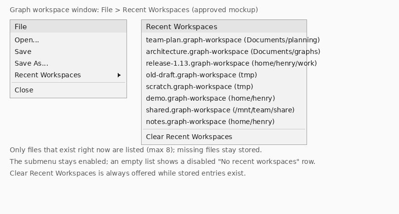

# Most Recent Workspaces Design

**Date:** 2026-09-10
**Status:** Approved (design reviewed with user; mockup confirmed)

## Summary

Make recently used graph workspaces easy to reopen.

1. The graph workspace window's **File** menu gains a **Recent Workspaces**
   submenu listing recently used workspace files, newest first.
2. Clicking **View ▸ Open Graph Workspace** in the main window opens the most
   recently used workspace that still exists, instead of always prompting with
   a file chooser. When no remembered workspace can be opened, the file chooser
   appears exactly as it does today.

The recollection is one application-wide list, shared by all graph workspace
windows and persisted across restarts in Freeplane's user properties.

## Decisions

- **Submenu, not inline entries.** The File menu keeps a stable shape
  (Open…, Save, Save As…, Recent Workspaces ▸, separator, Close) and the list
  can grow without bloating the menu. Ruled out: inline entries, which force a
  small hard cap and push Close far down; and a parallel copy in the main
  window's View menu, which duplicates the same menu in two places.
- **Hide missing files, keep them stored** ("hide-but-keep"). A file that does
  not exist right now is not listed, but stays in the stored list and reappears
  when the file does. Ruled out: greyed `name (missing)` rows, which cannot be
  clicked and consume visible slots; and hiding with pruning, which loses the
  shortcut permanently the first time a network share or removable drive is
  simply not mounted. Ruled out: core Freeplane's behaviour for mind maps
  (list stale entries, ask to remove them after a failed open), which trades a
  tidy menu for a prompt on every stale entry.
- **A recent entry never creates a workspace, structurally.**
  `DefaultGraphWorkspaceController.open` treats a nonexistent path as "create a
  new workspace", so a check-then-act guard in the UI would leave a window in
  which an externally deleted file is still recreated. Instead the controller
  gains `openExisting(Path)`, which never takes the create branch and fails with
  `GraphWorkspaceOpenException` when the file is gone. Every recents-based entry
  point uses it. The chooser path keeps today's `open(Path)` behaviour, so
  creating a workspace by choosing a new name still works.
- **Labels carry the full containing folder.** `file name (/absolute/folder)`,
  or just the file name when the path has no parent, matching core's recent-map
  labels. Showing only the immediate parent was rejected: `/p/a/x.fpg` and
  `/q/a/x.fpg` would render identical labels. Path separators are isolated for
  right-to-left rendering, as core's recent-map menu does.
- **Application-wide, user-property backed persistence.** One list for the
  whole application, stored through `ResourceController` like core's recent
  maps. No per-window lists, no workspace file content, no new file format.
- **No preferences UI.** The stored cap (25) and the displayed cap (8) are
  constants. A preferences entry is deferred until someone needs to tune them.
- **View ▸ Open Graph Workspace opens the newest *existing* entry**, falling
  back to the chooser when no stored entry currently exists or the newest one
  cannot be opened. This keeps the entry point consistent with hide-but-keep: a
  missing newest entry skips to the next existing one instead of sending the
  user to a chooser they just navigated away from.
- **The submenu is never disabled.** A disabled `JMenu` cannot reopen, so
  disabling it when the list is empty would freeze it off until the window is
  recreated. Instead the submenu stays enabled and shows a single disabled
  `No recent workspaces` row when nothing is displayable. *(Correction to the
  reviewed design sketch, which said "greyed out when empty".)*
- **Clear stays reachable while hidden entries exist.** Because hiding does
  not prune, `Clear Recent Workspaces` is offered whenever the *stored* list is
  non-empty, even if nothing is displayable. Otherwise hidden entries could
  never be removed by the user.
- **Recording is best-effort.** A failure to persist the list must never fail
  an open or a save.

## Mockup



File menu (graph workspace window) and the submenu it opens. Entries are
labelled `file name (full containing folder)`. Only files that exist right now
are listed; missing files stay in the stored list.

## Architecture

### Module: `RecentWorkspaceList`

New class `org.freeplane.plugin.graph.workspace.RecentWorkspaceList`. This is
the whole feature's policy in one place, with no Swing dependency:

```java
public final class RecentWorkspaceList {
    public static final class Entry {          // path + display label
        public Path path();
        public String label();
    }

    public static RecentWorkspaceList standard();   // ResourceController-backed
    public static RecentWorkspaceList empty();      // fresh instance, nothing stored, no persistence
    public RecentWorkspaceList(String storedValue, Consumer<String> persister);

    public void record(Path workspaceFile);         // promote to newest, de-duplicate, cap
    public void clear();                            // drop every stored entry
    public List<Entry> displayEntries();            // newest first, existing files only, capped
    public boolean hasStoredEntries();
    public Optional<Path> mostRecentExisting();     // newest existing file, if any
}
```

- Owns ordering (newest first), de-duplication on re-record, the stored cap
  (25) and display cap (8), existence filtering, label formatting, and the
  persisted encoding. Callers never see property keys, separators, or path
  policy.
- Paths are canonicalized through the existing
  `WorkspaceUriResolver.canonical`, the same normalizer
  `DefaultGraphWorkspaceController.open` already uses, so `..` or symlink
  variants cannot become duplicate entries. Canonicalization happens **only**
  while recording, wrapped, and a failure skips the entry; construction and
  decoding never canonicalize (see Persistence contract).
- `displayEntries` only returns **existing regular files**, in stored order,
  truncated to the display cap. Hidden entries do not consume display slots.
- Label policy: `file name (/absolute/containing/folder)`, with path
  separators isolated for right-to-left rendering via
  `TextWritingDirection.LEFT_TO_RIGHT.isolatePathSeparators`, exactly as core's
  recent-map menu labels its entries. The policy lives in a package-private
  label helper so it is unit-testable without a window. When the path has no
  containing folder, or `getFileName()` is null (a filesystem root), the label
  falls back to the path's own string form.
- Thread-safe: internally synchronized (recording can happen off the EDT,
  menu construction happens on it).
- Bounded I/O on the EDT: one popup rebuild or one resolution performs at most
  25 non-throwing existence probes — the stored cap — while walking for up to 8
  displayable entries. No other I/O runs on the EDT, and no caching is added.
- The two zero-argument factories keep the distinction between production
  (properties-backed) and tests (no persistence) explicit; the constructor
  with a persister is the single seam the unit tests drive.
- `empty()` returns a **fresh** instance on every call, and `record` and
  `clear` on it are no-ops. A shared mutable singleton was rejected: `empty()`
  is the default for the test-only constructor overloads, so a shared instance
  would leak recorded paths from one test into another.
- `record` and `clear` call the persister **outside** the internal lock, so a
  menu rebuild can never block behind a persister that synchronously notifies
  every `ResourceController` property listener. Out-of-order persistence is
  prevented by a monotonic state revision: each mutation snapshots
  `(revision, encoded value)` under the lock, and the write runs under a small
  dedicated lock that discards any snapshot older than the last one already
  written. Without that guard two concurrent `record`s could persist in the
  wrong order and lose the newer entry.

### Persistence contract

- Property key: `graph_workspace_recent_workspaces`, written through
  `ResourceController.setProperty` as a user property.
- Value format: `ConfigurationUtils.encodeListValue(paths, true)` — entries in
  newest-first order, each the canonical absolute `path.toString()`, joined by
  the platform path separator doubled. That is the same convention core's
  recent-map list uses, and it is what makes Windows drive letters safe.
- Decoding is total and must never throw, and it **never canonicalizes**: the
  stored absolute strings are kept verbatim, validated only with `Paths.get`
  plus an absoluteness check. Canonicalization is applied in `record` alone, and
  a failure there skips the entry. This matters because canonicalizing a path
  whose drive or mount is currently unreachable throws; doing it at decode time
  would drop the entry from memory, and the next `record` would re-encode the
  list without it — permanently losing exactly the shortcut that hide-but-keep
  exists to preserve.
- Entries that fail `Paths.get` or are not absolute are dropped at decode time,
  since they can never become valid workspace paths, and the decoded list is
  truncated to the newest 25 entries so a hand-edited or legacy property value
  cannot defeat the bounded-probe guarantee. Missing files are **not** dropped
  (hide-but-keep); they are filtered only from display.
- Because the doubled separator is the delimiter, and core's decoder trims
  whitespace around it (`ConfigurationUtils` splits on `\s*<separator>\s*`), a
  path containing two consecutive platform separators, or a trailing space
  directly before a separator, cannot round-trip. The limitation is inherited
  from core, is rare, and is accepted; it is not claimed to be unreachable,
  since such names are legal on POSIX and on Windows.
- `clear()` writes the empty string and swallows a failing persister.
- `standard()` must never assume `ResourceController.getProperty` returns a
  non-null value: `GraphPluginIntegrationShould` installs `GraphModeExtension`
  against a mocked `ApplicationResourceController` whose `getProperty` returns
  null, and `ConfigurationUtils.decodeListValue` dereferences its argument.

### Recording

Three points, all reusing existing seams; no new event machinery:

- **Open success** — `DefaultGraphWorkspaceController.finishOpen`, after the
  session publishes OPEN: `recentWorkspaces.record(path)`. The path is already
  canonical there, and this covers workspaces opened from the chooser, from a
  recent entry, and from the main window's action, including a workspace file
  that was created by opening a nonexistent path chosen in the chooser.
- **Focus of an already-open workspace** — `open` returns a live session through
  `existing.focus()` without ever reaching `finishOpen`, so `finishOpen` alone
  would leave the list stale whenever the workspace is already open. Concrete
  failure this fixes: open A, clear the list, open A again through the chooser —
  A must become recent again, and must not stay missing after its entry was
  evicted by the stored cap. The successful focus return records the path too.
- **Save As success** — a `WorkspaceStoreListener` registered per session on
  `WorkspaceStoreEvent.Type.IDENTITY_CHANGED` calls
  `record(change.newPath())`. The new file becomes newest; the previous path
  remains in the list because that file still exists.

Recording can never fail an open. `record` is specified as non-throwing, and
both controller-side call sites are wrapped so an unexpected failure is
swallowed instead of reaching the `finishOpen` catch block, which rolls a
successfully opened session back. The Save-As seam already has this protection
because `GraphWorkspaceStore.drainEvents` swallows listener exceptions.

The recorder is one small object, not a bare registration:
`RecentWorkspaceRecorder implements WorkspaceStoreListener, AutoCloseable`. Its
`onWorkspaceStoreEvent` records the new path on `IDENTITY_CHANGED` and ignores
every other event type; `close()` releases the store registration. That shape is
what makes the recording testable: `ProductionSessionFactory` is private and
builds the store itself, so a test that injects its own `SessionFactory` can
never fire a bare listener, whereas one object that both receives events and can
be closed is directly exercisable.

`ProductionSessionFactory` creates the recorder immediately after creating the
store, **`ResourceSet`** carries the recorder (both `ResourceSet.from(...)`
overloads copy it, and a test-compatible `SessionResources` overload is kept,
since several existing tests construct `SessionResources` directly), and the
existing resource-teardown funnel (`closeRemainingResources` and
`cleanupResources`, reached from shutdown, close, and rollback) closes it. That
funnel is chosen deliberately so the recorder survives a failed save — on save
failure the store stays open and only reopens the session; the store clears its
own listener list only on a successful close. The factory's own construction
failure path builds a `ResourceSet` without a recorder, which is safe because
`cleanupResources` calls `store.discardAndClose()` first and that clears the
store's listener list.

Concretely, the plumbing is: `RecentWorkspaceRecorder(GraphWorkspaceStore,
RecentWorkspaceList)` self-registers through `store.addListener(this)` and keeps
the returned `ListenerRegistration` for `close()`; it is public in the
`workspace` package because the `control` package constructs it;
`SessionResources` gains a recorder field with a compatible constructor
overload, and both `ResourceSet.from(...)` overloads copy it.

### Menu

`GraphWorkspaceWindowModel.createMenuBar` inserts a `JMenu`
(`graph_workspace.menu.recent_workspaces`, component name
`graph-workspace-recent-workspaces-menu`) directly after `fileSaveAsMenuItem`
and before the existing separator and Close item.

- Contents are rebuilt in a `PopupMenuListener` on
  `popupMenuWillBecomeVisible`, so the existence filter is never stale and no
  list-change listener is needed.
- Non-empty: one `JMenuItem` per `displayEntries()` entry, then a separator,
  then `Clear Recent Workspaces`.
- Empty: one disabled `No recent workspaces` item, then — only when
  `hasStoredEntries()` — a separator and `Clear Recent Workspaces`.
- Item activation calls `applicationController.openExisting(path)`, so no
  workspace can be created even if the file disappears between opening the menu
  and clicking. The pre-click existence check decides only what is displayed;
  correctness does not depend on it. The handler catches `RuntimeException`
  (the same UI-boundary policy as the action) and reports it.
- A failed click reports through the message sink and calls the same
  package-private rebuild method to repaint the current popup. It never edits
  the *stored* list, so a file that is only temporarily unavailable stays
  remembered; the next popup open rebuilds from storage again anyway.
- Clicking an entry whose session is momentarily OPENING or CLOSING (possible
  only within the same EDT dispatch cycle) surfaces the controller's "still
  being opened or closed" failure and is reported like any other failed open.
  Accepted: the pending session presents the workspace moments later, so the
  report is cosmetic, and special-casing it would need a distinct exception type
  for no functional gain.
- The rebuild is reachable as a package-private model method, so headless tests
  can trigger exactly what the popup listener triggers without showing a popup.
  A screenshot of the open popup is not obtainable from the existing UI evidence
  harness: it paints a `JPanel` holding the `JMenuBar`, and a `JMenu`'s popup is
  a separate `JPopupMenu` that is never a child component.
- `Clear Recent Workspaces` calls `clear()` and rebuilds the menu.

### View ▸ Open Graph Workspace

`OpenGraphWorkspaceAction` gains these constructors: `(controller)`,
`(controller, RecentWorkspaceList)`, and
`(controller, RecentWorkspaceList, Consumer<String> messageSink)`; the existing
`(controller, Supplier<Path>)` constructor is unchanged, so current tests keep
their meaning. The default sink is a lazy lambda identical to the window
model's —
`message -> Controller.getCurrentController().getViewController().out(message)`
— so it is not evaluated at install time, where the install test constructs the
action against a mocked `Controller`. Resolution and opening is:

```java
Optional<Path> recent = recentWorkspaces.mostRecentExisting();
if (recent.isPresent()) {
    try {
        applicationController.openExisting(recent.get());
        return;
    }
    catch (RuntimeException failure) {
        report("graph_workspace.recent_workspaces.open_failed", recent.get());
    }
}
Path chosen = pathChooser.get();
if (chosen != null) {
    applicationController.open(chosen);   // unchanged create-or-open semantics
}
```

Two layers protect the recents entry points, and each is pinned by its own
test. At the controller layer `openExisting` is **not** a thin alias for
`open`; it performs its own canonicalization and regular-file check and wraps
every failure — including the `IllegalArgumentException`
`WorkspaceUriResolver.canonical` raises for an unreachable path, a symlink loop,
or an ACL change, and the `IllegalStateException` a shut-down or unbound
controller raises — into `GraphWorkspaceOpenException`, so every
recents-initiated failure surfaces as one type. At the UI boundary the action
and the window model catch `RuntimeException` anyway: a dead end is worse than
an over-broad catch, and that keeps the guarantee intact even if a controller
implementation ever violates the wrapping contract. The chooser branch is
unchanged for the same reason — it is the documented create-or-open path.

The two branches use different controller methods on purpose. A remembered
workspace must never be created, so it goes through `openExisting`; a path from
the chooser may legitimately be a new file name, so it keeps `open`. A recent
workspace that cannot be opened is reported through the command message sink and
then falls back to the chooser, so the entry point is never a silent no-op —
today `GraphWorkspaceOpenException` is never caught and the only global EDT
handler merely logs it. A file chosen from the chooser that fails to open keeps
that existing behaviour; this change covers the recents path only.

### Wiring

`GraphModeExtension.installExtension` creates the single list and injects it:

- `new DefaultGraphWorkspaceController(modeController, viewFactory, recentWorkspaces)`
- `new SwingGraphWorkspaceViewFactory(viewController, recentWorkspaces)`
- `new OpenGraphWorkspaceAction(viewController, recentWorkspaces)`

`GraphWorkspaceWindow` and `GraphWorkspaceWindowModel` take the list through
their existing constructor chains, and the submenu opens entries with
`applicationController.openExisting(path)`. `GraphWorkspaceController` gains
`GraphWorkspaceHandle openExisting(Path)`, implemented by
`DefaultGraphWorkspaceController` and delegated by
`GraphModeExtension.ForwardingGraphWorkspaceController`. It never creates a
workspace, and it wraps every failure mode — canonicalization included — into
`GraphWorkspaceOpenException` (see View ▸ Open Graph Workspace). Test-only
short overloads default to `RecentWorkspaceList.empty()` so no existing test
starts touching user properties.

### Resources

New keys in `freeplane/src/viewer/resources/translations/Resources_en.properties`
(where every other `graph_workspace.*` key lives):

- `graph_workspace.menu.recent_workspaces=Recent Workspaces`
- `graph_workspace.action.clear_recent_workspaces=Clear Recent Workspaces`
- `graph_workspace.recent_workspaces.empty=No recent workspaces`
- `graph_workspace.recent_workspaces.open_failed=Could not open the recent workspace: {0}`

One message key covers both ways a recent entry can fail to open (the file
vanished between display and click, or it is present but corrupt or
unreadable), because both surface as `GraphWorkspaceOpenException` from
`openExisting`.

Only the English bundle carries `graph_workspace.*` keys today; other locales
fall back. Per repository rules the file stays ISO-8859-1 with `\uXXXX` escapes
and `gradle format_translation` is run after the edit (these four values are
plain ASCII).

## Data flow

- **Open a workspace** (chooser, recent entry, or main-window action) →
  `DefaultGraphWorkspaceController.open` → session opens → `finishOpen` →
  `record(path)` → properties updated in memory → flushed with the rest of the
  user properties on shutdown or preferences close. When the workspace is
  already open, the focus return records the path instead.
- **Save As** → command routed to `GraphWorkspaceStore.saveAs` →
  `IDENTITY_CHANGED` event → recorder → `record(newPath)`.
- **File ▸ Recent Workspaces ▸** → popup about to become visible →
  `displayEntries()` (fresh existence filter, capped) → menu items → click →
  `openExisting(path)` → new or focused session, or report + refresh.
- **View ▸ Open Graph Workspace** → `mostRecentExisting()` → `openExisting(path)`,
  or the chooser when the result is empty or the open attempt failed.

## Error handling and edge cases

- No stored entries, or every stored entry missing: submenu shows
  `No recent workspaces`; View ▸ Open Graph Workspace falls back to the
  chooser. Neither is a dead end.
- All stored entries missing but stored: `Clear Recent Workspaces` is still
  offered so the entries can be purged.
- Entry vanishes between menu build and click: reported, menu refreshed, no
  workspace created.
- A recent file that exists but cannot be opened (corrupt XML, unreadable) is
  reported through the command message sink, and View ▸ Open Graph Workspace
  then falls back to the chooser. A submenu click on such an entry reports the
  same message and leaves the list untouched: the file still exists, so the
  entry stays listed and can become usable again. Chooser-selected files that
  fail to open keep today's behaviour (logged, not reported).
- Persistence failure or an unusable path never fails an open or Save As; the
  list simply stays as it was.
- A workspace opened read-only still becomes recent: it opened successfully.
- Flush timing matches core's recent-maps list (properties are written on
  shutdown and preferences close), so a hard crash can lose the newest entry —
  the same exposure core already has. No new persistence machinery is added.
- Opening an already-open workspace continues to focus its window rather than
  creating a second one. Two accepted consequences of the existing session
  registry: clicking a recent entry whose session is momentarily OPENING or
  CLOSING reports a failed open (the pending session presents the workspace
  moments later), and a path that is the in-flight Save-As target of another
  workspace resolves to that workspace's window instead of opening the clicked
  file. Neither can create a workspace, and neither justifies a separate code
  path.

## Testing

- `RecentWorkspaceListShould` (new, headless): newest-first ordering;
  re-recording an existing path promotes instead of duplicating; stored cap 25
  evicts the oldest; display cap 8 truncates; missing files are filtered out of
  `displayEntries` and `mostRecentExisting` yet survive a write/read round-trip
  (hide-but-keep); `clear()` empties stored entries; persisted-value round-trip
  through `encodeListValue`/`decodeListValue`; `record` never throws on an
  unusable path or a failing persister. Label formatting is asserted through the
  package-private label helper (see the dedicated bullet below).
- Open resolution (`OpenGraphWorkspaceActionShould`): the newest existing entry
  is opened with `openExisting`; a missing newest entry falls through to the next
  existing entry; an empty list delegates to the chooser; a recent entry that
  throws `GraphWorkspaceOpenException` is reported and then falls through to the
  chooser; a chooser-selected path is still opened with create-or-open
  semantics. Two further cases pin the UI boundary against a controller that
  violates the wrapping contract: a recent entry whose open throws
  `IllegalArgumentException`, and one that throws `IllegalStateException`, must
  each put the formatted `graph_workspace.recent_workspaces.open_failed` message
  into the sink, invoke the chooser, and never pass the recent path to `open`.
- `GraphWorkspaceWindowModelShould` (extend): the File menu contains
  `Recent Workspaces` directly after `Save As…` and before the Close separator;
  the rebuild method produces items in order with the expected labels and cap;
  missing files are absent; the empty case shows the disabled
  `No recent workspaces` row and keeps Clear when entries are stored; the
  `Recent Workspaces` menu itself is asserted **enabled** in the populated,
  all-entries-missing, and nothing-stored cases, because a disabled `JMenu` can
  never reopen (requirement 5); clearing empties the list; a failing
  `openExisting` reports through the message sink and never calls `open`.
- `DefaultGraphWorkspaceControllerShould` (extend): opening a workspace records
  it; re-opening an already-open workspace records it again after `clear()`; a
  throwing persister does not fail the open and the window is still shown.
- `RecentWorkspaceRecorderShould` (new): an `IDENTITY_CHANGED` event records the
  new path, other event types record nothing, and `close()` releases the store
  registration. The recorder is exercised directly, because the production
  listener is created inside a private session factory and cannot be fired
  through an injected `SessionFactory`.
- `openExisting` never creates: with a capturing `SessionFactory`, opening a path
  that does not exist fails with `GraphWorkspaceOpenException`, the captured
  `create` flag is never `true`, the file is still absent afterwards, and the
  session registry has no owner for the path. This pins requirement 4 at the
  controller level; the action and model tests only assert which method is
  called, so reverting `openExisting` to a pre-check plus `open()` would
  otherwise pass every test. A companion case pins exception wrapping: a path
  that cannot be canonicalized (for example one beneath an unreachable parent)
  surfaces as `GraphWorkspaceOpenException`, not `IllegalArgumentException`.
- Hide-but-keep survives an unresolvable path: a stored absolute path whose
  parent is unreachable (for example a symlink loop) stays in the list after
  construction and after an unrelated `record`, proving decode never
  canonicalizes and never prunes.
- Label helper: same file name under same-named parents in different trees
  produce different labels; a filesystem root (null `getFileName()`) falls back
  to the path string instead of throwing.
- Constructor compatibility: the **9-argument `GraphWorkspaceWindowModel`
  constructor must survive** — `GraphWorkspaceUiEvidence.ModelAccess.create`
  reflectively requires exactly that signature — so the recents list is added
  as a further overload that the 9-argument form delegates to with
  `RecentWorkspaceList.empty()`.
- `GraphPluginIntegrationShould` (extend): with a mocked `ResourceController`
  returning a seeded stored value and capturing `setProperty`,
  `installExtension` builds the application-wide list from
  `graph_workspace_recent_workspaces`, a recorded path is written back under
  that key, and `clear()` writes the empty string. This pins requirement 6's
  property-backed wiring instead of merely surviving the mocked null
  `getProperty`.
- Regression: `GraphPluginIntegrationShould` menu-XML and action-registration
  checks stay green — no menu XML is touched.
- Verification evidence: `gradle :freeplane_plugin_graph:test` green and the
  touched core resources formatted with `gradle format_translation`. The
  approved mockup image is the visual record; the menu itself is pinned
  structurally by the model tests, not by a popup screenshot (see Menu).

## Out of scope

- A recents entry in the main window's View menu (the graph workspace window's
  File menu is the chosen surface).
- Showing workspace file names in the graph workspace window title.
- Preferences-dialog control over either cap.
- Pinning, grouping, or per-workspace metadata in the list.
- Removing a single entry from the list. `Clear Recent Workspaces` is the only
  removal affordance; per-entry removal can be added later if a broken
  workspace file turns out to be a recurring nuisance.
